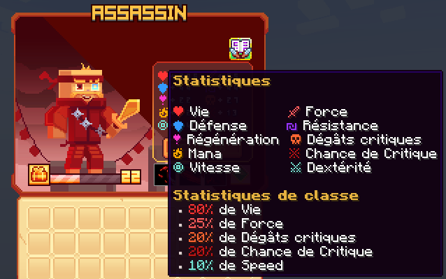

# 🗡️️ Assassin

L'Assassin est un maître de l'art de la furtivité et du combat rapproché. Utilisant des techniques rapides et précises, l'Assassin inflige des dégâts critiques et utilise des compétences mortelles pour éliminer ses ennemis avant même qu'ils ne remarquent sa présence.

<figure><figcaption>
<strong>Aperçu des stats de la classe Assassin</strong>
</figcaption></figure>

## 💠 <mark style="color:yellow;">Compétences</mark>


Les dégâts des compétences sont en cours de modification, ne les prennez pas pour argent comptant !
-L'équipe du wiki


### 🔸 <mark style="color:yellow;">**Niveau 1 : Coup de Lame**</mark>

Effectuez une attaque tranchante avec votre lame.

* <mark style="color:yellow;">**Temps de recharge**</mark>: 0.5s
* <mark style="color:yellow;">**Mana**</mark>: 0
* <mark style="color:yellow;">**Dégâts**</mark>: 12,1

### 🔸 <mark style="color:yellow;">**Niveau 5 : Lame Sanglante**</mark>

Vos attaques ont 15% de chances de faire saigner la cible.

* <mark style="color:yellow;">**Temps de recharge**</mark>: 1s
* <mark style="color:yellow;">**Mana**</mark>: 0
* <mark style="color:yellow;">**Dégâts de saignement**</mark>: 4,1

### 🔸 <mark style="color:yellow;">**Niveau 10 : Dash**</mark>

Foncez à travers vos ennemis et faites de lourds dégâts tout au long de votre déplacement.

* <mark style="color:yellow;">**Temps de recharge**</mark>: 2s
* <mark style="color:yellow;">**Mana**</mark>: 35
* <mark style="color:yellow;">**Dégâts**</mark>: 55,1

### 🔸 <mark style="color:yellow;">**Niveau 15 : Lancer de Dague**</mark>

Lancez 3 dagues sur votre cible.

* <mark style="color:yellow;">**Temps de recharge**</mark>: 5s
* <mark style="color:yellow;">**Mana**</mark>: 75
* <mark style="color:yellow;">**Dégâts**</mark>: 179,4

### 🔸 <mark style="color:yellow;">**Niveau 20 : Pas de l'Ombre**</mark>

Gagnez de la vitesse et une invisibilité pendant 5 secondes et infligez d'énormes dégâts de saignement lors de votre prochaine attaque de base. L'invisibilité disparaît lorsque vous attaquez.

* <mark style="color:yellow;">**Temps de recharge**</mark>: 5s
* <mark style="color:yellow;">**Mana**</mark>: 100
* <mark style="color:yellow;">**Dégâts de la compétence**</mark>: 110
* <mark style="color:yellow;">**Dégâts de saignement**</mark>: 14.9

### 🔸 <mark style="color:yellow;">**Niveau 30 : Déluge de Lames**</mark>

Effectuez une attaque tournante avec votre lame.

* <mark style="color:yellow;">**Temps de recharge**</mark>: 2s
* <mark style="color:yellow;">**Mana**</mark>: 50
* <mark style="color:yellow;">**Dégâts**</mark>: 992,6

### 🔸 <mark style="color:yellow;">**Niveau 40 : Danse de Lames**</mark>

Téléportez-vous vers les différentes cibles et tranchez-les avec votre lame. Cette compétence fait saigner les cibles.

* <mark style="color:yellow;">**Temps de recharge**</mark>: 25s
* <mark style="color:yellow;">**Mana**</mark>: 350
* <mark style="color:yellow;">**Dégâts**</mark>: 2894,6
<!--Il faudrai demander les dégâts de saignement-->

## 💠 <mark style="color:yellow;">Armes</mark>

<table>
  <tr>
    <th>Armes</th>
    <th>Rareté</th>
    <th>Stat</th>
    <th>Obtention</th>
  </tr>
  <tr>
    <td><mark style="color:green;">Croc de Fenrir</mark></td>
    <td><mark style="color:green;">Commun</mark></td>
    <td>
     
<mark style="color:red;">🗡️ Force +5</mark>

     
<mark style="color:orange;">💀 Dégât Critique +3</mark>

    </td>
    <td>Donjon Biome Forêt</td>
  </tr>
  <tr>
    <td><mark style="color:yellow;">Croc de Fenrir</mark></td>
    <td><mark style="color:yellow;">Rare</mark></td>
    <td>
     
<mark style="color:red;">🗡️ Force +11</mark>

     
<mark style="color:orange;">💀 Dégât Critique +6</mark>

    </td>
    <td>Donjon Biome Forêt ou Forge</td>
  </tr>
  <tr>
    <td><mark style="color:blue;">Croc de Fenrir</mark></td>
    <td><mark style="color:blue;">Épique</mark></td>
    <td>
     
<mark style="color:red;">🗡️ Force +18</mark>

     
<mark style="color:orange;">💀 Dégât Critique +9</mark>

    </td>
    <td>Donjon Biome Forêt ou Forge</td>
  </tr>
  <tr>
    <td><mark style="color:purple;">Croc de Fenrir</mark></td>
    <td><mark style="color:purple;">Légendaire</mark></td>
    <td>
     
<mark style="color:red;">🗡️ Force +35</mark>

     
<mark style="color:orange;">💀 Dégât Critique +15</mark>

    </td>
    <td>Forge</td>
  </tr>
  <tr>
    <td><mark style="color:red;">Croc de Fenrir</mark></td>
    <td><mark style="color:red;">Mythique</mark></td>
    <td>
     
<mark style="color:red;">🗡️ Force +60</mark>

     
<mark style="color:orange;">💀 Dégât Critique +26</mark>

    </td>
    <td>Forge</td>
  </tr>
  <tr>
    <td><mark style="color:green;">Dague Vipérienne</mark></td>
    <td><mark style="color:green;">Commun</mark></td>
    <td>
     
<mark style="color:red;">🗡️ Force +5</mark>

     
<mark style="color:blue;">🤺 Dextérité +3</mark>

    </td>
    <td>Donjon Biome Jungle</td>
  </tr>
  <tr>
    <td><mark style="color:yellow;">Dague Vipérienne</mark></td>
    <td><mark style="color:yellow;">Rare</mark></td>
    <td>
     
<mark style="color:red;">🗡️ Force +11</mark>

     
<mark style="color:blue;">🤺 Dextérité +6</mark>

    </td>
    <td>Donjon Biome Jungle ou Forge</td>
  </tr>
  <tr>
    <td><mark style="color:blue;">Dague Vipérienne</mark></td>
    <td><mark style="color:blue;">Épique</mark></td>
    <td>
     
<mark style="color:red;">🗡️ Force +18</mark>

     
<mark style="color:blue;">🤺 Dextérité +9</mark>

    </td>
    <td>Donjon Biome Jungle ou Forge</td>
  </tr>
  <tr>
    <td><mark style="color:purple;">Dague Vipérienne</mark></td>
    <td><mark style="color:purple;">Légendaire</mark></td>
    <td>
     
<mark style="color:red;">🗡️ Force +35</mark>

     
<mark style="color:blue;">🤺 Dextérité +15</mark>

    </td>
    <td>Forge</td>
  </tr>
  <tr>
    <td><mark style="color:red;">Dague Vipérienne</mark></td>
    <td><mark style="color:red;">Mythique</mark></td>
    <td>
     
<mark style="color:red;">🗡️ Force +60</mark>

     
<mark style="color:blue;">🤺 Dextérité +26</mark>

    </td>
    <td>Forge</td>
  </tr>
  <tr>
    <td><mark style="color:green;">Dague Polaire</mark></td>
    <td><mark style="color:green;">Commun</mark></td>
    <td>
     
<mark style="color:red;">🗡️ Force +5</mark>

     
<mark style="color:red;">🥊 Chance de Critique +1</mark>

    </td>
    <td>Donjon Biome Neige</td>
  </tr>
  <tr>
    <td><mark style="color:yellow;">Dague Polaire</mark></td>
    <td><mark style="color:yellow;">Rare</mark></td>
    <td>
     
<mark style="color:red;">🗡️ Force +11</mark>

     
<mark style="color:red;">🥊 Chance de Critique +1</mark>

    </td>
    <td>Donjon Biome Neige ou Forge</td>
  </tr>
  <tr>
    <td><mark style="color:blue;">Dague Polaire</mark></td>
    <td><mark style="color:blue;">Épique</mark></td>
    <td>
     
<mark style="color:red;">🗡️ Force +18</mark>

     
<mark style="color:red;">🥊 Chance de Critique +2</mark>

    </td>
    <td>Donjon Biome Neige ou Forge</td>
  </tr>
  <tr>
    <td><mark style="color:purple;">Dague Polaire</mark></td>
    <td><mark style="color:purple;">Légendaire</mark></td>
    <td>
     
<mark style="color:red;">🗡️ Force +35</mark>

     
<mark style="color:red;">🥊 Chance de Critique +3</mark>

    </td>
    <td>Forge</td>
  </tr>
  <tr>
    <td><mark style="color:red;">Dague Polaire</mark></td>
    <td><mark style="color:red;">Mythique</mark></td>
    <td>
     
<mark style="color:red;">🗡️ Force +60</mark>

     
<mark style="color:red;">🥊 Chance de Critique +6</mark>

    </td>
    <td>Forge</td>
  </tr>
  <tr>
    <td><mark style="color:green;">Dague des Ombres</mark></td>
    <td><mark style="color:green;">Commun</mark></td>
    <td>
     
<mark style="color:red;">🗡️ Force +7</mark>

     
<mark style="color:orange;">💀 Dégât Critique +4</mark>

    </td>
    <td>Pack d'arme</td>
  </tr>
  <tr>
    <td><mark style="color:yellow;">Dague des Ombres</mark></td>
    <td><mark style="color:yellow;">Rare</mark></td>
    <td>
     
<mark style="color:red;">🗡️ Force +15</mark>

     
<mark style="color:orange;">💀 Dégât Critique +8</mark>

    </td>
    <td>Pack d'arme ou Forge</td>
  </tr>
  <tr>
    <td><mark style="color:blue;">Dague des Ombres</mark></td>
    <td><mark style="color:blue;">Épique</mark></td>
    <td>
     
<mark style="color:red;">🗡️ Force +25</mark>

     
<mark style="color:orange;">💀 Dégât Critique +12</mark>

    </td>
    <td>Pack d'arme ou Forge</td>
  </tr>
  <tr>
    <td><mark style="color:purple;">Dague des Ombres</mark></td>
    <td><mark style="color:purple;">Légendaire</mark></td>
    <td>
     
<mark style="color:red;">🗡️ Force +45</mark>

     
<mark style="color:orange;">💀 Dégât Critique +22</mark>

    </td>
    <td>Forge</td>
  </tr>
  <tr>
    <td><mark style="color:red;">Dague des Ombres</mark></td>
    <td><mark style="color:red;">Mythique</mark></td>
    <td>
     
<mark style="color:red;">🗡️ Force +80</mark>

     
<mark style="color:orange;">💀 Dégât Critique +39</mark>

    </td>
    <td>Forge</td>
  </tr>  
  <tr>
    <td><mark style="color:yellow;">Dague légendaire</mark></td>
    <td><mark style="color:yellow;">Jackpot</mark></td>
    <td>
     
<mark style="color:red;">🗡️ Force +60</mark>

     
<mark style="color:orange;">💀 Dégât Critique +26</mark>

    </td>
    <td>▸ <a href="https://wiki.evolucraft.fr/le-gameplay/les-caisses#caisse-jackpot"><mark style="color:yellow;">Caisse Jackpot 🎰</mark></a></td>
  </tr>
  <tr>
    <td><mark style="color:yellow;">Dague légendaire Shiny</mark></td>
    <td><mark style="color:yellow;">Jackpot</mark></td>
    <td>
     
<mark style="color:red;">🗡️ Force +60</mark>

     
<mark style="color:orange;">💀 Dégât Critique +26</mark>

    </td>
    <td>▸ <a href="https://wiki.evolucraft.fr/le-gameplay/les-caisses#caisse-jackpot"><mark style="color:yellow;">Caisse Jackpot 🎰</mark></a></td>
  </tr>
  <tr>
    <td><mark style="color:orange;">Dague Draconique</mark></td>
    <td><mark style="color:orange;">Draconique</mark></td>
    <td>
     
<mark style="color:red;">🗡️ Force +20</mark>

     
<mark style="color:orange;">💀 Dégât Critique +10</mark>

    </td>
    <td>
      
▸ <a href="https://wiki.evolucraft.fr/le-gameplay/marche-noir#draconique"><mark style="color:green;">Marché Noir 🧥</mark></a>

      
▸ <a href="https://wiki.evolucraft.fr/le-gameplay/les-caisses#caisse-draconique"><mark style="color:orange;">Caisse Draconique 🐉</mark></a>

    </td>
  </tr>
  <tr>
    <td><mark style="color:blue;">Dague Abyssal</mark></td>
    <td><mark style="color:blue;">Abyssal</mark></td>
    <td>
     
<mark style="color:red;">🗡️ Force +20</mark>

     
<mark style="color:orange;">💀 Dégât Critique +5</mark>

    </td>
    <td>
      
▸ <a href="https://wiki.evolucraft.fr/le-gameplay/marche-noir#abyssal"><mark style="color:green;">Marché Noir 🧥</mark></a>

      
▸ <a href="https://wiki.evolucraft.fr/le-gameplay/les-caisses#caisse-abyssal"><mark style="color:blue;">Caisse Abyssal 🌊</mark></a>

    </td>
  </tr>
  <tr>
    <td><mark style="color:orange;">Dague de Minuit</mark></td>
    <td><mark style="color:orange;">Halloween</mark></td>
    <td>
     
<mark style="color:red;">🗡️ Force +31</mark>

     
<mark style="color:orange;">💀 Dégât Critique +14</mark>

    </td>
    <td>
      
▸ <a href="https://wiki.evolucraft.fr/le-gameplay/marche-noir#halloween"><mark style="color:green;">Marché Noir 🧥</mark></a>

      
▸ <a href="https://wiki.evolucraft.fr/le-gameplay/les-caisses#caisse-halloween"><mark style="color:orange;">Caisse Halloween 🎃</mark></a>

    </td>
  </tr>
  <tr>
    <td><mark style="color:blue;">Dague des Glaces</mark></td>
    <td><mark style="color:blue;">Givrée</mark></td>
    <td>
     
<mark style="color:red;">🗡️ Force +31</mark>

     
<mark style="color:orange;">💀 Dégât Critique +14</mark>

    </td>
    <td>
      
▸ <a href="https://wiki.evolucraft.fr/le-gameplay/marche-noir#givree"><mark style="color:green;">Marché Noir 🧥</mark></a>

      
▸ <a href="https://wiki.evolucraft.fr/le-gameplay/les-caisses#caisse-givree"><mark style="color:blue;">Caisse Givrée ❄️</mark></a>

    </td>
  </tr>
  <tr>
    <td><mark style="color:red;">Dague de l'Amour</mark></td>
    <td><mark style="color:red;">ST-Valentin</mark></td>
    <td>
     
<mark style="color:red;">🗡️ Force +36</mark>

     
<mark style="color:orange;">💀 Dégât Critique +16</mark>

    </td>
    <td>
      
▸ <a href="https://wiki.evolucraft.fr/le-gameplay/marche-noir#st-valentin"><mark style="color:green;">Marché Noir 🧥</mark></a>

      
▸ <a href="https://wiki.evolucraft.fr/le-gameplay/les-caisses#caisse-saint-valentin"><mark style="color:red;">Caisse Saint-Valentin 💕</mark></a>

    </td>
  </tr>
  <tr>
    <td><mark style="color:yellow;">Dague en Chocolat</mark></td>
    <td><mark style="color:yellow;">Pâques</mark></td>
    <td>
     
<mark style="color:red;">🗡️ Force +43</mark>

     
<mark style="color:orange;">💀 Dégât Critique +19</mark>

    </td>
    <td>
      
▸ <a href="https://wiki.evolucraft.fr/le-gameplay/marche-noir#paques"><mark style="color:green;">Marché Noir 🧥</mark></a>

      
▸ <a href="https://wiki.evolucraft.fr/le-gameplay/les-caisses#caisse-paques"><mark style="color:yellow;">Caisse Pâques 🥚</mark></a>

    </td>
  </tr>
  <tr>
    <td><mark style="color:blue;">Dague Summer</mark></td>
    <td><mark style="color:blue;">Summer</mark></td>
    <td>
     
<mark style="color:red;">🗡️ Force +49</mark>

     
<mark style="color:orange;">💀 Dégât Critique +19</mark>

     
<mark style="color:blue;">🏃‍♂️ Vitesse +2</mark></td>

    </td>
    <td>
      
▸ <a href="https://wiki.evolucraft.fr/le-gameplay/marche-noir#summer-2025"><mark style="color:green;">Marché Noir 🧥</mark></a>

      
▸ <a href="https://wiki.evolucraft.fr/le-gameplay/les-caisses#caisse-summer"><mark style="color:blue;">Caisse Summer 🏖️</mark></a>

    </td>
  </tr>
  <tr>
    <td><mark style="color:red;">Dague de la Lune de Sang</mark></td>
    <td><mark style="color:red;">Lune de Sang</mark></td>
    <td>
     
<mark style="color:red;">🗡️ Force +45</mark>

     
<mark style="color:orange;">💀 Dégât Critique +21</mark>

    </td>
    <td>
      
▸ <a href="https://wiki.evolucraft.fr/le-gameplay/marche-noir#halloween-2025"><mark style="color:green;">Marché Noir 🧥</mark></a>

      
▸ <a href="https://wiki.evolucraft.fr/le-gameplay/les-caisses#caisse-lune-de-sang"><mark style="color:red;">Caisse Lune de Sang 🩸</mark></a>

    </td>
  </tr>  
  <tr>
    <td><mark style="color:red;">Dague Pain d'épice</mark></td>
    <td><mark style="color:red;">Pain d'épice</mark></td>
    <td>
     
<mark style="color:red;">🗡️ Force +47</mark>

     
<mark style="color:orange;">💀 Dégât Critique +21</mark>

    </td>
    <td>
      
▸ <a href="https://wiki.evolucraft.fr/le-gameplay/marche-noir#Noel-2025"><mark style="color:green;">Marché Noir 🧥</mark></a>

      
▸ <a href="https://wiki.evolucraft.fr/le-gameplay/les-caisses#caisse-lune-de-sang"><mark style="color:red;">Caisse Pain d'épice 🍪</mark></a>

    </td>
  </tr> 
</table>
