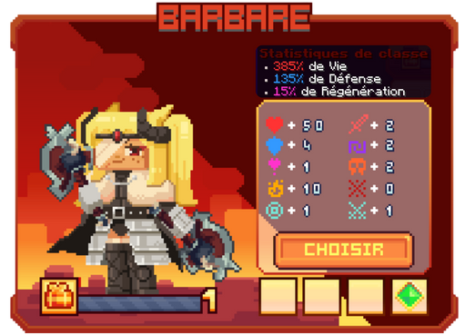

# 🪓 Barbare

Barbare au courroux sauvage, brisant ses ennemis d’un coup furieux sous sa rage déchaînée.

<figure><figcaption>
<strong>Aperçu des stats de la classe Barbare</strong>
</figcaption></figure>

## 💠 <mark style="color:yellow;">Compétences</mark>


Les dégâts des compétences sont en cours de modification, ne les prenez pas pour argent comptant !  
— L'équipe du wiki


### 🔸 <mark style="color:yellow;">**Niveau 1 : Coup Brutal**</mark>

Effectuez une attaque tranchante avec votre lame.

* <mark style="color:yellow;">**Temps de recharge**</mark> : 1s  
* <mark style="color:yellow;">**Mana**</mark> : 0  
* <mark style="color:yellow;">**Dégâts**</mark> : 12,5

### 🔸 <mark style="color:yellow;">**Niveau 5 : Soif de sang**</mark> *(Passif)*

Vous avez 5% de chance de vous soigner chaque fois que vous frappez un ennemi.

* <mark style="color:yellow;">**Temps de recharge**</mark> : ??  
* <mark style="color:yellow;">**Mana**</mark> : ??  
* <mark style="color:yellow;">**Dégâts**</mark> : ??

### 🔸 <mark style="color:yellow;">**Niveau 10 : Hache primordiale**</mark>

Lancez une hache vers l’avant, frappant tous les ennemis sur sa trajectoire.

* <mark style="color:yellow;">**Temps de recharge**</mark> : ??  
* <mark style="color:yellow;">**Mana**</mark> : ??  
* <mark style="color:yellow;">**Dégâts**</mark> : ??

### 🔸 <mark style="color:yellow;">**Niveau 15 : Cri de guerre**</mark>

Poussez un cri de guerre, augmentant votre résistance et votre force, tout en attirant les ennemis proches vers vous.

* <mark style="color:yellow;">**Temps de recharge**</mark> : ??  
* <mark style="color:yellow;">**Mana**</mark> : ??  
* <mark style="color:yellow;">**Dégâts**</mark> : ??

### 🔸 <mark style="color:yellow;">**Niveau 20 : Saut implacable**</mark>

Bondissez en avant et écrasez le sol avec votre hache, créant une onde de choc en cône qui attire instantanément les ennemis proches.

* <mark style="color:yellow;">**Temps de recharge**</mark> : ??  
* <mark style="color:yellow;">**Mana**</mark> : ??      
* <mark style="color:yellow;">**Dégâts**</mark> : ??

### 🔸 <mark style="color:yellow;">**Niveau 30 : Double entaille**</mark>

Libérez une double attaque puissante, infligeant des dégâts et appliquant un effet de saignement.

* <mark style="color:yellow;">**Temps de recharge**</mark> : ??  
* <mark style="color:yellow;">**Mana**</mark> : ??  
* <mark style="color:yellow;">**Dégâts**</mark> : ??

### 🔸 <mark style="color:yellow;">**Niveau 40 : Furie éternelle**</mark>

Libérez toute votre rage intérieure : vous gagnez en résistance, en vitesse et en régénération.  
Chaque coup devient plus puissant, plus large, et augmente la durée du saignement appliqué.

* <mark style="color:yellow;">**Temps de recharge**</mark> : ??  
* <mark style="color:yellow;">**Mana**</mark> : ??  
* <mark style="color:yellow;">**Dégâts**</mark> : ??  
<!-- Il faudrait demander les dégâts de saignement -->

## 💠 <mark style="color:yellow;">Armes</mark>

<table>
  <tr>
    <th>Armes</th>
    <th>Rareté</th>
    <th>Statistique</th>
    <th>Obtention</th>
  </tr>
  <tr>
    <td><mark style="color:red;">Hache de la Lune de Sang</mark></td>
    <td><mark style="color:red;">Lune de Sang</mark></td>
    <td>
     
<mark style="color:red;">🗡️ Force +45</mark>

     
<mark style="color:orange;">💀 Dégât Critique +24</mark>

    </td>
    <td>
      
▸ <a href="https://wiki.evolucraft.fr/le-gameplay/marche-noir#halloween-2025"><mark style="color:green;">Marché Noir 🧥</mark></a>

      
▸ <a href="https://wiki.evolucraft.fr/le-gameplay/les-caisses#caisse-lune-de-sang"><mark style="color:red;">Caisse Lune de Sang 🩸</mark></a>

    </td>
  </tr> 
  <tr>
    <td><mark style="color:red;">Hache Pain d'épice</mark></td>
    <td><mark style="color:red;">Pain d'épice</mark></td>
    <td>
     
<mark style="color:red;">🗡️ Force +47</mark>

     
<mark style="color:orange;">💀 Dégât Critique +21</mark>

    </td>
    <td>
      
▸ <a href="https://wiki.evolucraft.fr/le-gameplay/marche-noir#Noel-2025"><mark style="color:green;">Marché Noir 🧥</mark></a>

      
▸ <a href="https://wiki.evolucraft.fr/le-gameplay/les-caisses#caisse-lune-de-sang"><mark style="color:red;">Caisse Pain d'épice 🍪</mark></a>

    </td>
  </tr>  
</table>
