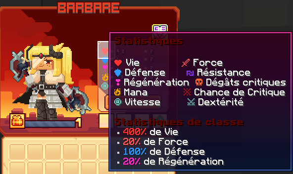

# 🪓 Barbare

Barbare au courroux sauvage, brisant ses ennemis d’un coup furieux sous sa rage déchaînée.

<figure><figcaption>
<strong>Aperçu des stats de la classe Barbare</strong>
</figcaption></figure>

## 💠 <mark style="color:yellow;">Compétences</mark>


Les dégâts des compétences sont en cours de modification, ne les prenez pas pour argent comptant !  
— L'équipe du wiki


### 🔸 <mark style="color:yellow;">**Niveau 1 : Coup Brutal**</mark>

Effectuez une attaque tranchante avec votre lame.

* <mark style="color:yellow;">**Temps de recharge**</mark> : 1s  
* <mark style="color:yellow;">**Mana**</mark> : 0  
* <mark style="color:yellow;">**Dégâts**</mark> : 12,5

### 🔸 <mark style="color:yellow;">**Niveau 5 : Soif de sang**</mark> *(Passif)*

Vous avez 5% de chance de vous soigner chaque fois que vous frappez un ennemi.

* <mark style="color:yellow;">**Temps de recharge**</mark> : ??  
* <mark style="color:yellow;">**Mana**</mark> : ??  
* <mark style="color:yellow;">**Dégâts**</mark> : ??

### 🔸 <mark style="color:yellow;">**Niveau 10 : Hache primordiale**</mark>

Lancez une hache vers l’avant, frappant tous les ennemis sur sa trajectoire.

* <mark style="color:yellow;">**Temps de recharge**</mark> : ??  
* <mark style="color:yellow;">**Mana**</mark> : ??  
* <mark style="color:yellow;">**Dégâts**</mark> : ??

### 🔸 <mark style="color:yellow;">**Niveau 15 : Cri de guerre**</mark>

Poussez un cri de guerre, augmentant votre résistance et votre force, tout en attirant les ennemis proches vers vous.

* <mark style="color:yellow;">**Temps de recharge**</mark> : ??  
* <mark style="color:yellow;">**Mana**</mark> : ??  
* <mark style="color:yellow;">**Dégâts**</mark> : ??

### 🔸 <mark style="color:yellow;">**Niveau 20 : Saut implacable**</mark>

Bondissez en avant et écrasez le sol avec votre hache, créant une onde de choc en cône qui attire instantanément les ennemis proches.

* <mark style="color:yellow;">**Temps de recharge**</mark> : ??  
* <mark style="color:yellow;">**Mana**</mark> : ??      
* <mark style="color:yellow;">**Dégâts**</mark> : ??

### 🔸 <mark style="color:yellow;">**Niveau 30 : Double entaille**</mark>

Libérez une double attaque puissante, infligeant des dégâts et appliquant un effet de saignement.

* <mark style="color:yellow;">**Temps de recharge**</mark> : ??  
* <mark style="color:yellow;">**Mana**</mark> : ??  
* <mark style="color:yellow;">**Dégâts**</mark> : ??

### 🔸 <mark style="color:yellow;">**Niveau 40 : Furie éternelle**</mark>

Libérez toute votre rage intérieure : vous gagnez en résistance, en vitesse et en régénération.  
Chaque coup devient plus puissant, plus large, et augmente la durée du saignement appliqué.

* <mark style="color:yellow;">**Temps de recharge**</mark> : ??  
* <mark style="color:yellow;">**Mana**</mark> : ??  
* <mark style="color:yellow;">**Dégâts**</mark> : ??  
<!-- Il faudrait demander les dégâts de saignement -->

## 💠 <mark style="color:yellow;">Armes</mark>

### 🔸 <mark style="color:green;">**Packs d'Armes**</mark>

<table>
<tr>
    <th><strong>Nom de l'Arme 🏷️</strong></th>
    <th><strong>Rareté ou Collection 🌟</strong></th>
    <th><strong>Statistiques 📊</strong></th>
    <th><strong>Effets ✨</strong></th>
    <th><strong>Obtentions 📌</strong></th>
  </tr> 
  <tr>
    <td><mark style="color:green;">Hache du Barbare</mark></td>
    <td><mark style="color:green;">Commun</mark></td>
    <td>
     
<mark style="color:red;">🗡️ Force +7</mark>

     
<mark style="color:orange;">💀 Dégât Critique +4</mark>

    </td>
    <td><mark style="color:green;">Aucun Effet</mark> Supplémentaire ❌</td>
    <td>
     
▸ <mark style="color:green;">Packs d'Armes (Mini-Boss & Boss des Donjons Communs)</mark>

    </td>
  </tr>
  <tr>
    <td><mark style="color:yellow;">Hache du Barbare</mark></td>
    <td><mark style="color:yellow;">Rare</mark></td>
    <td>
     
<mark style="color:red;">🗡️ Force +15</mark>

     
<mark style="color:orange;">💀 Dégât Critique +8</mark>

    </td>
    <td><mark style="color:green;">Aucun Effet</mark> Supplémentaire ❌</td>
    <td>
     
▸ <mark style="color:yellow;">Packs d'Armes (Mini-Boss & Boss des Donjons Rares)</mark>

     
▸ <a href="https://wiki.evolucraft.fr/le-gameplay/les-machines/forge#armes-rares"><mark style="color:green;">Forge 🔨</mark></a>

    </td>
  </tr>
  <tr>
    <td><mark style="color:blue;">Hache du Barbare</mark></td>
    <td><mark style="color:blue;">Épique</mark></td>
    <td>
     
<mark style="color:red;">🗡️ Force +25</mark>

     
<mark style="color:orange;">💀 Dégât Critique +12</mark>

    </td>
    <td><mark style="color:green;">Aucun Effet</mark> Supplémentaire ❌</td>
    <td>
     
▸ <mark style="color:blue;">Packs d'Armes (Mini-Boss & Boss des Donjons Épiques, Légendaires et Mythique)</mark>

     
▸ <a href="https://wiki.evolucraft.fr/le-gameplay/les-machines/forge#armes-epiques"><mark style="color:green;">Forge 🔨</mark></a>

    </td>
  </tr>
  <tr>
    <td><mark style="color:purple;">Hache du Barbare</mark></td>
    <td><mark style="color:purple;">Légendaire</mark></td>
    <td>
     
<mark style="color:red;">🗡️ Force +45</mark>

     
<mark style="color:orange;">💀 Dégât Critique +22</mark>

    </td>
    <td><mark style="color:green;">Aucun Effet</mark> Supplémentaire ❌</td>
    <td>
     
▸ <a href="https://wiki.evolucraft.fr/le-gameplay/les-machines/forge#armes-legendaires"><mark style="color:green;">Forge 🔨</mark></a>

    </td>
  </tr>
  <tr>
    <td><mark style="color:red;">Hache du Barbare</mark></td>
    <td><mark style="color:red;">Mythique</mark></td>
    <td>
     
<mark style="color:red;">🗡️ Force +80</mark>

     
<mark style="color:orange;">💀 Dégât Critique +39</mark>

    </td>
    <td><mark style="color:green;">Aucun Effet</mark> Supplémentaire ❌</td>
    <td>
     
▸ <a href="https://wiki.evolucraft.fr/le-gameplay/les-machines/forge#armes-mythiques"><mark style="color:green;">Forge 🔨</mark></a>

    </td>
  </tr> 
  <tr>
    <td><mark style="color:green;">Hache du Barbare Shiny</mark></td>
    <td><mark style="color:green;">Commun ✨</mark></td>
    <td>
     
<mark style="color:red;">🗡️ Force +7</mark>

     
<mark style="color:orange;">💀 Dégât Critique +4</mark>

    </td>
    <td><mark style="color:green;">Aucun Effet</mark> Supplémentaire ❌</td>
    <td>
     
▸ <mark style="color:green;">Packs d'Armes (Mini-Boss & Boss des Donjons Communs)</mark>

    </td>
  </tr>
  <tr>
    <td><mark style="color:yellow;">Hache du Barbare Shiny</mark></td>
    <td><mark style="color:yellow;">Rare ✨</mark></td>
    <td>
     
<mark style="color:red;">🗡️ Force +15</mark>

     
<mark style="color:orange;">💀 Dégât Critique +8</mark>

    </td>
    <td><mark style="color:green;">Aucun Effet</mark> Supplémentaire ❌</td>
    <td>
     
▸ <mark style="color:yellow;">Packs d'Armes (Mini-Boss & Boss des Donjons Rares)</mark>

     
▸ <a href="https://wiki.evolucraft.fr/le-gameplay/les-machines/forge#armes-rares"><mark style="color:green;">Forge 🔨</mark></a>

    </td>
  </tr>
  <tr>
    <td><mark style="color:blue;">Hache du Barbare Shiny</mark></td>
    <td><mark style="color:blue;">Épique ✨</mark></td>
    <td>
     
<mark style="color:red;">🗡️ Force +25</mark>

     
<mark style="color:orange;">💀 Dégât Critique +12</mark>

    </td>
    <td><mark style="color:green;">Aucun Effet</mark> Supplémentaire ❌</td>
    <td>
     
▸ <mark style="color:blue;">Packs d'Armes (Mini-Boss & Boss des Donjons Épiques, Légendaires et Mythique)</mark>

     
▸ <a href="https://wiki.evolucraft.fr/le-gameplay/les-machines/forge#armes-epiques"><mark style="color:green;">Forge 🔨</mark></a>

    </td>
  </tr>
  <tr>
    <td><mark style="color:purple;">Hache du Barbare Shiny</mark></td>
    <td><mark style="color:purple;">Légendaire ✨</mark></td>
    <td>
     
<mark style="color:red;">🗡️ Force +45</mark>

     
<mark style="color:orange;">💀 Dégât Critique +22</mark>

    </td>
    <td><mark style="color:green;">Aucun Effet</mark> Supplémentaire ❌</td>
    <td>
     
▸ <a href="https://wiki.evolucraft.fr/le-gameplay/les-machines/forge#armes-legendaires"><mark style="color:green;">Forge 🔨</mark></a>

    </td>
  </tr>
  <tr>
    <td><mark style="color:red;">Hache du Barbare Shiny</mark></td>
    <td><mark style="color:red;">Mythique ✨</mark></td>
    <td>
     
<mark style="color:red;">🗡️ Force +80</mark>

     
<mark style="color:orange;">💀 Dégât Critique +39</mark>

    </td>
    <td><mark style="color:green;">Aucun Effet</mark> Supplémentaire ❌</td>
    <td>
     
▸ <a href="https://wiki.evolucraft.fr/le-gameplay/les-machines/forge#armes-mythiques"><mark style="color:green;">Forge 🔨</mark></a>

    </td>
  </tr>
</table>

### 🔸 <mark style="color:green;">**Armes des Événements**</mark>

<table>
<tr>
    <th><strong>Nom de l'Arme 🏷️</strong></th>
    <th><strong>Rareté ou Collection 🌟</strong></th>
    <th><strong>Statistiques 📊</strong></th>
    <th><strong>Effets ✨</strong></th>
    <th><strong>Obtentions 📌</strong></th>
  </tr>
  <tr>
    <td><mark style="color:yellow;">Hache du Barbare Shiny</mark></td>
    <td><mark style="color:yellow;">Rare ✨</mark></td>
    <td>
     
<mark style="color:red;">🗡️ Force +15</mark>

     
<mark style="color:orange;">💀 Dégât Critique +8</mark>

    </td>
    <td><mark style="color:green;">Aucun Effet</mark> Supplémentaire ❌</td>
    <td>▸ <a href="https://wiki.evolucraft.fr/le-gameplay/les-caisses#caisse-jackpot"><mark style="color:yellow;">Caisse Jackpot 🎰</mark></a></td>
  </tr>
  <tr>
    <td><mark style="color:yellow;">Hache légendaire Shiny</mark></td>
    <td><mark style="color:yellow;">Jackpot ✨</mark></td>
    <td>
     
<mark style="color:red;">🗡️ Force +60</mark>

     
<mark style="color:orange;">💀 Dégât Critique +26</mark>

    </td>
    <td><mark style="color:green;">Aucun Effet</mark> Supplémentaire ❌</td>
    <td>▸ <a href="https://wiki.evolucraft.fr/le-gameplay/les-caisses#caisse-jackpot"><mark style="color:yellow;">Caisse Jackpot 🎰</mark></a></td>
  </tr>   
  <tr>
    <td><mark style="color:red;">Hache de la Lune de Sang</mark></td>
    <td><mark style="color:red;">Lune de Sang</mark></td>
    <td>
     
<mark style="color:red;">🗡️ Force +45</mark>

     
<mark style="color:orange;">💀 Dégât Critique +21</mark>

    </td>
    <td><mark style="color:green;">Aucun Effet</mark> Supplémentaire ❌</td>
    <td>
      
▸ <a href="https://wiki.evolucraft.fr/le-gameplay/marche-noir#halloween-2025"><mark style="color:green;">Marché Noir 🧥</mark></a>

      
▸ <a href="https://wiki.evolucraft.fr/le-gameplay/les-caisses#caisse-lune-de-sang"><mark style="color:red;">Caisse Lune de Sang 🩸</mark></a>

      
▸ <a href="https://wiki.evolucraft.fr/le-gameplay/lucky-block"><mark style="color:gold;">Arme Aléatoire via les Lucky Blocks Gold🎲</mark></a>

    </td>
  </tr> 
  <tr>
    <td><mark style="color:red;">Hache Pain d'épice</mark></td>
    <td><mark style="color:red;">Pain d'épice</mark></td>
    <td>
     
<mark style="color:red;">🗡️ Force +47</mark>

     
<mark style="color:orange;">💀 Dégât Critique +21</mark>

    </td>
    <td><mark style="color:red;"><strong>Bonus Dégâts 💢</strong></mark> ▸ <mark style="color:red;">+5% de dégâts</mark> dans les donjons <mark style="color:red;">caverne glaciale</mark> et <mark style="color:red;">laboratoire glacial</mark></td>
    <td>
      
▸ <a href="https://wiki.evolucraft.fr/le-gameplay/marche-noir#Noel-2025"><mark style="color:green;">Marché Noir 🧥</mark></a>

      
▸ <a href="https://wiki.evolucraft.fr/le-gameplay/les-caisses#caisse-pain-depice"><mark style="color:red;">Caisse Pain d'épice 🍪</mark></a>

      
▸ <a href="https://wiki.evolucraft.fr/le-gameplay/lucky-block"><mark style="color:gold;">Arme Aléatoire via les Lucky Blocks Gold🎲</mark></a>

    </td>
  </tr>
  <tr>
    <td><mark style="color:green;">Hache de Jade</mark></td>
    <td><mark style="color:green;">Nouvel An Lunaire</mark></td>
    <td>
     
<mark style="color:red;">🗡️ Force +51</mark>

     
<mark style="color:orange;">💀 Dégât Critique +26</mark>

    </td>
    <td><mark style="color:green;">Aura de Feu 🔥</mark> ▸ Enflamme la cible pendant 4 secondes</td>
    <td>
      
▸ <a href="https://wiki.evolucraft.fr/le-gameplay/marche-noir#nouvel-an-lunaire"><mark style="color:green;">Marché Noir 🧥</mark></a>

      
▸ <a href="https://wiki.evolucraft.fr/le-gameplay/les-caisses#caisse-lunaire"><mark style="color:green;">Caisse Lunaire 🎑</mark></a>

    </td>
    <tr>
  <td><mark style="color:green;">Hache en Chocolat</mark></td>
  <td><mark style="color:green;">Pâques</mark></td>
  <td>
    
<mark style="color:red;">🗡️ Force +53</mark>

    
<mark style="color:orange;">💀 Dégâts Critiques +28</mark>

  </td>
  <td><mark style="color:green;">Onde de Choc 💥</mark> ► Inflige 10% des dégâts aux ennemis dans un rayon de 4 blocs</td>
  <td>
    
► <a href="#"><mark style="color:green;">Caisse Pâques 2026 🥚</mark></a>

    
► <a href="#"><mark style="color:green;">Arme Aléatoire Pâques 2026</mark></a>

  </td>
</tr>
  </tr> 
</table>
