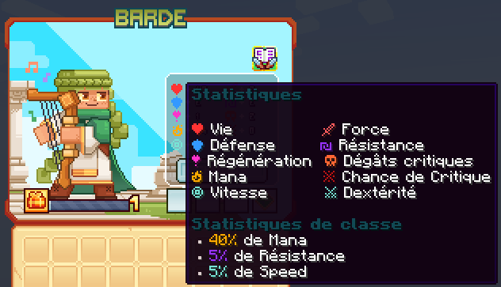

# 🎼 Barde

Le Barde est une classe polyvalente qui utilise la musique pour soutenir ses alliés et entraver ses ennemis. Maître des mélodies enchantées, le Barde peut soigner, renforcer et infliger des effets débilitants avec ses chansons.

<figure><figcaption>
<strong>Aperçu des stats de la classe Barde</strong>
</figcaption></figure>

## 💠 <mark style="color:green;">Compétences</mark>


Les dégâts des compétences sont en cours de modification, ne les prennez pas pour argent comptant !
-L'équipe du wiki


### 🔸 <mark style="color:green;">**Niveau 1 : Onde Mélodieuse**</mark>

Envoyez une onde sonore harmonieuse qui perturbe et endommage les ennemis.

* <mark style="color:green;">**Temps de recharge**</mark>: 1s
* <mark style="color:green;">**Mana**</mark>: 0
* <mark style="color:green;">**Dégâts**</mark>: 23,7
<!--Il faudrai demander la durée du slow-->

### 🔸 <mark style="color:green;">**Niveau 5 : Harmonie**</mark>

Vos notes de musique protectrices appliquent une résistance à vous et vos alliés proches.

* <mark style="color:green;">**Temps de recharge**</mark>: 1s
* <mark style="color:green;">**Mana**</mark>: 0
* <mark style="color:green;">**Dégâts**</mark>: 0

### 🔸 <mark style="color:green;">**Niveau 10 : Mélodie**</mark>

Crée une vibration massive qui étourdit les ennemis.

* <mark style="color:green;">**Temps de recharge**</mark>: 15s
* <mark style="color:green;">**Mana**</mark>: 25
* <mark style="color:green;">**Dégâts**</mark>: 44,8
<!--Il faudrai demander la durée du stun-->

### 🔸 <mark style="color:green;">**Niveau 15 : Sérénade**</mark>

Invoquez un ange qui crée une aura de guérison, soignant les alliés à l'intérieur de la zone.

* <mark style="color:green;">**Temps de recharge**</mark>: 20s
* <mark style="color:green;">**Mana**</mark>: 125
* <mark style="color:green;">**Dégâts**</mark>: 0

### 🔸 <mark style="color:green;">**Niveau 20 : Rhapsodie**</mark>

Augmentez le tempo avec l'aide des oiseaux, appliquant de la vitesse à vous et vos alliés proches.

* <mark style="color:green;">**Temps de recharge**</mark>: 15s
* <mark style="color:green;">**Mana**</mark>: 100
* <mark style="color:green;">**Dégâts**</mark>: 0

### 🔸 <mark style="color:green;">**Niveau 30 : Memento Mori**</mark>

Jouez un accord de mort, déclenchant une onde sonore sombre qui aveugle votre cible.

* <mark style="color:green;">**Temps de recharge**</mark>: 20s
* <mark style="color:green;">**Mana**</mark>: 150
* <mark style="color:green;">**Dégâts**</mark>: 204,3

### 🔸 <mark style="color:green;">**Niveau 40 : Symphonie**</mark>

Invoquez un cercle de mélodies, ralentissant toutes les cibles à l'intérieur de la zone. La clé au milieu du cercle crée une explosion destructrice après un certain temps, faisant léviter les cibles à l'intérieur.

* <mark style="color:green;">**Temps de recharge**</mark>: 30s
* <mark style="color:green;">**Mana**</mark>: 300
* <mark style="color:green;">**Dégâts**</mark>: 2384,9
<!--Il faudrai demander la puissance du slow-->

## 💠 <mark style="color:green;">Armes</mark>

<table>
  <tr>
    <th>Armes</th>
    <th>Rareté</th>
    <th>Stat</th>
    <th>Obtention</th>
  </tr>
  <tr>
    <td><mark style="color:green;">Harpe des murmures</mark></td>
    <td><mark style="color:green;">Commun</mark></td>
    <td>
     
<mark style="color:red;">🗡️️ Force +5</mark>

     
<mark style="color:yellow;">🧪 Mana +25</mark>

    </td>
    <td>Donjon Biome Savane</td>
  </tr>
  <tr>
    <td><mark style="color:yellow;">Harpe des murmures</mark></td>
    <td><mark style="color:yellow;">Rare</mark></td>
    <td>
     
<mark style="color:red;">🗡️️ Force +11</mark>

     
<mark style="color:yellow;">🧪 Mana +50</mark>

    </td>
    <td>Donjon Biome Savane ou Forge</td>
  </tr>
  <tr>
    <td><mark style="color:blue;">Harpe des murmures</mark></td>
    <td><mark style="color:blue;">Épique</mark></td>
    <td>
     
<mark style="color:red;">🗡️️ Force +18</mark>

     
<mark style="color:yellow;">🧪 Mana +75</mark>

    </td>
    <td>Donjon Biome Savane ou Forge</td>
  </tr>
  <tr>
    <td><mark style="color:purple;">Harpe des murmures</mark></td>
    <td><mark style="color:purple;">Légendaire</mark></td>
    <td>
     
<mark style="color:red;">🗡️ Force +35</mark>

     
<mark style="color:yellow;">🧪 Mana +125</mark>

    </td>
    <td>Forge</td>
  </tr>
  <tr>
    <td><mark style="color:red;">Harpe des murmures</mark></td>
    <td><mark style="color:red;">Mythique</mark></td>
    <td>
     
<mark style="color:red;">🗡️️ Force +60</mark>

     
<mark style="color:yellow;">🧪 Mana +210</mark>

    </td>
    <td>Forge</td>
  </tr>
  <tr>
    <td><mark style="color:green;">Harpe Sylvestre</mark></td>
    <td><mark style="color:green;">Commun</mark></td>
    <td>
     
<mark style="color:red;">🗡️️ Force +5</mark>

     
<mark style="color:blue;">🛡️ Défense +3</mark>

    </td>
    <td>Donjon Biome Forêt</td>
  </tr>
  <tr>
    <td><mark style="color:yellow;">Harpe Sylvestre</mark></td>
    <td><mark style="color:yellow;">Rare</mark></td>
    <td>
     
<mark style="color:red;">🗡️️ Force +11</mark>

     
<mark style="color:blue;">🛡️ Défense +6</mark>

    </td>
    <td>Donjon Biome Forêt ou Forge</td>
  </tr>
  <tr>
    <td><mark style="color:blue;">Harpe Sylvestre</mark></td>
    <td><mark style="color:blue;">Épique</mark></td>
    <td>
     
<mark style="color:red;">🗡️️ Force +18</mark>

     
<mark style="color:blue;">🛡️ Défense +9</mark>

    </td>
    <td>Donjon Biome Forêt ou Forge</td>
  </tr>
  <tr>
    <td><mark style="color:purple;">Harpe Sylvestre</mark></td>
    <td><mark style="color:purple;">Légendaire</mark></td>
    <td>
     
<mark style="color:red;">🗡️️ Force +35</mark>

     
<mark style="color:blue;">🛡️ Défense +15</mark>

    </td>
    <td>Forge</td>
  </tr>
  <tr>
    <td><mark style="color:red;">Harpe Sylvestre</mark></td>
    <td><mark style="color:red;">Mythique</mark></td>
    <td>
     
<mark style="color:red;">🗡️️ Force +60</mark>

     
<mark style="color:blue;">🛡️ Défense +26</mark>

    </td>
    <td>Forge</td>
  </tr>
  <tr>
    <td><mark style="color:green;">Harpe épineuse</mark></td>
    <td><mark style="color:green;">Commun</mark></td>
    <td>
     
<mark style="color:red;">🗡️️ Force +5</mark>

     
<mark style="color:blue;">🏃‍♂️ Vitesse +3</mark></td>

    </td>
    <td>Donjon Biome Jungle</td>
  </tr>
  <tr>
    <td><mark style="color:yellow;">Harpe épineuse</mark></td>
    <td><mark style="color:yellow;">Rare</mark></td>
    <td>
     
<mark style="color:red;">🗡️️ Force +11</mark>

     
<mark style="color:blue;">🏃‍♂️ Vitesse +6</mark></td>

    </td>
    <td>Donjon Biome Jungle ou Forge</td>
  </tr>
  <tr>
    <td><mark style="color:blue;">Harpe épineuse</mark></td>
    <td><mark style="color:blue;">Épique</mark></td>
    <td>
     
<mark style="color:red;">🗡️️ Force +18</mark>

     
<mark style="color:blue;">🏃‍♂️ Vitesse +9</mark></td>

    </td>
    <td>Donjon Biome Jungle ou Forge</td>
  </tr>
  <tr>
    <td><mark style="color:purple;">Harpe épineuse</mark></td>
    <td><mark style="color:purple;">Légendaire</mark></td>
    <td>
     
<mark style="color:red;">🗡️️ Force +35</mark>

     
<mark style="color:blue;">🏃‍♂️ Vitesse +15</mark></td>

    </td>
    <td>Forge</td>
  </tr>
  <tr>
    <td><mark style="color:red;">Harpe épineuse</mark></td>
    <td><mark style="color:red;">Mythique</mark></td>
    <td>
     
<mark style="color:red;">🗡️️ Force +60</mark>

     
<mark style="color:blue;">🏃‍♂️ Vitesse +25</mark></td>

    </td>
    <td>Forge</td>
  </tr>
  <tr>
    <td><mark style="color:green;">Harpe des muses</mark></td>
    <td><mark style="color:green;">Commun</mark></td>
    <td>
     
<mark style="color:red;">🗡️️ Force +7</mark>

     
<mark style="color:orange;">💀 Dégât Critique +4</mark>

    </td>
    <td>Pack d'arme</td>
  </tr>
  <tr>
    <td><mark style="color:yellow;">Harpe des muses</mark></td>
    <td><mark style="color:yellow;">Rare</mark></td>
    <td>
     
<mark style="color:red;">🗡️️ Force +15</mark>

     
<mark style="color:orange;">💀 Dégât Critique +8</mark>

    </td>
    <td>Pack d'arme ou Forge</td>
  </tr>
  <tr>
    <td><mark style="color:blue;">Harpe des muses</mark></td>
    <td><mark style="color:blue;">Épique</mark></td>
    <td>
     
<mark style="color:red;">🗡️️ Force +25</mark>

     
<mark style="color:orange;">💀 Dégât Critique +12</mark>

    </td>
    <td>Pack d'arme ou Forge</td>
  </tr>
  <tr>
    <td><mark style="color:purple;">Harpe des muses</mark></td>
    <td><mark style="color:purple;">Légendaire</mark></td>
    <td>
     
<mark style="color:red;">🗡️️ Force +45</mark>

     
<mark style="color:orange;">💀 Dégât Critique +22</mark>

    </td>
    <td>Forge</td>
  </tr>
  <tr>
    <td><mark style="color:red;">Harpe des muses</mark></td>
    <td><mark style="color:red;">Mythique</mark></td>
    <td>
     
<mark style="color:red;">🗡️️ Force +80</mark>

     
<mark style="color:orange;">💀 Dégât Critique +39</mark>

    </td>
    <td>Forge</td>
  </tr>
  <tr>
    <td><mark style="color:yellow;">Harpe légendaire</mark></td>
    <td><mark style="color:yellow;">Jackpot</mark></td>
    <td>
     
<mark style="color:red;">🗡️ Force +60</mark>

     
<mark style="color:orange;">💀 Dégât Critique +26</mark>

    </td>
    <td>X</td>
    <td>▸ <a href="https://wiki.evolucraft.fr/le-gameplay/les-caisses#caisse-jackpot"><mark style="color:yellow;">Caisse Jackpot 🎰</mark></a></td>
  </tr>
  <tr>
    <td><mark style="color:yellow;">Harpe légendaire Shiny</mark></td>
    <td><mark style="color:yellow;">Jackpot</mark></td>
    <td>
     
<mark style="color:red;">🗡️ Force +60</mark>

     
<mark style="color:orange;">💀 Dégât Critique +26</mark>

    </td>
    <td>X</td>
    <td>▸ <a href="https://wiki.evolucraft.fr/le-gameplay/les-caisses#caisse-jackpot"><mark style="color:yellow;">Caisse Jackpot 🎰</mark></a></td>
  </tr>
  <tr>
    <td><mark style="color:blue;">Harpe Abyssal</mark></td>
    <td><mark style="color:blue;">Abyssal</mark></td>
    <td>
     
<mark style="color:red;">🗡️ Force +20</mark>

     
<mark style="color:orange;">💀 Dégât Critique +5</mark>

    </td>
    <td>X</td>
    <td>
      
▸ <a href="https://wiki.evolucraft.fr/le-gameplay/marche-noir#abyssal"><mark style="color:green;">Marché Noir 🧥</mark></a>

      
▸ <a href="https://wiki.evolucraft.fr/le-gameplay/les-caisses#caisse-abyssal"><mark style="color:blue;">Caisse Abyssal 🌊</mark></a>

    </td>
  </tr>
  <tr>
    <td><mark style="color:orange;">Harpe de Minuit</mark></td>
    <td><mark style="color:orange;">Halloween</mark></td>
    <td>
     
<mark style="color:red;">🗡️ Force +31</mark>

     
<mark style="color:orange;">💀 Dégât Critique +14</mark>

    </td>
    <td>X</td>
    <td>
      
▸ <a href="https://wiki.evolucraft.fr/le-gameplay/marche-noir#halloween"><mark style="color:green;">Marché Noir 🧥</mark></a>

      
▸ <a href="https://wiki.evolucraft.fr/le-gameplay/les-caisses#caisse-halloween"><mark style="color:orange;">Caisse Halloween 🎃</mark></a>

    </td>
  </tr>
  <tr>
    <td><mark style="color:blue;">Harpe des Glaces</mark></td>
    <td><mark style="color:blue;">Givrée</mark></td>
    <td>
     
<mark style="color:red;">🗡️ Force +31</mark>

     
<mark style="color:orange;">💀 Dégât Critique +14</mark>

    </td>
    <td>X</td>
    <td>
      
▸ <a href="https://wiki.evolucraft.fr/le-gameplay/marche-noir#givree"><mark style="color:green;">Marché Noir 🧥</mark></a>

      
▸ <a href="https://wiki.evolucraft.fr/le-gameplay/les-caisses#caisse-givree"><mark style="color:blue;">Caisse Givrée ❄️</mark></a>

    </td>
  </tr>
  <tr>
    <td><mark style="color:red;">Harpe de l'Amour</mark></td>
    <td><mark style="color:red;">ST-Valentin</mark></td>
    <td>
     
<mark style="color:red;">🗡️ Force +36</mark>

     
<mark style="color:orange;">💀 Dégât Critique +16</mark>

    </td>
    <td>X</td>
    <td>
      
▸ <a href="https://wiki.evolucraft.fr/le-gameplay/marche-noir#st-valentin"><mark style="color:green;">Marché Noir 🧥</mark></a>

      
▸ <a href="https://wiki.evolucraft.fr/le-gameplay/les-caisses#caisse-saint-valentin"><mark style="color:red;">Caisse Saint-Valentin 💕</mark></a>

    </td>
  </tr>
  <tr>
    <td><mark style="color:yellow;">Harpe en Chocolat</mark></td>
    <td><mark style="color:yellow;">Pâques</mark></td>
    <td>
     
<mark style="color:red;">🗡️ Force +43</mark>

     
<mark style="color:orange;">💀 Dégât Critique +19</mark>

    </td>
    <td>X</td>
    <td>
      
▸ <a href="https://wiki.evolucraft.fr/le-gameplay/marche-noir#paques"><mark style="color:green;">Marché Noir 🧥</mark></a>

      
▸ <a href="https://wiki.evolucraft.fr/le-gameplay/les-caisses#caisse-paques"><mark style="color:yellow;">Caisse Pâques 🥚</mark></a>

    </td>
  </tr>
  <tr>
    <td><mark style="color:blue;">Harpe Summer</mark></td>
    <td><mark style="color:blue;">Summer</mark></td>
    <td>
     
<mark style="color:red;">🗡️ Force +49</mark>

     
<mark style="color:orange;">💀 Dégât Critique +19</mark>

     
<mark style="color:blue;">🏃‍♂️ Vitesse +2</mark></td>

    </td>
    <td>X</td>
    <td>
      
▸ <a href="https://wiki.evolucraft.fr/le-gameplay/marche-noir#summer-2025"><mark style="color:green;">Marché Noir 🧥</mark></a>

      
▸ <a href="https://wiki.evolucraft.fr/le-gameplay/les-caisses#caisse-summer"><mark style="color:blue;">Caisse Summer 🏖️</mark></a>

    </td>
  </tr>
  <tr>
    <td><mark style="color:red;">Harpe de la Lune de Sang</mark></td>
    <td><mark style="color:red;">Lune de Sang</mark></td>
    <td>
     
<mark style="color:red;">🗡️ Force +45</mark>

     
<mark style="color:orange;">💀 Dégât Critique +24</mark>

    </td>
    <td>X</td>
    <td>
      
▸ <a href="https://wiki.evolucraft.fr/le-gameplay/marche-noir#halloween-2025"><mark style="color:green;">Marché Noir 🧥</mark></a>

      
▸ <a href="https://wiki.evolucraft.fr/le-gameplay/les-caisses#caisse-lune-de-sang"><mark style="color:red;">Caisse Lune de Sang 🩸</mark></a>

    </td>
  </tr> 
</table>
