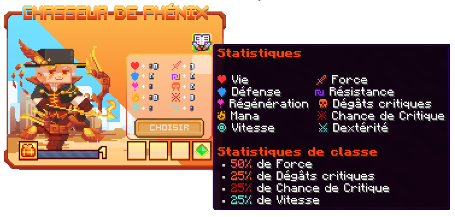

# 💥 Chasseur de Phénix

Maîtres des flammes éternelles, le Chasseur de Phénix puise sa force dans la renaissance et le feu sacré.

<figure><figcaption>
<strong>Aperçu des stats de la classe Chasseur de Phénix</strong>
</figcaption></figure>

## 💠 <mark style="color:purple;">Compétences</mark>


Les dégâts des compétences sont en cours de modification, ne les prenez pas pour argent comptant !  
— L'équipe du wiki


### 🔸 <mark style="color:purple;">**Niveau 1 : Coup du Feu**</mark>

Effectuez une attaque enflammée sur vos ennemis.

* <mark style="color:purple;">**Temps de recharge**</mark> : 1s
* <mark style="color:purple;">**Mana**</mark> : 0
* <mark style="color:purple;">**Dégâts**</mark> : ??

### 🔸 <mark style="color:purple;">**Niveau 5 : Né de la Flamme**</mark> *(Passif)*

Les ennemis blessés par vos compétences sont brûlés. Quant à vous, vous serez résistant au feu et à la lave.

* <mark style="color:purple;">**Temps de recharge**</mark> : ??
* <mark style="color:purple;">**Mana**</mark> : ??
* <mark style="color:purple;">**Dégâts**</mark> : ??

### 🔸 <mark style="color:purple;">**Niveau 10 : Danse Ardente**</mark>

Effectuez une esquive en arrière et projetez des cendres enflammées qui poursuivent l'ennemi le plus proche.

* <mark style="color:purple;">**Temps de recharge**</mark> : ??
* <mark style="color:purple;">**Mana**</mark> : ??
* <mark style="color:purple;">**Dégâts**</mark> : ??

### 🔸 <mark style="color:purple;">**Niveau 15 : Convergence**</mark>

Lancez 3 plumes qui se divisent en trois directions, puis convergent vers un point central, provoquant une puissante explosion qui repousse vos ennemis.

* <mark style="color:purple;">**Temps de recharge**</mark> : ??
* <mark style="color:purple;">**Mana**</mark> : ??
* <mark style="color:purple;">**Dégâts**</mark> : ??

### 🔸 <mark style="color:purple;">**Niveau 20 : Totem du Phénix**</mark>

Invoquez un totem de phénix. Frapper le totem déclenche une vague de flammes qui brûle les ennemis. Au 5e coup, le totem explose en anneau et repousse les ennemis.

* <mark style="color:purple;">**Temps de recharge**</mark> : ??
* <mark style="color:purple;">**Mana**</mark> : ??      
* <mark style="color:purple;">**Dégâts**</mark> : ??

### 🔸 <mark style="color:purple;">**Niveau 30 : Salve Ardente**</mark>

Répandez plusieurs plumes et effectuez un saut en arrière. Lancez toutes vos plumes puis retombez en créant une vague de flammes qui brûle et repousse.

* <mark style="color:purple;">**Temps de recharge**</mark> : ??
* <mark style="color:purple;">**Mana**</mark> : ??
* <mark style="color:purple;">**Dégâts**</mark> : ??

### 🔸 <mark style="color:purple;">**Niveau 40 : Éveil du Phénix**</mark>

Invoquez vos ailes de phénix, infligeant des dégâts et repoussant les ennemis.  
Vous bénéficiez des effets **Saut amélioré II** et **Chute lente**.  
Toutes les 4 attaques, une explosion en forme de X se déclenche. Danse Ardente se charge et lance une vague mortelle.

* <mark style="color:purple;">**Temps de recharge**</mark> : ??
* <mark style="color:purple;">**Mana**</mark> : ??
* <mark style="color:purple;">**Dégâts**</mark> : ??
<!-- Il faudrait demander les dégâts de saignement -->

## 💠 <mark style="color:purple;">Armes</mark>

<table>
  <tr>
    <th>Armes</th>
    <th>Rareté</th>
    <th>Stat</th>
    <th>Obtention</th>
  </tr>
  <tr>
    <td colspan="4">
Bientôt disponible
</td>
  </tr>
</table>
