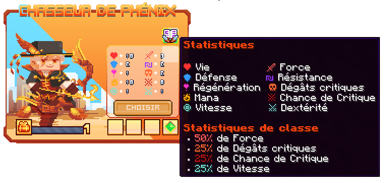

# 💥 Chasseur de Phénix

Maîtres des flammes éternelles, le Chasseur de Phénix puise sa force dans la renaissance et le feu sacré.

<figure><figcaption>
<strong>Aperçu des stats de la classe Chasseur de Phénix</strong>
</figcaption></figure>

## 💠 <mark style="color:purple;">Compétences</mark>


Les dégâts des compétences sont en cours de modification, ne les prenez pas pour argent comptant !  
— L'équipe du wiki


### 🔸 <mark style="color:purple;">**Niveau 1 : Coup du Feu**</mark>

Effectuez une attaque enflammée sur vos ennemis.

* <mark style="color:purple;">**Temps de recharge**</mark> : 1s
* <mark style="color:purple;">**Mana**</mark> : 0
* <mark style="color:purple;">**Dégâts**</mark> : ??

### 🔸 <mark style="color:purple;">**Niveau 5 : Né de la Flamme**</mark> *(Passif)*

Les ennemis blessés par vos compétences sont brûlés. Quant à vous, vous serez résistant au feu et à la lave.

* <mark style="color:purple;">**Temps de recharge**</mark> : ??
* <mark style="color:purple;">**Mana**</mark> : ??
* <mark style="color:purple;">**Dégâts**</mark> : ??

### 🔸 <mark style="color:purple;">**Niveau 10 : Danse Ardente**</mark>

Effectuez une esquive en arrière et projetez des cendres enflammées qui poursuivent l'ennemi le plus proche.

* <mark style="color:purple;">**Temps de recharge**</mark> : ??
* <mark style="color:purple;">**Mana**</mark> : ??
* <mark style="color:purple;">**Dégâts**</mark> : ??

### 🔸 <mark style="color:purple;">**Niveau 15 : Convergence**</mark>

Lancez 3 plumes qui se divisent en trois directions, puis convergent vers un point central, provoquant une puissante explosion qui repousse vos ennemis.

* <mark style="color:purple;">**Temps de recharge**</mark> : ??
* <mark style="color:purple;">**Mana**</mark> : ??
* <mark style="color:purple;">**Dégâts**</mark> : ??

### 🔸 <mark style="color:purple;">**Niveau 20 : Totem du Phénix**</mark>

Invoquez un totem de phénix. Frapper le totem déclenche une vague de flammes qui brûle les ennemis. Au 5e coup, le totem explose en anneau et repousse les ennemis.

* <mark style="color:purple;">**Temps de recharge**</mark> : ??
* <mark style="color:purple;">**Mana**</mark> : ??      
* <mark style="color:purple;">**Dégâts**</mark> : ??

### 🔸 <mark style="color:purple;">**Niveau 30 : Salve Ardente**</mark>

Répandez plusieurs plumes et effectuez un saut en arrière. Lancez toutes vos plumes puis retombez en créant une vague de flammes qui brûle et repousse.

* <mark style="color:purple;">**Temps de recharge**</mark> : ??
* <mark style="color:purple;">**Mana**</mark> : ??
* <mark style="color:purple;">**Dégâts**</mark> : ??

### 🔸 <mark style="color:purple;">**Niveau 40 : Éveil du Phénix**</mark>

Invoquez vos ailes de phénix, infligeant des dégâts et repoussant les ennemis.  
Vous bénéficiez des effets **Saut amélioré II** et **Chute lente**.  
Toutes les 4 attaques, une explosion en forme de X se déclenche. Danse Ardente se charge et lance une vague mortelle.

* <mark style="color:purple;">**Temps de recharge**</mark> : ??
* <mark style="color:purple;">**Mana**</mark> : ??
* <mark style="color:purple;">**Dégâts**</mark> : ??
<!-- Il faudrait demander les dégâts de saignement -->

## 💠 <mark style="color:purple;">Armes</mark>

<table>
<tr>
    <th><strong>Nom de l'Armes 🏷️</strong></th>
    <th><strong>Rareté ou Collection 🌟</strong></th>
    <th><strong>Statistiques 📊</strong></th>
    <th><strong>Effets ✨</strong></th>
    <th><strong>Obtentions 📌</strong></th>
  </tr>
  <tr>
    <td><mark style="color:green;">Arc du Phénix</mark></td>
    <td><mark style="color:green;">Commun</mark></td>
    <td>
     
<mark style="color:red;">🗡️ Force +7</mark>

     
<mark style="color:orange;">💀 Dégât Critique +4</mark>

    </td>
    <td><mark style="color:green;">Aucun Effet</mark> Supplémentaire ❌</td>
    <td>
     
▸ <mark style="color:green;">Packs d'Armes (Mini-Boss & Boss des Donjons Communs)</mark>

    </td>
  </tr>
  <tr>
    <td><mark style="color:yellow;">Arc du Phénix</mark></td>
    <td><mark style="color:yellow;">Rare</mark></td>
    <td>
     
<mark style="color:red;">🗡️ Force +15</mark>

     
<mark style="color:orange;">💀 Dégât Critique +8</mark>

    </td>
    <td><mark style="color:green;">Aucun Effet</mark> Supplémentaire ❌</td>
    <td>
     
▸ <mark style="color:yellow;">Packs d'Armes (Mini-Boss & Boss des Donjons Rares)</mark>

     
▸ <a href="https://wiki.evolucraft.fr/le-gameplay/les-machines/forge#armes-rares"><mark style="color:green;">Forge 🔨</mark></a>

    </td>
  </tr>
  <tr>
    <td><mark style="color:blue;">Arc du Phénix</mark></td>
    <td><mark style="color:blue;">Épique</mark></td>
    <td>
     
<mark style="color:red;">🗡️ Force +25</mark>

     
<mark style="color:orange;">💀 Dégât Critique +12</mark>

    </td>
    <td><mark style="color:green;">Aucun Effet</mark> Supplémentaire ❌</td>
    <td>
     
▸ <mark style="color:blue;">Packs d'Armes (Mini-Boss & Boss des Donjons Épiques)</mark>

     
▸ <a href="https://wiki.evolucraft.fr/le-gameplay/les-machines/forge#armes-epiques"><mark style="color:green;">Forge 🔨</mark></a>

    </td>
  </tr>
  <tr>
    <td><mark style="color:purple;">Arc du Phénix</mark></td>
    <td><mark style="color:purple;">Légendaires</mark></td>
    <td>
     
<mark style="color:red;">🗡️ Force +45</mark>

     
<mark style="color:orange;">💀 Dégât Critique +22</mark>

    </td>
    <td><mark style="color:green;">Aucun Effet</mark> Supplémentaire ❌</td>
    <td>
     
▸ <a href="https://wiki.evolucraft.fr/le-gameplay/les-machines/forge#armes-legendaire"><mark style="color:green;">Forge 🔨</mark></a>

    </td>
  </tr>
  <tr>
    <td><mark style="color:red;">Arc du Phénix</mark></td>
    <td><mark style="color:red;">Mythique</mark></td>
    <td>
     
<mark style="color:red;">🗡️ Force +7</mark>

     
<mark style="color:orange;">💀 Dégât Critique +4</mark>

    </td>
    <td><mark style="color:green;">Aucun Effet</mark> Supplémentaire ❌</td>
    <td>
     
▸ <a href="https://wiki.evolucraft.fr/le-gameplay/les-machines/forge#armes-mythiques"><mark style="color:green;">Forge 🔨</mark></a>

    </td>
  </tr>
  <tr>
    <td><mark style="color:red;">Arc de l'enfer de la Lune de Sang</mark></td>
    <td><mark style="color:red;">Lune de Sang</mark></td>
    <td>
     
<mark style="color:red;">🗡️ Force +45</mark>

     
<mark style="color:orange;">💀 Dégât Critique +21</mark>

    </td>
    <td><mark style="color:green;">Aucun Effet</mark> Supplémentaire ❌</td>
    <td>
      
▸ <a href="https://wiki.evolucraft.fr/le-gameplay/marche-noir#halloween-2025"><mark style="color:green;">Marché Noir 🧥</mark></a>

      
▸ <a href="https://wiki.evolucraft.fr/le-gameplay/les-caisses#caisse-lune-de-sang"><mark style="color:red;">Caisse Lune de Sang 🩸</mark></a>

    </td>
  </tr> 
  <tr>
    <td><mark style="color:red;">Arc de l'enfer Pain d'épice</mark></td>
    <td><mark style="color:red;">Pain d'épice</mark></td>
    <td>
     
<mark style="color:red;">🗡️ Force +47</mark>

     
<mark style="color:orange;">💀 Dégât Critique +21</mark>

    </td>
    <td><mark style="color:red;"><strong>Bonus Dégâts 💢</strong></mark> ▸ <mark style="color:red;">+5% de dégâts</mark> dans les donjons <mark style="color:red;">caverne glaciale</mark> et <mark style="color:red;">laboratoire glaciale</mark></td>
    <td>
      
▸ <a href="https://wiki.evolucraft.fr/le-gameplay/marche-noir#Noel-2025"><mark style="color:green;">Marché Noir 🧥</mark></a>

      
▸ <a href="https://wiki.evolucraft.fr/le-gameplay/les-caisses#caisse-pain-depice"><mark style="color:red;">Caisse Pain d'épice 🍪</mark></a>

    </td>
  </tr>
  <tr>
    <td><mark style="color:green;">Arc de l'enfer de Jade</mark></td>
    <td><mark style="color:green;">Nouvel An Lunaire</mark></td>
    <td>
     
<mark style="color:red;">🗡️ Force +51</mark>

     
<mark style="color:orange;">💀 Dégât Critique +21</mark>

     
<mark style="color:blue;">🏃‍♂️ Vitesse +8</mark></td>

    </td>
    <td><mark style="color:green;">Aura de Feu 🔥</mark> ▸ Enflamme la cible pendant 4 secondes</td>
    <td>
      
▸ <a href="https://wiki.evolucraft.fr/le-gameplay/marche-noir#nouvel-an-lunaire"><mark style="color:green;">Marché Noir 🧥</mark></a>

      
▸ <a href="https://wiki.evolucraft.fr/le-gameplay/les-caisses#caisse-lunaire"><mark style="color:green;">Caisse Lunaire 🎑</mark></a>

    </td>
  </tr> 
</table>
