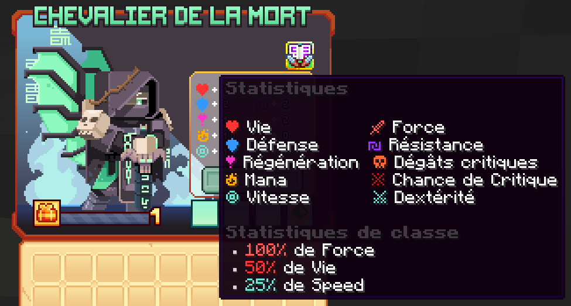

# ☠️ Chevalier de la Mort
Guerrier hanté, serviteur de la mort, maniant la corruption et la magie noire, il inspire la terreur.

<figure><figcaption>
<strong>Aperçu des stats de la classe Chevalier de la Mort</strong>
</figcaption></figure>

## 💠 <mark style="color:red;">Compétences</mark>


Les dégâts des compétences sont en cours de modification, ne les prenez pas pour argent comptant !
-L'équipe du wiki


### 🔸 <mark style="color:red;">**Niveau 1 : Frappe Mortelle**</mark>

Frappez vers l'avant en repoussant les ennemis. Au troisième lancer, lancez des chaînes en avant, accrochez-vous à des blocs ou des ennemis.
Au quatrième lancer, frappez le sol avec une force immense, libérant une onde de choc nécrotique massive.

* <mark style="color:red;">**Temps de recharge**</mark>**:** 0.5s
* <mark style="color:red;">**Mana**</mark>**:** 0
* <mark style="color:red;">**Dégâts**</mark>**:** 40,3 (pour les deux premières attaques), puis 9.4 (pour les deux suivantes)

### 🔸 <mark style="color:red;">**Niveau 5 : Sceau Maudit**</mark>

Frappez votre ennemi pour lui infliger un sceau maudit, qui s'accumule à chaque attaque jusqu'à 4 charges.
En atteignant la pleine charge, l'ennemi marqué obtient Faiblesse I.

* <mark style="color:red;">**Temps de recharge**</mark>**:** 0s
* <mark style="color:red;">**Mana**</mark>**:** 0
* <mark style="color:red;">**Dégâts**</mark>**:** 0

### 🔸 <mark style="color:red;">**Niveau 10 : Charge fantôme**</mark>

Foncez vers l'avant, avec une force écrasante, traînant les ennemis sur votre chemin et laissant le chaos dans votre sillage.

* <mark style="color:red;">**Temps de recharge**</mark>**:** 10s
* <mark style="color:red;">**Mana**</mark>**:** 25
* <mark style="color:red;">**Dégâts**</mark>**:** 53,6

### 🔸 <mark style="color:red;">**Niveau 15 : Chaîne fantôme**</mark>

Déchaîne les chaînes fantomatiques, liant les ennemis et les traînant lentement vers vous.

Les mains nécrotiques se lèvent, s'aggrippant à leurs cibles et les étourdissant en place.

* <mark style="color:red;">**Temps de recharge**</mark>**:** 12s
* <mark style="color:red;">**Mana**</mark>**:** 125
* <mark style="color:red;">**Dégâts**</mark>**:** 0

### 🔸 <mark style="color:red;">**Niveau 20 : Barrière d'âme**</mark>

Invoque une barrière d'énergie nécrotique, vous accordant l'invulnérabilité pendant quelques secondes.
Pendant ce temps, tous les dégâts reçus sont absorbés et convertis en soins.

* <mark style="color:red;">**Temps de recharge**</mark>**:** 20s
* <mark style="color:red;">**Mana**</mark>**:** 100
* <mark style="color:red;">**Dégâts**</mark>**:**  62,3 + 311,6

### 🔸 <mark style="color:red;">**Niveau 30 : Nécrophage**</mark>

Faites tourner votre Nécrophage dans un vortex mortel, soulevant légèrement les ennemis en l'air au contact.
À la fin de la compétence, invoquez des griffes nécrotiques pour trancher les ennemis proches et soignez-vous en fonction du nombre d'ennemis touchés. Les ennemis sont repoussés et ralentis.

* <mark style="color:red;">**Temps de recharge**</mark>**:** 17s
* <mark style="color:red;">**Mana**</mark>**:** 150
* <mark style="color:red;">**Dégâts**</mark>**:** 62,3 + 311,6

### 🔸 <mark style="color:red;">**Niveau 40 : Peine de mort**</mark>

Déployez vos ailes mortelles et envolez-vous dans les airs, invoquez lentement votre lame d'âme. Plongez vers l'endroit choisi avec une force terrifiante en frappant tout les ennemis avec votre épée de l'âme.
Les ennemis avec des sceaux maudits complètement chargés prennent des dégâts supplémentaires, ne laissant aucune chance de survie.

* <mark style="color:red;">**Temps de recharge**</mark>**:** 35s
* <mark style="color:red;">**Mana**</mark>**:** 300
* <mark style="color:red;">**Dégâts**</mark>**:** 4012,1

## 💠 <mark style="color:red;">Armes</mark>

<table>
<tr>
    <th><strong>Nom de l'Armes 🏷️</strong></th>
    <th><strong>Rareté ou Collection 🌟</strong></th>
    <th><strong>Statistiques 📊</strong></th>
    <th><strong>Effets ✨</strong></th>
    <th><strong>Obtentions 📌</strong></th>
  </tr>
  <tr>
    <td><mark style="color:red;">Épée des morts</mark></td>
    <td><mark style="color:red;">Commun</mark></td>   
    <td>
     
<mark style="color:red;">🗡️ Force +7</mark>

     
<mark style="color:orange;">💀 Dégât Critique +4</mark>

    </td>    
    <td>Pack d'arme</td>
  </tr>
  <tr>
    <td><mark style="color:yellow;">Épée des morts</mark></td>
    <td><mark style="color:yellow;">Rare</mark></td>   
    <td>
     
<mark style="color:red;">🗡️ Force +15</mark>

     
<mark style="color:orange;">💀 Dégât Critique +8</mark>

    </td>    
    <td>Pack d'arme ou Forge</td>
  </tr>
  <tr>
    <td><mark style="color:blue;">Épée des morts</mark></td>
    <td><mark style="color:blue;">Épique</mark></td>   
    <td>
     
<mark style="color:red;">🗡️ Force +25</mark>

     
<mark style="color:orange;">💀 Dégât Critique +12</mark>

    </td>    
    <td>Pack d'arme ou Forge</td>
  </tr>
  <tr>
    <td><mark style="color:purple;">Épée des morts</mark></td>
    <td><mark style="color:purple;">Légendaire</mark></td>   
    <td>
     
<mark style="color:red;">🗡️ Force +45</mark>

     
<mark style="color:orange;">💀 Dégât Critique +22</mark>

    </td>    
    <td>Forge</td>
  </tr>
  <tr>
    <td><mark style="color:red;">Épée des morts</mark></td>
    <td><mark style="color:red;">Mythique</mark></td>   
    <td>
     
<mark style="color:red;">🗡️ Force +80</mark>

     
<mark style="color:orange;">💀 Dégât Critique +39</mark>

    </td>    
    <td>Forge</td>
  </tr>
  <tr>
    <td><mark style="color:yellow;">Épée des morts légendaire</mark></td>
    <td><mark style="color:yellow;">Jackpot</mark></td>
    <td>
     
<mark style="color:red;">🗡️ Force +60</mark>

     
<mark style="color:orange;">💀 Dégât Critique +26</mark>

    </td>
    <td>▸ <a href="https://wiki.evolucraft.fr/le-gameplay/les-caisses#caisse-jackpot"><mark style="color:yellow;">Caisse Jackpot 🎰</mark></a></td>
  </tr>
  <tr>
    <td><mark style="color:yellow;">Épée des morts légendaire Shiny</mark></td>
    <td><mark style="color:yellow;">Jackpot</mark></td>
    <td>
     
<mark style="color:red;">🗡️ Force +60</mark>

     
<mark style="color:orange;">💀 Dégât Critique +26</mark>

    </td>
    <td>▸ <a href="https://wiki.evolucraft.fr/le-gameplay/les-caisses#caisse-jackpot"><mark style="color:yellow;">Caisse Jackpot 🎰</mark></a></td>
  </tr>
  <tr>
    <td><mark style="color:blue;">Épée des morts Summer</mark></td>
    <td><mark style="color:blue;">Summer</mark></td>
    <td>
     
<mark style="color:red;">🗡️ Force +49</mark>

     
<mark style="color:orange;">💀 Dégât Critique +19</mark>

     
<mark style="color:blue;">🏃‍♂️ Vitesse +2</mark></td>

    </td>
    <td>
      
▸ <a href="https://wiki.evolucraft.fr/le-gameplay/marche-noir#summer-2025"><mark style="color:green;">Marché Noir 🧥</mark></a>

      
▸ <a href="https://wiki.evolucraft.fr/le-gameplay/les-caisses#caisse-summer"><mark style="color:blue;">Caisse Summer 🏖️</mark></a>

    </td>
  </tr>
  <tr>
    <td><mark style="color:red;">Épée des morts de la Lune de Sang</mark></td>
    <td><mark style="color:red;">Lune de Sang</mark></td>
    <td>
     
<mark style="color:red;">🗡️ Force +45</mark>

     
<mark style="color:orange;">💀 Dégât Critique +21</mark>

    </td>
    <td>
      
▸ <a href="https://wiki.evolucraft.fr/le-gameplay/marche-noir#halloween-2025"><mark style="color:green;">Marché Noir 🧥</mark></a>

      
▸ <a href="https://wiki.evolucraft.fr/le-gameplay/les-caisses#caisse-lune-de-sang"><mark style="color:red;">Caisse Lune de Sang 🩸</mark></a>

    </td>
  </tr> 
  <tr>
    <td><mark style="color:red;">Épée des morts Pain d'épice</mark></td>
    <td><mark style="color:red;">Pain d'épice</mark></td>
    <td>
     
<mark style="color:red;">🗡️ Force +47</mark>

     
<mark style="color:orange;">💀 Dégât Critique +21</mark>

    </td>
    <td>
      
▸ <a href="https://wiki.evolucraft.fr/le-gameplay/marche-noir#Noel-2025"><mark style="color:green;">Marché Noir 🧥</mark></a>

      
▸ <a href="https://wiki.evolucraft.fr/le-gameplay/les-caisses#caisse-pain-depice"><mark style="color:red;">Caisse Pain d'épice 🍪</mark></a>

    </td>
  </tr>
  <tr>
    <td><mark style="color:green;">Épée des morts de Jade</mark></td>
    <td><mark style="color:green;">Nouvel An Lunaire</mark></td>
    <td>
     
<mark style="color:red;">🗡️ Force +51</mark>

     
<mark style="color:orange;">💀 Dégât Critique +26</mark>

    </td>
    <td><mark style="color:green;">Aura de Feu 🔥</mark> ▸ Enflamme la cible pendant 4 secondes</td>
    <td>
      
▸ <a href="https://wiki.evolucraft.fr/le-gameplay/marche-noir#nouvel-an-lunaire"><mark style="color:green;">Marché Noir 🧥</mark></a>

      
▸ <a href="https://wiki.evolucraft.fr/le-gameplay/les-caisses#caisse-lunaire"><mark style="color:green;">Caisse Lunaire 🎑</mark></a>

    </td>
  </tr>     
</table>
