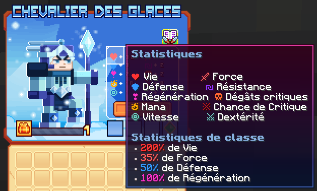

# ❄️ Chevalier des glaces

Chevalier maniant le givre, paralysant ses ennemis dans le froid et refroidissant leur ardeur.

<figure><figcaption>
<strong>Aperçu des stats de la classe Chevalier des glaces</strong>
</figcaption></figure>

## 💠 <mark style="color:yellow;">Compétences</mark>


Les dégâts des compétences sont en cours de modification, ne les prenez pas pour argent comptant !
-L'équipe du wiki


### 🔸 <mark style="color:yellow;">**Niveau 1 : Frappe de givre**</mark>

Effectuez une attaque tranchante avec votre lame.

* <mark style="color:yellow;">**Temps de recharge**</mark>: 0.5s
* <mark style="color:yellow;">**Mana**</mark>: 0
* <mark style="color:yellow;">**Dégâts**</mark>: 5,9
* <mark style="color:yellow;">**Dégâts du combo**</mark>**:** 9.9

### 🔸 <mark style="color:yellow;">**Niveau 5 : Engelures**</mark>

Vos attaques ont 15% de chances d'infliger des engelures.

* <mark style="color:yellow;">**Temps de recharge**</mark>: 0s
* <mark style="color:yellow;">**Mana**</mark>: 0
* <mark style="color:yellow;">**Dégâts d'engelures**</mark>: 11,3

### 🔸 <mark style="color:yellow;">**Niveau 10 : Lance givrée**</mark>

Invoquez votre lance glaciale et visez. Après 3 secondes, la lance glaciale se projette à grande vitesse vers l'avant, transperçant tous les ennemis.

* <mark style="color:yellow;">**Temps de recharge**</mark>: 5s
* <mark style="color:yellow;">**Mana**</mark>: 100
* <mark style="color:yellow;">**Dégâts**</mark>: 29,2

### 🔸 <mark style="color:yellow;">**Niveau 15 : Fracas glacial**</mark>

Sautez vers le haut et fracassez la surface, créant un cratère de glace. Les ennemis dans la zone du cratère sont complètement gelés.

* <mark style="color:yellow;">**Temps de recharge**</mark>: 10s
* <mark style="color:yellow;">**Mana**</mark>: 120
* <mark style="color:yellow;">**Dégâts**</mark>: 73

### 🔸 <mark style="color:yellow;">**Niveau 20 : Charge arctique**</mark>

Concentrez votre énergie glaciaire et foncez en avant. Les ennemis touchés sont projetés en arrière. Vous laissez derrière vous un chemin de glace qui ralentit et endommage les ennemis.

* <mark style="color:yellow;">**Temps de recharge**</mark>: 10s
* <mark style="color:yellow;">**Mana**</mark>: 125
* <mark style="color:yellow;">**Dégâts**</mark>: 61,4
* <mark style="color:yellow;">**Dégâts de trainée**</mark>: 15.3
<!--Il faudrai demander la durée du slow-->

### 🔸 <mark style="color:yellow;">**Niveau 30 : Bouclier gelé**</mark>

Déployez un bouclier de glace empêchant les ennemis d'approcher en bloquant les projectiles. Après quelques secondes, votre bouclier est projeté vers l'avant, repoussant les ennemis.

* <mark style="color:yellow;">**Temps de recharge**</mark>: 5s
* <mark style="color:yellow;">**Mana**</mark>: 100
* <mark style="color:yellow;">**Dégâts**</mark>: 102,6

### 🔸 <mark style="color:yellow;">**Niveau 40 : Percée glaciale**</mark>

Percez les défenses de vos ennemis avec votre lance , vos deux premières frappes repoussent les ennemis. La troisième fait décoller vos ennemis et la quatrième cloue les ennemis au sol, les emprisonnant dans la glace.

* <mark style="color:yellow;">**Temps de recharge**</mark>: 25s
* <mark style="color:yellow;">**Mana**</mark>: 350
* <mark style="color:yellow;">**Dégâts**</mark>: 191,2 les deux premières attaques et 237,2 les deux dernières attaques

## 💠 <mark style="color:yellow;">Armes</mark>

### 🔸 <mark style="color:green;">**Packs d'Armes**</mark>

<table>
<tr>
    <th><strong>Nom de l'Armes 🏷️</strong></th>
    <th><strong>Rareté ou Collection 🌟</strong></th>
    <th><strong>Statistiques 📊</strong></th>
    <th><strong>Effets ✨</strong></th>
    <th><strong>Obtentions 📌</strong></th>
  </tr>
  <tr>
    <td><mark style="color:green;">Lance de frigg</mark></td>
    <td><mark style="color:green;">Commun</mark></td>   
    <td>
     
<mark style="color:red;">🗡️ Force +7</mark>

     
<mark style="color:orange;">💀 Dégât Critique +4</mark>

    </td>
    <td><mark style="color:green;">Aucun Effet</mark> Supplémentaire ❌</td>    
    <td>
     
▸ <mark style="color:green;">Packs d'Armes (Mini-Boss & Boss des Donjons Communs)</mark>

    </td>
  </tr>
  <tr>
    <td><mark style="color:yellow;">Lance de frigg</mark></td>
    <td><mark style="color:yellow;">Rare</mark></td>   
    <td>
     
<mark style="color:red;">🗡️ Force +15</mark>

     
<mark style="color:orange;">💀 Dégât Critique +8</mark>

    </td>
    <td><mark style="color:green;">Aucun Effet</mark> Supplémentaire ❌</td>    
    <td>
     
▸ <mark style="color:yellow;">Packs d'Armes (Mini-Boss & Boss des Donjons Rares)</mark>

     
▸ <a href="https://wiki.evolucraft.fr/le-gameplay/les-machines/forge#armes-rares"><mark style="color:green;">Forge 🔨</mark></a>

    </td>
  </tr>
  <tr>
    <td><mark style="color:blue;">Lance de frigg</mark></td>
    <td><mark style="color:blue;">Épique</mark></td>   
    <td>
     
<mark style="color:red;">🗡️ Force +25</mark>

     
<mark style="color:orange;">💀 Dégât Critique +12</mark>

    </td>
    <td><mark style="color:green;">Aucun Effet</mark> Supplémentaire ❌</td>    
    <td>
     
▸ <mark style="color:blue;">Packs d'Armes (Mini-Boss & Boss des Donjons Épiques, Légendaires et Mythique)</mark>

     
▸ <a href="https://wiki.evolucraft.fr/le-gameplay/les-machines/forge#armes-epiques"><mark style="color:green;">Forge 🔨</mark></a>

    </td>
  </tr>
  <tr>
    <td><mark style="color:purple;">Lance de frigg</mark></td>
    <td><mark style="color:purple;">Légendaire</mark></td>   
    <td>
     
<mark style="color:red;">🗡️ Force +45</mark>

     
<mark style="color:orange;">💀 Dégât Critique +22</mark>

    </td>
    <td><mark style="color:green;">Aucun Effet</mark> Supplémentaire ❌</td>    
    <td>
     
▸ <a href="https://wiki.evolucraft.fr/le-gameplay/les-machines/forge#armes-legendaires"><mark style="color:green;">Forge 🔨</mark></a>

    </td>
  </tr>
  <tr>
    <td><mark style="color:red;">Lance de frigg</mark></td>
    <td><mark style="color:red;">Mythique</mark></td>   
    <td>
     
<mark style="color:red;">🗡️️ Force +80</mark>

     
<mark style="color:orange;">💀 Dégât Critique +39</mark>

    </td>
    <td><mark style="color:green;">Aucun Effet</mark> Supplémentaire ❌</td>    
    <td>
     
▸ <a href="https://wiki.evolucraft.fr/le-gameplay/les-machines/forge#armes-mythiques"><mark style="color:green;">Forge 🔨</mark></a>

    </td>
  </tr>
  <tr>
    <td><mark style="color:green;">Lance de frigg Shiny</mark></td>
    <td><mark style="color:green;">Commun ✨</mark></td>   
    <td>
     
<mark style="color:red;">🗡️ Force +7</mark>

     
<mark style="color:orange;">💀 Dégât Critique +4</mark>

    </td>
    <td><mark style="color:green;">Aucun Effet</mark> Supplémentaire ❌</td>    
    <td>
     
▸ <mark style="color:green;">Packs d'Armes (Mini-Boss & Boss des Donjons Communs)</mark>

    </td>
  </tr>
  <tr>
    <td><mark style="color:yellow;">Lance de frigg Shiny</mark></td>
    <td><mark style="color:yellow;">Rare ✨</mark></td>   
    <td>
     
<mark style="color:red;">🗡️ Force +15</mark>

     
<mark style="color:orange;">💀 Dégât Critique +8</mark>

    </td>
    <td><mark style="color:green;">Aucun Effet</mark> Supplémentaire ❌</td>    
    <td>
     
▸ <mark style="color:yellow;">Packs d'Armes (Mini-Boss & Boss des Donjons Rares)</mark>

     
▸ <a href="https://wiki.evolucraft.fr/le-gameplay/les-machines/forge#armes-rares"><mark style="color:green;">Forge 🔨</mark></a>

    </td>
  </tr>
  <tr>
    <td><mark style="color:blue;">Lance de frigg Shiny</mark></td>
    <td><mark style="color:blue;">Épique ✨</mark></td>   
    <td>
     
<mark style="color:red;">🗡️ Force +25</mark>

     
<mark style="color:orange;">💀 Dégât Critique +12</mark>

    </td>
    <td><mark style="color:green;">Aucun Effet</mark> Supplémentaire ❌</td>    
    <td>
     
▸ <mark style="color:blue;">Packs d'Armes (Mini-Boss & Boss des Donjons Épiques, Légendaires et Mythique)</mark>

     
▸ <a href="https://wiki.evolucraft.fr/le-gameplay/les-machines/forge#armes-epiques"><mark style="color:green;">Forge 🔨</mark></a>

    </td>
  </tr>
  <tr>
    <td><mark style="color:purple;">Lance de frigg Shiny</mark></td>
    <td><mark style="color:purple;">Légendaire ✨</mark></td>   
    <td>
     
<mark style="color:red;">🗡️ Force +45</mark>

     
<mark style="color:orange;">💀 Dégât Critique +22</mark>

    </td>
    <td><mark style="color:green;">Aucun Effet</mark> Supplémentaire ❌</td>    
    <td>
     
▸ <a href="https://wiki.evolucraft.fr/le-gameplay/les-machines/forge#armes-legendaires"><mark style="color:green;">Forge 🔨</mark></a>

    </td>
  </tr>
  <tr>
    <td><mark style="color:red;">Lance de frigg Shiny</mark></td>
    <td><mark style="color:red;">Mythique ✨</mark></td>   
    <td>
     
<mark style="color:red;">🗡️️ Force +80</mark>

     
<mark style="color:orange;">💀 Dégât Critique +39</mark>

    </td>
    <td><mark style="color:green;">Aucun Effet</mark> Supplémentaire ❌</td>    
    <td>
     
▸ <a href="https://wiki.evolucraft.fr/le-gameplay/les-machines/forge#armes-mythiques"><mark style="color:green;">Forge 🔨</mark></a>

    </td>
  </tr>
</table>

### 🔸 <mark style="color:green;">**Armes des Évènements**</mark>

<table>
<tr>
    <th><strong>Nom de l'Armes 🏷️</strong></th>
    <th><strong>Rareté ou Collection 🌟</strong></th>
    <th><strong>Statistiques 📊</strong></th>
    <th><strong>Effets ✨</strong></th>
    <th><strong>Obtentions 📌</strong></th>
  </tr>    
  <tr>
    <td><mark style="color:yellow;">Lance Glacée légendaire</mark></td>
    <td><mark style="color:yellow;">Jackpot</mark></td>
    <td>
     
<mark style="color:red;">🗡️ Force +60</mark>

     
<mark style="color:orange;">💀 Dégât Critique +26</mark>

    </td>
    <td><mark style="color:green;">Aucun Effet</mark> Supplémentaire ❌</td>
    <td>▸ <a href="https://wiki.evolucraft.fr/le-gameplay/les-caisses#caisse-jackpot"><mark style="color:yellow;">Caisse Jackpot 🎰</mark></a></td>
  </tr>
  <tr>
    <td><mark style="color:yellow;">Lance Glacée légendaire Shiny</mark></td>
    <td><mark style="color:yellow;">Jackpot</mark></td>
    <td>
     
<mark style="color:red;">🗡️ Force +60</mark>

     
<mark style="color:orange;">💀 Dégât Critique +26</mark>

    </td>
    <td><mark style="color:green;">Aucun Effet</mark> Supplémentaire ❌</td>
    <td>▸ <a href="https://wiki.evolucraft.fr/le-gameplay/les-caisses#caisse-jackpot"><mark style="color:yellow;">Caisse Jackpot 🎰</mark></a></td>
  </tr>
  <tr>
    <td><mark style="color:red;">Lance Glacée de l'Amour</mark></td>
    <td><mark style="color:red;">ST-Valentin</mark></td>
    <td>
     
<mark style="color:red;">🗡️ Force +36</mark>

     
<mark style="color:orange;">💀 Dégât Critique +16</mark>

    </td>
    <td><mark style="color:red;"><strong>Bonus Dégâts 💢</strong></mark> ▸ <mark style="color:red;">+5% de dégâts</mark> dans les donjons <mark style="color:red;">amour</mark> et <mark style="color:red;">cupidon</mark></td>
    <td>
      
▸ <a href="https://wiki.evolucraft.fr/le-gameplay/marche-noir#st-valentin"><mark style="color:green;">Marché Noir 🧥</mark></a>

      
▸ <a href="https://wiki.evolucraft.fr/le-gameplay/les-caisses#caisse-saint-valentin"><mark style="color:red;">Caisse Saint-Valentin 💕</mark></a>

    </td>
  </tr>
  <tr>
    <td><mark style="color:yellow;">Lance Glacée en Chocolat</mark></td>
    <td><mark style="color:yellow;">Pâques</mark></td>
    <td>
     
<mark style="color:red;">🗡️ Force +43</mark>

     
<mark style="color:orange;">💀 Dégât Critique +19</mark>

    </td>
    <td><mark style="color:yellow;"><strong>Bonus Dégâts 💢</strong></mark> ▸ <mark style="color:yellow;">+5% de dégâts</mark> dans les donjons <mark style="color:yellow;">terriers du lapins</mark> et <mark style="color:yellow;">fabrique du chocolat</mark></td>
    <td>
      
▸ <a href="https://wiki.evolucraft.fr/le-gameplay/marche-noir#paques"><mark style="color:green;">Marché Noir 🧥</mark></a>

      
▸ <a href="https://wiki.evolucraft.fr/le-gameplay/les-caisses#caisse-paques"><mark style="color:yellow;">Caisse Pâques 🥚</mark></a>

    </td>
  </tr>
  <tr>
    <td><mark style="color:blue;">Lance Glacée Summer</mark></td>
    <td><mark style="color:blue;">Summer</mark></td>
    <td>
     
<mark style="color:red;">🗡️ Force +49</mark>

     
<mark style="color:orange;">💀 Dégât Critique +19</mark>

     
<mark style="color:blue;">🏃‍♂️ Vitesse +2</mark></td>

    </td>
    <td><mark style="color:green;">Aucun Effet</mark> Supplémentaire ❌</td>
    <td>
      
▸ <a href="https://wiki.evolucraft.fr/le-gameplay/marche-noir#summer-2025"><mark style="color:green;">Marché Noir 🧥</mark></a>

      
▸ <a href="https://wiki.evolucraft.fr/le-gameplay/les-caisses#caisse-summer"><mark style="color:blue;">Caisse Summer 🏖️</mark></a>

    </td>
  </tr>
  <tr>
    <td><mark style="color:red;">Lance Glacée de la Lune de Sang</mark></td>
    <td><mark style="color:red;">Lune de Sang</mark></td>
    <td>
     
<mark style="color:red;">🗡️ Force +45</mark>

     
<mark style="color:orange;">💀 Dégât Critique +21</mark>

    </td>
    <td><mark style="color:green;">Aucun Effet</mark> Supplémentaire ❌</td>
    <td>
      
▸ <a href="https://wiki.evolucraft.fr/le-gameplay/marche-noir#halloween-2025"><mark style="color:green;">Marché Noir 🧥</mark></a>

      
▸ <a href="https://wiki.evolucraft.fr/le-gameplay/les-caisses#caisse-lune-de-sang"><mark style="color:red;">Caisse Lune de Sang 🩸</mark></a>

    </td>
  </tr> 
  <tr>
    <td><mark style="color:red;">Lance Glacée Pain d'épice</mark></td>
    <td><mark style="color:red;">Pain d'épice</mark></td>
    <td>
     
<mark style="color:red;">🗡️ Force +47</mark>

     
<mark style="color:orange;">💀 Dégât Critique +21</mark>

    </td>
    <td><mark style="color:red;"><strong>Bonus Dégâts 💢</strong></mark> ▸ <mark style="color:red;">+5% de dégâts</mark> dans les donjons <mark style="color:red;">caverne glaciale</mark> et <mark style="color:red;">laboratoire glaciale</mark></td>
    <td>
      
▸ <a href="https://wiki.evolucraft.fr/le-gameplay/marche-noir#Noel-2025"><mark style="color:green;">Marché Noir 🧥</mark></a>

      
▸ <a href="https://wiki.evolucraft.fr/le-gameplay/les-caisses#caisse-pain-depice"><mark style="color:red;">Caisse Pain d'épice 🍪</mark></a>

    </td>
  </tr>
  <tr>
    <td><mark style="color:green;">Lance Glacée de Jade</mark></td>
    <td><mark style="color:green;">Nouvel An Lunaire</mark></td>
    <td>
     
<mark style="color:red;">🗡️ Force +51</mark>

     
<mark style="color:orange;">💀 Dégât Critique +26</mark>

    </td>
    <td><mark style="color:green;">Aura de Feu 🔥</mark> ▸ Enflamme la cible pendant 4 secondes</td>
    <td>
      
▸ <a href="https://wiki.evolucraft.fr/le-gameplay/marche-noir#nouvel-an-lunaire"><mark style="color:green;">Marché Noir 🧥</mark></a>

      
▸ <a href="https://wiki.evolucraft.fr/le-gameplay/les-caisses#caisse-lunaire"><mark style="color:green;">Caisse Lunaire 🎑</mark></a>

    </td>
  </tr>   
</table>
