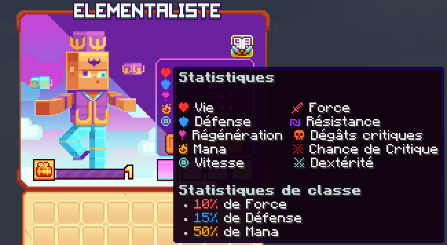

# 🌬️ Élémentaliste

Maîtrisez les éléments pour manipuler le terrain et infliger des dégâts dévastateurs. Contrôlez le pouvoir des éléments pour submerger vos ennemis et soutenir vos alliés.

<figure><figcaption>
<strong>Aperçu des stats de la classe Élémentaliste</strong>
</figcaption></figure>

## 💠 <mark style="color:yellow;">Compétences</mark>&#x20;


Les dégâts des compétences sont en cours de modification, ne les prennez pas pour argent comptant !
-L'équipe du wiki


### 🔸 <mark style="color:yellow;">**Niveau 1 : Lancer de Terre**</mark>

Projectile de rocher lancé sur un ennemi, le repoussant légèrement.

* <mark style="color:yellow;">**Temps de recharge**</mark>**:** 0.5s
* <mark style="color:yellow;">**Mana**</mark>**:** 0
* <mark style="color:yellow;">**Dégâts**</mark>**:** 98,9

### 🔸 <mark style="color:yellow;">**Niveau 5 : Explosion d'Air**</mark>

Crée une bulle d'air explosive lorsque vous sprintez, repoussant les ennemis proches après un court délai.

* <mark style="color:yellow;">**Temps de recharge**</mark>**:** 0s (passif avec déclenchement)
* <mark style="color:yellow;">**Mana**</mark>**:** 0
* <mark style="color:yellow;">**Dégâts**</mark>**:** 0

### 🔸 <mark style="color:yellow;">**Niveau 10 : Fouet Aquatique**</mark>

Invoque un tentacule aquatique pour fouetter les ennemis, les repoussant.

* <mark style="color:yellow;">**Temps de recharge**</mark>**:** 10s
* <mark style="color:yellow;">**Mana**</mark>**:** 50
* <mark style="color:yellow;">**Dégâts**</mark>**:** 49,1

### 🔸 <mark style="color:yellow;">**Niveau 15 : Bête Magmatique**</mark>

Invoque une bête magmatique qui émerge du sol, écrasant et brûlant les ennemis dans la zone.

* <mark style="color:yellow;">**Temps de recharge**</mark>**:** 10s
* <mark style="color:yellow;">**Mana**</mark>**:** 100
* <mark style="color:yellow;">**Dégâts**</mark>**:** 17,4

### 🔸 <mark style="color:yellow;">**Niveau 20 : Vent Extrême**</mark>

Appelle un faucon qui crée un tourbillon endommageant et renversant continuellement les ennemis à l'intérieur.

* <mark style="color:yellow;">**Temps de recharge**</mark>**:** 20s
* <mark style="color:yellow;">**Mana**</mark>**:** 150
* <mark style="color:yellow;">**Dégâts**</mark>**:** 28,7

### 🔸 <mark style="color:yellow;">**Niveau 30 : Barricade de Terre**</mark>

Invoque un golem de terre qui émerge du sol pour élever un mur de terre, repoussant tous les ennemis au passage.

* <mark style="color:yellow;">**Temps de recharge**</mark>**:** 10s
* <mark style="color:yellow;">**Mana**</mark>**:** 100
* <mark style="color:yellow;">**Dégâts**</mark>**:** 392,5

### 🔸 <mark style="color:yellow;">**Niveau 40 : Surchauffe**</mark>

Invoque une bête tirant un faisceau infernal continu, infligeant des dégâts et brûlant les ennemis en contact.

* <mark style="color:yellow;">**Temps de recharge**</mark>**:** 30s
* <mark style="color:yellow;">**Mana**</mark>**:** 300
* <mark style="color:yellow;">**Dégâts**</mark>**:** 364,8

## 💠 <mark style="color:yellow;">Armes</mark>

<table>
  <tr>
    <th>Armes</th>
    <th>Rareté</th>
    <th>Stat</th>
    <th>Obtention</th>
  </tr>
  <tr>
    <td><mark style="color:green;">Spectre de Glace</mark></td>
    <td><mark style="color:green;">Commun</mark></td>  
    <td>
     
<mark style="color:red;">🗡 Force +5</mark>

     
<mark style="color:blue;">🛡️ Défense +3</mark>

    </td>   
    <td>Donjon Biome Neige</td>
  </tr>
  <tr>
    <td><mark style="color:yellow;">Spectre de Glace</mark></td>
    <td><mark style="color:yellow;">Rare</mark></td>  
    <td>
     
<mark style="color:red;">🗡 Force +11</mark>

     
<mark style="color:blue;">🛡️ Défense +6</mark>

    </td>   
    <td>Donjon Biome Neige ou Forge</td>
  </tr>
  <tr>
    <td><mark style="color:blue;">Spectre de Glace</mark></td>
    <td><mark style="color:blue;">Épique</mark></td>  
    <td>
     
<mark style="color:red;">🗡 Force +18</mark>

     
<mark style="color:blue;">🛡️ Défense +9</mark>

    </td>   
    <td>Donjon Biome Neige ou Forge</td>
  </tr>
  <tr>
    <td><mark style="color:purple;">Spectre de Glace</mark></td>
    <td><mark style="color:purple;">Légendaire</mark></td>  
    <td>
     
<mark style="color:red;">🗡 Force +35</mark>

     
<mark style="color:blue;">🛡️ Défense +15</mark>

    </td>   
    <td>Forge</td>
  </tr>
  <tr>
    <td><mark style="color:red;">Spectre de Glace</mark></td>
    <td><mark style="color:red;">Mythique</mark></td>  
    <td>
     
<mark style="color:red;">🗡 Force +60</mark>

     
<mark style="color:blue;">🛡️ Défense +26</mark>

    </td>   
    <td>Forge</td>
  </tr>
  <tr>
    <td><mark style="color:green;">Spectre de Feu</mark></td>
    <td><mark style="color:green;">Commun</mark></td>  
    <td>
     
<mark style="color:red;">🗡 Force +5</mark>

     
<mark style="color:yellow;">🧪 Mana +25</mark>

    </td>   
    <td>Donjon Biome Désert</td>
  </tr>
  <tr>
    <td><mark style="color:yellow;">Spectre de Feu</mark></td>
    <td><mark style="color:yellow;">Rare</mark></td>  
    <td>
     
<mark style="color:red;">🗡 Force +11</mark>

     
<mark style="color:yellow;">🧪 Mana +50</mark>

    </td>   
    <td>Donjon Biome Désert ou Forge</td>
  </tr>
  <tr>
    <td><mark style="color:blue;">Spectre de Feu</mark></td>
    <td><mark style="color:blue;">Épique</mark></td>  
    <td>
     
<mark style="color:red;">🗡 Force +18</mark>

     
<mark style="color:yellow;">🧪 Mana +75</mark>

    </td>   
    <td>Donjon Biome Désert ou Forge</td>
  </tr>
  <tr>
    <td><mark style="color:purple;">Spectre de Feu</mark></td>
    <td><mark style="color:purple;">Légendaire</mark></td>  
    <td>
     
<mark style="color:red;">🗡 Force +35</mark>

     
<mark style="color:yellow;">🧪 Mana +125</mark>

    </td>   
    <td>Forge</td>
  </tr>
  <tr>
    <td><mark style="color:red;">Spectre de Feu</mark></td>
    <td><mark style="color:red;">Mythique</mark></td>  
    <td>
     
<mark style="color:red;">🗡 Force +60</mark>

     
<mark style="color:yellow;">🧪 Mana +210</mark>

    </td>   
    <td>Forge</td>
  </tr>
  <tr>
    <td><mark style="color:green;">Spectre de la Nature</mark></td>
    <td><mark style="color:green;">Commun</mark></td>  
    <td>
     
<mark style="color:red;">🗡 Force +5</mark>

     
<mark style="color:blue;">🏃‍♂️ Vitesse +3</mark></td>

    </td>   
    <td>Donjon Biome Jungle</td>
  </tr>
  <tr>
    <td><mark style="color:yellow;">Spectre de la Nature</mark></td>
    <td><mark style="color:yellow;">Rare</mark></td>  
    <td>
     
<mark style="color:red;">🗡 Force +11</mark>

     
<mark style="color:blue;">🏃‍♂️ Vitesse +6</mark></td>

    </td>   
    <td>Donjon Biome Jungle ou Forge</td>
  </tr>
  <tr>
    <td><mark style="color:blue;">Spectre de la Nature</mark></td>
    <td><mark style="color:blue;">Épique</mark></td>  
    <td>
     
<mark style="color:red;">🗡 Force +18</mark>

     
<mark style="color:blue;">🏃‍♂️ Vitesse +9</mark></td>

    </td>   
    <td>Donjon Biome Jungle ou Forge</td>
  </tr>
  <tr>
    <td><mark style="color:purple;">Spectre de la Nature</mark></td>
    <td><mark style="color:purple;">Légendaire</mark></td>  
    <td>
     
<mark style="color:red;">🗡 Force +35</mark>

     
<mark style="color:blue;">🏃‍♂️ Vitesse +15</mark></td>

    </td>   
    <td>Forge</td>
  </tr>
  <tr>
    <td><mark style="color:red;">Spectre de la Nature</mark></td>
    <td><mark style="color:red;">Mythique</mark></td>  
    <td>
     
<mark style="color:red;">🗡 Force +60</mark>

     
<mark style="color:blue;">🏃‍♂️ Vitesse +25</mark></td>

    </td>   
    <td>Forge</td>
  </tr>
  <tr>
    <td><mark style="color:green;">Prisme du Nexus</mark></td>
    <td><mark style="color:green;">Commun</mark></td>  
    <td>
     
<mark style="color:red;">🗡 Force +7</mark>

     
<mark style="color:orange;">💀 Dégât Critique +4</mark>

    </td>   
    <td>Pack d'arme</td>
  </tr>
  <tr>
    <td><mark style="color:yellow;">Prisme du Nexus</mark></td>
    <td><mark style="color:yellow;">Rare</mark></td>  
    <td>
     
<mark style="color:red;">🗡 Force +15</mark>

     
<mark style="color:orange;">💀 Dégât Critique +8</mark>

    </td>   
    <td>Pack d'arme ou Forge</td>
  </tr>
  <tr>
    <td><mark style="color:blue;">Prisme du Nexus</mark></td>
    <td><mark style="color:blue;">Épique</mark></td>  
    <td>
     
<mark style="color:red;">🗡 Force +25</mark>

     
<mark style="color:orange;">💀 Dégât Critique +12</mark>

    </td>   
    <td>Pack d'arme ou Forge</td>
  </tr>
  <tr>
    <td><mark style="color:purple;">Prisme du Nexus</mark></td>
    <td><mark style="color:purple;">Légendaire</mark></td>  
    <td>
     
<mark style="color:red;">🗡 Force +45</mark>

     
<mark style="color:orange;">💀 Dégât Critique +22</mark>

    </td>   
    <td>Forge</td>
  </tr>
  <tr>
    <td><mark style="color:red;">Prisme du Nexus</mark></td>
    <td><mark style="color:red;">Mythique</mark></td>  
    <td>
     
<mark style="color:red;">🗡 Force +80</mark>

     
<mark style="color:orange;">💀 Dégât Critique +39</mark>

    </td>   
    <td>Forge</td>
  </tr>
  <tr>
    <td><mark style="color:yellow;">Orbe légendaire</mark></td>
    <td><mark style="color:yellow;">Légendaire</mark></td>  
    <td>
     
<mark style="color:red;">🗡 Force +60</mark>

     
<mark style="color:orange;">💀 Dégât Critique +26</mark>

    </td>
    <td>Box Jackpot</td>
  </tr>
  <tr>
    <td><mark style="color:orange;">Orbe Draconique</mark></td>
    <td><mark style="color:orange;">Draconique</mark></td>  
    <td>
     
<mark style="color:red;">🗡 Force +20</mark>

     
<mark style="color:orange;">💀 Dégât Critique +10</mark>

    </td>   
    <td>Marché Noir</td>
  </tr>
  <tr>
    <td><mark style="color:blue;">Orbe Abyssal</mark></td>
    <td><mark style="color:blue;">Abyssal</mark></td>  
    <td>
     
<mark style="color:red;">🗡 Force +20</mark>

     
<mark style="color:orange;">💀 Dégât Critique +5</mark>

    </td>   
    <td>Marché Noir</td>
  </tr>
  <tr>
    <td><mark style="color:orange;">Orbe de Minuit</mark></td>
    <td><mark style="color:orange;">Halloween</mark></td>  
    <td>
     
<mark style="color:red;">🗡 Force +31</mark>

     
<mark style="color:orange;">💀 Dégât Critique +14</mark>

    </td>   
    <td>Marché Noir</td>
  </tr>
  <tr>
    <td><mark style="color:red;">Orbe des Glaces</mark></td>
    <td><mark style="color:red;">Givrée</mark></td>  
    <td>
     
<mark style="color:red;">🗡 Force +31</mark>

     
<mark style="color:orange;">💀 Dégât Critique +14</mark>

    </td>   
    <td>Marché Noir</td>
  </tr>
  <tr>
    <td><mark style="color:red;">Orbe de l'Amour</mark></td>
    <td><mark style="color:red;">ST-Valentin</mark></td>  
    <td>
     
<mark style="color:red;">🗡 Force +36</mark>

     
<mark style="color:orange;">💀 Dégât Critique +16</mark>

    </td>   
    <td>Marché Noir</td>
  </tr>
  <tr>
    <td><mark style="color:yellow;">Orbe en Chocolat</mark></td>
    <td><mark style="color:yellow;">Pâques</mark></td>  
    <td>
     
<mark style="color:red;">🗡 Force +43</mark>

     
<mark style="color:orange;">💀 Dégât Critique +19</mark>

    </td>   
    <td>Marché Noir</td>
  </tr>
  <tr>
    <td><mark style="color:blue;">Orbe Summer</mark></td>
    <td><mark style="color:blue;">Summer</mark></td>  
    <td>
     
<mark style="color:red;">🗡 Force +43</mark>

     
<mark style="color:orange;">💀 Dégât Critique +19</mark>

     
<mark style="color:blue;">🏃‍♂️ Vitesse +2</mark></td>

    </td>   
    <td>Marché Noir</td>
  </tr>
</table>
