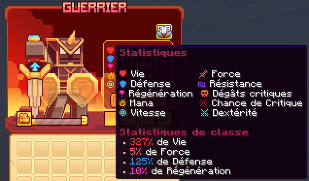

# ⚔️ Guerrier

Le Guerrier est une classe robuste, qui excelle dans le combat rapproché et dispose d'une défense élevée. Avec une variété de compétences, le Guerrier peut infliger de lourds dégâts tout en résistant aux attaques ennemies.

<figure><figcaption>
<strong>Aperçu des stats de la classe Guerrier</strong>
</figcaption></figure>

## 💠 <mark style="color:green;">Compétences</mark>


Les dégâts des compétences sont en cours de modification, ne les prenez pas pour argent comptant !
-L'équipe du wiki


### 🔸 <mark style="color:green;">**Niveau 1 : Frappe Brutale**</mark>

Effectuez une large gamme d'attaques tranchantes et perçantes.

* <mark style="color:green;">**Temps de recharge**</mark>**:** 0.5s
* <mark style="color:green;">**Mana**</mark>**:** 0
* <mark style="color:green;">**Dégâts**</mark>**:** 6.6

### 🔸 <mark style="color:green;">**Niveau 5 : Carnage**</mark>

Votre vitesse et votre défense augmentent en cas de dégâts lorsque votre santé est inférieure à 30% de vos PV max.

* <mark style="color:green;">**Temps de recharge**</mark>**:** 0s
* <mark style="color:green;">**Mana**</mark>**:** 0
* <mark style="color:green;">**Dégâts**</mark>**:** 0

### 🔸 <mark style="color:green;">**Niveau 10 : Charge**</mark>

Bondissez en avant pour vous rapprocher de votre cible.

* <mark style="color:green;">**Temps de recharge**</mark>**:** 5s
* <mark style="color:green;">**Mana**</mark>**:** 50
* <mark style="color:green;">**Dégâts**</mark>**:** 29

### 🔸 <mark style="color:green;">**Niveau 15 : Bouclier**</mark>

Invoquez 4 boucliers qui vous protègent et repoussent les cibles proches. Un bouclier se brisera si vous êtes attaqué, mais vous ne subirez aucun dégât.

* <mark style="color:green;">**Temps de recharge**</mark>**:** 15s
* <mark style="color:green;">**Mana**</mark>**:** 100
* <mark style="color:green;">**Dégâts**</mark>**:** 0

### 🔸 <mark style="color:green;">**Niveau 20 : Chaîne**</mark>

Lancez une chaîne qui tire la cible vers vous.

* <mark style="color:green;">**Temps de recharge**</mark>**:** 5s
* <mark style="color:green;">**Mana**</mark>**:** 100
* <mark style="color:green;">**Dégâts**</mark>**:** 48

### 🔸 <mark style="color:green;">**Niveau 30 : Tourbillon**</mark>

Faites tourner votre épée, endommageant les cibles proches.

* <mark style="color:green;">**Temps de recharge**</mark>**:** 10s
* <mark style="color:green;">**Mana**</mark>**:** 150
* <mark style="color:green;">**Dégâts**</mark>**:** 173.4

### 🔸 <mark style="color:green;">**Niveau 40 : Jugement**</mark>

Chargez vers l'avant avec un énorme bouclier qui endommage et étourdit les cibles. Vous bondissez et invoquez l'épée du jugement, brisant la surface, endommageant et étourdissant les cibles proches.

* <mark style="color:green;">**Temps de recharge**</mark>**:** 30s
* <mark style="color:green;">**Mana**</mark>**:** 300
* <mark style="color:green;">**Dégâts**</mark>**:** 2359

## 💠 <mark style="color:green;">Armes</mark>

<table>
    <tr>
    <th>Armes</th>
    <th>Rareté</th>
    <th>Stat</th>
    <th>Effet</th>
    <th>Obtention</th>
    </tr>
    <tr>
        <td><mark style="color:green;">Tranche Givre</mark></td>
        <td><mark style="color:green;">Commun</mark></td>
    <td>
     
<mark style="color:red;">🗡️ Force +5</mark>

    </td>
        <td>"+1% de chance de doubler les dégât"</td>
        <td>Donjon Biome Neige</td>
    </tr>
    <tr>
        <td><mark style="color:yellow;">Tranche Givre</mark></td>
        <td><mark style="color:yellow;">Rare</mark></td>
    <td>
     
<mark style="color:red;">🗡️ Force +11</mark>

    </td>
        <td>"+2% de chance de doubler les dégât"</td>
        <td>Donjon Biome Neige ou Forge</td>
    </tr>
    <tr>
        <td><mark style="color:blue;">Tranche Givre</mark></td>
        <td><mark style="color:blue;">Épique</mark></td>
    <td>
     
<mark style="color:red;">🗡️ Force +18</mark>

    </td>
        <td>"+2% de chance de doubler les dégât"</td>
        <td>Donjon Biome Neige ou Forge</td>
    </tr>
    <tr>
        <td><mark style="color:purple;">Tranche Givre</mark></td>
        <td><mark style="color:purple;">Légendaire</mark></td>
    <td>
     
<mark style="color:red;">🗡️ Force +35</mark>

    </td>
        <td>"+4% de chance de doubler les dégât"</td>
        <td>Forge</td>
    </tr>
    <tr>
        <td><mark style="color:red;">Tranche Givre</mark></td>
        <td><mark style="color:red;">Mythique</mark></td>
    <td>
     
<mark style="color:red;">🗡️ Force +60</mark>

    </td>
        <td>"+5% de chance de doubler les dégât"</td>
        <td>Forge</td>
    </tr>
    <tr>
        <td><mark style="color:green;">Lame du Styx</mark></td>
        <td><mark style="color:green;">Commun</mark></td>
    <td>
     
<mark style="color:red;">🗡️ Force +5</mark>

     
<mark style="color:orange;">💀 Dégât Critique +3</mark>

    </td>
        <td>X</td>
        <td>Donjon Biome Nether</td>
    </tr>
    <tr>
        <td><mark style="color:yellow;">Lame du Styx</mark></td>
        <td><mark style="color:yellow;">Rare</mark></td>
    <td>
     
<mark style="color:red;">🗡️ Force +11</mark>

     
<mark style="color:orange;">💀 Dégât Critique +6</mark>

    </td>
        <td>X</td>
        <td>Donjon Biome Nether ou Forge</td>
    </tr>
    <tr>
        <td><mark style="color:blue;">Lame du Styx</mark></td>
        <td><mark style="color:blue;">Épique</mark></td>
    <td>
     
<mark style="color:red;">🗡️ Force +18</mark>

     
<mark style="color:orange;">💀 Dégât Critique +9</mark>

    </td>
        <td>X</td>
        <td>Donjon Biome Nether ou Forge</td>
    </tr>
    <tr>
        <td><mark style="color:purple;">Lame du Styx</mark></td>
        <td><mark style="color:purple;">Légendaire</mark></td>
    <td>
     
<mark style="color:red;">🗡️ Force +35</mark>

     
<mark style="color:orange;">💀 Dégât Critique +15</mark>

    </td>
        <td>X</td>
        <td>Forge</td>
    </tr>
    <tr>
        <td><mark style="color:red;">Lame du Styx</mark></td>
        <td><mark style="color:red;">Mythique</mark></td>
    <td>
     
<mark style="color:red;">🗡️ Force +60</mark>

     
<mark style="color:orange;">💀 Dégât Critique +26</mark>

    </td>
        <td>X</td>
        <td>Forge</td>
    </tr>
    <tr>
        <td><mark style="color:green;">Sabre des Sables</mark></td>
        <td><mark style="color:green;">Commun</mark></td>
    <td>
     
<mark style="color:red;">🗡️ Force +5</mark>

     
<mark style="color:blue;">🏃‍♂️ Vitesse +3</mark></td>

    </td>
        <td>X</td>
        <td>Donjon Biome Désert</td>
    </tr>
    <tr>
        <td><mark style="color:yellow;">Sabre des Sables</mark></td>
        <td><mark style="color:yellow;">Rare</mark></td>
    <td>
     
<mark style="color:red;">🗡️ Force +11</mark>

     
<mark style="color:blue;">🏃‍♂️ Vitesse +6</mark></td>

    </td>
        <td>X</td>
        <td>Donjon Biome Désert ou Forge</td>
    </tr>
    <tr>
        <td><mark style="color:blue;">Sabre des Sables</mark></td>
        <td><mark style="color:blue;">Épique</mark></td>
    <td>
     
<mark style="color:red;">🗡️ Force +18</mark>

     
<mark style="color:blue;">🏃‍♂️ Vitesse +9</mark></td>

    </td>
        <td>X</td>
        <td>Donjon Biome Désert ou Forge</td>
    </tr>
    <tr>
        <td><mark style="color:purple;">Sabre des Sables</mark></td>
        <td><mark style="color:purple;">Légendaire</mark></td>
    <td>
     
<mark style="color:red;">🗡️ Force +35</mark>

     
<mark style="color:blue;">🏃‍♂️ Vitesse +15</mark></td>

    </td>
        <td>X</td>
        <td>Forge</td>
    </tr>
    <tr>
        <td><mark style="color:red;">Sabre des Sables</mark></td>
        <td><mark style="color:red;">Mythique</mark></td>
    <td>
     
<mark style="color:red;">🗡️ Force +60</mark>

     
<mark style="color:blue;">🏃‍♂️ Vitesse +25</mark></td>

    </td>
        <td>X</td>
        <td>Forge</td>
    </tr>
    <tr>
        <td><mark style="color:green;">Fendoir Orc</mark></td>
        <td><mark style="color:green;">Commun</mark></td>
    <td>
     
<mark style="color:red;">🗡️ Force +5</mark>

     
<mark style="color:red;">🥊 Chance de Critique +1</mark>

    </td>
        <td>X</td>
        <td>Donjon Biome Messa</td>
    </tr>
    <tr>
        <td><mark style="color:yellow;">Fendoir Orc</mark></td>
        <td><mark style="color:yellow;">Rare</mark></td>
    <td>
     
<mark style="color:red;">🗡️ Force +11</mark>

     
<mark style="color:red;">🥊 Chance de Critique +1</mark>

    </td>
        <td>X</td>
        <td>Donjon Biome Messa ou Forge</td>
    </tr>
    <tr>
        <td><mark style="color:blue;">Fendoir Orc</mark></td>
        <td><mark style="color:blue;">Épique</mark></td>
    <td>
     
<mark style="color:red;">🗡️ Force +18</mark>

     
<mark style="color:red;">🥊 Chance de Critique +2</mark>

    </td>
        <td>X</td>
        <td>Donjon Biome Messa ou Forge</td>
    </tr>
    <tr>
        <td><mark style="color:purple;">Fendoir Orc</mark></td>
        <td><mark style="color:purple;">Légendaire</mark></td>
    <td>
     
<mark style="color:red;">🗡️ Force +35</mark>

     
<mark style="color:red;">🥊 Chance de Critique +3</mark>

    </td>
        <td>X</td>
        <td>Forge</td>
    </tr>
    <tr>
        <td><mark style="color:red;">Fendoir Orc</mark></td>
        <td><mark style="color:red;">Mythique</mark></td>
    <td>
     
<mark style="color:red;">🗡️ Force +60</mark>

     
<mark style="color:red;">🥊 Chance de Critique +6</mark>

    </td>
        <td>X</td>
        <td>Forge</td>
    </tr>
    <tr>
        <td><mark style="color:green;">Épée du Colosse</mark></td>
        <td><mark style="color:green;">Commun</mark></td>
    <td>
     
<mark style="color:red;">🗡️ Force +7</mark>

     
<mark style="color:red;">❤️ Vie +14</mark>

    </td>
        <td>X</td>
        <td>Pack d'arme</td>
    </tr>
    <tr>
        <td><mark style="color:yellow;">Épée du Colosse</mark></td>
        <td><mark style="color:yellow;">Rare</mark></td>
    <td>
     
<mark style="color:red;">🗡️ Force +15</mark>

     
<mark style="color:red;">❤️ Vie +35</mark>

    </td>
        <td>X</td>
        <td>Pack d'arme ou Forge</td>
    </tr>
    <tr>
        <td><mark style="color:blue;">Épée du Colosse</mark></td>
        <td><mark style="color:blue;">Épique</mark></td>
    <td>
     
<mark style="color:red;">🗡️ Force +25</mark>

     
<mark style="color:red;">❤️ Vie +56</mark>

    </td>
        <td>X</td>
        <td>Pack d'arme ou Forge</td>
    </tr>
    <tr>
        <td><mark style="color:purple;">Épée du Colosse</mark></td>
        <td><mark style="color:purple;">Légendaire</mark></td>
    <td>
     
<mark style="color:red;">🗡️ Force +45</mark>

     
<mark style="color:red;">❤️ Vie +100</mark>

    </td>
        <td>X</td>
        <td>Forge</td>
    </tr>
    <tr>
        <td><mark style="color:red;">Épée du Colosse</mark></td>
        <td><mark style="color:red;">Mythique</mark></td>
    <td>
     
<mark style="color:red;">🗡️ Force +80</mark>

     
<mark style="color:red;">❤️ Vie +180</mark>

    </td>
        <td>X</td>
        <td>Forge</td>
    </tr>
<tr>
    <td><mark style="color:yellow;">Épée légendaire</mark></td>
    <td><mark style="color:yellow;">Jackpot</mark></td>
    <td>
     
<mark style="color:red;">🗡️ Force +60</mark>

     
<mark style="color:orange;">💀 Dégât Critique +26</mark>

    </td>
    <td>X</td>
    <td>▸ <a href="https://wiki.evolucraft.fr/le-gameplay/les-caisses#caisse-jackpot"><mark style="color:yellow;">Caisse Jackpot 🎰</mark></a></td>
  </tr>
  <tr>
    <td><mark style="color:yellow;">Épée légendaire Shiny</mark></td>
    <td><mark style="color:yellow;">Jackpot</mark></td>
    <td>
     
<mark style="color:red;">🗡️ Force +60</mark>

     
<mark style="color:orange;">💀 Dégât Critique +26</mark>

    </td>
    <td>X</td>
    <td>▸ <a href="https://wiki.evolucraft.fr/le-gameplay/les-caisses#caisse-jackpot"><mark style="color:yellow;">Caisse Jackpot 🎰</mark></a></td>
  </tr>
  <tr>
    <td><mark style="color:orange;">Épée Draconique</mark></td>
    <td><mark style="color:orange;">Draconique</mark></td>
    <td>
     
<mark style="color:red;">🗡️ Force +20</mark>

     
<mark style="color:orange;">💀 Dégât Critique +10</mark>

    </td>
    <td>X</td>
    <td>
      
▸ <a href="https://wiki.evolucraft.fr/le-gameplay/marche-noir#draconique"><mark style="color:green;">Marché Noir 🧥</mark></a>

      
▸ <a href="https://wiki.evolucraft.fr/le-gameplay/les-caisses#caisse-draconique"><mark style="color:orange;">Caisse Draconique 🐉</mark></a>

    </td>
  </tr>
  <tr>
    <td><mark style="color:blue;">Épée Abyssale</mark></td>
    <td><mark style="color:blue;">Abyssal</mark></td>
    <td>
     
<mark style="color:red;">🗡️ Force +20</mark>

     
<mark style="color:orange;">💀 Dégât Critique +5</mark>

    </td>
    <td>X</td>
    <td>
      
▸ <a href="https://wiki.evolucraft.fr/le-gameplay/marche-noir#abyssal"><mark style="color:green;">Marché Noir 🧥</mark></a>

      
▸ <a href="https://wiki.evolucraft.fr/le-gameplay/les-caisses#caisse-abyssal"><mark style="color:blue;">Caisse Abyssale 🌊</mark></a>

    </td>
  </tr>
  <tr>
    <td><mark style="color:orange;">Épée de Minuit</mark></td>
    <td><mark style="color:orange;">Halloween</mark></td>
    <td>
     
<mark style="color:red;">🗡️ Force +31</mark>

     
<mark style="color:orange;">💀 Dégât Critique +14</mark>

    </td>
    <td>X</td>
    <td>
      
▸ <a href="https://wiki.evolucraft.fr/le-gameplay/marche-noir#halloween"><mark style="color:green;">Marché Noir 🧥</mark></a>

      
▸ <a href="https://wiki.evolucraft.fr/le-gameplay/les-caisses#caisse-halloween"><mark style="color:orange;">Caisse Halloween 🎃</mark></a>

    </td>
  </tr>
  <tr>
    <td><mark style="color:blue;">Épée des Glaces</mark></td>
    <td><mark style="color:blue;">Givrée</mark></td>
    <td>
     
<mark style="color:red;">🗡️ Force +31</mark>

     
<mark style="color:orange;">💀 Dégât Critique +14</mark>

    </td>
    <td>X</td>
    <td>
      
▸ <a href="https://wiki.evolucraft.fr/le-gameplay/marche-noir#givree"><mark style="color:green;">Marché Noir 🧥</mark></a>

      
▸ <a href="https://wiki.evolucraft.fr/le-gameplay/les-caisses#caisse-givree"><mark style="color:blue;">Caisse Givrée ❄️</mark></a>

    </td>
  </tr>
  <tr>
    <td><mark style="color:red;">Épée de l'Amour</mark></td>
    <td><mark style="color:red;">ST-Valentin</mark></td>
    <td>
     
<mark style="color:red;">🗡️ Force +36</mark>

     
<mark style="color:orange;">💀 Dégât Critique +16</mark>

    </td>
    <td>X</td>
    <td>
      
▸ <a href="https://wiki.evolucraft.fr/le-gameplay/marche-noir#st-valentin"><mark style="color:green;">Marché Noir 🧥</mark></a>

      
▸ <a href="https://wiki.evolucraft.fr/le-gameplay/les-caisses#caisse-saint-valentin"><mark style="color:red;">Caisse Saint-Valentin 💕</mark></a>

    </td>
  </tr>
  <tr>
    <td><mark style="color:yellow;">Épée en Chocolat</mark></td>
    <td><mark style="color:yellow;">Pâques</mark></td>
    <td>
     
<mark style="color:red;">🗡️ Force +43</mark>

     
<mark style="color:orange;">💀 Dégât Critique +19</mark>

    </td>
    <td>X</td>
    <td>
      
▸ <a href="https://wiki.evolucraft.fr/le-gameplay/marche-noir#paques"><mark style="color:green;">Marché Noir 🧥</mark></a>

      
▸ <a href="https://wiki.evolucraft.fr/le-gameplay/les-caisses#caisse-paques"><mark style="color:yellow;">Caisse Pâques 🥚</mark></a>

    </td>
  </tr>
  <tr>
    <td><mark style="color:blue;">Épée Summer</mark></td>
    <td><mark style="color:blue;">Summer</mark></td>
    <td>
     
<mark style="color:red;">🗡️ Force +49</mark>

     
<mark style="color:orange;">💀 Dégât Critique +19</mark>

     
<mark style="color:blue;">🏃‍♂️ Vitesse +2</mark></td>

    </td>
    <td>X</td>
    <td>
      
▸ <a href="https://wiki.evolucraft.fr/le-gameplay/marche-noir#summer-2025"><mark style="color:green;">Marché Noir 🧥</mark></a>

      
▸ <a href="https://wiki.evolucraft.fr/le-gameplay/les-caisses#caisse-summer"><mark style="color:blue;">Caisse Summer 🏖️</mark></a>

    </td>
  </tr>
  <tr>
    <td><mark style="color:red;">Épée de la Lune de Sang</mark></td>
    <td><mark style="color:red;">Lune de Sang</mark></td>
    <td>
     
<mark style="color:red;">🗡️ Force +45</mark>

     
<mark style="color:orange;">💀 Dégât Critique +21</mark>

    </td>
    <td>X</td>
    <td>
      
▸ <a href="https://wiki.evolucraft.fr/le-gameplay/marche-noir#halloween-2025"><mark style="color:green;">Marché Noir 🧥</mark></a>

      
▸ <a href="https://wiki.evolucraft.fr/le-gameplay/les-caisses#caisse-lune-de-sang"><mark style="color:red;">Caisse Lune de Sang 🩸</mark></a>

    </td>
  </tr> 
  <tr>
    <td><mark style="color:red;">Épée Pain d'épice</mark></td>
    <td><mark style="color:red;">Pain d'épice</mark></td>
    <td>
     
<mark style="color:red;">🗡️ Force +47</mark>

     
<mark style="color:orange;">💀 Dégât Critique +21</mark>

    </td>
    <td>X</td>
    <td>
      
▸ <a href="https://wiki.evolucraft.fr/le-gameplay/marche-noir#Noel-2025"><mark style="color:green;">Marché Noir 🧥</mark></a>

      
▸ <a href="https://wiki.evolucraft.fr/le-gameplay/les-caisses#caisse-pain-depice"><mark style="color:red;">Caisse Pain d'épice 🍪</mark></a>

    </td>
  </tr>  
</table>
