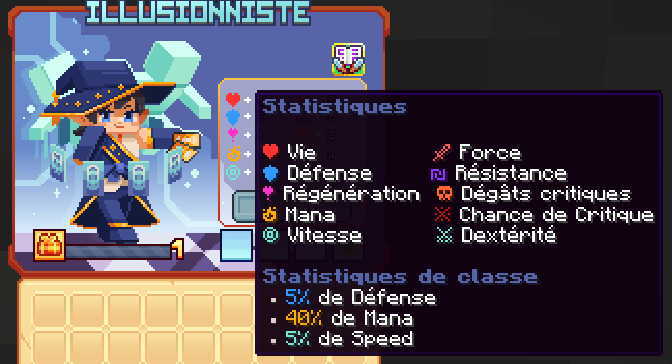

# 🎭 Illusionniste
Maître des illusions et de la ruse, trouble les sens et trompe l'ennemi, il frappe où nul ne s'y attend.

<figure><figcaption>
<strong>Aperçu des stats de la classe Illusionniste</strong>
</figcaption></figure>

## 💠 <mark style="color:green;">Compétences</mark>


Les dégâts des compétences sont en cours de modification, ne les prenez pas pour argent comptant !
-L'équipe du wiki


### 🔸 <mark style="color:green;">**Niveau 1 : Tir de cartes**</mark>

Lancez 1 à 3 cartes sur vos ennemis

* <mark style="color:green;">**Temps de recharge**</mark>**:** 0.5s
* <mark style="color:green;">**Mana**</mark>**:** 0
* <mark style="color:green;">**Dégâts**</mark>**:** 12,5

### 🔸 <mark style="color:green;">**Niveau 5 : Reine**</mark>

Les cartes tournent autour de vous, étourdissant les ennemis autour.

* <mark style="color:green;">**Temps de recharge**</mark>**:** 0s
* <mark style="color:green;">**Mana**</mark>**:** 0
* <mark style="color:green;">**Dégâts**</mark>**:** 32,3

### 🔸 <mark style="color:green;">**Niveau 10 : Flash fantôme**</mark>

Vous vous téléportez en diagonale vers l'arrière tout en lançant 3 cartes. 

Votre clone miroir fonce alors sur la trajectoire que vous venez de quitter infligeant des dégâts sur le chemin.

* <mark style="color:green;">**Temps de recharge**</mark>**:** 8s
* <mark style="color:green;">**Mana**</mark>**:** 025
* <mark style="color:green;">**Dégâts**</mark>**:** 55,7

### 🔸 <mark style="color:green;">**Niveau 15 : Shuriken**</mark>

Lancez un shuriken miroir qui repousse les ennemis. 

Votre shuriken revient vers vous, repoussant les ennemis dans la direction opposée.

Les ennemis touchés subissent un saignement.

* <mark style="color:green;">**Temps de recharge**</mark>**:** 10s
* <mark style="color:green;">**Mana**</mark>**:** 125
* <mark style="color:green;">**Dégâts**</mark>**:** 80,7

### 🔸 <mark style="color:green;">**Niveau 20 : Mirage**</mark>

Vous vous téléportez vers l'avant. Votre clone miroir se précipite à nouveau sur votre chemin, endommageant les ennemis en contact avec votre clone.

* <mark style="color:green;">**Temps de recharge**</mark>**:** 8s
* <mark style="color:green;">**Mana**</mark>**:** 100
* <mark style="color:green;">**Dégâts**</mark>**:**  297,8

### 🔸 <mark style="color:green;">**Niveau 30 : Pique miroir**</mark>

Invoquez 2 miroirs sur vos côtés. Chaque miroir déclenche 3 aiguilles miroir.

* <mark style="color:green;">**Temps de recharge**</mark>**:** 15s
* <mark style="color:green;">**Mana**</mark>**:** 150
* <mark style="color:green;">**Dégâts**</mark>**:** 362,2

### 🔸 <mark style="color:green;">**Niveau 40 : Zone miroir**</mark>

Vous invoquez un portail miroir sous vos pieds, ce qui étourdit les ennemis proches. 

Après un court délai, le portail se téléporte dans la direction où vous regardez emmenant avec lui tous les ennemis étourdis qui se trouvent à l'intérieur.

* <mark style="color:green;">**Temps de recharge**</mark>**:** 20s
* <mark style="color:green;">**Mana**</mark>**:** 300
* <mark style="color:green;">**Dégâts**</mark>**:** 2360,6

## 💠 <mark style="color:green;">Armes</mark>

### 🔸 <mark style="color:green;">**Packs d'Armes**</mark>

<table>
<tr>
    <th><strong>Nom de l'Armes 🏷️</strong></th>
    <th><strong>Rareté ou Collection 🌟</strong></th>
    <th><strong>Statistiques 📊</strong></th>
    <th><strong>Effets ✨</strong></th>
    <th><strong>Obtentions 📌</strong></th>
  </tr>
  <tr>
    <td><mark style="color:green;">Carte divinatoire</mark></td>
    <td><mark style="color:green;">Commun</mark></td>
    <td>
     
<mark style="color:red;">🗡️️ Force +7</mark>

     
<mark style="color:orange;">💀 Dégât Critique +4</mark>

    </td>
    <td><mark style="color:green;">Aucun Effet</mark> Supplémentaire ❌</td>
    <td>
     
▸ <mark style="color:green;">Packs d'Armes (Mini-Boss & Boss des Donjons Communs)</mark>

    </td>
  </tr>
  <tr>
    <td><mark style="color:yellow;">Carte divinatoire</mark></td>
    <td><mark style="color:yellow;">Rare</mark></td>
    <td>
     
<mark style="color:red;">🗡️️ Force +15</mark>

     
<mark style="color:orange;">💀 Dégât Critique +8</mark>

    </td>
    <td><mark style="color:green;">Aucun Effet</mark> Supplémentaire ❌</td>
    <td>
     
▸ <mark style="color:yellow;">Packs d'Armes (Mini-Boss & Boss des Donjons Rares)</mark>

     
▸ <a href="https://wiki.evolucraft.fr/le-gameplay/les-machines/forge#armes-rares"><mark style="color:green;">Forge 🔨</mark></a>

    </td>
  </tr>
  <tr>
    <td><mark style="color:blue;">Carte divinatoire</mark></td>
    <td><mark style="color:blue;">Épique</mark></td>
    <td>
     
<mark style="color:red;">🗡️️️ Force +25</mark>

     
<mark style="color:orange;">💀 Dégât Critique +12</mark>

    </td>
    <td><mark style="color:green;">Aucun Effet</mark> Supplémentaire ❌</td>
    <td>
     
▸ <mark style="color:blue;">Packs d'Armes (Mini-Boss & Boss des Donjons Épiques, Légendaires et Mythique)</mark>

     
▸ <a href="https://wiki.evolucraft.fr/le-gameplay/les-machines/forge#armes-epiques"><mark style="color:green;">Forge 🔨</mark></a>

    </td>
  </tr>
  <tr>
    <td><mark style="color:purple;">Carte divinatoire</mark></td>
    <td><mark style="color:purple;">Légendaire</mark></td>
    <td>
     
<mark style="color:red;">🗡️ Force +45</mark>

     
<mark style="color:orange;">💀 Dégât Critique +22</mark>

    </td>
    <td><mark style="color:green;">Aucun Effet</mark> Supplémentaire ❌</td>
    <td>
     
▸ <a href="https://wiki.evolucraft.fr/le-gameplay/les-machines/forge#armes-legendaires"><mark style="color:green;">Forge 🔨</mark></a>

    </td>
  </tr>
  <tr>
    <td><mark style="color:red;">Carte divinatoire</mark></td>
    <td><mark style="color:red;">Mythique</mark></td>
    <td>
     
<mark style="color:red;">🗡️ Force +80</mark>

     
<mark style="color:orange;">💀 Dégât Critique +39</mark>

    </td>
    <td><mark style="color:green;">Aucun Effet</mark> Supplémentaire ❌</td>
    <td>
     
▸ <a href="https://wiki.evolucraft.fr/le-gameplay/les-machines/forge#armes-mythiques"><mark style="color:green;">Forge 🔨</mark></a>

    </td>
  </tr>
  <tr>
    <td><mark style="color:green;">Carte divinatoire Shiny</mark></td>
    <td><mark style="color:green;">Commun ✨</mark></td>
    <td>
     
<mark style="color:red;">🗡️️ Force +7</mark>

     
<mark style="color:orange;">💀 Dégât Critique +4</mark>

    </td>
    <td><mark style="color:green;">Aucun Effet</mark> Supplémentaire ❌</td>
    <td>
     
▸ <mark style="color:green;">Packs d'Armes (Mini-Boss & Boss des Donjons Communs)</mark>

    </td>
  </tr>
  <tr>
    <td><mark style="color:yellow;">Carte divinatoire Shiny</mark></td>
    <td><mark style="color:yellow;">Rare ✨</mark></td>
    <td>
     
<mark style="color:red;">🗡️️ Force +15</mark>

     
<mark style="color:orange;">💀 Dégât Critique +8</mark>

    </td>
    <td><mark style="color:green;">Aucun Effet</mark> Supplémentaire ❌</td>
    <td>
     
▸ <mark style="color:yellow;">Packs d'Armes (Mini-Boss & Boss des Donjons Rares)</mark>

     
▸ <a href="https://wiki.evolucraft.fr/le-gameplay/les-machines/forge#armes-rares"><mark style="color:green;">Forge 🔨</mark></a>

    </td>
  </tr>
  <tr>
    <td><mark style="color:blue;">Carte divinatoire Shiny</mark></td>
    <td><mark style="color:blue;">Épique ✨</mark></td>
    <td>
     
<mark style="color:red;">🗡️️️ Force +25</mark>

     
<mark style="color:orange;">💀 Dégât Critique +12</mark>

    </td>
    <td><mark style="color:green;">Aucun Effet</mark> Supplémentaire ❌</td>
    <td>
     
▸ <mark style="color:blue;">Packs d'Armes (Mini-Boss & Boss des Donjons Épiques, Légendaires et Mythique)</mark>

     
▸ <a href="https://wiki.evolucraft.fr/le-gameplay/les-machines/forge#armes-epiques"><mark style="color:green;">Forge 🔨</mark></a>

    </td>
  </tr>
  <tr>
    <td><mark style="color:purple;">Carte divinatoire Shiny</mark></td>
    <td><mark style="color:purple;">Légendaire ✨</mark></td>
    <td>
     
<mark style="color:red;">🗡️ Force +45</mark>

     
<mark style="color:orange;">💀 Dégât Critique +22</mark>

    </td>
    <td><mark style="color:green;">Aucun Effet</mark> Supplémentaire ❌</td>
    <td>
     
▸ <a href="https://wiki.evolucraft.fr/le-gameplay/les-machines/forge#armes-legendaires"><mark style="color:green;">Forge 🔨</mark></a>

    </td>
  </tr>
  <tr>
    <td><mark style="color:red;">Carte divinatoire Shiny</mark></td>
    <td><mark style="color:red;">Mythique ✨</mark></td>
    <td>
     
<mark style="color:red;">🗡️ Force +80</mark>

     
<mark style="color:orange;">💀 Dégât Critique +39</mark>

    </td>
    <td><mark style="color:green;">Aucun Effet</mark> Supplémentaire ❌</td>
    <td>
     
▸ <a href="https://wiki.evolucraft.fr/le-gameplay/les-machines/forge#armes-mythiques"><mark style="color:green;">Forge 🔨</mark></a>

    </td>
  </tr>
</table>

### 🔸 <mark style="color:green;">**Armes des Évènements**</mark>

<table>
<tr>
    <th><strong>Nom de l'Armes 🏷️</strong></th>
    <th><strong>Rareté ou Collection 🌟</strong></th>
    <th><strong>Statistiques 📊</strong></th>
    <th><strong>Effets ✨</strong></th>
    <th><strong>Obtentions 📌</strong></th>
  </tr>
  <tr>
    <td><mark style="color:yellow;">Carte Mystique légendaire</mark></td>
    <td><mark style="color:yellow;">Jackpot</mark></td>
    <td>
     
<mark style="color:red;">🗡️ Force +60</mark>

     
<mark style="color:orange;">💀 Dégât Critique +26</mark>

    </td>
    <td><mark style="color:green;">Aucun Effet</mark> Supplémentaire ❌</td>
    <td>▸ <a href="https://wiki.evolucraft.fr/le-gameplay/les-caisses#caisse-jackpot"><mark style="color:yellow;">Caisse Jackpot 🎰</mark></a></td>
  </tr>
  <tr>
    <td><mark style="color:yellow;">Carte Mystique légendaire Shiny</mark></td>
    <td><mark style="color:yellow;">Jackpot ✨</mark></td>
    <td>
     
<mark style="color:red;">🗡️ Force +60</mark>

     
<mark style="color:orange;">💀 Dégât Critique +26</mark>

    </td>
    <td><mark style="color:green;">Aucun Effet</mark> Supplémentaire ❌</td>
    <td>▸ <a href="https://wiki.evolucraft.fr/le-gameplay/les-caisses#caisse-jackpot"><mark style="color:yellow;">Caisse Jackpot 🎰</mark></a></td>
  </tr>
  <tr>
    <td><mark style="color:blue;">Carte Mystique Summer</mark></td>
    <td><mark style="color:blue;">Summer</mark></td>
    <td>
     
<mark style="color:red;">🗡️ Force +49</mark>

     
<mark style="color:orange;">💀 Dégât Critique +19</mark>

     
<mark style="color:blue;">🏃‍♂️ Vitesse +2</mark></td>

    </td>
    <td><mark style="color:green;">Aucun Effet</mark> Supplémentaire ❌</td>
    <td>
      
▸ <a href="https://wiki.evolucraft.fr/le-gameplay/marche-noir#summer-2025"><mark style="color:green;">Marché Noir 🧥</mark></a>

      
▸ <a href="https://wiki.evolucraft.fr/le-gameplay/les-caisses#caisse-summer"><mark style="color:blue;">Caisse Summer 🏖️</mark></a>

      
▸ <a href="https://wiki.evolucraft.fr/le-gameplay/lucky-block"><mark style="color:gold;">Armes Aléatoire via les Lucky Blocks Gold🎲</mark></a>

    </td>
  </tr>
  <tr>
    <td><mark style="color:red;">Carte Mystique de la Lune de Sang</mark></td>
    <td><mark style="color:red;">Lune de Sang</mark></td>
    <td>
     
<mark style="color:red;">🗡️ Force +45</mark>

     
<mark style="color:orange;">💀 Dégât Critique +21</mark>

    </td>
    <td><mark style="color:green;">Aucun Effet</mark> Supplémentaire ❌</td>
    <td>
      
▸ <a href="https://wiki.evolucraft.fr/le-gameplay/marche-noir#halloween-2025"><mark style="color:green;">Marché Noir 🧥</mark></a>

      
▸ <a href="https://wiki.evolucraft.fr/le-gameplay/les-caisses#caisse-lune-de-sang"><mark style="color:red;">Caisse Lune de Sang 🩸</mark></a>

      
▸ <a href="https://wiki.evolucraft.fr/le-gameplay/lucky-block"><mark style="color:gold;">Armes Aléatoire via les Lucky Blocks Gold🎲</mark></a>

    </td>
  </tr> 
  <tr>
    <td><mark style="color:red;">Carte Mystique Pain d'épice</mark></td>
    <td><mark style="color:red;">Pain d'épice</mark></td>
    <td>
     
<mark style="color:red;">🗡️ Force +47</mark>

     
<mark style="color:orange;">💀 Dégât Critique +21</mark>

    </td>
    <td><mark style="color:red;"><strong>Bonus Dégâts 💢</strong></mark> ▸ <mark style="color:red;">+5% de dégâts</mark> dans les donjons <mark style="color:red;">caverne glaciale</mark> et <mark style="color:red;">laboratoire glaciale</mark></td>
    <td>
      
▸ <a href="https://wiki.evolucraft.fr/le-gameplay/marche-noir#Noel-2025"><mark style="color:green;">Marché Noir 🧥</mark></a>

      
▸ <a href="https://wiki.evolucraft.fr/le-gameplay/les-caisses#caisse-pain-depice"><mark style="color:red;">Caisse Pain d'épice 🍪</mark></a>

      
▸ <a href="https://wiki.evolucraft.fr/le-gameplay/lucky-block"><mark style="color:gold;">Armes Aléatoire via les Lucky Blocks Gold🎲</mark></a>

    </td>
  </tr>
  <tr>
    <td><mark style="color:green;">Carte Mystique de Jade</mark></td>
    <td><mark style="color:green;">Nouvel An Lunaire</mark></td>
    <td>
     
<mark style="color:red;">🗡️ Force +51</mark>

     
<mark style="color:orange;">💀 Dégât Critique +13</mark>

     
<mark style="color:yellow;">🧪 Mana +50</mark>

    </td>
    <td><mark style="color:green;">Aura de Feu 🔥</mark> ▸ Enflamme la cible pendant 4 secondes</td>
    <td>
      
▸ <a href="https://wiki.evolucraft.fr/le-gameplay/marche-noir#nouvel-an-lunaire"><mark style="color:green;">Marché Noir 🧥</mark></a>

      
▸ <a href="https://wiki.evolucraft.fr/le-gameplay/les-caisses#caisse-lunaire"><mark style="color:green;">Caisse Lunaire 🎑</mark></a>

    </td>
    <tr>
  <td><mark style="color:green;">Carte Mystique en Chocolat</mark></td>
  <td><mark style="color:green;">Pâques</mark></td>
  <td>
    
<mark style="color:red;">🗡️ Force +53</mark>

    
<mark style="color:orange;">💀 Dégâts Critiques +15</mark>

    
<mark style="color:yellow;">🧪 Mana +60</mark>

  </td>
  <td><mark style="color:green;">Onde de Choc 💥</mark> ► Inflige 10% des dégâts aux ennemis dans un rayon de 4 blocs</td>
  <td>
    
► <a href="#"><mark style="color:green;">Caisse Pâques 2026 🥚</mark></a>

    
► <a href="#"><mark style="color:green;">Arme Aléatoire Pâques 2026</mark></a>

  </td>
</tr>
</tr>
  </tr>    
</table>
