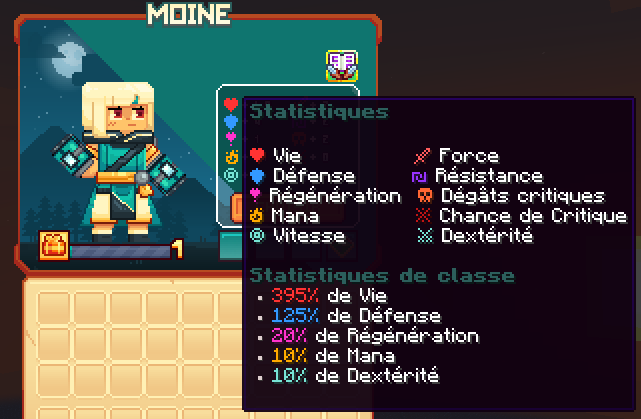

# 🙇 Moine

Maîtrisez les arts martiaux spirituels pour infliger des dégâts rapides et soigner vos alliés, tout en manipulant l'énergie du chi pour des attaques dévastatrices et des protections renforcées.

<figure><figcaption>
<strong>Aperçu des stats de la classe Moine</strong>
</figcaption></figure>

## 💠 <mark style="color:blue;">Compétences</mark>


Les dégâts des compétences sont en cours de modification, ne les prennez pas pour argent comptant !
-L'équipe du wiki


### 🔸 <mark style="color:blue;">**Niveau 1 : Frappes rapides**</mark>

Frappez trois fois rapidement avec vos poings, touchant tous les ennemis devant vous.

* <mark style="color:blue;">**Temps de recharge**</mark>**:** 0.5s
* <mark style="color:blue;">**Mana**</mark>**:** 0
* <mark style="color:blue;">**Dégâts**</mark>**:** 7,9

### 🔸 <mark style="color:blue;">**Niveau 5 : Chi**</mark>

Soignez les alliés proches à chaque fois que vous subissez des dégâts.

* <mark style="color:blue;">**Temps de recharge**</mark>**:** Passif (se déclenche automatiquement)
* <mark style="color:blue;">**Mana**</mark>**:** 0
* <mark style="color:blue;">**Dégâts**</mark>**:** 0

### 🔸 <mark style="color:blue;">**Niveau 10 : Éclat de Chi**</mark>

Tirez une explosion de chi qui laisse une marque sur votre ennemi. Volez instantanément vers l'ennemi marqué et attaquez-le.

* <mark style="color:blue;">**Temps de recharge**</mark>**:** 5s
* <mark style="color:blue;">**Mana**</mark>**:** 30
* <mark style="color:blue;">**Dégâts**</mark>**:** 109,4

### 🔸 <mark style="color:blue;">**Niveau 15 : Projection**</mark>

Projetez votre ennemi en arrière, le faisant passer au-dessus de vous et l'étourdissant. Les ennemis affectés sont également assommés.

* <mark style="color:blue;">**Temps de recharge**</mark>**:** 7s
* <mark style="color:blue;">**Mana**</mark>**:** 75
* <mark style="color:blue;">**Dégâts**</mark>**:** 13

### 🔸 <mark style="color:blue;">**Niveau 20 : Perles de Karma**</mark>

Invoquez des perles spirituelles pour créer une aura de karma. Repoussez les ennemis, soignez vos alliés et supprimez les débuffs.

* <mark style="color:blue;">**Temps de recharge**</mark>**:** 10s
* <mark style="color:blue;">**Mana**</mark>**:** 125
* <mark style="color:blue;">**Dégâts**</mark>**:** 44

### 🔸 <mark style="color:blue;">**Niveau 30 : Accumulation**</mark>

Créez un bouclier spirituel qui absorbe les attaques entrantes et augmente les dégâts à chaque fois que vous êtes endommagé. Relâchez le bouclier pour déclencher une onde de chi puissante.

* <mark style="color:blue;">**Temps de recharge**</mark>**:** 5s
* <mark style="color:blue;">**Mana**</mark>**:** 100
* <mark style="color:blue;">**Dégâts**</mark>**:** 12

### 🔸 <mark style="color:blue;">**Niveau 40 : Poings Final**</mark>

Invoquez des poings spirituels pour effectuer un combo ultime dévastateur.

* <mark style="color:blue;">**Temps de recharge**</mark>**:** 5s
* <mark style="color:blue;">**Mana**</mark>**:** 350
* <mark style="color:blue;">**Dégâts**</mark>**:** 26.5

## 💠 <mark style="color:blue;">Armes</mark>

<table>
  <tr>
    <th>Armes</th>
    <th>Rareté</th>
    <th>Stat</th>
    <th>Obtention</th>
  </tr>
  <tr>
    <td><mark style="color:green;">Gant emflammé</mark></td>
    <td><mark style="color:green;">Commun</mark></td>
    <td>
     
<mark style="color:red;">🗡️ Force +5</mark>

     
<mark style="color:red;">🥊 Chance de Critique +1</mark>

    </td>
    <td>Donjon Biome Nether</td>
  </tr>
  <tr>
    <td><mark style="color:yellow;">Gant emflammé</mark></td>
    <td><mark style="color:yellow;">Rare</mark></td>
    <td>
     
<mark style="color:red;">🗡️ Force +11</mark>

     
<mark style="color:red;">🥊 Chance de Critique +1</mark>

    </td>
    <td>Donjon Biome Nether ou Forge</td>
  </tr>
  <tr>
    <td><mark style="color:blue;">Gant emflammé</mark></td>
    <td><mark style="color:blue;">Épique</mark></td>
    <td>
     
<mark style="color:red;">🗡️ Force +18</mark>

     
<mark style="color:red;">🥊 Chance de Critique +2</mark>

    </td>
    <td>Donjon Biome Nether ou Forge</td>
  </tr>
  <tr>
    <td><mark style="color:purple;">Gant emflammé</mark></td>
    <td><mark style="color:purple;">Légendaire</mark></td>
    <td>
     
<mark style="color:red;">🗡️ Force +35</mark>

     
<mark style="color:red;">🥊 Chance de Critique +3</mark>

    </td>
    <td>Forge</td>
  </tr>
  <tr>
    <td><mark style="color:red;">Gant emflammé</mark></td>
    <td><mark style="color:red;">Mythique</mark></td>
    <td>
     
<mark style="color:red;">🗡️ Force +60</mark>

     
<mark style="color:red;">🥊 Chance de Critique +6</mark>

    </td>
    <td>Forge</td>
  </tr>
  <tr>
    <td><mark style="color:green;">Gant du massacreur</mark></td>
    <td><mark style="color:green;">Commun</mark></td>
    <td>
     
<mark style="color:red;">🗡️ Force +5</mark>

     
<mark style="color:blue;">🤺 Dextérité +3</mark>

    </td>
    <td>Donjon Biome Messa</td>
  </tr>
  <tr>
    <td><mark style="color:yellow;">Gant du massacreur</mark></td>
    <td><mark style="color:yellow;">Rare</mark></td>
    <td>
     
<mark style="color:red;">🗡️ Force +11</mark>

     
<mark style="color:blue;">🤺 Dextérité +6</mark>

    </td>
    <td>Donjon Biome Messa ou Forge</td>
  </tr>
  <tr>
    <td><mark style="color:blue;">Gant du massacreur</mark></td>
    <td><mark style="color:blue;">Épique</mark></td>
    <td>
     
<mark style="color:red;">🗡️ Force +18</mark>

     
<mark style="color:blue;">🤺 Dextérité +9</mark>

    </td>
    <td>Donjon Biome Messa ou Forge</td>
  </tr>
  <tr>
    <td><mark style="color:purple;">Gant du massacreur</mark></td>
    <td><mark style="color:purple;">Légendaire</mark></td>
    <td>
     
<mark style="color:red;">🗡️ Force +35</mark>

     
<mark style="color:blue;">🤺 Dextérité +15</mark>

    </td>
    <td>Forge</td>
  </tr>
  <tr>
    <td><mark style="color:red;">Gant du massacreur</mark></td>
    <td><mark style="color:red;">Mythique</mark></td>
    <td>
     
<mark style="color:red;">🗡️ Force +60</mark>

     
<mark style="color:blue;">🤺 Dextérité +26</mark>

    </td>
    <td>Forge</td>
  </tr>
  <tr>
    <td><mark style="color:green;">Gant gelé</mark></td>
    <td><mark style="color:green;">Commun</mark></td>
    <td>
     
<mark style="color:red;">❤️ Vie +10</mark>

     
<mark style="color:blue;">🛡️ Défense +3</mark>

    </td>
    <td>Donjon Biome Neige</td>
  </tr>
  <tr>
    <td><mark style="color:yellow;">Gant gelé</mark></td>
    <td><mark style="color:yellow;">Rare</mark></td>
    <td>
     
<mark style="color:red;">❤️ Vie +25</mark>

     
<mark style="color:blue;">🛡️ Défense +6</mark>

    </td>
    <td>Donjon Biome Neige ou Forge</td>
  </tr>
  <tr>
    <td><mark style="color:blue;">Gant gelé</mark></td>
    <td><mark style="color:blue;">Épique</mark></td>
    <td>
     
<mark style="color:red;">❤️ Vie +40</mark>

     
<mark style="color:blue;">🛡️ Défense +9</mark>

    </td>
    <td>Donjon Biome Neige ou Forge</td>
  </tr>
  <tr>
    <td><mark style="color:purple;">Gant gelé</mark></td>
    <td><mark style="color:purple;">Légendaire</mark></td>
    <td>
     
<mark style="color:red;">❤️ Vie +82</mark>

     
<mark style="color:blue;">🛡️ Défense +15</mark>

    </td>
    <td>Forge</td>
  </tr>
  <tr>
    <td><mark style="color:red;">Gant gelé</mark></td>
    <td><mark style="color:red;">Mythique</mark></td>
    <td>
     
<mark style="color:red;">❤️ Vie +140</mark>

     
<mark style="color:blue;">🛡️ Défense +26</mark>

    </td>
    <td>Forge</td>
  </tr>
  <tr>
    <td><mark style="color:green;">Gant de l'Art Absolue</mark></td>
    <td><mark style="color:green;">Commun</mark></td>
    <td>
     
<mark style="color:red;">🗡️ Force +7</mark>

     
<mark style="color:orange;">💀 Dégât Critique +4</mark>

    </td>
    <td>Pack d'arme</td>
  </tr>
  <tr>
    <td><mark style="color:yellow;">Gant de l'Art Absolue</mark></td>
    <td><mark style="color:yellow;">Rare</mark></td>
    <td>
     
<mark style="color:red;">🗡️ Force +15</mark>

     
<mark style="color:orange;">💀 Dégât Critique +8</mark>

    </td>
    <td>Pack d'arme ou Forge</td>
  </tr>
  <tr>
    <td><mark style="color:blue;">Gant de l'Art Absolue</mark></td>
    <td><mark style="color:blue;">Épique</mark></td>
    <td>
     
<mark style="color:red;">🗡️ Force +25</mark>

     
<mark style="color:orange;">❤️ Vie +56</mark>

    </td>
    <td>Pack d'arme ou Forge</td>
  </tr>
  <tr>
    <td><mark style="color:purple;">Gant de l'Art Absolue</mark></td>
    <td><mark style="color:purple;">Légendaire</mark></td>
    <td>
     
<mark style="color:red;">🗡️ Force +45</mark>

     
<mark style="color:orange;">💀 Dégât Critique +22</mark>

    </td>
    <td>Forge</td>
  </tr>
  <tr>
    <td><mark style="color:red;">Gant de l'Art Absolue</mark></td>
    <td><mark style="color:red;">Mythique</mark></td>
    <td>
     
<mark style="color:red;">🗡️ Force +80</mark>

     
<mark style="color:orange;">💀 Dégât Critique +39</mark>

    </td>
    <td>Forge</td>
  </tr>
  <tr>
    <td><mark style="color:yellow;">Poing légendaire</mark></td>
    <td><mark style="color:yellow;">Jackpot</mark></td>
    <td>
     
<mark style="color:red;">🗡️ Force +60</mark>

     
<mark style="color:orange;">💀 Dégât Critique +26</mark>

    </td>
    <td>▸ <a href="https://wiki.evolucraft.fr/le-gameplay/les-caisses#caisse-jackpot"><mark style="color:yellow;">Caisse Jackpot 🎰</mark></a></td>
  </tr>
  <tr>
    <td><mark style="color:yellow;">Arc légendaire Shiny</mark></td>
    <td><mark style="color:yellow;">Jackpot</mark></td>
    <td>
     
<mark style="color:red;">🗡️ Force +60</mark>

     
<mark style="color:orange;">💀 Dégât Critique +26</mark>

    </td>
    <td>▸ <a href="https://wiki.evolucraft.fr/le-gameplay/les-caisses#caisse-jackpot"><mark style="color:yellow;">Caisse Jackpot 🎰</mark></a></td>
  </tr>
  <tr>
    <td><mark style="color:orange;">Poing Draconique</mark></td>
    <td><mark style="color:orange;">Draconique</mark></td>
    <td>
     
<mark style="color:red;">🗡️ Force +20</mark>

     
<mark style="color:orange;">💀 Dégât Critique +10</mark>

    </td>
    <td>X</td>
    <td>
      
▸ <a href="https://wiki.evolucraft.fr/le-gameplay/marche-noir#draconique"><mark style="color:green;">Marché Noir 🧥</mark></a>

      
▸ <a href="https://wiki.evolucraft.fr/le-gameplay/les-caisses#caisse-draconique"><mark style="color:orange;">Caisse Draconique 🐉</mark></a>

    </td>
  </tr>
  <tr>
    <td><mark style="color:blue;">Poing Abyssal</mark></td>
    <td><mark style="color:blue;">Abyssal</mark></td>
    <td>
     
<mark style="color:red;">🗡️ Force +20</mark>

     
<mark style="color:orange;">💀 Dégât Critique +5</mark>

    </td>
    <td>
      
▸ <a href="https://wiki.evolucraft.fr/le-gameplay/marche-noir#abyssal"><mark style="color:green;">Marché Noir 🧥</mark></a>

      
▸ <a href="https://wiki.evolucraft.fr/le-gameplay/les-caisses#caisse-abyssal"><mark style="color:blue;">Caisse Abyssal 🌊</mark></a>

    </td>
  </tr>
  <tr>
    <td><mark style="color:orange;">Poing de Minuit</mark></td>
    <td><mark style="color:orange;">Halloween</mark></td>
    <td>
     
<mark style="color:red;">🗡️ Force +31</mark>

     
<mark style="color:orange;">💀 Dégât Critique +14</mark>

    </td>
    <td>
      
▸ <a href="https://wiki.evolucraft.fr/le-gameplay/marche-noir#halloween"><mark style="color:green;">Marché Noir 🧥</mark></a>

      
▸ <a href="https://wiki.evolucraft.fr/le-gameplay/les-caisses#caisse-halloween"><mark style="color:orange;">Caisse Halloween 🎃</mark></a>

    </td>
  </tr>
  <tr>
    <td><mark style="color:blue;">Poing des Glaces</mark></td>
    <td><mark style="color:blue;">Givrée</mark></td>
    <td>
     
<mark style="color:red;">🗡️ Force +31</mark>

     
<mark style="color:orange;">💀 Dégât Critique +14</mark>

    </td>
    <td>
      
▸ <a href="https://wiki.evolucraft.fr/le-gameplay/marche-noir#givree"><mark style="color:green;">Marché Noir 🧥</mark></a>

      
▸ <a href="https://wiki.evolucraft.fr/le-gameplay/les-caisses#caisse-givree"><mark style="color:blue;">Caisse Givrée ❄️</mark></a>

    </td>
  </tr>
  <tr>
    <td><mark style="color:red;">Poing de l'Amour</mark></td>
    <td><mark style="color:red;">ST-Valentin</mark></td>
    <td>
     
<mark style="color:red;">🗡️ Force +36</mark>

     
<mark style="color:orange;">💀 Dégât Critique +16</mark>

    </td>
    <td>
      
▸ <a href="https://wiki.evolucraft.fr/le-gameplay/marche-noir#st-valentin"><mark style="color:green;">Marché Noir 🧥</mark></a>

      
▸ <a href="https://wiki.evolucraft.fr/le-gameplay/les-caisses#caisse-saint-valentin"><mark style="color:red;">Caisse Saint-Valentin 💕</mark></a>

    </td>
  </tr>
  <tr>
    <td><mark style="color:yellow;">Poing en Chocolat</mark></td>
    <td><mark style="color:yellow;">Pâques</mark></td>
    <td>
     
<mark style="color:red;">🗡️ Force +43</mark>

     
<mark style="color:orange;">💀 Dégât Critique +19</mark>

    </td>
    <td>
      
▸ <a href="https://wiki.evolucraft.fr/le-gameplay/marche-noir#paques"><mark style="color:green;">Marché Noir 🧥</mark></a>

      
▸ <a href="https://wiki.evolucraft.fr/le-gameplay/les-caisses#caisse-paques"><mark style="color:yellow;">Caisse Pâques 🥚</mark></a>

    </td>
  </tr>
  <tr>
    <td><mark style="color:blue;">Gantelet Summer</mark></td>
    <td><mark style="color:blue;">Summer</mark></td>
    <td>
     
<mark style="color:red;">🗡️ Force +49</mark>

     
<mark style="color:orange;">💀 Dégât Critique +19</mark>

     
<mark style="color:blue;">🏃‍♂️ Vitesse +2</mark></td>

    </td>
    <td>
      
▸ <a href="https://wiki.evolucraft.fr/le-gameplay/marche-noir#summer-2025"><mark style="color:green;">Marché Noir 🧥</mark></a>

      
▸ <a href="https://wiki.evolucraft.fr/le-gameplay/les-caisses#caisse-summer"><mark style="color:blue;">Caisse Summer 🏖️</mark></a>

    </td>
  </tr>
  <tr>
    <td><mark style="color:red;">Gantelet de la Lune de Sang</mark></td>
    <td><mark style="color:red;">Lune de Sang</mark></td>
    <td>
     
<mark style="color:red;">🗡️ Force +45</mark>

     
<mark style="color:orange;">💀 Dégât Critique +24</mark>

    </td>
    <td>
      
▸ <a href="https://wiki.evolucraft.fr/le-gameplay/marche-noir#halloween-2025"><mark style="color:green;">Marché Noir 🧥</mark></a>

      
▸ <a href="https://wiki.evolucraft.fr/le-gameplay/les-caisses#caisse-lune-de-sang"><mark style="color:red;">Caisse Lune de Sang 🩸</mark></a>

    </td>
  </tr> 
</table>

