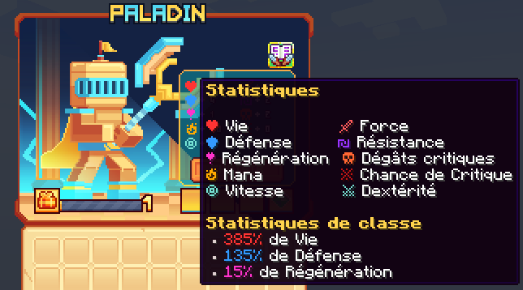

# 🛡️ Paladin

L'art de la divinité et de la défense. Utilisez des attaques puissantes et des compétences saintes pour protéger vos alliés et repousser les ennemis.

<figure><figcaption>
<strong>Aperçu des stats de la classe Paladin</strong>
</figcaption></figure>

## 💠 <mark style="color:yellow;">Compétences</mark>


Les dégâts des compétences sont en cours de modification, ne les prennez pas pour argent comptant !
-L'équipe du wiki


### 🔸 <mark style="color:yellow;">**Niveau 1 : Frappe sacrée**</mark>

Effectuez une attaque sacrée. Chaque troisième frappe coupe vos ennemis et les fait décoller.

* <mark style="color:yellow;">**Temps de recharge**</mark>**:** 0.5s
* <mark style="color:yellow;">**Mana**</mark>**:** 0
* <mark style="color:yellow;">**Dégâts**</mark>**:** 4.2
* <mark style="color:yellow;">**Dégâts du combo**</mark>**:** 14.8

### 🔸 <mark style="color:yellow;">**Niveau 5 : Aura radieuse**</mark>

Chaque utilisation de compétence empile un anneau sacré autour de vous. Chaque 4ème anneau crée une aura qui guérit et donne de la résistance.

* <mark style="color:yellow;">**Temps de recharge**</mark>**:** 10s
* <mark style="color:yellow;">**Mana**</mark>**:** 0
* <mark style="color:yellow;">**Dégâts**</mark>**:** 0

### 🔸 <mark style="color:yellow;">**Niveau 10 : Volonté inébranlable**</mark>

Invoquez un bouclier sacré devant vous, foncez à l'emplacement ciblé et repoussez les ennemis, les étourdissant.

* <mark style="color:yellow;">**Temps de recharge**</mark>**:** 10s
* <mark style="color:yellow;">**Mana**</mark>**:** 75
* <mark style="color:yellow;">**Dégâts**</mark>**:** 77,2
<!--Il faudrai demander la durée du stun-->

### 🔸 <mark style="color:yellow;">**Niveau 15 : Marteau de justice**</mark>

Invoquez un marteau sacré et brisez la surface, créant des éruptions lumineuses dans la direction que vous regardez.

* <mark style="color:yellow;">**Temps de recharge**</mark>**:** 15s
* <mark style="color:yellow;">**Mana**</mark>**:** 200
* <mark style="color:yellow;">**Dégâts**</mark>**:** 176,4

### 🔸 <mark style="color:yellow;">**Niveau 20 : Bouclier divin**</mark>

Donnez-vous un bouclier divin et à vos alliés proches. Vous ne subissez aucun dégât tant que vous avez le bouclier.

* <mark style="color:yellow;">**Temps de recharge**</mark>**:** 20s
* <mark style="color:yellow;">**Mana**</mark>**:** 200
* <mark style="color:yellow;">**Dégâts**</mark>**:** 0

### 🔸 <mark style="color:yellow;">**Niveau 30 : Sceau**</mark>

Liez un ennemi avec des chaînes et invoquez une lance sacrée qui transperce et marque un ennemi.

* <mark style="color:yellow;">**Temps de recharge**</mark>**:** 10s
* <mark style="color:yellow;">**Mana**</mark>**:** 75
* <mark style="color:yellow;">**Dégâts**</mark>**:** 1621,1

### 🔸 <mark style="color:yellow;">**Niveau 40 : Dernier combat**</mark>

Dessinez un large cercle autour de vous, attirant les ennemis proches. Vous invoquez vos ailes sacrées, sautez en arrière et frappez le sol avec votre marteau, propulsant les ennemis dans les airs. Si l'ennemi touché est marqué, il laisse derrière lui une aura de guérison.

* <mark style="color:yellow;">**Temps de recharge**</mark>**:** 30s
* <mark style="color:yellow;">**Mana**</mark>**:** 400
* <mark style="color:yellow;">**Dégâts**</mark>**:** 3555,2 + 413

## 💠 <mark style="color:yellow;">Armes</mark>

<table>
  <tr>
    <th>Armes</th>
    <th>Rareté</th>
    <th>Stat</th>
    <th>Obtention</th>
  </tr>
  <tr>
    <td><mark style="color:green;">Brise feuille</mark></td>
    <td><mark style="color:green;">Commun</mark></td>
    <td>
     
<mark style="color:red;">🗡 Force +5</mark>

     
<mark style="color:blue;">🐈 Dextérité +3</mark>

    </td>
    <td>Donjon Biome Forêt</td>
  </tr>
  <tr>
    <td><mark style="color:yellow;">Brise feuille</mark></td>
    <td><mark style="color:yellow;">Rare</mark></td>
    <td>
     
<mark style="color:red;">🗡 Force +11</mark>

     
<mark style="color:blue;">🐈 Dextérité +6</mark>

    </td>
    <td>Donjon Biome Forêt ou Forge</td>
  </tr>
  <tr>
    <td><mark style="color:blue;">Brise feuille</mark></td>
    <td><mark style="color:blue;">Épique</mark></td>
    <td>
     
<mark style="color:red;">🗡 Force +18</mark>

     
<mark style="color:blue;">🐈 Dextérité +9</mark>

    </td>
    <td>Donjon Biome Forêt ou Forge</td>
  </tr>
  <tr>
    <td><mark style="color:purple;">Brise feuille</mark></td>
    <td><mark style="color:purple;">Légendaire</mark></td>
    <td>
     
<mark style="color:red;">🗡 Force +35</mark>

     
<mark style="color:blue;">🐈 Dextérité +15</mark>

    </td>
    <td>Forge</td>
  </tr>
  <tr>
    <td><mark style="color:red;">Brise feuille</mark></td>
    <td><mark style="color:red;">Mythique</mark></td>
    <td>
     
<mark style="color:red;">🗡 Force +60</mark>

     
<mark style="color:blue;">🐈 Dextérité +26</mark>

    </td>
    <td>Forge</td>
  </tr>
  <tr>
    <td><mark style="color:green;">Ecraseur de tête</mark></td>
    <td><mark style="color:green;">Commun</mark></td>
    <td>
     
<mark style="color:red;">🗡 Force +5</mark>

     
<mark style="color:red;">🥊 Chance de Critique +1</mark>

    </td>
    <td>Donjon Biome Savane</td>
  </tr>
  <tr>
    <td><mark style="color:yellow;">Ecraseur de tête</mark></td>
    <td><mark style="color:yellow;">Rare</mark></td>
    <td>
     
<mark style="color:red;">🗡 Force +11</mark>

     
<mark style="color:red;">🥊 Chance de Critique +1</mark>

    </td>
    <td>Donjon Biome Savane ou Forge</td>
  </tr>
  <tr>
    <td><mark style="color:blue;">Ecraseur de tête</mark></td>
    <td><mark style="color:blue;">Épique</mark></td>
    <td>
     
<mark style="color:red;">🗡 Force +18</mark>

     
<mark style="color:red;">🥊 Chance de Critique +2</mark>

    </td>
    <td>Donjon Biome Savane ou Forge</td>
  </tr>
  <tr>
    <td><mark style="color:purple;">Ecraseur de tête</mark></td>
    <td><mark style="color:purple;">Légendaire</mark></td>
    <td>
     
<mark style="color:red;">🗡 Force +35</mark>

     
<mark style="color:red;">🥊 Chance de Critique +3</mark>

    </td>
    <td>Forge</td>
  </tr>
  <tr>
    <td><mark style="color:red;">Ecraseur de tête</mark></td>
    <td><mark style="color:red;">Mythique</mark></td>
    <td>
     
<mark style="color:red;">🗡 Force +60</mark>

     
<mark style="color:red;">🥊 Chance de Critique +6</mark>

    </td>
    <td>Forge</td>
  </tr>
  <tr>
    <td><mark style="color:green;">Marteau sismique</mark></td>
    <td><mark style="color:green;">Commun</mark></td>
    <td>
     
<mark style="color:red;">🗡 Force +5</mark>

     
<mark style="color:orange;">💀 Dégât Critique +3</mark>

    </td>
    <td>Donjon Biome Messa</td>
  </tr>
  <tr>
    <td><mark style="color:yellow;">Marteau sismique</mark></td>
    <td><mark style="color:yellow;">Rare</mark></td>
    <td>
     
<mark style="color:red;">🗡 Force +11</mark>

     
<mark style="color:orange;">💀 Dégât Critique +6</mark>

    </td>
    <td>Donjon Biome Messa ou Forge</td>
  </tr>
  <tr>
    <td><mark style="color:blue;">Marteau sismique</mark></td>
    <td><mark style="color:blue;">Épique</mark></td>
    <td>
     
<mark style="color:red;">🗡 Force +18</mark>

     
<mark style="color:orange;">💀 Dégât Critique +9</mark>

    </td>
    <td>Donjon Biome Messa ou Forge</td>
  </tr>
  <tr>
    <td><mark style="color:purple;">Marteau sismique</mark></td>
    <td><mark style="color:purple;">Légendaire</mark></td>
    <td>
     
<mark style="color:red;">🗡 Force +35</mark>

     
<mark style="color:orange;">💀 Dégât Critique +15</mark>

    </td>
    <td>Forge</td>
  </tr>
  <tr>
    <td><mark style="color:red;">Marteau sismique</mark></td>
    <td><mark style="color:red;">Mythique</mark></td>
    <td>
     
<mark style="color:red;">🗡 Force +60</mark>

     
<mark style="color:orange;">💀 Dégât Critique +26</mark>

    </td>
    <td>Forge</td>
  </tr>
  <tr>
    <td><mark style="color:green;">Bouclier du chaos</mark></td>
    <td><mark style="color:green;">Commun</mark></td>
    <td>
     
<mark style="color:red;">❤️ Vie +10</mark>

     
<mark style="color:blue;">🛡️ Défense +3</mark>

    </td>
    <td>Donjon Biome Nether</td>
  </tr>
  <tr>
    <td><mark style="color:yellow;">Bouclier du chaos</mark></td>
    <td><mark style="color:yellow;">Rare</mark></td>
    <td>
     
<mark style="color:red;">❤️ Vie +25</mark>

     
<mark style="color:blue;">🛡️ Défense +6</mark>

    </td>
    <td>Donjon Biome Nether ou Forge</td>
  </tr>
  <tr>
    <td><mark style="color:blue;">Bouclier du chaos</mark></td>
    <td><mark style="color:blue;">Épique</mark></td>
    <td>
     
<mark style="color:red;">❤️ Vie +40</mark>

     
<mark style="color:yellow;">🧪 Mana +25</mark>

     
<mark style="color:blue;">🛡️ Défense +9</mark>

    </td>
    <td>Donjon Biome Nether ou Forge</td>
  </tr>
  <tr>
    <td><mark style="color:purple;">Bouclier du chaos</mark></td>
    <td><mark style="color:purple;">Légendaire</mark></td>
    <td>
     
<mark style="color:red;">❤️ Vie +82</mark>

     
<mark style="color:blue;">🛡️ Défense +15</mark>

    </td>
    <td>Donjon Biome Nether ou Forge</td>
  </tr>
  <tr>
    <td><mark style="color:red;">Bouclier du chaos</mark></td>
    <td><mark style="color:red;">Mythique</mark></td>
    <td>
     
<mark style="color:red;">❤️ Vie +140</mark>

     
<mark style="color:blue;">🛡️ Défense +26</mark>

    </td>
    <td>Donjon Biome Nether ou Forge</td>
  </tr>
  <tr>
    <td><mark style="color:green;">Marteau de la lumière</mark></td>
    <td><mark style="color:green;">Commun</mark></td>
    <td>
     
<mark style="color:red;">🗡 Force +7</mark>

     
<mark style="color:red;">❤️ Vie +14</mark>

    </td>
    <td>Pack d'arme</td>
  </tr>
  <tr>
    <td><mark style="color:yellow;">Marteau de la lumière</mark></td>
    <td><mark style="color:yellow;">Rare</mark></td>
    <td>
     
<mark style="color:red;">🗡 Force +15</mark>

     
<mark style="color:red;">❤️ Vie +35</mark>

    </td>
    <td>Pack d'arme ou Forge</td>
  </tr>
  <tr>
    <td><mark style="color:blue;">Marteau de la lumière</mark></td>
    <td><mark style="color:blue;">Épique</mark></td>
    <td>
     
<mark style="color:red;">🗡 Force +25</mark>

     
<mark style="color:red;">❤️ Vie +56</mark>

    </td>
    <td>Pack d'arme ou Forge</td>
  </tr>
  <tr>
    <td><mark style="color:purple;">Marteau de la lumière</mark></td>
    <td><mark style="color:purple;">Légendaire</mark></td>
    <td>
     
<mark style="color:red;">🗡 Force +45</mark>

     
<mark style="color:red;">❤️ Vie +100</mark>

    </td>
    <td>Forge</td>
  </tr>
  <tr>
    <td><mark style="color:red;">Marteau de la lumière</mark></td>
    <td><mark style="color:red;">Mythique</mark></td>
    <td>
     
<mark style="color:red;">🗡 Force +80</mark>

     
<mark style="color:red;">❤️ Vie +180</mark>

    </td>
    <td>Forge</td>
  </tr>
  <tr>
    <td><mark style="color:yellow;">Marteau légendaire</mark></td>
    <td><mark style="color:yellow;">Légendaire</mark></td>
    <td>
    <td>Box Jackpot</td>
  </tr>
  <tr>
    <td><mark style="color:orange;">Marteau Draconique</mark></td>
    <td><mark style="color:orange;">Draconique</mark></td>
    <td>
     
<mark style="color:red;">🗡 Force +20</mark>

     
<mark style="color:red;">❤️ Vie +45</mark>

    </td>
    <td>Marché Noir</td>
  </tr>
  <tr>
    <td><mark style="color:blue;">Marteau Abyssal</mark></td>
    <td><mark style="color:blue;">Abyssal</mark></td>
    <td>
     
<mark style="color:red;">🗡 Force +20</mark>

     
<mark style="color:red;">❤️ Vie +45</mark>

    </td>
    <td>Marché Noir</td>
  </tr>
  <tr>
    <td><mark style="color:orange;">Marteau de Minuit</mark></td>
    <td><mark style="color:orange;">Halloween</mark></td>
    <td>
     
<mark style="color:red;">🗡 Force +31</mark>

     
<mark style="color:red;">❤️ Vie +73</mark>

    </td>
    <td>Marché Noir</td>
  </tr>
  <tr>
    <td><mark style="color:red;">Marteau des Glaces</mark></td>
    <td><mark style="color:red;">Givrée</mark></td>
    <td>
     
<mark style="color:red;">🗡 Force +31</mark>

     
<mark style="color:red;">❤️ Vie +73</mark>

    </td>
    <td>Marché Noir</td>
  </tr>
  <tr>
    <td><mark style="color:red;">Marteau de l'Amour</mark></td>
    <td><mark style="color:red;">ST-Valentin</mark></td>
    <td>
     
<mark style="color:red;">🗡 Force +36</mark>

     
<mark style="color:red;">❤️ Vie +91</mark>

    </td>
    <td>Marché Noir</td>
  </tr>
  <tr>
    <td><mark style="color:yellow;">Marteau en Chocolat</mark></td>
    <td><mark style="color:yellow;">Pâques</mark></td>
    <td>
     
<mark style="color:red;">🗡 Force +43</mark>

     
<mark style="color:red;">❤️ Vie +109</mark>

    </td>
    <td>Marché Noir</td>
  </tr>
  <tr>
    <td><mark style="color:blue;">Marteau Summer</mark></td>
    <td><mark style="color:blue;">Summer</mark></td>
    <td>
     
<mark style="color:red;">🗡 Force +43</mark>

     
<mark style="color:blue;">🏃‍♂️ Vitesse +2</mark>

     
<mark style="color:red;">❤️ Vie +109</mark>

    </td>
    <td>Marché Noir</td>
  </tr>
</table>
