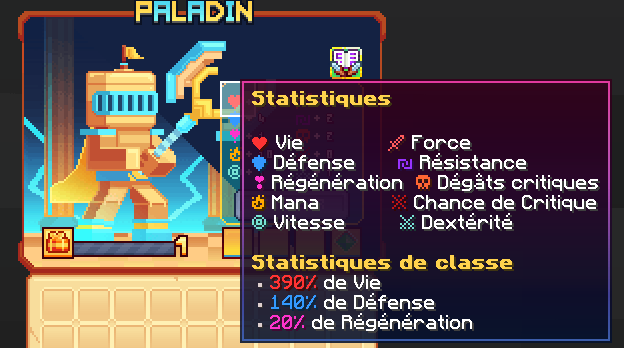

# 🛡️ Paladin

L'art de la divinité et de la défense. Utilisez des attaques puissantes et des compétences saintes pour protéger vos alliés et repousser les ennemis.

<figure><figcaption>
<strong>Aperçu des stats de la classe Paladin</strong>
</figcaption></figure>

## 💠 <mark style="color:yellow;">Compétences</mark>


Les dégâts des compétences sont en cours de modification, ne les prenez pas pour argent comptant !
-L'équipe du wiki


### 🔸 <mark style="color:yellow;">**Niveau 1 : Frappe sacrée**</mark>

Effectuez une attaque sacrée. Chaque troisième frappe coupe vos ennemis et les fait décoller.

* <mark style="color:yellow;">**Temps de recharge**</mark>**:** 0.5s
* <mark style="color:yellow;">**Mana**</mark>**:** 0
* <mark style="color:yellow;">**Dégâts**</mark>**:** 4.2
* <mark style="color:yellow;">**Dégâts du combo**</mark>**:** 14.8

### 🔸 <mark style="color:yellow;">**Niveau 5 : Aura radieuse**</mark>

Chaque utilisation de compétence empile un anneau sacré autour de vous. Chaque 4ème anneau crée une aura qui guérit et donne de la résistance.

* <mark style="color:yellow;">**Temps de recharge**</mark>**:** 10s
* <mark style="color:yellow;">**Mana**</mark>**:** 0
* <mark style="color:yellow;">**Dégâts**</mark>**:** 0

### 🔸 <mark style="color:yellow;">**Niveau 10 : Volonté inébranlable**</mark>

Invoquez un bouclier sacré devant vous, foncez à l'emplacement ciblé et repoussez les ennemis, les étourdissant.

* <mark style="color:yellow;">**Temps de recharge**</mark>**:** 10s
* <mark style="color:yellow;">**Mana**</mark>**:** 75
* <mark style="color:yellow;">**Dégâts**</mark>**:** 77,2
<!--Il faudrai demander la durée du stun-->

### 🔸 <mark style="color:yellow;">**Niveau 15 : Marteau de justice**</mark>

Invoquez un marteau sacré et brisez la surface, créant des éruptions lumineuses dans la direction que vous regardez.

* <mark style="color:yellow;">**Temps de recharge**</mark>**:** 15s
* <mark style="color:yellow;">**Mana**</mark>**:** 200
* <mark style="color:yellow;">**Dégâts**</mark>**:** 176,4

### 🔸 <mark style="color:yellow;">**Niveau 20 : Bouclier divin**</mark>

Donnez-vous un bouclier divin et à vos alliés proches. Vous ne subissez aucun dégât tant que vous avez le bouclier.

* <mark style="color:yellow;">**Temps de recharge**</mark>**:** 20s
* <mark style="color:yellow;">**Mana**</mark>**:** 200
* <mark style="color:yellow;">**Dégâts**</mark>**:** 0

### 🔸 <mark style="color:yellow;">**Niveau 30 : Sceau**</mark>

Liez un ennemi avec des chaînes et invoquez une lance sacrée qui transperce et marque un ennemi.

* <mark style="color:yellow;">**Temps de recharge**</mark>**:** 10s
* <mark style="color:yellow;">**Mana**</mark>**:** 75
* <mark style="color:yellow;">**Dégâts**</mark>**:** 1621,1

### 🔸 <mark style="color:yellow;">**Niveau 40 : Dernier combat**</mark>

Dessinez un large cercle autour de vous, attirant les ennemis proches. Vous invoquez vos ailes sacrées, sautez en arrière et frappez le sol avec votre marteau, propulsant les ennemis dans les airs. Si l'ennemi touché est marqué, il laisse derrière lui une aura de guérison.

* <mark style="color:yellow;">**Temps de recharge**</mark>**:** 30s
* <mark style="color:yellow;">**Mana**</mark>**:** 400
* <mark style="color:yellow;">**Dégâts**</mark>**:** 3555,2 + 413

## 💠 <mark style="color:yellow;">Armes</mark>

### 🔸 <mark style="color:green;">**Armes des Récompenses de Donjon**</mark>

<table>
<tr>
    <th><strong>Nom de l'Armes 🏷️</strong></th>
    <th><strong>Rareté ou Collection 🌟</strong></th>
    <th><strong>Statistiques 📊</strong></th>
    <th><strong>Effets ✨</strong></th>
    <th><strong>Obtentions 📌</strong></th>
  </tr>
  <tr>
    <td><mark style="color:green;">Brise feuille</mark></td>
    <td><mark style="color:green;">Commun</mark></td>
    <td>
     
<mark style="color:red;">🗡️ Force +5</mark>

     
<mark style="color:blue;">🤺 Dextérité +3</mark>

    </td>
    <td><mark style="color:green;">Aucun Effet</mark> Supplémentaire ❌</td>
    <td>
     
▸ <mark style="color:green;">Donjon Commun (Biome Forêt)</mark>

     
▸ <mark style="color:yellow;">Donjon Rare (Biome Forêt)</mark>

    </td>
  </tr>
  <tr>
    <td><mark style="color:yellow;">Brise feuille</mark></td>
    <td><mark style="color:yellow;">Rare</mark></td>
    <td>
     
<mark style="color:red;">🗡️ Force +11</mark>

     
<mark style="color:blue;">🤺 Dextérité +6</mark>

    </td>
    <td><mark style="color:green;">Aucun Effet</mark> Supplémentaire ❌</td>
    <td>
     
▸ <mark style="color:yellow;">Donjon Rare (Biome Forêt)</mark>

     
▸ <mark style="color:blue;">Donjon Épique (Biome Forêt)</mark>

     
▸ <a href="https://wiki.evolucraft.fr/le-gameplay/les-machines/forge#armes-rares"><mark style="color:green;">Forge 🔨</mark></a>

    </td>
  </tr>
  <tr>
    <td><mark style="color:blue;">Brise feuille</mark></td>
    <td><mark style="color:blue;">Épique</mark></td>
    <td>
     
<mark style="color:red;">🗡️ Force +18</mark>

     
<mark style="color:blue;">🤺 Dextérité +9</mark>

    </td>
    <td><mark style="color:green;">Aucun Effet</mark> Supplémentaire ❌</td>
    <td>
     
▸ <mark style="color:blue;">Donjon Épique (Biome Forêt)</mark>

     
▸ <a href="https://wiki.evolucraft.fr/le-gameplay/les-machines/forge#armes-epiques"><mark style="color:green;">Forge 🔨</mark></a>

    </td>
  </tr>
  <tr>
    <td><mark style="color:purple;">Brise feuille</mark></td>
    <td><mark style="color:purple;">Légendaire</mark></td>
    <td>
     
<mark style="color:red;">🗡️ Force +35</mark>

     
<mark style="color:blue;">🤺 Dextérité +15</mark>

    </td>
    <td><mark style="color:green;">Aucun Effet</mark> Supplémentaire ❌</td>
    <td>
     
▸ <a href="https://wiki.evolucraft.fr/le-gameplay/les-machines/forge#armes-legendaires"><mark style="color:green;">Forge 🔨</mark></a>

    </td>
  </tr>
  <tr>
    <td><mark style="color:red;">Brise feuille</mark></td>
    <td><mark style="color:red;">Mythique</mark></td>
    <td>
     
<mark style="color:red;">🗡️ Force +60</mark>

     
<mark style="color:blue;">🤺 Dextérité +26</mark>

    </td>
    <td><mark style="color:green;">Aucun Effet</mark> Supplémentaire ❌</td>
    <td>
     
▸ <a href="https://wiki.evolucraft.fr/le-gameplay/les-machines/forge#armes-mythiques"><mark style="color:green;">Forge 🔨</mark></a>

    </td>
  </tr>
  <tr>
    <td><mark style="color:green;">Ecraseur de tête</mark></td>
    <td><mark style="color:green;">Commun</mark></td>
    <td>
     
<mark style="color:red;">🗡️ Force +5</mark>

     
<mark style="color:red;">🥊 Chance de Critique +1</mark>

    </td>
    <td><mark style="color:green;">Aucun Effet</mark> Supplémentaire ❌</td>
    <td>
     
▸ <mark style="color:green;">Donjon Commun (Biome Savane)</mark>

     
▸ <mark style="color:yellow;">Donjon Rare (Biome Savane)</mark>

    </td>
  </tr>
  <tr>
    <td><mark style="color:yellow;">Ecraseur de tête</mark></td>
    <td><mark style="color:yellow;">Rare</mark></td>
    <td>
     
<mark style="color:red;">🗡️ Force +11</mark>

     
<mark style="color:red;">🥊 Chance de Critique +1</mark>

    </td>
    <td><mark style="color:green;">Aucun Effet</mark> Supplémentaire ❌</td>
    <td>
     
▸ <mark style="color:yellow;">Donjon Rare (Biome Savane)</mark>

     
▸ <mark style="color:blue;">Donjon Épique (Biome Savane)</mark>

     
▸ <a href="https://wiki.evolucraft.fr/le-gameplay/les-machines/forge#armes-rares"><mark style="color:green;">Forge 🔨</mark></a>

    </td>
  </tr>
  <tr>
    <td><mark style="color:blue;">Ecraseur de tête</mark></td>
    <td><mark style="color:blue;">Épique</mark></td>
    <td>
     
<mark style="color:red;">🗡️ Force +18</mark>

     
<mark style="color:red;">🥊 Chance de Critique +2</mark>

    </td>
    <td><mark style="color:green;">Aucun Effet</mark> Supplémentaire ❌</td>
    <td>
     
▸ <mark style="color:blue;">Donjon Épique (Biome Savane)</mark>

     
▸ <a href="https://wiki.evolucraft.fr/le-gameplay/les-machines/forge#armes-epiques"><mark style="color:green;">Forge 🔨</mark></a>

    </td>
  </tr>
  <tr>
    <td><mark style="color:purple;">Ecraseur de tête</mark></td>
    <td><mark style="color:purple;">Légendaire</mark></td>
    <td>
     
<mark style="color:red;">🗡️ Force +35</mark>

     
<mark style="color:red;">🥊 Chance de Critique +3</mark>

    </td>
    <td><mark style="color:green;">Aucun Effet</mark> Supplémentaire ❌</td>
    <td>
     
▸ <a href="https://wiki.evolucraft.fr/le-gameplay/les-machines/forge#armes-legendaires"><mark style="color:green;">Forge 🔨</mark></a>

    </td>
  </tr>
  <tr>
    <td><mark style="color:red;">Ecraseur de tête</mark></td>
    <td><mark style="color:red;">Mythique</mark></td>
    <td>
     
<mark style="color:red;">🗡️ Force +60</mark>

     
<mark style="color:red;">🥊 Chance de Critique +6</mark>

    </td>
    <td><mark style="color:green;">Aucun Effet</mark> Supplémentaire ❌</td>
    <td>
     
▸ <a href="https://wiki.evolucraft.fr/le-gameplay/les-machines/forge#armes-mythiques"><mark style="color:green;">Forge 🔨</mark></a>

    </td>
  </tr>
  <tr>
    <td><mark style="color:green;">Marteau sismique</mark></td>
    <td><mark style="color:green;">Commun</mark></td>
    <td>
     
<mark style="color:red;">🗡️ Force +5</mark>

     
<mark style="color:orange;">💀 Dégât Critique +3</mark>

    </td>
    <td><mark style="color:green;">Aucun Effet</mark> Supplémentaire ❌</td>
    <td>
     
▸ <mark style="color:green;">Donjon Commun (Biome Messa)</mark>

     
▸ <mark style="color:yellow;">Donjon Rare (Biome Messa)</mark>

    </td>
  </tr>
  <tr>
    <td><mark style="color:yellow;">Marteau sismique</mark></td>
    <td><mark style="color:yellow;">Rare</mark></td>
    <td>
     
<mark style="color:red;">🗡️ Force +11</mark>

     
<mark style="color:orange;">💀 Dégât Critique +6</mark>

    </td>
    <td><mark style="color:green;">Aucun Effet</mark> Supplémentaire ❌</td>
    <td>
     
▸ <mark style="color:yellow;">Donjon Rare (Biome Messa)</mark>

     
▸ <mark style="color:blue;">Donjon Épique (Biome Messa)</mark>

     
▸ <a href="https://wiki.evolucraft.fr/le-gameplay/les-machines/forge#armes-rares"><mark style="color:green;">Forge 🔨</mark></a>

    </td>
  </tr>
  <tr>
    <td><mark style="color:blue;">Marteau sismique</mark></td>
    <td><mark style="color:blue;">Épique</mark></td>
    <td>
     
<mark style="color:red;">🗡️ Force +18</mark>

     
<mark style="color:orange;">💀 Dégât Critique +9</mark>

    </td>
    <td><mark style="color:green;">Aucun Effet</mark> Supplémentaire ❌</td>
    <td>
     
▸ <mark style="color:blue;">Donjon Épique (Biome Messa)</mark>

     
▸ <a href="https://wiki.evolucraft.fr/le-gameplay/les-machines/forge#armes-epiques"><mark style="color:green;">Forge 🔨</mark></a>

    </td>
  </tr>
  <tr>
    <td><mark style="color:purple;">Marteau sismique</mark></td>
    <td><mark style="color:purple;">Légendaire</mark></td>
    <td>
     
<mark style="color:red;">🗡️ Force +35</mark>

     
<mark style="color:orange;">💀 Dégât Critique +15</mark>

    </td>
    <td><mark style="color:green;">Aucun Effet</mark> Supplémentaire ❌</td>
    <td>
     
▸ <a href="https://wiki.evolucraft.fr/le-gameplay/les-machines/forge#armes-legendaires"><mark style="color:green;">Forge 🔨</mark></a>

    </td>
  </tr>
  <tr>
    <td><mark style="color:red;">Marteau sismique</mark></td>
    <td><mark style="color:red;">Mythique</mark></td>
    <td>
     
<mark style="color:red;">🗡️ Force +60</mark>

     
<mark style="color:orange;">💀 Dégât Critique +26</mark>

    </td>
    <td><mark style="color:green;">Aucun Effet</mark> Supplémentaire ❌</td>
    <td>
     
▸ <a href="https://wiki.evolucraft.fr/le-gameplay/les-machines/forge#armes-mythiques"><mark style="color:green;">Forge 🔨</mark></a>

    </td>
  </tr>
  <tr>
    <td><mark style="color:green;">Bouclier du chaos</mark></td>
    <td><mark style="color:green;">Commun</mark></td>
    <td>
     
<mark style="color:red;">❤️ Vie +10</mark>

     
<mark style="color:blue;">🛡️ Défense +3</mark>

    </td>
    <td><mark style="color:green;">Aucun Effet</mark> Supplémentaire ❌</td>
    <td>
     
▸ <mark style="color:green;">Donjon Commun (Biome Nether)</mark>

     
▸ <mark style="color:yellow;">Donjon Rare (Biome Nether)</mark>

    </td>
  </tr>
  <tr>
    <td><mark style="color:yellow;">Bouclier du chaos</mark></td>
    <td><mark style="color:yellow;">Rare</mark></td>
    <td>
     
<mark style="color:red;">❤️ Vie +25</mark>

     
<mark style="color:blue;">🛡️ Défense +6</mark>

    </td>
    <td><mark style="color:green;">Aucun Effet</mark> Supplémentaire ❌</td>
    <td>
     
▸ <mark style="color:yellow;">Donjon Rare (Biome Nether)</mark>

     
▸ <mark style="color:blue;">Donjon Épique (Biome Nether)</mark>

     
▸ <a href="https://wiki.evolucraft.fr/le-gameplay/les-machines/forge#armes-rares"><mark style="color:green;">Forge 🔨</mark></a>

    </td>
  </tr>
  <tr>
    <td><mark style="color:blue;">Bouclier du chaos</mark></td>
    <td><mark style="color:blue;">Épique</mark></td>
    <td>
     
<mark style="color:red;">❤️ Vie +40</mark>

     
<mark style="color:yellow;">🧪 Mana +25</mark>

     
<mark style="color:blue;">🛡️ Défense +9</mark>

    </td>
    <td><mark style="color:green;">Aucun Effet</mark> Supplémentaire ❌</td>
    <td>
     
▸ <mark style="color:blue;">Donjon Épique (Biome Nether)</mark>

     
▸ <a href="https://wiki.evolucraft.fr/le-gameplay/les-machines/forge#armes-epiques"><mark style="color:green;">Forge 🔨</mark></a>

    </td>
  </tr>
  <tr>
    <td><mark style="color:purple;">Bouclier du chaos</mark></td>
    <td><mark style="color:purple;">Légendaire</mark></td>
    <td>
     
<mark style="color:red;">❤️ Vie +82</mark>

     
<mark style="color:blue;">🛡️ Défense +15</mark>

    </td>
    <td><mark style="color:green;">Aucun Effet</mark> Supplémentaire ❌</td>
    <td>
     
▸ <a href="https://wiki.evolucraft.fr/le-gameplay/les-machines/forge#armes-legendaires"><mark style="color:green;">Forge 🔨</mark></a>

    </td>
  </tr>
  <tr>
    <td><mark style="color:red;">Bouclier du chaos</mark></td>
    <td><mark style="color:red;">Mythique</mark></td>
    <td>
     
<mark style="color:red;">❤️ Vie +140</mark>

     
<mark style="color:blue;">🛡️ Défense +26</mark>

    </td>
    <td><mark style="color:green;">Aucun Effet</mark> Supplémentaire ❌</td>
    <td>
     
▸ <a href="https://wiki.evolucraft.fr/le-gameplay/les-machines/forge#armes-mythiques"><mark style="color:green;">Forge 🔨</mark></a>

    </td>
  </tr>
</table>

### 🔸 <mark style="color:green;">**Packs d'Armes**</mark>

<table>
<tr>
    <th><strong>Nom de l'Armes 🏷️</strong></th>
    <th><strong>Rareté ou Collection 🌟</strong></th>
    <th><strong>Statistiques 📊</strong></th>
    <th><strong>Effets ✨</strong></th>
    <th><strong>Obtentions 📌</strong></th>
  </tr>
  <tr>
    <td><mark style="color:green;">Marteau de la lumière</mark></td>
    <td><mark style="color:green;">Commun</mark></td>
    <td>
     
<mark style="color:red;">🗡️ Force +7</mark>

     
<mark style="color:red;">❤️ Vie +14</mark>

    </td>
    <td><mark style="color:green;">Aucun Effet</mark> Supplémentaire ❌</td>
    <td>
     
▸ <mark style="color:green;">Packs d'Armes (Mini-Boss & Boss des Donjons Communs)</mark>

    </td>
  </tr>
  <tr>
    <td><mark style="color:yellow;">Marteau de la lumière</mark></td>
    <td><mark style="color:yellow;">Rare</mark></td>
    <td>
     
<mark style="color:red;">🗡️ Force +15</mark>

     
<mark style="color:red;">❤️ Vie +35</mark>

    </td>
    <td><mark style="color:green;">Aucun Effet</mark> Supplémentaire ❌</td>
    <td>
     
▸ <mark style="color:yellow;">Packs d'Armes (Mini-Boss & Boss des Donjons Rares)</mark>

     
▸ <a href="https://wiki.evolucraft.fr/le-gameplay/les-machines/forge#armes-rares"><mark style="color:green;">Forge 🔨</mark></a>

    </td>
  </tr>
  <tr>
    <td><mark style="color:blue;">Marteau de la lumière</mark></td>
    <td><mark style="color:blue;">Épique</mark></td>
    <td>
     
<mark style="color:red;">🗡️ Force +25</mark>

     
<mark style="color:red;">❤️ Vie +56</mark>

    </td>
    <td><mark style="color:green;">Aucun Effet</mark> Supplémentaire ❌</td>
    <td>
     
▸ <mark style="color:blue;">Packs d'Armes (Mini-Boss & Boss des Donjons Épiques, Légendaires et Mythique)</mark>

     
▸ <a href="https://wiki.evolucraft.fr/le-gameplay/les-machines/forge#armes-epiques"><mark style="color:green;">Forge 🔨</mark></a>

    </td>
  </tr>
  <tr>
    <td><mark style="color:purple;">Marteau de la lumière</mark></td>
    <td><mark style="color:purple;">Légendaire</mark></td>
    <td>
     
<mark style="color:red;">🗡️ Force +45</mark>

     
<mark style="color:red;">❤️ Vie +100</mark>

    </td>
    <td><mark style="color:green;">Aucun Effet</mark> Supplémentaire ❌</td>
    <td>
     
▸ <a href="https://wiki.evolucraft.fr/le-gameplay/les-machines/forge#armes-legendaires"><mark style="color:green;">Forge 🔨</mark></a>

    </td>
  </tr>
  <tr>
    <td><mark style="color:red;">Marteau de la lumière</mark></td>
    <td><mark style="color:red;">Mythique</mark></td>
    <td>
     
<mark style="color:red;">🗡️ Force +80</mark>

     
<mark style="color:red;">❤️ Vie +180</mark>

    </td>
    <td><mark style="color:green;">Aucun Effet</mark> Supplémentaire ❌</td>
    <td>
     
▸ <a href="https://wiki.evolucraft.fr/le-gameplay/les-machines/forge#armes-mythiques"><mark style="color:green;">Forge 🔨</mark></a>

    </td>
  </tr>
  <tr>
    <td><mark style="color:green;">Marteau de la lumière Shiny</mark></td>
    <td><mark style="color:green;">Commun ✨</mark></td>
    <td>
     
<mark style="color:red;">🗡️ Force +7</mark>

     
<mark style="color:red;">❤️ Vie +14</mark>

    </td>
    <td><mark style="color:green;">Aucun Effet</mark> Supplémentaire ❌</td>
    <td>
     
▸ <mark style="color:green;">Packs d'Armes (Mini-Boss & Boss des Donjons Communs)</mark>

    </td>
  </tr>
  <tr>
    <td><mark style="color:yellow;">Marteau de la lumière Shiny</mark></td>
    <td><mark style="color:yellow;">Rare ✨</mark></td>
    <td>
     
<mark style="color:red;">🗡️ Force +15</mark>

     
<mark style="color:red;">❤️ Vie +35</mark>

    </td>
    <td><mark style="color:green;">Aucun Effet</mark> Supplémentaire ❌</td>
    <td>
     
▸ <mark style="color:yellow;">Packs d'Armes (Mini-Boss & Boss des Donjons Rares)</mark>

     
▸ <a href="https://wiki.evolucraft.fr/le-gameplay/les-machines/forge#armes-rares"><mark style="color:green;">Forge 🔨</mark></a>

    </td>
  </tr>
  <tr>
    <td><mark style="color:blue;">Marteau de la lumière Shiny</mark></td>
    <td><mark style="color:blue;">Épique ✨</mark></td>
    <td>
     
<mark style="color:red;">🗡️ Force +25</mark>

     
<mark style="color:red;">❤️ Vie +56</mark>

    </td>
    <td><mark style="color:green;">Aucun Effet</mark> Supplémentaire ❌</td>
    <td>
     
▸ <mark style="color:blue;">Packs d'Armes (Mini-Boss & Boss des Donjons Épiques, Légendaires et Mythique)</mark>

     
▸ <a href="https://wiki.evolucraft.fr/le-gameplay/les-machines/forge#armes-epiques"><mark style="color:green;">Forge 🔨</mark></a>

    </td>
  </tr>
  <tr>
    <td><mark style="color:purple;">Marteau de la lumière Shiny</mark></td>
    <td><mark style="color:purple;">Légendaire ✨</mark></td>
    <td>
     
<mark style="color:red;">🗡️ Force +45</mark>

     
<mark style="color:red;">❤️ Vie +100</mark>

    </td>
    <td><mark style="color:green;">Aucun Effet</mark> Supplémentaire ❌</td>
    <td>
     
▸ <a href="https://wiki.evolucraft.fr/le-gameplay/les-machines/forge#armes-legendaires"><mark style="color:green;">Forge 🔨</mark></a>

    </td>
  </tr>
  <tr>
    <td><mark style="color:red;">Marteau de la lumière Shiny</mark></td>
    <td><mark style="color:red;">Mythique ✨</mark></td>
    <td>
     
<mark style="color:red;">🗡️ Force +80</mark>

     
<mark style="color:red;">❤️ Vie +180</mark>

    </td>
    <td><mark style="color:green;">Aucun Effet</mark> Supplémentaire ❌</td>
    <td>
     
▸ <a href="https://wiki.evolucraft.fr/le-gameplay/les-machines/forge#armes-mythiques"><mark style="color:green;">Forge 🔨</mark></a>

    </td>
  </tr>
</table>

### 🔸 <mark style="color:green;">**Armes des Évènements**</mark>

<table>
<tr>
    <th><strong>Nom de l'Armes 🏷️</strong></th>
    <th><strong>Rareté ou Collection 🌟</strong></th>
    <th><strong>Statistiques 📊</strong></th>
    <th><strong>Effets ✨</strong></th>
    <th><strong>Obtentions 📌</strong></th>
  </tr>
  <tr>
      <tr>
    <td><mark style="color:yellow;">Marteau légendaire</mark></td>
    <td><mark style="color:yellow;">Jackpot</mark></td>
    <td>
     
<mark style="color:red;">🗡️ Force +60</mark>

     
<mark style="color:red;">❤️ Vie +140</mark>

    </td>
    <td><mark style="color:green;">Aucun Effet</mark> Supplémentaire ❌</td>
    <td>▸ <a href="https://wiki.evolucraft.fr/le-gameplay/les-caisses#caisse-jackpot"><mark style="color:yellow;">Caisse Jackpot 🎰</mark></a></td>
  </tr>
  <tr>
    <td><mark style="color:yellow;">Marteau légendaire Shiny</mark></td>
    <td><mark style="color:yellow;">Jackpot ✨</mark></td>
    <td>
     
<mark style="color:red;">🗡️ Force +60</mark>

     
<mark style="color:red;">❤️ Vie +140</mark>

    </td>
    <td><mark style="color:green;">Aucun Effet</mark> Supplémentaire ❌</td>
    <td>▸ <a href="https://wiki.evolucraft.fr/le-gameplay/les-caisses#caisse-jackpot"><mark style="color:yellow;">Caisse Jackpot 🎰</mark></a></td>
  </tr>
  <tr>
    <td><mark style="color:orange;">Marteau Draconique</mark></td>
    <td><mark style="color:orange;">Draconique</mark></td>
    <td>
     
<mark style="color:red;">🗡️ Force +20</mark>

     
<mark style="color:red;">❤️ Vie +45</mark>

    </td>
    <td><mark style="color:green;">Aucun Effet</mark> Supplémentaire ❌</td>
    <td>
      
▸ <a href="https://wiki.evolucraft.fr/le-gameplay/marche-noir#draconique"><mark style="color:green;">Marché Noir 🧥</mark></a>

      
▸ <a href="https://wiki.evolucraft.fr/le-gameplay/les-caisses#caisse-draconique"><mark style="color:orange;">Caisse Draconique 🐉</mark></a>

      
▸ <a href="https://wiki.evolucraft.fr/le-gameplay/lucky-block"><mark style="color:gold;">Armes Aléatoire via les Lucky Blocks Gold🎲</mark></a>

    </td>
  </tr>
  <tr>
    <td><mark style="color:blue;">Marteau Abyssal</mark></td>
    <td><mark style="color:blue;">Abyssal</mark></td>
    <td>
     
<mark style="color:red;">🗡️ Force +20</mark>

     
<mark style="color:red;">❤️ Vie +45</mark>

    </td>
    <td><mark style="color:blue;"><strong>Bonus Dégâts 💢</strong></mark> ▸ <mark style="color:blue;">+5% de dégâts</mark> dans les donjons <mark style="color:blue;">abyssales</mark></td>
    <td>
      
▸ <a href="https://wiki.evolucraft.fr/le-gameplay/marche-noir#abyssal"><mark style="color:green;">Marché Noir 🧥</mark></a>

      
▸ <a href="https://wiki.evolucraft.fr/le-gameplay/les-caisses#caisse-abyssal"><mark style="color:blue;">Caisse Abyssale 🌊</mark></a>

      
▸ <a href="https://wiki.evolucraft.fr/le-gameplay/lucky-block"><mark style="color:gold;">Armes Aléatoire via les Lucky Blocks Gold🎲</mark></a>

    </td>
  </tr>
  <tr>
    <td><mark style="color:orange;">Marteau de Minuit</mark></td>
    <td><mark style="color:orange;">Halloween</mark></td>
    <td>
     
<mark style="color:red;">🗡️ Force +31</mark>

     
<mark style="color:red;">❤️ Vie +73</mark>

    </td>
    <td><mark style="color:orange;"><strong>Bonus Dégâts 💢</strong></mark> ▸ <mark style="color:orange;">+5% de dégâts</mark> dans les donjons <mark style="color:orange;">halloween</mark></td>
    <td>
      
▸ <a href="https://wiki.evolucraft.fr/le-gameplay/marche-noir#halloween"><mark style="color:green;">Marché Noir 🧥</mark></a>

      
▸ <a href="https://wiki.evolucraft.fr/le-gameplay/les-caisses#caisse-halloween"><mark style="color:orange;">Caisse Halloween 🎃</mark></a>

      
▸ <a href="https://wiki.evolucraft.fr/le-gameplay/lucky-block"><mark style="color:gold;">Armes Aléatoire via les Lucky Blocks Gold🎲</mark></a>

    </td>
  </tr>
  <tr>
    <td><mark style="color:blue;">Marteau des Glaces</mark></td>
    <td><mark style="color:blue;">Givrée</mark></td>
    <td>
     
<mark style="color:red;">🗡️ Force +31</mark>

     
<mark style="color:red;">❤️ Vie +73</mark>

    </td>
    <td><mark style="color:blue;"><strong>Bonus Dégâts 💢</strong></mark> ▸ <mark style="color:blue;">+5% de dégâts</mark> dans les donjons <mark style="color:blue;">givrée commun</mark> et <mark style="color:blue;">épique</mark></td>
    <td>
      
▸ <a href="https://wiki.evolucraft.fr/le-gameplay/marche-noir#givree"><mark style="color:green;">Marché Noir 🧥</mark></a>

      
▸ <a href="https://wiki.evolucraft.fr/le-gameplay/les-caisses#caisse-givree"><mark style="color:blue;">Caisse Givrée ❄️</mark></a>

      
▸ <a href="https://wiki.evolucraft.fr/le-gameplay/lucky-block"><mark style="color:gold;">Armes Aléatoire via les Lucky Blocks Gold🎲</mark></a>

    </td>
  </tr>
  <tr>
    <td><mark style="color:red;">Marteau de l'Amour</mark></td>
    <td><mark style="color:red;">ST-Valentin</mark></td>
    <td>
     
<mark style="color:red;">🗡️ Force +36</mark>

     
<mark style="color:red;">❤️ Vie +91</mark>

    </td>
    <td><mark style="color:red;"><strong>Bonus Dégâts 💢</strong></mark> ▸ <mark style="color:red;">+5% de dégâts</mark> dans les donjons <mark style="color:red;">amour</mark> et <mark style="color:red;">cupidon</mark></td>
    <td>
      
▸ <a href="https://wiki.evolucraft.fr/le-gameplay/marche-noir#st-valentin"><mark style="color:green;">Marché Noir 🧥</mark></a>

      
▸ <a href="https://wiki.evolucraft.fr/le-gameplay/les-caisses#caisse-saint-valentin"><mark style="color:red;">Caisse Saint-Valentin 💕</mark></a>

      
▸ <a href="https://wiki.evolucraft.fr/le-gameplay/lucky-block"><mark style="color:gold;">Armes Aléatoire via les Lucky Blocks Gold🎲</mark></a>

    </td>
  </tr>
  <tr>
    <td><mark style="color:yellow;">Marteau en Chocolat</mark></td>
    <td><mark style="color:yellow;">Pâques</mark></td>
    <td>
     
<mark style="color:red;">🗡️ Force +43</mark>

     
<mark style="color:red;">❤️ Vie +109</mark>

    </td>
    <td><mark style="color:yellow;"><strong>Bonus Dégâts 💢</strong></mark> ▸ <mark style="color:yellow;">+5% de dégâts</mark> dans les donjons <mark style="color:yellow;">terriers du lapins</mark> et <mark style="color:yellow;">fabrique du chocolat</mark></td>
    <td>
      
▸ <a href="https://wiki.evolucraft.fr/le-gameplay/marche-noir#paques"><mark style="color:green;">Marché Noir 🧥</mark></a>

      
▸ <a href="https://wiki.evolucraft.fr/le-gameplay/les-caisses#caisse-paques"><mark style="color:yellow;">Caisse Pâques 🥚</mark></a>

      
▸ <a href="https://wiki.evolucraft.fr/le-gameplay/lucky-block"><mark style="color:gold;">Armes Aléatoire via les Lucky Blocks Gold🎲</mark></a>

    </td>
  </tr>
  <tr>
    <td><mark style="color:blue;">Marteau Summer</mark></td>
    <td><mark style="color:blue;">Summer</mark></td>
    <td>
     
<mark style="color:red;">🗡️ Force +49</mark>

     
<mark style="color:red;">❤️ Vie +109</mark>

     
<mark style="color:blue;">🏃‍♂️ Vitesse +2</mark></td>

    </td>
    <td><mark style="color:green;">Aucun Effet</mark> Supplémentaire ❌</td>
    <td>
      
▸ <a href="https://wiki.evolucraft.fr/le-gameplay/marche-noir#summer-2025"><mark style="color:green;">Marché Noir 🧥</mark></a>

      
▸ <a href="https://wiki.evolucraft.fr/le-gameplay/les-caisses#caisse-summer"><mark style="color:blue;">Caisse Summer 🏖️</mark></a>

      
▸ <a href="https://wiki.evolucraft.fr/le-gameplay/lucky-block"><mark style="color:gold;">Armes Aléatoire via les Lucky Blocks Gold🎲</mark></a>

    </td>
  </tr>
  <tr>
    <td><mark style="color:red;">Marteau de la Lune de Sang</mark></td>
    <td><mark style="color:red;">Lune de Sang</mark></td>
    <td>
     
<mark style="color:red;">🗡️ Force +45</mark>

     
<mark style="color:red;">❤️ Vie +112</mark>

    </td>
    <td><mark style="color:green;">Aucun Effet</mark> Supplémentaire ❌</td>
    <td>
      
▸ <a href="https://wiki.evolucraft.fr/le-gameplay/marche-noir#halloween-2025"><mark style="color:green;">Marché Noir 🧥</mark></a>

      
▸ <a href="https://wiki.evolucraft.fr/le-gameplay/les-caisses#caisse-lune-de-sang"><mark style="color:red;">Caisse Lune de Sang 🩸</mark></a>

      
▸ <a href="https://wiki.evolucraft.fr/le-gameplay/lucky-block"><mark style="color:gold;">Armes Aléatoire via les Lucky Blocks Gold🎲</mark></a>

    </td>
  </tr> 
  <tr>
    <td><mark style="color:red;">Marteau Pain d'épice</mark></td>
    <td><mark style="color:red;">Pain d'épice</mark></td>
    <td>
     
<mark style="color:red;">🗡️ Force +47</mark>

     
<mark style="color:red;">❤️ Vie +115</mark>

    </td>
    <td><mark style="color:red;"><strong>Bonus Dégâts 💢</strong></mark> ▸ <mark style="color:red;">+5% de dégâts</mark> dans les donjons <mark style="color:red;">caverne glaciale</mark> et <mark style="color:red;">laboratoire glaciale</mark></td>
    <td>
      
▸ <a href="https://wiki.evolucraft.fr/le-gameplay/marche-noir#Noel-2025"><mark style="color:green;">Marché Noir 🧥</mark></a>

      
▸ <a href="https://wiki.evolucraft.fr/le-gameplay/les-caisses#caisse-pain-depice"><mark style="color:red;">Caisse Pain d'épice 🍪</mark></a>

      
▸ <a href="https://wiki.evolucraft.fr/le-gameplay/lucky-block"><mark style="color:gold;">Armes Aléatoire via les Lucky Blocks Gold🎲</mark></a>

    </td>
  </tr>
  <tr>
    <td><mark style="color:green;">Marteau de Jade</mark></td>
    <td><mark style="color:green;">Nouvel An Lunaire</mark></td>
    <td>
     
<mark style="color:red;">🗡️ Force +51</mark>

     
<mark style="color:red;">❤️ Vie +119</mark>

    </td>
    <td><mark style="color:green;">Aura de Feu 🔥</mark> ▸ Enflamme la cible pendant 4 secondes</td>
    <td>
      
▸ <a href="https://wiki.evolucraft.fr/le-gameplay/marche-noir#nouvel-an-lunaire"><mark style="color:green;">Marché Noir 🧥</mark></a>

      
▸ <a href="https://wiki.evolucraft.fr/le-gameplay/les-caisses#caisse-lunaire"><mark style="color:green;">Caisse Lunaire 🎑</mark></a>

    </td>
  </tr>
</table>

