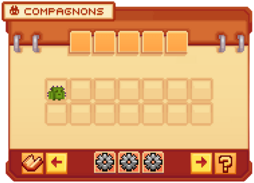
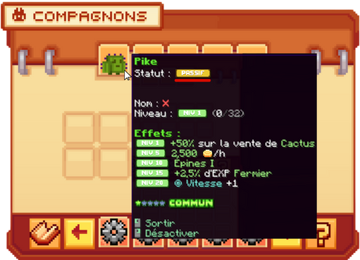
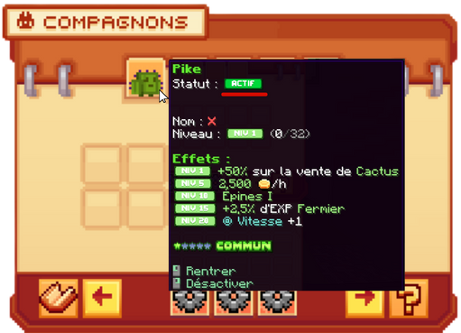
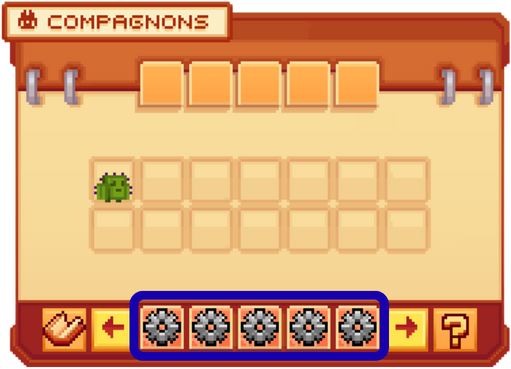

# 🥚 Les Compagnons


**Tuto : Comment faire Évoluer son Personnage sur Evolucraft ?**


Les <mark style="color:green;">**compagnons**</mark> sont un système qui vous permet d’avoir un petit compagnon qui vous suit dans votre aventure, tout en offrant des <mark style="color:green;">**avantages**</mark> selon les <mark style="color:green;">**paliers**</mark> débloqués. Ces bonus peuvent être : un gain d’<mark style="color:green;">**argent**</mark> toutes les heures, un <mark style="color:green;">**boost d’XP**</mark> ou de <mark style="color:green;">**revenus sur vos métiers**</mark>, ainsi qu’un <mark style="color:green;">**meilleur bénéfice**</mark> lors de la vente d’objets dans le <mark style="color:green;">**`/shop`**</mark>.

Mais pour profiter de ces avantages… encore faut-il avoir un <mark style="color:green;">**compagnon**</mark> !

## 💠 Comment avoir un compagnon ? 🐾

Pour en obtenir un, plusieurs moyens sont possibles :

### 🔸 Les <mark style="color:green;">**caisses**</mark>
Lorsque vous ouvrez les <mark style="color:green;">**boxs Émeraude, Rubis, Évènements ou Jackpot**</mark>, vous avez une petite chance d’obtenir un <mark style="color:green;">**œuf de familier**</mark>.  
Si vous avez cette chance, il vous suffit de faire un **clic droit** avec l’œuf en main pour qu’un compagnon apparaisse dans votre inventaire.

### 🔸 Les <mark style="color:green;">**paliers de votes**</mark>
En votant régulièrement pour le serveur, vous débloquez des <mark style="color:green;">**récompenses de paliers**</mark>.  
Au palier 7 (atteint après <mark style="color:green;">**50 votes**</mark> dans la semaine), vous recevez un <mark style="color:green;">**œuf de familier**</mark> équivalent à celui de la <mark style="color:green;">**box Émeraude**</mark>.

### 🔸 L’<mark style="color:green;">**hôtel de vente**</mark>
Vous pouvez aussi acheter des compagnons directement dans l’<mark style="color:green;">**hôtel de vente**</mark>, en échange d’<mark style="color:green;">**argent ingame**</mark>.  
Cependant, leur disponibilité dépend de ce que les autres joueurs proposent à la vente.

## 💠 Équiper un compagnon 🎒

Équiper un compagnon permet d’activer ses <mark style="color:green;">**avantages**</mark>, à condition que son <mark style="color:green;">**palier**</mark> soit débloqué.  

### 🔸 Étape 1 :
Tenez votre <mark style="color:green;">**compagnon**</mark> en main et effectuez un **clic droit**.

### 🔸 Étape 2 :
Faites la commande <mark style="color:green;">**`/pets`**</mark>. Votre compagnon apparaîtra alors dans l’interface.
<figure><figcaption>
<strong>Aperçu du <mark style="color:green;">/pets</mark></strong>
</figcaption></figure>

### 🔸 Étape 3 :
Cliquez gauche sur votre compagnon pour l’équiper en mode **PASSIF**.
<figure><figcaption>
<strong>Compagnon en mode <mark style="color:green;">PASSIF</mark></strong>
</figcaption></figure>


🔍 REMARQUE : Pour désactiver un compagnon, refaites un clic droit dans le <mark style="color:green;">`/pets`</mark> pour le passer en mode **Inactif**.


## 💠 Améliorer un compagnon 🆙
Pour améliorer un compagnon et débloquer de nouveaux <mark style="color:green;">**avantages**</mark>, vous devez lui donner des <mark style="color:green;">**bonbons**</mark>.

### 🔸 Étape 1 :
En prenant en compte que votre pet est déjà équiper, faites un cliquez gauche sur votre compagnon pour le mettre en mode **ACTIF**. Cette manipulation le fera apparaitre à coté de vous.
<figure><figcaption>
<strong>Compagnon en mode <mark style="color:green;">ACTIF</mark></strong>
</figcaption></figure>

### 🔸 Étape 2 :
Donnez lui [<mark style="color:green;">des bonbons 🍬</mark>](https://wiki.evolucraft.fr/le-gameplay/les-compagnons/bonbon-tableau) en faisant un clique droit sur votre compagnon.

Pour plus d'informations sur les bonbons, nous vous invitons à consulter la page concernant [<mark style="color:green;">Les Bonbons 🍬</mark>](https://wiki.evolucraft.fr/le-gameplay/les-compagnons/bonbon-tableau)


🔍 REMARQUE : Plus votre compagnon monte en niveau, plus il demandera d’<mark style="color:green;">**XP**</mark> pour progresser.


## 💠 Créer une sauvegarde 💾

Les <mark style="color:green;">**sauvegardes**</mark>, symbolisées par un engrenage dans le <mark style="color:green;">`/pets`</mark>, permettent de stocker vos compositions de compagnons.  
Vous pouvez enregistrer jusqu’à <mark style="color:green;">**5 sauvegardes**</mark>, ce qui facilite le passage d’une composition **farm** à une composition **donjon**.

<figure><figcaption>
<strong>Aperçu des <mark style="color:green;">sauvegardes</mark></strong>
</figcaption></figure>


🔍 REMARQUE : Si l’un des compagnons de votre composition n’existe plus, la sauvegarde s’appliquera sans lui, ou un message d’erreur vous préviendra.


## 💠 La liste des compagnons 🧸

<figure><figcaption>
<strong>Aperçu du </strong><mark style="color:green;"><strong><code>/pokedex</code></strong></mark>
</figcaption></figure>

Il existe au total <mark style="color:green;">**92 compagnons différents**</mark>, visibles via la commande <mark style="color:green;">**`/pokedex`**</mark>.  
Ils sont classés par <mark style="color:green;">**rareté**</mark> :

* [<mark style="color:green;">**20 compagnons Communs 🐸**</mark>](https://wiki.evolucraft.fr/le-gameplay/les-compagnons/pet-communs) dont 6 shinys.  
* [<mark style="color:yellow;">**20 compagnons Rares 🐤**</mark>](https://wiki.evolucraft.fr/le-gameplay/les-compagnons/pet-rare) dont 5 shinys.  
* [<mark style="color:blue;">**30 compagnons Épiques 🐟**</mark>](https://wiki.evolucraft.fr/le-gameplay/les-compagnons/pet-epique) dont 4 shinys.  
* [<mark style="color:purple;">**16 compagnons Légendaires 👾**</mark>](https://wiki.evolucraft.fr/le-gameplay/les-compagnons/pet-legendaire) dont 2 shinys.  
* [<mark style="color:red;">**6 compagnons Mythiques 🦞**</mark>](https://wiki.evolucraft.fr/le-gameplay/les-compagnons/pet-mythique) dont 1 shiny.  


Maintenant que vous savez tout sur les <mark style="color:green;">**compagnons**</mark>, tentez d’en obtenir le plus possible et exploitez-les au maximum dans vos aventures sur Evolucraft !


