# 🐸 Compagnon Commun

## 💠 La liste des compagnons communs

| <mark style="color:green;">**Nom 🏷️**</mark>        | <mark style="color:green;">**Image de l'item 🖼️**</mark>                                                                                                                                                                                                                       | <mark style="color:green;">**Avantages 💪**</mark>                                                                                                                                                                                                                                                                                                                                                                                                                                                                                                                                                                                                                                                                                                                                                                                                                                                         | <mark style="color:green;">**Obtentions 🔍**</mark>                                             |
| ---------------------------------------------------- | ------------------------------------------------------------------------------------------------------------------------------------------------------------------------------------------------------------------------------------------------------------------------------- | ---------------------------------------------------------------------------------------------------------------------------------------------------------------------------------------------------------------------------------------------------------------------------------------------------------------------------------------------------------------------------------------------------------------------------------------------------------------------------------------------------------------------------------------------------------------------------------------------------------------------------------------------------------------------------------------------------------------------------------------------------------------------------------------------------------------------------------------------------------------------------------------------------------- | ----------------------------------------------------------------------------------------------- |
| <mark style="color:green;">**Meow**</mark>           | 
<figure>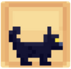<figcaption></figcaption></figure>

<figure><figcaption></figcaption></figure>
       | 
<mark style="color:green;"><strong>Niveau 1</strong></mark> → <mark style="color:green;"><strong>+ 1.000</strong></mark> 💰/h

<mark style="color:green;"><strong>Niveau 5</strong></mark> → <mark style="color:green;"><strong>Vitesse 🏃‍♂️</strong></mark> +2

<mark style="color:green;"><strong>Niveau 10</strong></mark> → <mark style="color:green;"><strong>Vision Nocturne</strong></mark>

<mark style="color:green;"><strong>Niveau 15</strong></mark> → <mark style="color:green;"><strong>+ 1.500</strong></mark> 💰/h

<mark style="color:green;"><strong>Niveau 20</strong></mark> → <mark style="color:green;"><strong>+2,5%</strong></mark> d'EXP <mark style="color:green;"><strong>Chasseur 🗡️</strong></mark>
                                                                                                                                              | 
* Œuf de familier (Caisse Émeraude ✳️)

* Œuf de familier Commun (Palier 7 de vote)
 |
| <mark style="color:green;">**Duck**</mark>           | 
<figure>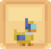<figcaption></figcaption></figure>

<figure>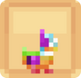<figcaption></figcaption></figure>
       | 
<mark style="color:green;"><strong>Niv. 1</strong></mark> → <mark style="color:green;"><strong>Respiration</strong></mark>

<mark style="color:green;"><strong>Niv. 5</strong></mark> → <mark style="color:green;"><strong>+ 1.250</strong></mark> 💰/h

<mark style="color:green;"><strong>Niv. 10</strong></mark> → <mark style="color:green;"><strong>Grâce du Dauphin</strong></mark>

<mark style="color:green;"><strong>Niv. 15</strong></mark> → <mark style="color:green;"><strong>💀 Dégâts Critiques</strong></mark> +1

<mark style="color:green;"><strong>Niv. 20</strong></mark> → <mark style="color:green;"><strong>+2,5%</strong></mark> d'EXP <mark style="color:green;"><strong>Pêcheur 🎣</strong></mark>
                                                                                                                                                    | 
* Œuf de familier (Caisse Émeraude ✳️)

* Œuf de familier Commun (Palier 7 de vote)
 |
| <mark style="color:green;">**Lapinou**</mark>        | 
<figure>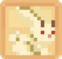<figcaption></figcaption></figure>

<figure><figcaption></figcaption></figure>
 | 
<mark style="color:green;"><strong>Niv. 1</strong></mark> → <mark style="color:green;"><strong>🧪 Mana</strong></mark> +10

<mark style="color:green;"><strong>Niv. 5</strong></mark> → <mark style="color:green;"><strong>+2,5%</strong></mark> d'EXP <mark style="color:green;"><strong>ForgeMage 📖</strong></mark>

<mark style="color:green;"><strong>Niv. 10</strong></mark> → <mark style="color:green;"><strong>+ 1.000</strong></mark> 💰/h

<mark style="color:green;"><strong>Niv. 15</strong></mark> → <mark style="color:green;"><strong>+50%</strong></mark> sur la vente de <mark style="color:green;"><strong>Pattes de lapin</strong></mark> au /shop

<mark style="color:green;"><strong>Niv. 20</strong></mark> → <mark style="color:green;"><strong>+ 1.000</strong></mark> 💰/h
                                                                            | 
* Œuf de familier (Caisse Émeraude ✳️)

* Œuf de familier Commun (Palier 7 de vote)
 |
| <mark style="color:green;">**Nugget**</mark>         | 
<figure><figcaption></figcaption></figure>

<figure><figcaption></figcaption></figure>
   | 
<mark style="color:green;"><strong>Niv. 1</strong></mark> → <mark style="color:green;"><strong>❤️ Vie</strong></mark> +5

<mark style="color:green;"><strong>Niv. 5</strong></mark> → <mark style="color:green;"><strong>+ 1.000</strong></mark> 💰/h

<mark style="color:green;"><strong>Niv. 10</strong></mark> → <mark style="color:green;"><strong>+2,5%</strong></mark> d'EXP <mark style="color:green;"><strong>Bûcheron 🪚</strong></mark>

<mark style="color:green;"><strong>Niv. 15</strong></mark> → <mark style="color:green;"><strong>+ 2.000</strong></mark> 💰/h

<mark style="color:green;"><strong>Niv. 20</strong></mark> → <mark style="color:green;"><strong>🛡️ Défense</strong></mark> +2
                                                                                                                                                                 | 
* Œuf de familier (Caisse Émeraude ✳️)

* Œuf de familier Commun (Palier 7 de vote)
 |
| <mark style="color:green;">**Pike**</mark>           | 
<figure>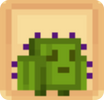<figcaption></figcaption></figure>

<figure>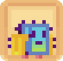<figcaption></figcaption></figure>
       | 
<mark style="color:green;"><strong>Niv. 1</strong></mark> → <mark style="color:green;"><strong>+50%</strong></mark> sur la vente de <mark style="color:green;"><strong>Cactus</strong></mark> au /shop

<mark style="color:green;"><strong>Niv. 5</strong></mark> → <mark style="color:green;"><strong>+ 2.500</strong></mark> 💰/h

<mark style="color:green;"><strong>Niv. 10</strong></mark> → <mark style="color:green;"><strong>Épines 1</strong></mark>

<mark style="color:green;"><strong>Niv. 15</strong></mark> → <mark style="color:green;"><strong>+2,5%</strong></mark> d'EXP <mark style="color:green;"><strong>Fermier 🌾</strong></mark>

<mark style="color:green;"><strong>Niv. 20</strong></mark> → <mark style="color:green;"><strong>🏃‍♂️ Vitesse</strong></mark> +1
                                                                                      | 
* Œuf de familier (Caisse Émeraude ✳️)

* Œuf de familier Commun (Palier 7 de vote)
 |
| <mark style="color:green;">**Surt**</mark>           | 
<figure>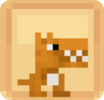<figcaption></figcaption></figure>

<figure>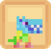<figcaption></figcaption></figure>
       | 
<mark style="color:green;"><strong>Niv. 1</strong></mark> → <mark style="color:green;"><strong>+ 2.000</strong></mark> 💰/h

<mark style="color:green;"><strong>Niv. 5</strong></mark> → <mark style="color:green;"><strong>+25%</strong></mark> sur la vente de <mark style="color:green;"><strong>Chair putréfiées</strong></mark> au /shop

<mark style="color:green;"><strong>Niv. 10</strong></mark> → <mark style="color:green;"><strong>+10%</strong></mark> de chance <mark style="color:green;"><strong>d'enflammer les ennemies</strong></mark>

<mark style="color:green;"><strong>Niv. 15</strong></mark> → <mark style="color:green;"><strong>+2,5%</strong></mark> d'EXP <mark style="color:green;"><strong>Mineur ⛏️</strong></mark>

<mark style="color:green;"><strong>Niv. 20</strong></mark> → <mark style="color:green;"><strong>Célérité 1</strong></mark>
 | 
* Œuf de familier (Caisse Émeraude ✳️)

* Œuf de familier Commun (Palier 7 de vote)
 |
| <mark style="color:green;">**Potato**</mark>         | 
<figure>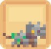<figcaption></figcaption></figure>
                                                                                                                                            | 
<mark style="color:green;"><strong>Niv. 1</strong></mark> → <mark style="color:green;"><strong>+10%</strong></mark> sur la vente de <mark style="color:green;"><strong>Bettrave</strong></mark> chez Jimmy

<mark style="color:green;"><strong>Niv. 5</strong></mark> → <mark style="color:green;"><strong>+ 1.000</strong></mark> 💰/h

<mark style="color:green;"><strong>Niv. 10</strong></mark> → <mark style="color:green;"><strong>Monture</strong></mark> (Terrestre)

<mark style="color:green;"><strong>Niv. 15</strong></mark> → <mark style="color:green;"><strong>🧪 Mana</strong></mark> +15

<mark style="color:green;"><strong>Niv. 20</strong></mark> → <mark style="color:green;"><strong>Célérité 1</strong></mark>
                                                                                                                                           | \* Œuf de famillier (Caisse Draconique 🐉)                                                      |
| <mark style="color:green;">**Coka**</mark>           | 
<figure>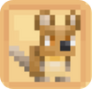<figcaption></figcaption></figure>
                                                                                                                                              | 
<mark style="color:green;"><strong>Niv. 1</strong></mark> → <mark style="color:green;"><strong>+ 1.500</strong></mark> 💰/h

<mark style="color:green;"><strong>Niv. 5</strong></mark> → <mark style="color:green;"><strong>Vision Nocturne</strong></mark>

<mark style="color:green;"><strong>Niv. 10</strong></mark> → <mark style="color:green;"><strong>🧪 Mana</strong></mark> +20

<mark style="color:green;"><strong>Niv. 15</strong></mark> → <mark style="color:green;"><strong>+ 1.500</strong></mark> 💰/h

<mark style="color:green;"><strong>Niv. 20</strong></mark> → <mark style="color:green;"><strong>+2,5%</strong></mark> d'EXP <mark style="color:green;"><strong>ForgeMage 📖</strong></mark>
                                                                                                                                                             | \* Œuf de famillier (Caisse aux Trésors 🏴‍☠️)                                                  |
| <mark style="color:green;">**The Reaper**</mark>     | 
<figure><figcaption></figcaption></figure>
                                                                                                                                         | 
<mark style="color:green;"><strong>Niv. 1</strong></mark> → <mark style="color:green;"><strong>+5%</strong></mark> sur la vente de <mark style="color:green;"><strong>Citrouille</strong></mark> au /shop

<mark style="color:green;"><strong>Niv. 5</strong></mark> → <mark style="color:green;"><strong>+ 1.000</strong></mark> 💰/h

<mark style="color:green;"><strong>Niv. 10</strong></mark> → <mark style="color:green;"><strong>🛡️ Défense</strong></mark> +2

<mark style="color:green;"><strong>Niv. 15</strong></mark> → <mark style="color:green;"><strong>+ 1.000</strong></mark> 💰/h

<mark style="color:green;"><strong>Niv. 20</strong></mark> → <mark style="color:green;"><strong>💕 Régénération</strong></mark> +1
                                                                                                                                        | \* Œuf de famillier (Caisse Halloween 🎃)                                                       |
| <mark style="color:green;">**Olaf**</mark>           | 
<figure><figcaption></figcaption></figure>
                                                                                                                                              | 
<mark style="color:green;"><strong>Niv. 1</strong></mark> → <mark style="color:green;"><strong>+5%</strong></mark> sur la vente de <mark style="color:green;"><strong>Diorite</strong></mark> au /shop

<mark style="color:green;"><strong>Niv. 5</strong></mark> → <mark style="color:green;"><strong>+ 1.000</strong></mark> 💰/h

<mark style="color:green;"><strong>Niv. 10</strong></mark> → <mark style="color:green;"><strong>+ 1.500</strong></mark> 💰/h

<mark style="color:green;"><strong>Niv. 15</strong></mark> → <mark style="color:green;"><strong>❤️ Vie</strong></mark> +7

<mark style="color:green;"><strong>Niv. 20</strong></mark> → <mark style="color:green;"><strong>+ 1.500</strong></mark> 💰/h
                                                                                                                                                      | \* Œuf de famillier (Caisse Givrée ❄️)                                                          |
| <mark style="color:green;">**Chimère**</mark>        | 
<figure><figcaption></figcaption></figure>
                                                                                                                                           | 
<mark style="color:green;"><strong>Niv. 1</strong></mark> → <mark style="color:green;"><strong>+5%</strong></mark> sur la vente de <mark style="color:green;"><strong>Peau de Lapin</strong></mark> au /shop

<mark style="color:green;"><strong>Niv. 5</strong></mark> → <mark style="color:green;"><strong>+ 1.000</strong></mark> 💰/h

<mark style="color:green;"><strong>Niv. 10</strong></mark> → <mark style="color:green;"><strong>+ 1.500</strong></mark> 💰/h

<mark style="color:green;"><strong>Niv. 15</strong></mark> → <mark style="color:green;"><strong>🥊 Chance de Critique</strong></mark> +4

<mark style="color:green;"><strong>Niv. 20</strong></mark> → <mark style="color:green;"><strong>+2,5%</strong></mark> d'EXP <mark style="color:green;"><strong>Chasseur 🗡️</strong></mark>
                                                                  | \* Œuf de famillier (Caisse Saint Valentin 💕)                                                  |
| <mark style="color:green;">**Cot-Cot**</mark>        | 
<figure><figcaption></figcaption></figure>
                                                                                                                                           | 
<mark style="color:green;"><strong>Niv. 1</strong></mark> → <mark style="color:green;"><strong>+5%</strong></mark> sur la vente de <mark style="color:green;"><strong>Poulet Cru</strong></mark> au /shop

<mark style="color:green;"><strong>Niv. 5</strong></mark> → <mark style="color:green;"><strong>+ 1.500</strong></mark> 💰/h

<mark style="color:green;"><strong>Niv. 10</strong></mark> → <mark style="color:green;"><strong>🏃‍♂️ Vitesse</strong></mark> +3

<mark style="color:green;"><strong>Niv. 15</strong></mark> → <mark style="color:green;"><strong>+ 2.500</strong></mark> 💰/h

<mark style="color:green;"><strong>Niv. 20</strong></mark> → <mark style="color:green;"><strong>+2,5%</strong></mark> d'EXP <mark style="color:green;"><strong>Fermier 🌾</strong></mark>
                                                                               | \* Œuf de famillier (Caisse Pâques 🥚)                                                          |
| <mark style="color:green;">**Petite-Feuille**</mark> | 
<figure>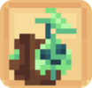<figcaption></figcaption></figure>
                                                                                                                                    | 
<mark style="color:green;"><strong>Niv. 1</strong></mark> → <mark style="color:green;"><strong>+5%</strong></mark> sur la vente de <mark style="color:green;"><strong>Liane</strong></mark> au /shop

<mark style="color:green;"><strong>Niv. 5</strong></mark> → <mark style="color:green;"><strong>+ 1.250</strong></mark> 💰/h

<mark style="color:green;"><strong>Niv. 10</strong></mark> → <mark style="color:green;"><strong>🛡️ Défense</strong></mark> +3

<mark style="color:green;"><strong>Niv. 15</strong></mark> → <mark style="color:green;"><strong>+ 2.250</strong></mark> 💰/h

<mark style="color:green;"><strong>Niv. 20</strong></mark> → <mark style="color:green;"><strong>+2,5%</strong></mark> d'EXP <mark style="color:green;"><strong>Mineur ⛏️</strong></mark>
                                                                                       | \* Œuf de famillier (Caisse Summer 🏖️)                                                         |
| <mark style="color:green;">**Petit-Pied**</mark>     | 
<figure><figcaption></figcaption></figure>
                                                                                                                                       | 
<mark style="color:green;"><strong>Niv. 1</strong></mark> → <mark style="color:green;"><strong>+5%</strong></mark> sur la vente de <mark style="color:green;"><strong>Pomme de Terre</strong></mark> au /shop

<mark style="color:green;"><strong>Niv. 5</strong></mark> → <mark style="color:green;"><strong>🛡️ Défense</strong></mark> +2

<mark style="color:green;"><strong>Niv. 10</strong></mark> → <mark style="color:green;"><strong>+ 1.250</strong></mark> 💰/h

<mark style="color:green;"><strong>Niv. 15</strong></mark> → <mark style="color:green;"><strong>+ 2.000</strong></mark> 💰/h

<mark style="color:green;"><strong>Niv. 20</strong></mark> → <mark style="color:green;"><strong>💕 Régénération</strong></mark> +1
                                                                                                                                   | \* Œuf de famillier (Caisse Antique 🗿)                                                         |
