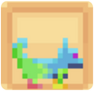
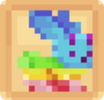
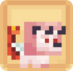

# Les compagnons COMMUNS 🐸

## 💠 La liste des compagnons communs

<table border="1" cellspacing="0" cellpadding="6">
  <tr>
    <td><strong>Nom 🏷️</strong></td>
    <td><strong>Image de l'item 🖼️</strong></td>
    <td><strong>Aventages 💪</strong></td>
    <td><strong>Obtentions 🔍</strong></td>
  </tr>
  <tr>
    <td align="center"><strong>Meow</strong></td>
    <td>
      <figure>
        
      </figure>
      <figure>
        
      </figure>
    </td>
    <td>
      
<mark style="color:green;"><strong>Niveau 1</strong></mark> → <mark style="color:green;"><strong>+ 1.000</strong></mark> 💰/h

      
<mark style="color:green;"><strong>Niveau 5</strong></mark> → <mark style="color:green;"><strong>Vitesse 🏃‍♂️</strong></mark> +2

      
<mark style="color:green;"><strong>Niveau 10</strong></mark> → <mark style="color:green;"><strong>Vision Nocturne</strong></mark>

      
<mark style="color:green;"><strong>Niveau 15</strong></mark> → <mark style="color:green;"><strong>+ 1.500</strong></mark> 💰/h

      
<mark style="color:green;"><strong>Niveau 20</strong></mark> → <mark style="color:green;"><strong>+2,5%</strong></mark> d'EXP <mark style="color:green;"><strong>Chasseur 🗡️</strong></mark>

    </td>
    <td>
      
 * Œuf de familier Émeraude

      
 * Œuf de familier Commun

    </td>
  </tr>
  <tr>
    <td align="center"><strong>Duck</strong></td>
    <td>
      <figure>
        
      </figure>
      <figure>
        
      </figure>
    </td>
    <td>
      
<mark style="color:green;"><strong>Niv. 1</strong></mark> → <mark style="color:green;"><strong>Respiration</strong></mark>

      
<mark style="color:green;"><strong>Niv. 5</strong></mark> → <mark style="color:green;"><strong>+ 1.250</strong></mark> 💰/h

      
<mark style="color:green;"><strong>Niv. 10</strong></mark> → <mark style="color:green;"><strong>Grâce du Dauphin</strong></mark>

      
<mark style="color:green;"><strong>Niv. 15</strong></mark> → <mark style="color:green;"><strong>💀 Dégâts Critiques</strong></mark> +1

      
<mark style="color:green;"><strong>Niv. 20</strong></mark> → <mark style="color:green;"><strong>+2,5%</strong></mark> d'EXP <mark style="color:green;"><strong>Pêcheur 🎣</strong></mark>

    </td>
    <td>
      
 * Œuf de familier Émeraude

      
 * Œuf de familier Commun

    </td>
  </tr>
  <tr>
    <td align="center"><strong>Lapinou</strong></td>
    <td>
      <figure>
        
      </figure>
      <figure>
        
      </figure>
    </td>
    <td>
      
<mark style="color:green;"><strong>Niv. 1</strong></mark> → <mark style="color:green;"><strong>🧪 Mana</strong></mark> +10

      
<mark style="color:green;"><strong>Niv. 5</strong></mark> → <mark style="color:green;"><strong>+2,5%</strong></mark> d'EXP <mark style="color:green;"><strong>ForgeMage 📖</strong></mark>

      
<mark style="color:green;"><strong>Niv. 10</strong></mark> → <mark style="color:green;"><strong>+ 1.000</strong></mark> 💰/h

      
<mark style="color:green;"><strong>Niv. 15</strong></mark> → <mark style="color:green;"><strong>+50%</strong></mark> sur la vente de <mark style="color:green;"><strong>Pattes de lapin</strong></mark> au /shop

      
<mark style="color:green;"><strong>Niv. 20</strong></mark> → <mark style="color:green;"><strong>+ 1.000</strong></mark> 💰/h

    </td>
    <td>
      
 * Œuf de familier Émeraude

      
 * Œuf de familier Commun

    </td>
  </tr>
  <tr>
    <td align="center"><strong>Nugget</strong></td>
    <td>
      <figure>
        
      </figure>
      <figure>
        
      </figure>
    </td>
    <td>
      
<mark style="color:green;"><strong>Niv. 1</strong></mark> → <mark style="color:green;"><strong>❤️ Vie</strong></mark> +5

      
<mark style="color:green;"><strong>Niv. 5</strong></mark> → <mark style="color:green;"><strong>+ 1.000</strong></mark> 💰/h

      
<mark style="color:green;"><strong>Niv. 10</strong></mark> → <mark style="color:green;"><strong>+2,5%</strong></mark> d'EXP <mark style="color:green;"><strong>Bûcheron 🪚</strong></mark>

      
<mark style="color:green;"><strong>Niv. 15</strong></mark> → <mark style="color:green;"><strong>+ 2.000</strong></mark> 💰/h

      
<mark style="color:green;"><strong>Niv. 20</strong></mark> → <mark style="color:green;"><strong>🛡️ 
Défense</strong></mark> +2

    </td>
    <td>
      
 * Œuf de familier Émeraude

      
 * Œuf de familier Commun

    </td>
  </tr>
  <tr>
    <td align="center"><strong>Pike</strong></td>
    <td>
      <figure>
        
      </figure>
      <figure>
        
      </figure>
    </td>
    <td>
      
<mark style="color:green;"><strong>Niv. 1</strong></mark> → <mark style="color:green;"><strong>+50%</strong></mark> sur la vente de <mark style="color:green;"><strong>Cactus</strong></mark> au /shop

      
<mark style="color:green;"><strong>Niv. 5</strong></mark> → <mark style="color:green;"><strong>+ 2.500</strong></mark> 💰/h

      
<mark style="color:green;"><strong>Niv. 10</strong></mark> → <mark style="color:green;"><strong>Épines 1</strong></mark>

      
<mark style="color:green;"><strong>Niv. 15</strong></mark> → <mark style="color:green;"><strong>+2,5%</strong></mark> d'EXP <mark style="color:green;"><strong>Fermier 🌾</strong></mark>

      
<mark style="color:green;"><strong>Niv. 20</strong></mark> → <mark style="color:green;"><strong>🏃‍♂️ Vitesse</strong></mark> +1

    </td>
    <td>
      
 * Œuf de familier Émeraude

      
 * Œuf de familier Commun

    </td>
  </tr>
  <tr>
    <td align="center"><strong>Surt</strong></td>
    <td>
      <figure>
        
      </figure>
      <figure>
        
      </figure>
    </td>
    <td>
      
<mark style="color:green;"><strong>Niv. 1</strong></mark> → <mark style="color:green;"><strong>+ 2.000</strong></mark> 💰/h

      
<mark style="color:green;"><strong>Niv. 5</strong></mark> → <mark style="color:green;"><strong>+25%</strong></mark> sur la vente de <mark style="color:green;"><strong>Chair putréfiées</strong></mark> au /shop

      
<mark style="color:green;"><strong>Niv. 10</strong></mark> → <mark style="color:green;"><strong>+10%</strong></mark> de chance <mark style="color:green;"><strong>d'enflammer les ennemies</strong></mark>

      
<mark style="color:green;"><strong>Niv. 15</strong></mark> → <mark style="color:green;"><strong>+2,5%</strong></mark> d'EXP <mark style="color:green;"><strong>Mineur ⛏️</strong></mark>

      
<mark style="color:green;"><strong>Niv. 20</strong></mark> → <mark style="color:green;"><strong>Célérité 1</strong></mark>

    </td>
    <td>
      
 * Œuf de familier Émeraude

      
 * Œuf de familier Commun

    </td>
  </tr>
  <tr>
    <td align="center"><strong>Potato</strong></td>
    <td>
      <figure>
        
      </figure>
    </td>
    <td>
      
<mark style="color:green;"><strong>Niv. 1</strong></mark> → <mark style="color:green;"><strong>+10%</strong></mark> sur la vente de <mark style="color:green;"><strong>Bettrave</strong></mark> chez Jimmy

      
<mark style="color:green;"><strong>Niv. 5</strong></mark> → <mark style="color:green;"><strong>+ 1.000</strong></mark> 💰/h

      
<mark style="color:green;"><strong>Niv. 10</strong></mark> → <mark style="color:green;"><strong>Monture</strong></mark> (Terrestre)</mark>

      
<mark style="color:green;"><strong>Niv. 15</strong></mark> → <mark style="color:green;"><strong>🧪 Mana</strong></mark> +15

      
<mark style="color:green;"><strong>Niv. 20</strong></mark> → <mark style="color:green;"><strong>Célérité 1</strong></mark>

    </td>
    <td>
      
 * Œuf de famillier (Ciasse Draconique 🐉)

    </td>
  </tr>
  <tr>
    <td align="center"><strong>Coka</strong></td>
    <td>
      <figure>
        
      </figure>
    </td>
    <td>
      
<mark style="color:green;"><strong>Niv. 1</strong></mark> → <mark style="color:green;"><strong>+ 1.500</strong></mark> 💰/h

      
<mark style="color:green;"><strong>Niv. 5</strong></mark> → <mark style="color:green;"><strong>Vision Nocturne</strong></mark>

      
<mark style="color:green;"><strong>Niv. 10</strong></mark> → <mark style="color:green;"><strong>🧪 Mana</strong></mark> +20

      
<mark style="color:green;"><strong>Niv. 15</strong></mark> → <mark style="color:green;"><strong>+ 1.500</strong></mark> 💰/h

      
<mark style="color:green;"><strong>Niv. 20</strong></mark> → <mark style="color:green;"><strong>+2,5%</strong></mark> d'EXP <mark style="color:green;"><strong>ForgeMage 📖</strong></mark>

    </td>
    <td>
      
 * Œuf de famillier (Caisse aux Trésors 🏴‍☠️)

    </td>
  </tr>
  <tr>
    <td align="center"><strong>The Reaper</strong></td>
    <td>
      <figure>
        
      </figure>
    </td>
    <td>
      
<mark style="color:green;"><strong>Niv. 1</strong></mark> → <mark style="color:green;"><strong>+5%</strong></mark> sur la vente de <mark style="color:green;"><strong>Citrouille</strong></mark> au /shop

      
<mark style="color:green;"><strong>Niv. 5</strong></mark> → <mark style="color:green;"><strong>+ 1.000</strong></mark> 💰/h

      
<mark style="color:green;"><strong>Niv. 10</strong></mark> → <mark style="color:green;"><strong>🛡️ Défense</strong></mark> +2

      
<mark style="color:green;"><strong>Niv. 15</strong></mark> → <mark style="color:green;"><strong>+ 1.000</strong></mark> 💰/h

      
<mark style="color:green;"><strong>Niv. 20</strong></mark> → <mark style="color:green;"><strong>💕 Régénération</strong></mark> +1

    </td>
    <td>
      
 * Œuf de famillier (Caisse Halloween 🎃)

    </td>
  </tr>
  <tr>
    <td align="center"><strong>Olaf</strong></td>
    <td>
      <figure>
        
      </figure>
    </td>
    <td>
      
<mark style="color:green;"><strong>Niv. 1</strong></mark> → <mark style="color:green;"><strong>+5%</strong></mark> sur la vente de <mark style="color:green;"><strong>Diorite</strong></mark> au /shop

      
<mark style="color:green;"><strong>Niv. 5</strong></mark> → <mark style="color:green;"><strong>+ 1.000</strong></mark> 💰/h

      
<mark style="color:green;"><strong>Niv. 10</strong></mark> → <mark style="color:green;"><strong>+ 1.500</strong></mark> 💰/h

      
<mark style="color:green;"><strong>Niv. 15</strong></mark> → <mark style="color:green;"><strong>❤️ Vie</strong></mark> +7

      
<mark style="color:green;"><strong>Niv. 20</strong></mark> → <mark style="color:green;"><strong>+ 1.500</strong></mark> 💰/h

    </td>
    <td>
      
 * Œuf de famillier (Caisse Givrée ❄️)

    </td>
  </tr>
  <tr>
    <td align="center"><strong>Chimère</strong></td>
    <td>
      <figure>
        
      </figure>
    </td>
    <td>
      
<mark style="color:green;"><strong>Niv. 1</strong></mark> → <mark style="color:green;"><strong>+5%</strong></mark> sur la vente de <mark style="color:green;"><strong>Peau de  Lapin</strong></mark> au /shop

      
<mark style="color:green;"><strong>Niv. 5</strong></mark> → <mark style="color:green;"><strong>+ 1.000</strong></mark> 💰/h

      
<mark style="color:green;"><strong>Niv. 10</strong></mark> → <mark style="color:green;"><strong>+ 1.500</strong></mark> 💰/h

      
<mark style="color:green;"><strong>Niv. 15</strong></mark> → <mark style="color:green;"><strong>🥊 Chance de Critique</strong></mark> +4

      
<mark style="color:green;"><strong>Niv. 20</strong></mark> → <mark style="color:green;"><strong>+2,5%</strong></mark> d'EXP <mark style="color:green;"><strong>Chasseur 🗡️</strong></mark>

    </td>
    <td>
      
 * Œuf de famillier (Caisse Saint Valentin 💕)

    </td>
  </tr>
  <tr>
    <td align="center"><strong>Cot-Cot</strong></td>
    <td>
      <figure>
        
      </figure>
    </td>
    <td>
      
<mark style="color:green;"><strong>Niv. 1</strong></mark> → <mark style="color:green;"><strong>+5%</strong></mark> sur la vente de <mark style="color:green;"><strong>Poulet Cru</strong></mark> au /shop

      
<mark style="color:green;"><strong>Niv. 5</strong></mark> → <mark style="color:green;"><strong>+ 1.500</strong></mark> 💰/h

      
<mark style="color:green;"><strong>Niv. 10</strong></mark> → <mark style="color:green;"><strong>🏃‍♂️ Vitesse</strong></mark> +3

      
<mark style="color:green;"><strong>Niv. 15</strong></mark> → <mark style="color:green;"><strong>+ 2.500</strong></mark> 💰/h

      
<mark style="color:green;"><strong>Niv. 20</strong></mark> → <mark style="color:green;"><strong>+2,5%</strong></mark> d'EXP <mark style="color:green;"><strong>Fermier 🌾</strong></mark>

    </td>
    <td>
      
 * Œuf de famillier (Caisse Pâques 🥚)

    </td>
  </tr>
  <tr>
    <td align="center"><strong>Petite-Feuille</strong></td>
    <td>
      <figure>
        
      </figure>
    </td>
    <td>
      
<mark style="color:green;"><strong>Niv. 1</strong></mark> → <mark style="color:green;"><strong>+5%</strong></mark> sur la vente de <mark style="color:green;"><strong>Liane</strong></mark> au /shop

      
<mark style="color:green;"><strong>Niv. 5</strong></mark> → <mark style="color:green;"><strong>+ 1.250</strong></mark> 💰/h

      
<mark style="color:green;"><strong>Niv. 10</strong></mark> → <mark style="color:green;"><strong>🛡️ Défense</strong></mark> +3

      
<mark style="color:green;"><strong>Niv. 15</strong></mark> → <mark style="color:green;"><strong>+ 2.250</strong></mark> 💰/h

      
<mark style="color:green;"><strong>Niv. 20</strong></mark> → <mark style="color:green;"><strong>+2,5%</strong></mark> d'EXP <mark style="color:green;"><strong>Mineur ⛏️</strong></mark>

    </td>
    <td>
      
 * Œuf de famillier (Caisse Summer 🏖️)

    </td>
  </tr>
</table>
