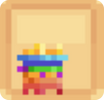
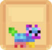
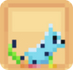
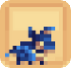
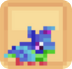
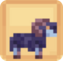
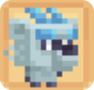

# Les compagnons RARES 🐤

## 💠 La liste des compagnons RARES

<table border="1" cellspacing="0" cellpadding="6">
  <tr>
    <td><mark style="color:yellow;"><strong>Nom 🏷️</strong></mark></td>
    <td><mark style="color:yellow;"><strong>Image de l'item 🖼️</strong></mark></td>
    <td><mark style="color:yellow;"><strong>Aventages 💪</strong></mark></td>
    <td><mark style="color:yellow;"><strong>Obtentions 🔍</strong></mark></td>
  </tr>
  <tr>
    <td align="center"><mark style="color:yellow;"><strong>Chaudroth</strong></mark></td>
    <td>
      <figure>
        
      </figure>
      <figure>
        
      </figure>
    </td>
    <td>
      
<mark style="color:yellow;"><strong>Niveau 1</strong></mark> → <mark style="color:yellow;"><strong>+ 2.500</strong></mark> 💰/h + <mark style="color:yellow;">Stockage</mark> coffre simple

      
<mark style="color:yellow;"><strong>Niveau 5</strong></mark> → <mark style="color:yellow;"><strong>+ 2.500</strong></mark> 💰/h
      
<mark style="color:yellow;"><strong>Niveau 10</strong></mark> → <mark style="color:yellow;"><strong>+ 2.500</strong></mark> 💰/h
      
<mark style="color:yellow;"><strong>Niveau 15</strong></mark> → <mark style="color:yellow;"><strong>+ 2.500</strong></mark> 💰/h + <mark style="color:yellow;">Stockage</mark> double coffre

      
<mark style="color:yellow;"><strong>Niveau 20</strong></mark> → <mark style="color:yellow;"><strong>+5%</strong></mark> d'EXP <mark style="color:yellow;"><strong>ForgeMage 📖</strong></mark>

    </td>
    <td>
      
 * Œuf de familier (Caisse Émeraude ✳️)

      
 * Œuf de familier (Caisse Rubis 🔻)

    </td>
  </tr>
  <tr>
    <td align="center"><mark style="color:yellow;"><strong>Hedwig</strong></mark></td>
    <td>
      <figure>
        
      </figure>
      <figure>
        
      </figure>
    </td>
    <td>
      
<mark style="color:yellow;"><strong>Niv. 1</strong></mark> → <mark style="color:yellow;"><strong>💕 Régénération</strong></mark> +3

      
<mark style="color:yellow;"><strong>Niv. 5</strong></mark> → <mark style="color:yellow;"><strong>+ 3.500</strong></mark> 💰/h

      
<mark style="color:yellow;"><strong>Niv. 10</strong></mark> → Réduction des<mark style="color:yellow;"><strong>Dégats de Chute</strong></mark> de moitié

      
<mark style="color:yellow;"><strong>Niv. 15</strong></mark> → <mark style="color:yellow;"><strong>🗡️ Force</strong></mark> +3

      
<mark style="color:yellow;"><strong>Niv. 20</strong></mark> → <mark style="color:yellow;"><strong>+5%</strong></mark> d'EXP <mark style="color:yellow;"><strong>Fermier 🌾</strong></mark>

    </td>
    <td>
      
 * Œuf de familier (Caisse Émeraude ✳️)

      
 * Œuf de familier (Caisse Rubis 🔻)

    </td>
  </tr>
  <tr>
    <td align="center"><mark style="color:yellow;"><strong>Mayline</strong></mark></td>
    <td>
      <figure>
        
      </figure>
      <figure>
        
      </figure>
    </td>
    <td>
      
<mark style="color:yellow;"><strong>Niv. 1</strong></mark> → <mark style="color:yellow;"><strong>+ 2.500</strong></mark> 💰/h

      
<mark style="color:yellow;"><strong>Niv. 5</strong></mark> → <mark style="color:yellow;"><strong>+15%</strong></mark> sur la vente de <mark style="color:yellow;"><strong>Carottes</strong></mark> chez Jimmy

      
<mark style="color:yellow;"><strong>Niv. 10</strong></mark> → <mark style="color:yellow;"><strong>+ 4.000</strong></mark> 💰/h

      
<mark style="color:yellow;"><strong>Niv. 15</strong></mark> → <mark style="color:yellow;"><strong>+15%</strong></mark> sur la vente de <mark style="color:yellow;"><strong>Patates</strong></mark> chez Jimmy

      
<mark style="color:yellow;"><strong>Niv. 20</strong></mark> → <mark style="color:yellow;"><strong>+5%</strong></mark> d'EXP <mark style="color:yellow;"><strong>Bûcheron 🪚</strong></mark>

    </td>
    <td>
      
 * Œuf de familier (Caisse Émeraude ✳️)

      
 * Œuf de familier (Caisse Rubis 🔻)

    </td>
  </tr>
  <tr>
    <td align="center"><mark style="color:yellow;"><strong>Shira</strong></mark></td>
    <td>
      <figure>
        
      </figure>
      <figure>
        
      </figure>
    </td>
    <td>
      
<mark style="color:yellow;"><strong>Niv. 1</strong></mark> → <mark style="color:yellow;"><strong>+10%</strong></mark> sur la vente de <mark style="color:yellow;"><strong>Bûches d'acaccia</strong></mark> au /shop

      
<mark style="color:yellow;"><strong>Niv. 5</strong></mark> → <mark style="color:yellow;"><strong>+ 2.500</strong></mark> 💰/h

      
<mark style="color:yellow;"><strong>Niv. 10</strong></mark> → <mark style="color:yellow;"><strong>Monture</strong></mark> (Terrestre)</mark>

      
<mark style="color:yellow;"><strong>Niv. 15</strong></mark> → <mark style="color:yellow;"><strong>+5%</strong></mark> d'EXP <mark style="color:yellow;"><strong>Chasseur 🗡️</strong></mark>

      
<mark style="color:yellow;"><strong>Niv. 20</strong></mark> → <mark style="color:yellow;"><strong>🐈 Dextérité</strong></mark> +2

    </td>
    <td>
      
 * Œuf de familier (Caisse Émeraude ✳️)

      
 * Œuf de familier (Caisse Rubis 🔻)

    </td>
  </tr>
  <tr>
    <td align="center"><mark style="color:yellow;"><strong>Viserion</strong></mark></td>
    <td>
      <figure>
        
      </figure>
      <figure>
        
      </figure>
    </td>
    <td>
      
<mark style="color:yellow;"><strong>Niv. 1</strong></mark> → <mark style="color:yellow;"><strong>❤️ Vie</strong></mark> +7

      
<mark style="color:yellow;"><strong>Niv. 5</strong></mark> → <mark style="color:yellow;"><strong>🧪 Mana</strong></mark> +20

      
<mark style="color:yellow;"><strong>Niv. 10</strong></mark> → <mark style="color:yellow;"><strong>Monture</strong></mark> (Aérienne)</mark>

      
<mark style="color:yellow;"><strong>Niv. 15</strong></mark> → <mark style="color:yellow;"><strong>+5%</strong></mark> d'EXP <mark style="color:yellow;"><strong>Pêcheur 🎣</strong></mark>

      
<mark style="color:yellow;"><strong>Niv. 20</strong></mark> → <mark style="color:yellow;"><strong>+ 4.000</strong></mark> 💰/h

    </td>
    <td>
      
 * Œuf de familier (Caisse Émeraude ✳️)

      
 * Œuf de familier (Caisse Rubis 🔻)

    </td>
  </tr>
  <tr>
    <td align="center"><mark style="color:yellow;"><strong>Goat</strong></mark></td>
    <td>
      <figure>
        
      </figure>
    </td>
    <td>
      
<mark style="color:yellow;"><strong>Niv. 1</strong></mark> → <mark style="color:yellow;"><strong>+ 3.000</strong></mark> 💰/h

      
<mark style="color:yellow;"><strong>Niv. 5</strong></mark> → <mark style="color:yellow;"><strong>🛡️ Défense</strong></mark> +4

      
<mark style="color:yellow;"><strong>Niv. 10</strong></mark> → <mark style="color:yellow;"><strong>Monture</strong></mark> (Terrestre)</mark>

      
<mark style="color:yellow;"><strong>Niv. 15</strong></mark> → <mark style="color:yellow;"><strong>+ 3.000</strong></mark> 💰/h

      
<mark style="color:yellow;"><strong>Niv. 20</strong></mark> → <mark style="color:yellow;"><strong>+5%</strong></mark> d'EXP <mark style="color:yellow;"><strong>Mineur ⛏️</strong></mark>

    </td>
    <td>
      
 * Œuf de familier (Caisse Émeraude ✳️)

      
 * Œuf de familier (Caisse Rubis 🔻)

    </td>
  </tr>
  <tr>
    <td align="center"><mark style="color:yellow;"><strong>Albi</strong></mark></td>
    <td>
      <figure>
        
      </figure>
    </td>
    <td>
      
<mark style="color:yellow;"><strong>Niv. 1</strong></mark> → <mark style="color:yellow;"><strong>+15%</strong></mark> sur la vente de <mark style="color:yellow;"><strong>Quartz</strong></mark> chez Jimmy

      
<mark style="color:yellow;"><strong>Niv. 5</strong></mark> → <mark style="color:yellow;"><strong>+ 3.000</strong></mark> 💰/h

      
<mark style="color:yellow;"><strong>Niv. 10</strong></mark> → <mark style="color:yellow;"><strong>Monture</strong></mark> (Aérienne)</mark>

      
<mark style="color:yellow;"><strong>Niv. 15</strong></mark> → <mark style="color:yellow;"><strong>+ 2.500</strong></mark> 💰/h

      
<mark style="color:yellow;"><strong>Niv. 20</strong></mark> → <mark style="color:yellow;"><strong>🏃‍♂️ Vitesse</strong></mark> +5

    </td>
    <td>
      
 * Œuf de famillier (Caisse Draconique 🐉)

    </td>
  </tr>
  <tr>
    <td align="center"><mark style="color:yellow;"><strong>Crusty</strong></mark></td>
    <td>
      <figure>
        
      </figure>
    </td>
    <td>
      
<mark style="color:yellow;"><strong>Niv. 1</strong></mark> → <mark style="color:yellow;"><strong>+ 2.500</strong></mark> 💰/h

      
<mark style="color:yellow;"><strong>Niv. 5</strong></mark> → <mark style="color:yellow;"><strong>🗡️ Force</strong></mark> +4

      
<mark style="color:yellow;"><strong>Niv. 10</strong></mark> → <mark style="color:yellow;"><strong>+15%</strong></mark> sur la vente d'<mark style="color:yellow;"><strong>Algues</strong></mark> au /shop

      
<mark style="color:yellow;"><strong>Niv. 15</strong></mark> → <mark style="color:yellow;"><strong>+ 4.000</strong></mark> 💰/h

      
<mark style="color:yellow;"><strong>Niv. 20</strong></mark> → <mark style="color:yellow;"><strong>+5%</strong></mark> d'EXP <mark style="color:yellow;"><strong>Pêcheur 🎣</strong></mark>

    </td>
    <td>
      
 * Œuf de famillier (Caisse Abyssal 🌊)

    </td>
  </tr>
  <tr>
    <td align="center"><mark style="color:yellow;"><strong>Rio</strong></mark></td>
    <td>
      <figure>
        
      </figure>
    </td>
    <td>
      
<mark style="color:yellow;"><strong>Niv. 1</strong></mark> → <mark style="color:yellow;"><strong>+5%</strong></mark> sur la vente de <mark style="color:yellow;"><strong>Blé</strong></mark> au /shop

      
<mark style="color:yellow;"><strong>Niv. 5</strong></mark> → <mark style="color:yellow;"><strong>+ 4.000</strong></mark> 💰/h

      
<mark style="color:yellow;"><strong>Niv. 10</strong></mark> → <mark style="color:yellow;"><strong>🏃‍♂️ Vitesse</strong></mark> +4

      
<mark style="color:yellow;"><strong>Niv. 15</strong></mark> → <mark style="color:yellow;"><strong>🛡️ Défense</strong></mark> +5

      
<mark style="color:yellow;"><strong>Niv. 20</strong></mark> → <mark style="color:yellow;"><strong>+5%</strong></mark> d'EXP <mark style="color:yellow;"><strong>Fermier 🌾</strong></mark>

    </td>
    <td>
      
 * Œuf de famillier (Caisse aux Trésors 🏴‍☠️)

    </td>
  </tr>
  <tr>
    <td align="center"><mark style="color:yellow;"><strong>Rudolphe</strong></mark></td>
    <td>
      <figure>
        
      </figure>
    </td>
    <td>
      
<mark style="color:yellow;"><strong>Niv. 1</strong></mark> → <mark style="color:yellow;"><strong>+15%</strong></mark> sur la vente de <mark style="color:yellow;"><strong>Carottes</strong></mark> au /shop

      
<mark style="color:yellow;"><strong>Niv. 5</strong></mark> → <mark style="color:yellow;"><strong>🏃‍♂️ Vitesse</strong></mark> +2

      
<mark style="color:yellow;"><strong>Niv. 10</strong></mark> → Réduction des<mark style="color:yellow;"><strong>Dégats de Chute</strong></mark> de moitié

      
<mark style="color:yellow;"><strong>Niv. 15</strong></mark> → <mark style="color:yellow;"><strong>+ 3.500</strong></mark> 💰/h

      
<mark style="color:yellow;"><strong>Niv. 20</strong></mark> → <mark style="color:yellow;"><strong>+5%</strong></mark> d'EXP <mark style="color:yellow;"><strong>Mineur ⛏️</strong></mark>

    </td>
    <td>
      
 * Œuf de famillier (Caisse Givrée ❄️)

    </td>
  </tr>
  <tr>
    <td align="center"><mark style="color:yellow;"><strong>Serpent Cristallin</strong></mark></td>
    <td>
      <figure>
        
      </figure>
    </td>
    <td>
      
<mark style="color:yellow;"><strong>Niv. 1</strong></mark> → <mark style="color:yellow;"><strong>+10%</strong></mark> sur la vente de <mark style="color:yellow;"><strong>Baies</strong></mark> au /shop

      
<mark style="color:yellow;"><strong>Niv. 5</strong></mark> → <mark style="color:yellow;"><strong>❤️ Vie</strong></mark> +6

      
<mark style="color:yellow;"><strong>Niv. 10</strong></mark> → <mark style="color:yellow;"><strong>Monture</strong></mark> (Aérienne)</mark>

      
<mark style="color:yellow;"><strong>Niv. 15</strong></mark> → <mark style="color:yellow;"><strong>+ 4.500</strong></mark> 💰/h

      
<mark style="color:yellow;"><strong>Niv. 20</strong></mark> → <mark style="color:yellow;"><strong>+2,5%</strong></mark> d'EXP <mark style="color:yellow;"><strong>ForgeMage 📖</strong></mark>

    </td>
    <td>
      
 * Œuf de famillier (Caisse Saint Valentin 💕)

    </td>
  </tr>
  <tr>
    <td align="center"><mark style="color:yellow;"><strong>Bilbon Sacquet</strong></mark></td>
    <td>
      <figure>
        
      </figure>
    </td>
    <td>
      
<mark style="color:yellow;"><strong>Niv. 1</strong></mark> → <mark style="color:yellow;"><strong>+10%</strong></mark> sur la vente de <mark style="color:yellow;"><strong>Roche</strong></mark> au /shop

      
<mark style="color:yellow;"><strong>Niv. 5</strong></mark> → <mark style="color:yellow;"><strong>+ 3.500</strong></mark> 💰/h

      
<mark style="color:yellow;"><strong>Niv. 10</strong></mark> → <mark style="color:yellow;"><strong>Célérité 1</strong></mark>

      
<mark style="color:yellow;"><strong>Niv. 15</strong></mark> → <mark style="color:yellow;"><strong>+ 4.500</strong></mark> 💰/h

      
<mark style="color:yellow;"><strong>Niv. 20</strong></mark> → <mark style="color:yellow;"><strong>+5%</strong></mark> d'EXP <mark style="color:yellow;"><strong>Fermier 🌾</strong></mark>

    </td>
    <td>
      
 * Œuf de famillier (Caisse Saint Patrick 🍀)

    </td>
  </tr>
  <tr>
    <td align="center"><mark style="color:yellow;"><strong>Clocher</strong></mark></td>
    <td>
      <figure>
        
      </figure>
    </td>
    <td>
      
<mark style="color:yellow;"><strong>Niv. 1</strong></mark> → <mark style="color:yellow;"><strong>+10%</strong></mark> sur la vente de <mark style="color:yellow;"><strong>Cuivres</strong></mark> au /shop

      
<mark style="color:yellow;"><strong>Niv. 5</strong></mark> → <mark style="color:yellow;"><strong>✨ Régénération de Mana</strong></mark> +1

      
<mark style="color:yellow;"><strong>Niv. 10</strong></mark> → <mark style="color:yellow;"><strong>+ 3.500</strong></mark> 💰/h

      
<mark style="color:yellow;"><strong>Niv. 15</strong></mark> → <mark style="color:yellow;"><strong>❤️ Vie</strong></mark> +35

      
<mark style="color:yellow;"><strong>Niv. 20</strong></mark> → <mark style="color:yellow;"><strong>+5%</strong></mark> d'EXP <mark style="color:yellow;"><strong>ForgeMage 📖</strong></mark>

    </td>
    <td>
      
 * Œuf de famillier (Caisse Pâques 🥚)

    </td>
  </tr>
  <tr>
    <td align="center"><mark style="color:yellow;"><strong>Nanook</strong></mark></td>
    <td>
      <figure>
        
      </figure>
    </td>
    <td>
      
<mark style="color:yellow;"><strong>Niv. 1</strong></mark> → <mark style="color:yellow;"><strong>+40%</strong></mark> sur la vente de <mark style="color:yellow;"><strong>Morues</strong></mark> au /shop

      
<mark style="color:yellow;"><strong>Niv. 5</strong></mark> → <mark style="color:yellow;"><strong>+ 5.000</strong></mark> 💰/h

      
<mark style="color:yellow;"><strong>Niv. 10</strong></mark> → <mark style="color:yellow;"><strong>🗡️ Force</strong></mark> +4

      
<mark style="color:yellow;"><strong>Niv. 15</strong></mark> → <mark style="color:yellow;"><strong>🏃‍♂️ Vitesse</strong></mark> +2

      
<mark style="color:yellow;"><strong>Niv. 20</strong></mark> → <mark style="color:yellow;"><strong>+5%</strong></mark> d'EXP <mark style="color:yellow;"><strong>ForgeMage 📖</strong></mark>

    </td>
    <td>
      
 * Loot d'un boss du Monde Noël ? 

    </td>
  </tr>
</table>

</table>
