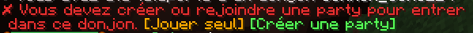
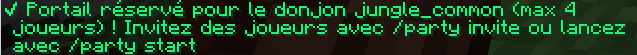
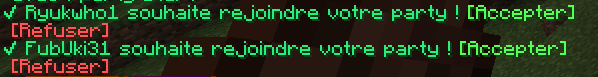
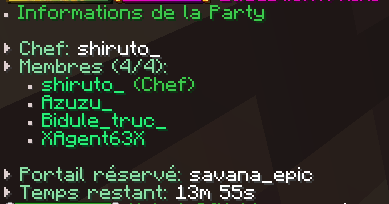
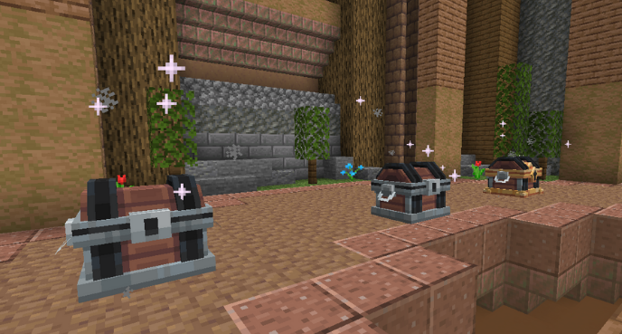

# 🏛️ Les Donjons


**Tuto : Les Nouveautés MMO/RPG d'Evolucraft**


Les donjons sont une nouvelle fonctionnalité sur Evolucraft, offrant des aventures passionnantes aux explorateurs en quête d'action pour monter en niveaux de classe, gagner de nouvelles armes de classe ou encore obtenir de nombreuses autres récompenses !

## <mark style="color:green;">💠 Où trouver un donjon ? 📍</mark>

Les donjons apparaissent <mark style="color:green;">aléatoirement</mark> dans le <mark style="color:green;">monde ressource</mark> et <mark style="color:green;">le nether</mark>, avec au minimum <mark style="color:green;">un type de donjon par monde ressource</mark>, qu'il s'agisse de donjons basiques ou de donjons événements.

## <mark style="color:green;">💠 Comment trouver un donjon ? 🔍</mark>

### <mark style="color:green;">• 1️⃣ Les pierres de téléportation donjon 🟩</mark>

Les pierres de téléportation donjon vous servent à être <mark style="color:green;">téléporté directement</mark>, en étant dans le monde ressource, à <mark style="color:green;">un portail de donjon généré</mark>. Très utile si vous ne voulez pas passer des heures à en chercher un !

Pour <mark style="color:green;">vous en procurer</mark>, il vous suffit d'utiliser <mark style="color:green;">`/kit donjon`</mark> _(disponible toutes les 24 heures)_ ou de passer par <mark style="color:green;">la box de vote</mark>.

Pour les joueurs plus avancés, vous avez le <mark style="color:green;">`/dragon`</mark> où, sur la deuxième page, vous pouvez <mark style="color:green;">échanger des pierres de tp donjon</mark> de rareté supérieure : <mark style="color:yellow;">Rare</mark>, <mark style="color:blue;">Épique</mark> ou <mark style="color:purple;">Légendaire</mark> !

### <mark style="color:green;">• 2️⃣ La recherche en balade 🚶‍♂️</mark>

En vous <mark style="color:green;">baladant dans les différents mondes ressource</mark>, vous pouvez également <mark style="color:green;">trouver des donjons générés</mark> et y entrer pour défier leurs mobs féroces. Avec un peu de chance, le <mark style="color:green;">`/rtp`</mark> pourra vous faire apparaître <mark style="color:green;">près d’un portail de donjon</mark>.

### <mark style="color:green;">• 3️⃣ Les publicités 📣</mark>

Avec la commande [<mark style="color:green;">/pub 📢</mark>](http://wiki.evolucraft.fr/le-gameplay/le-commerce#publicite), vous pouvez <mark style="color:green;">activer les notifications de pub pour donjon</mark> lorsque <mark style="color:green;">des joueurs trouvent un portail</mark> et souhaitent le partager. Très utile pour gagner des loots tout en participant au donjon !

Si vous souhaitez faire la <mark style="color:green;">publicité</mark> de votre trouvaille d'un <mark style="color:green;">portail de donjon</mark>, vous pouvez inviter des joueurs à éventuellement vous accompagner en effectuant la commande <mark style="color:green;">`/donjon "nom du donjon" "nombre de joueurs" "prix"`</mark>.

## <mark style="color:green;">💠 Comment inviter des joueurs dans un donjon ? 👥</mark>

Avec le **<mark style="color:green;">`/party`</mark>**, elle permettra, à la personne ayant **<mark style="color:green;">créé le groupe</mark>**, de gérer les **<mark style="color:green;">joueurs entrant dans un donjon</mark>** avec elle.  
Fini les **<mark style="color:green;">vols de donjon</mark>** ou les **<mark style="color:green;">téléportations trop proches</mark>** !

### 🔸 Un donjon trouvé

Lorsque vous avez **<mark style="color:green;">trouvé un donjon</mark>**, dirigez-vous vers le **<mark style="color:green;">portail</mark>**. Un message s’affichera alors, vous permettant de choisir si vous souhaitez faire le donjon **<mark style="color:green;">seul</mark>** ou **<mark style="color:green;">à plusieurs</mark>**. Il vous suffira de cliquer sur l’option souhaitée directement dans le **<mark style="color:green;">chat</mark>**.

* L’option **"<mark style="color:orange;">Jouer seul</mark>"** vous téléportera directement dans le **<mark style="color:green;">donjon</mark>**.  
* L’option **"<mark style="color:green;">Créer une party</mark>"** vous permettra de **<mark style="color:green;">créer une party</mark>**.

<figure></figure>

### 🔸 Réservation du donjon

Une fois la **<mark style="color:green;">party créée</mark>**, retournez au **<mark style="color:green;">portail</mark>** afin de le **<mark style="color:green;">réserver</mark>**. Cela permet d’effectuer le donjon **<mark style="color:green;">à plusieurs</mark>** et d’éviter tout **<mark style="color:green;">vol de dernière minute</mark>**.
Le portail sera considéré comme **<mark style="color:green;">réservé</mark>** dès réception du message ci-dessous.

<figure></figure>


Si le portail a déjà été **<mark style="color:green;">réservé</mark>**, le message ci-dessous vous sera affiché.
<figure></figure>


### 🔸 Formation de votre groupe

Pour inviter des **<mark style="color:green;">joueurs</mark>** dans votre **<mark style="color:green;">groupe</mark>**, publiez une **<mark style="color:green;">pub de donjon</mark>** avec la commande :  
**<mark style="color:green;">`/donjon [Type de donjon] [Nombre de joueurs] [Prix d'entrée]`</mark>**


En cas de doute sur votre **<mark style="color:green;">portail</mark>**, consultez le **[<mark style="color:green;">codex des portails de donjons disponible sur le serveur</mark>](https://wiki.evolucraft.fr/le-codex/donjons)** ou vérifiez le **<mark style="color:green;">message de réservation</mark>**.


Une fois la **<mark style="color:green;">pub envoyée</mark>**, vous recevrez les **<mark style="color:green;">demandes des joueurs</mark>** souhaitant vous accompagner.

<figure></figure>

### 🔸 Démarrer le donjon

Lorsque votre **<mark style="color:green;">groupe est prêt</mark>** et **<mark style="color:green;">au complet</mark>**, utilisez la commande **<mark style="color:green;">`/party start`</mark>** afin que **<mark style="color:green;">tous les joueurs</mark>** soient **<mark style="color:green;">téléportés</mark>** dans le donjon.


Un **<mark style="color:green;">timer de 10 secondes</mark>** se déclenchera avant la téléportation dans le donjon, permettant à tous les joueurs de se préparer.


Pour consulter les **<mark style="color:green;">joueurs présents</mark>**, utilisez  
**<mark style="color:green;">`/party info`</mark>**, affichant le **<mark style="color:green;">chef de la party</mark>** ainsi que les **<mark style="color:green;">membres</mark>**.

<figure></figure>


Une fois que **<mark style="color:green;">le donjon est terminé</mark>** et que vous ne voulez plus **<mark style="color:green;">refaire de donjon avec ce groupe</mark>**, il faudra réaliser la commande **<mark style="color:green;">`/party leave`</mark>** pour pas être téléporter à ce dernier si vous rester dans le monde où le reste du groupe resteront pour des donjons **<mark style="color:green;">sauf en cas de restart du serveur</mark>** ou de **<mark style="color:green;">disband de la party</mark>**.


## <mark style="color:green;">💠 Comment réaliser un donjon ? 🎮</mark>

### 🔸 La salle de préparation ⏳

Une fois entrés dans le donjon, les joueurs <mark style="color:green;">patientent le temps du décompte</mark> pour que tout le monde puisse préparer son inventaire. Une fois ce <mark style="color:green;">décompte passé</mark>, la première salle peut alors commencer !

Également, en cas de besoin, il est possible d'activer le chat de donjons via le **<mark style="color:green;">`/party chat`</mark>** afin de **<mark style="color:green;">transmettre des informations à vos cooéquipier**</mark> plutôt que de l'envoyer dans le chat générale.

En cas de **<mark style="color:green;">crash ou de déconnexion</mark>**, vous avez maintenant la possibilité de vous **<mark style="color:green;">re-téléporter dans votre donjon</mark>** via la commande **<mark style="color:green;">`/party tp`</mark>**.

### 🔸 Les salles de combat ⚔️

Selon le donjon effectué, plus il demandera <mark style="color:green;">un niveau de classe élevé</mark>, plus le <mark style="color:green;">nombre de salles à franchir augmentera</mark> _(sauf pour certains donjons événementiels)_.

Dans un donjon, vous trouverez plusieurs types de salles :

* <mark style="color:green;">Salle de monstres 🧟‍♂️</mark>
* <mark style="color:yellow;">Salle de mini-boss 👽</mark>
* <mark style="color:red;">Salle de boss 🐉</mark>


REMARQUE 🔍 : Il n’est <mark style="color:green;">pas toujours obligatoire</mark> d’avoir <mark style="color:green;">une salle de mini-boss</mark>. Il peut donc arriver qu’il n’y ait que des salles de mobs et une salle pour le boss ⚔️


### 🔸 Les récompenses 🎁

Après avoir <mark style="color:green;">vaincu le boss final du donjon</mark>, vous pourrez alors <mark style="color:green;">récupérer des récompenses</mark> si vous avez <mark style="color:green;">survécu</mark>.

Pour cela, il vous suffit de <mark style="color:green;">cliquer sur les coffres</mark> au <mark style="color:green;">fond de la salle</mark>. Il y a <mark style="color:green;">3 coffres de récompenses</mark> _(2 coffres gratuits et le 3e disponible avec le_ [_<mark style="color:green;">Premium 👑</mark>_](https://wiki.evolucraft.fr/le-gameplay/les-grades#abonnement-premium)_)_.

<figure></figure>

## <mark style="color:green;">💠 Quelques exemples de récompenses... 🧰</mark>

|            <mark style="color:green;">**Commun 🟩**</mark>            |                <mark style="color:yellow;">**Rare 🟨**</mark>                |                 <mark style="color:blue;">**Épique 🟦**</mark>                 |              <mark style="color:purple;">**Légendaire 🟪**</mark>             | <mark style="color:red;">**Mythique 🟥**</mark>                      |
| :-------------------------------------------------------------------: | :--------------------------------------------------------------------------: | :----------------------------------------------------------------------------: | :---------------------------------------------------------------------------: | -------------------------------------------------------------------- |
|  <mark style="color:green;">Carte Aléatoire de Classe Commune</mark>  |   <mark style="color:yellow;">2 Cartes Aléatoires de Classe Commune</mark>   |         <mark style="color:blue;">Carte Aléatoire de Classe Rare</mark>        |       <mark style="color:purple;">Carte Aléatoire de Classe Rare</mark>       | <mark style="color:red;">Carte Aléatoire de Classe Épique</mark>     |
|           <mark style="color:green;">Parchemin Facile</mark>          |              <mark style="color:yellow;">Parchemin Avancé</mark>             |              <mark style="color:blue;">Parchemin Difficile</mark>              |      <mark style="color:purple;">Carte Aléatoire de Classe Épique</mark>      | <mark style="color:red;">Carte Aléatoire de Classe Légendaire</mark> |
|              <mark style="color:green;">10 000 💲</mark>              |                 <mark style="color:yellow;">20 000 💲</mark>                 |                   <mark style="color:blue;">50 000 💲</mark>                   |             <mark style="color:purple;">Parchemin Difficile</mark>            | <mark style="color:red;">Parchemin Expert</mark>                     |
|              <mark style="color:green;">15 000 💲</mark>              |                 <mark style="color:yellow;">50 000 💲</mark>                 |                   <mark style="color:blue;">100 000 💲</mark>                  |              <mark style="color:purple;">Parchemin Expert</mark>              | <mark style="color:red;">Parchemin Impossible</mark>                 |
|              <mark style="color:green;">25 000 💲</mark>              |                 <mark style="color:yellow;">100 000 💲</mark>                |                   <mark style="color:blue;">250 000 💲</mark>                  |                 <mark style="color:purple;">150 000 💲</mark>                 | <mark style="color:red;">300 000 💲</mark>                           |
|       <mark style="color:green;">Cristal de Donjon Commun</mark>      |           <mark style="color:yellow;">Cristal de Donjon Rare</mark>          |            <mark style="color:blue;">Cristal de Donjon Épique</mark>           |                 <mark style="color:purple;">300 000 💲</mark>                 | <mark style="color:red;">750.000 💲</mark>                           |
|          <mark style="color:green;">Bonbon à la Pomme</mark>          |            <mark style="color:yellow;">2 Bonbons à l’Orange</mark>           |            <mark style="color:blue;">2 Bonbons à la Myrtille</mark>            |                 <mark style="color:purple;">750 000 💲</mark>                 | <mark style="color:red;">1 000 000 💲</mark>                         |
|         <mark style="color:green;">Plume de Fly (10min)</mark>        |            <mark style="color:yellow;">Plume de Fly (30min)</mark>           |                <mark style="color:blue;">Plume de Phoenix</mark>               |        <mark style="color:purple;">Cristal de donjon Légendaire</mark>        | <mark style="color:red;">Cristal de donjon Mythique</mark>           |
|           <mark style="color:green;">Plume de Phoenix</mark>          |              <mark style="color:yellow;">Plume de Phoenix</mark>             |                   <mark style="color:blue;">Arme Rare</mark>                   |           <mark style="color:purple;">2 Bonbons à la Myrtille</mark>          | <mark style="color:red;">2 Bonbons aux raisin</mark>                 |
|             <mark style="color:green;">Arme Commune</mark>            |                <mark style="color:yellow;">Arme Commune</mark>               |                  <mark style="color:blue;">Arme Épique</mark>                  |            <mark style="color:purple;">2 Bonbons aux Raisin</mark>            | <mark style="color:red;">Plume de Phoenix</mark>                     |
| <mark style="color:green;">Lame de la Machette Aztèque (Musée)</mark> |                 <mark style="color:yellow;">Armes Rare</mark>                |        <mark style="color:blue;">Pet de Donjon (Boss Uniquement)</mark>        |              <mark style="color:purple;">Plume de Phoenix</mark>              | <mark style="color:red;">Items Évolutif Aléatoire</mark>             |
|     <mark style="color:green;">Socle de la Machette Aztèque</mark>    |      <mark style="color:yellow;">Pet de Donjon (Boss Uniquement)</mark>      | <mark style="color:blue;">Partie Gauche de la Pierre de Rosette (Musée)</mark> |           <mark style="color:purple;">Item Évolutif Aléatoire</mark>          | <mark style="color:red;">Pet de Donjon (Boss Uniquement)</mark>      |
|                                   X                                   |          <mark style="color:yellow;">Socle du Kabuto (Musée)</mark>          |  <mark style="color:blue;">Partie Haute de la Pierre de Rosette (Musée)</mark> |       <mark style="color:purple;">Pet de Donjon (Boss Uniquement)</mark>      | <mark style="color:red;">Clé Aléatoire d'événement</mark>            |
|                                   X                                   |     <mark style="color:yellow;">Jambière Droite du Kabuto (Musée)</mark>     |        <mark style="color:blue;">Socle du Soldat D'Argile (Musée)</mark>       |          <mark style="color:purple;">Clé Aléatoire d'événement</mark>         | <mark style="color:red;">Pied Droit du T-Rex (Musée)</mark>          |
|                                   X                                   |     <mark style="color:yellow;">Épaulière Droit du Kabuto (Musée)</mark>     |     <mark style="color:blue;">Côté Droit du Soldat D'Argile (Musée)</mark>     | <mark style="color:purple;">Pierre de Téléportation de Donjon Mythique</mark> | <mark style="color:red;">Pied Gauche du T-Rex (Musée)</mark>         |
|                                   X                                   | <mark style="color:yellow;">Bébé Droit de la Louve Capitoline (Musée)</mark> |     <mark style="color:blue;">Côté Gauche du Soldat D'Argile (Musée)</mark>    |        <mark style="color:purple;">Jambe Gauche d'Atlas (Musée)</mark>        | <mark style="color:red;">Colonne Vertébrake du T-Rex (Musée)</mark>  |
|                                   X                                   |          <mark style="color:yellow;">Louve Capitoline (Musée)</mark>         |         <mark style="color:blue;">Pot du Vase de Soisons (Musée)</mark>        |         <mark style="color:purple;">Bras Gauche d'Atlas (Musée)</mark>        | <mark style="color:red;">Bras Droit du T-Rex (Musée)</mark>          |
|                                   X                                   |                                       X                                      |        <mark style="color:blue;">Socle du Vase de Soisons (Musée)</mark>       |        <mark style="color:purple;">Pierre du Bas d'Atlas (Musée)</mark>       | <mark style="color:red;">Bras Gauche du T-Rex (Musée)</mark>         |
|                                   X                                   |                                       X                                      |                                        X                                       |       <mark style="color:purple;">Pierre du Haut d'Atlas (Musée)</mark>       | <mark style="color:red;">Main Gauche du T-Rex (Musée)</mark>         |


Tous les monstres peuvent lâcher un coffre contenant un cristal de donjons, dont la rareté dépend du donjon. De plus, les mini-boss et boss laissent souvent des packs d'armes, qui permettent d'améliorer sa classe.

