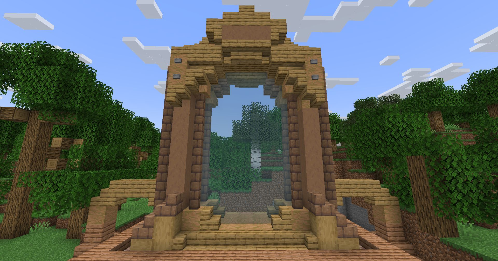

# 🟦 Donjon Abyssal

## <mark style="color:green;"> Caractéristiques 📋</mark>

👪 Nombre de joueurs accueillis : <mark style="color:green;">**1 à 4 joueurs**</mark>  
📈 Niveau de classe minimum : <mark style="color:green;">**Classe niveau 10**</mark>  
🕓 Durée du donjon : <mark style="color:green;">**20 minutes**</mark>  

## <mark style="color:green;"> Aperçu du portail 👁‍🗨</mark>

<table border="1" cellspacing="0" cellpadding="6">
  <tr>
    <td><mark style="color:green;"><strong>Aperçu du Donjon 📸</strong></mark></td>
  </tr>
  <tr>
    <td><figure></figure></td>
  </tr>
</table>

## <mark style="color:green;"> XP de classe récoltée ⚔</mark>

Lors de ce donjon, vous pouvez obtenir l’XP de classe comme suit :  

* <mark style="color:green;"><strong>Mob normal 🧟‍♂️</strong></mark> : **17.5 XP**  
* <mark style="color:yellow;"><strong>Nautilux 👽</strong></mark> : **450 XP**  
* <mark style="color:red;"><strong>Merlock 🐉</strong></mark> : **900 XP**

### <mark style="color:green;">Récompenses 🎁</mark>

|                                                                                        |
|:--------------------------------------------------------------------------------------:|
| <mark style="color:blue;"><strong>2 Cartes de Classe Aléatoire Commune</strong></mark> |
| <mark style="color:blue;"><strong>Cartes de Classe Aléatoire Rare</strong></mark>      |
| <mark style="color:blue;"><strong>Parchemin Abyssal</strong></mark>                    |
| <mark style="color:blue;"><strong>75.000 💲</strong></mark>                             |
| <mark style="color:blue;"><strong>125.000 💲</strong></mark>                            |
| <mark style="color:blue;"><strong>175.000 💲</strong></mark>                            |
| <mark style="color:blue;"><strong>2 Pinces de Crabe Abyssale (x2)</strong></mark>      |
| <mark style="color:blue;"><strong>2 Bonbons à l'Orange</strong></mark>                 |
| <mark style="color:blue;"><strong>5 000 XP Classe</strong></mark>                      |
| <mark style="color:blue;"><strong>Pet Merlock (Uniquement sur le boss)</strong></mark> |
