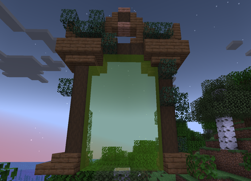
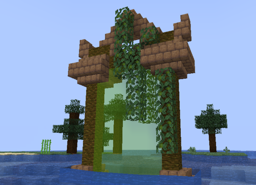
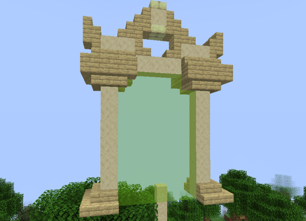
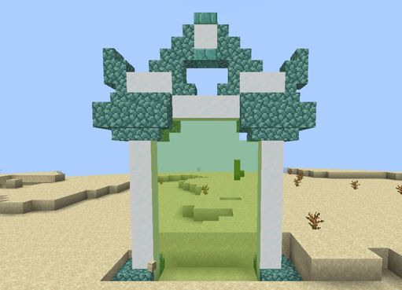
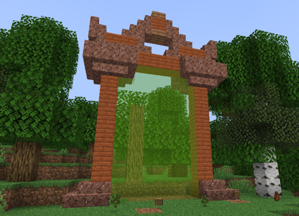
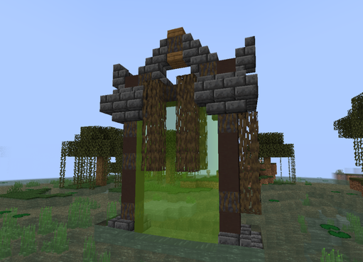
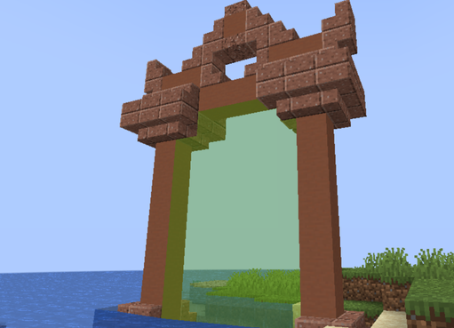
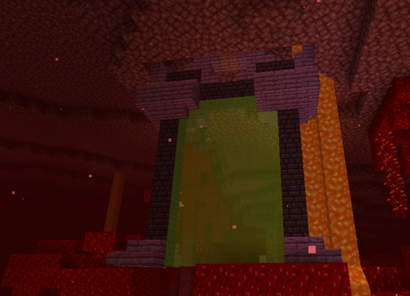

# 🟩 Donjon Commun

## <mark style="color:green;"> Caractéristiques 📋</mark>

👪 Nombre de joueurs accueillis : <mark style="color:green;">**1 à 4 joueurs**</mark>  
📈 Niveau de classe minimum : <mark style="color:green;">**Classe niveau 1**</mark>  
🕓 Durée du donjon : <mark style="color:green;">**10 minutes**</mark>  

## <mark style="color:green;"> Aperçu du portail 👁‍🗨</mark>

<table border="1" cellspacing="0" cellpadding="6">
  <tr>
    <td><mark style="color:green;"><strong>Biome du portail 🏛️</strong></mark></td>
    <td><mark style="color:white;"><strong>Forêt 🌳</strong></mark></td>
    <td><mark style="color:white;"><strong>Jungle 🦜</strong></mark></td>
    <td><mark style="color:white;"><strong>Désert 🏜️</strong></mark></td>
    <td><mark style="color:white;"><strong>Neige ❄️</strong></mark></td>
    <td><mark style="color:white;"><strong>Savane 🦏</strong></mark></td>
    <td><mark style="color:white;"><strong>Marais 🐸</strong></mark></td>
    <td><mark style="color:white;"><strong>Messa 🌵</strong></mark></td>
    <td><mark style="color:white;"><strong>Nether 🔥</strong></mark></td>
  </tr>
  <tr>
    <td><mark style="color:green;"><strong>Aperçu du Donjon 📸</strong></mark></td>
    <td><figure></figure></td>
    <td><figure></figure></td>
    <td><figure></figure></td>
    <td><figure></figure></td>
    <td><figure></figure></td>
    <td><figure></figure></td>
    <td><figure></figure></td>
    <td><figure></figure></td>
  </tr>
</table>

## <mark style="color:green;"> XP de classe récoltée ⚔</mark>

Lors de ce donjon, vous pouvez obtenir l’XP de classe comme suit :  

* <mark style="color:green;"><strong>Mob normal 🧟‍♂️</strong></mark> : **6.5 XP**  
* <mark style="color:yellow;"><strong>Mini-boss 👽</strong></mark> : **200 XP**  
* <mark style="color:red;"><strong>Boss 🐉</strong></mark> : **400 XP**

### <mark style="color:green;">Récompenses 🎁</mark>

|                                                                                          |
|:----------------------------------------------------------------------------------------:|
| <mark style="color:green;"><strong>Cartes Aléatoire de Classe Commune</strong></mark>    |
| <mark style="color:green;"><strong>Parchemin Facile</strong></mark>                      |
| <mark style="color:green;"><strong>10 000 💲</strong></mark>                              |
| <mark style="color:green;"><strong>15 000 💲</strong></mark>                              |
| <mark style="color:green;"><strong>25 000 💲</strong></mark>                              |
| <mark style="color:green;"><strong>Cristal de Donjon Commun</strong></mark>              |
| <mark style="color:green;"><strong>Bonbon à la Pomme</strong></mark>                      |
| <mark style="color:green;"><strong>Plume de Fly 10min</strong></mark>                     |
| <mark style="color:purple;"><strong>Plume de Phoenix</strong></mark>                      |
| <mark style="color:green;"><strong>Arme Commune</strong></mark>                           |
| <mark style="color:green;"><strong>Lame de la Machette Aztèque (Musée)</strong></mark>   |
| <mark style="color:green;"><strong>Socle de la Machette Aztèque (Musée)</strong></mark>  |

