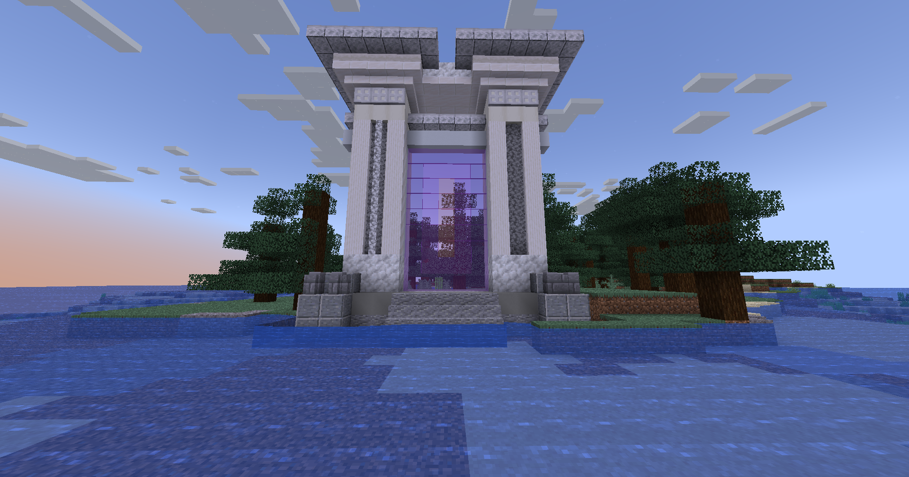

# 🟥 Cupidon

## 💠 <mark style="color:green;"> Caractéristiques 📋</mark>

👪 Nombre de joueurs accueillis : <mark style="color:green;">**1 à 8 joueurs**</mark>  
📈 Niveau de classe minimum : <mark style="color:green;">**Classe niveau 40**</mark>  
🕓 Durée du donjon : <mark style="color:green;">**15 minutes**</mark>  

## <mark style="color:green;"> Aperçu du portail 👁‍🗨</mark>

<table border="1" cellspacing="0" cellpadding="6">
  <tr>
    <td><mark style="color:green;"><strong>Aperçu du Donjon 📸</strong></mark></td>
  </tr>
  <tr>
    <td><figure></figure></td>
  </tr>
</table>

## 💠 <mark style="color:green;"> XP de classe récoltée ⚔️</mark>

Lors de ce donjon, vous pouvez obtenir l’XP de classe comme suit :  

* <mark style="color:green;"><strong>Apprenti, Archer & Chevalier 🧟‍♂️</strong></mark> : **17.5 XP**  
* <mark style="color:yellow;"><strong>Seraphiel & Uriel 👽</strong></mark> : **450 XP**  
* <mark style="color:red;"><strong>Cupidon 🐉</strong></mark> : **900 XP**

## 💠 <mark style="color:green;">Récompenses 🎁</mark>

|                                                                              | 
|:----------------------------------------------------------------------------:|
| <mark style="color:red;"><strong>Parchemin de l'amour</strong></mark>        |
| <mark style="color:red;"><strong>40 000 💲</strong></mark>                   |
| <mark style="color:red;"><strong>60 000 💲</strong></mark>                   |
| <mark style="color:red;"><strong>100 000 💲</strong></mark>                  |
| <mark style="color:red;"><strong>2 Auréoles</strong></mark>                 |
| <mark style="color:red;"><strong>2 Bonbons à l'orange</strong></mark>       |
| <mark style="color:red;"><strong>Œuf de familier de l'amour</strong></mark> |
| <mark style="color:red;"><strong>5 000 XP classe</strong></mark>            |
| <mark style="color:red;"><strong>Clé Cupidon</strong></mark>                |
