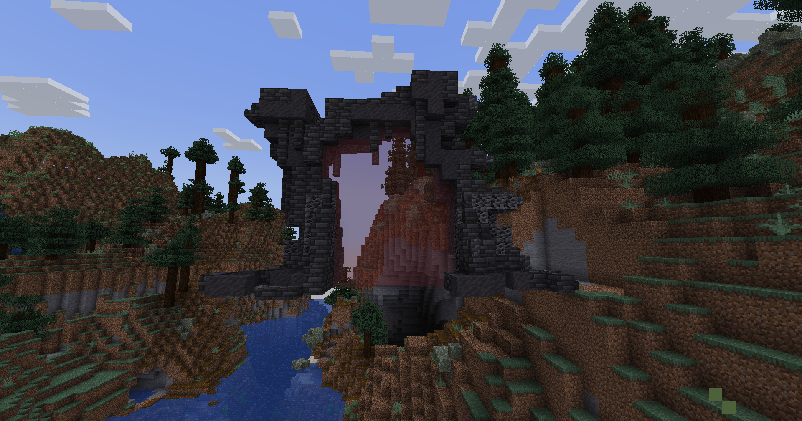

# 🟧 Donjon Draconique

## 💠 <mark style="color:green;"> Caractéristiques 📋</mark>

👪 Nombre de joueurs accueillis : <mark style="color:green;">**1 à 10 joueurs**</mark>  
📈 Niveau de classe minimum : <mark style="color:green;">**Classe niveau 10**</mark>  
🕓 Durée du donjon : <mark style="color:green;">**30 minutes**</mark>  

## 💠 <mark style="color:green;"> Aperçu du portail 👁‍🗨</mark>

<table border="1" cellspacing="0" cellpadding="6">
  <tr>
    <td><mark style="color:green;"><strong>Aperçu du Donjon 📸</strong></mark></td>
  </tr>
  <tr>
    <td><figure></figure></td>
  </tr>
</table>

## 💠 <mark style="color:green;"> XP de classe récoltée ⚔️</mark>

Lors de ce donjon, vous pouvez obtenir l’XP de classe comme suit :  

* <mark style="color:green;"><strong>Dragon vert & Dragon de feu 🧟‍♂️</strong></mark> : **17.5 XP**
* <mark style="color:green;"><strong>Patate 🐍</strong></mark> : **150 XP**
* <mark style="color:green;"><strong>Albi 🐍</strong></mark> : **200 XP**  
* <mark style="color:yellow;"><strong>Drogon 👽</strong></mark> : **500 XP**  
* <mark style="color:red;"><strong>Saphira 🐉</strong></mark> : **900 XP**

## 💠 <mark style="color:green;">Récompenses 🎁</mark>

|                                                                                           |
|:-----------------------------------------------------------------------------------------:|
| <mark style="color:orange;"><strong>2 Cartes Aléatoires de Classe Commune</strong></mark> |
| <mark style="color:orange;"><strong>Carte Aléatoire de Classe Rare</strong></mark>        |
| <mark style="color:orange;"><strong>Parchemin Avancé</strong></mark>                        |
| <mark style="color:orange;"><strong>Parchemin Difficile</strong></mark>                      |
| <mark style="color:orange;"><strong>50 000 💲</strong></mark>                              |
| <mark style="color:orange;"><strong>100 000 💲</strong></mark>                             |
| <mark style="color:orange;"><strong>150 000 💲</strong></mark>                             |
| <mark style="color:orange;"><strong>4 Cœurs de Dragon </strong></mark>                    |
| <mark style="color:orange;"><strong>6 Cœurs de Dragon </strong></mark>                    |
| <mark style="color:orange;"><strong>Bonbon à l'Orange</strong></mark>                     |
| <mark style="color:orange;"><strong>Œuf de Familier Draconique</strong></mark>            |
| <mark style="color:orange;"><strong>5 000 XP Classe</strong></mark>                       |
