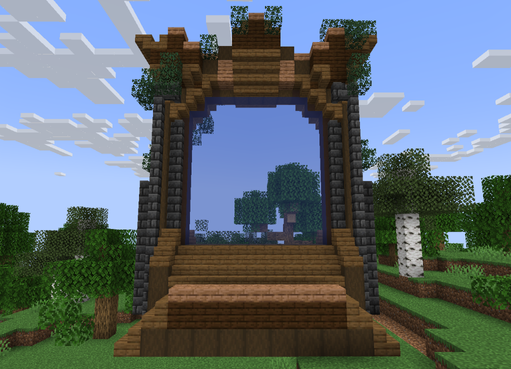
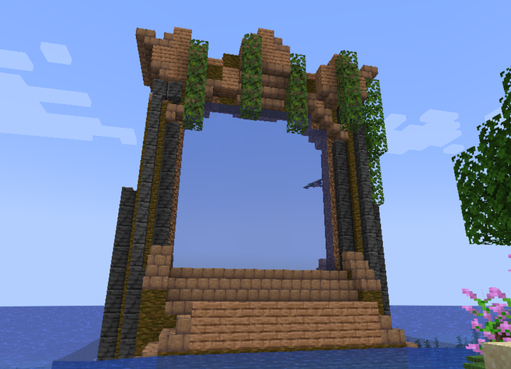
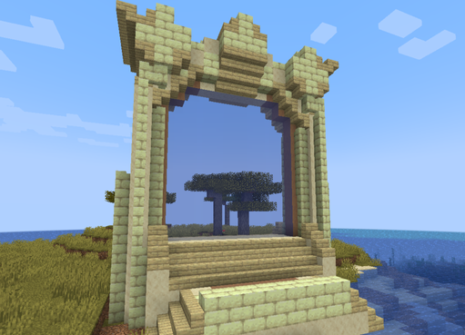
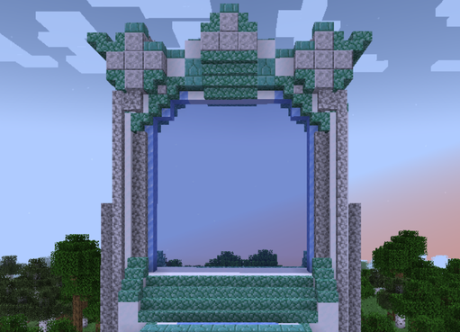
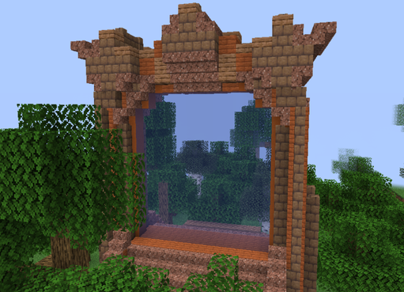
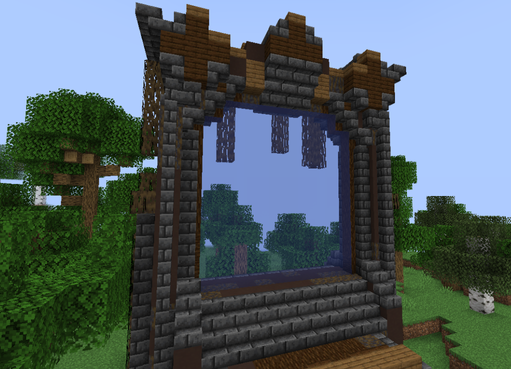
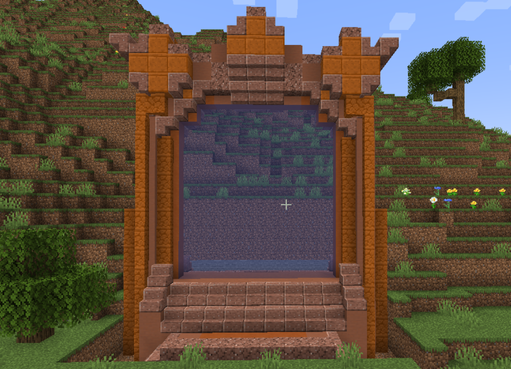
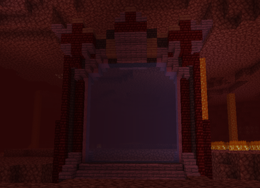

# 🟦 Donjon Épique

## 💠 <mark style="color:green;"> Caractéristiques 📋</mark>

👪 Nombre de joueurs accueillis : <mark style="color:green;">**1 à 4 joueurs**</mark>  
📈 Niveau de classe minimum : <mark style="color:green;">**Classe niveau 25**</mark>  
🕓 Durée du donjon : <mark style="color:green;">**25 minutes**</mark>  

## 💠 <mark style="color:green;"> Aperçu du portail 👁‍🗨</mark>

<table border="1" cellspacing="0" cellpadding="6">
  <tr>
    <td><mark style="color:green;"><strong>Biome du portail 🏛️</strong></mark></td>
    <td><mark style="color:white;"><strong>Forêt 🌳</strong></mark></td>
    <td><mark style="color:white;"><strong>Jungle 🦜</strong></mark></td>
    <td><mark style="color:white;"><strong>Désert 🏜️</strong></mark></td>
    <td><mark style="color:white;"><strong>Neige ❄️</strong></mark></td>
    <td><mark style="color:white;"><strong>Savane 🦏</strong></mark></td>
    <td><mark style="color:white;"><strong>Marais 🐸</strong></mark></td>
    <td><mark style="color:white;"><strong>Messa 🌵</strong></mark></td>
    <td><mark style="color:white;"><strong>Nether 🔥</strong></mark></td>
  </tr>
  <tr>
    <td><mark style="color:green;"><strong>Aperçu du Donjon 📸</strong></mark></td>
    <td><figure></figure></td>
    <td><figure></figure></td>
    <td><figure></figure></td>
    <td><figure></figure></td>
    <td><figure></figure></td>
    <td><figure></figure></td>
    <td><figure></figure></td>
    <td><figure></figure></td>
  </tr>
</table>

## 💠 <mark style="color:green;"> XP de classe récoltée ⚔️</mark>

Lors de ce donjon, vous pouvez obtenir l’XP de classe comme suit :  

* <mark style="color:green;"><strong>Mob normal 🧟‍♂️</strong></mark> : **35 XP**  
* <mark style="color:yellow;"><strong>Mini-boss 👽</strong></mark> : **1 500 XP**  
* <mark style="color:red;"><strong>Boss 🐉</strong></mark> : **4 000 XP**

## 💠 <mark style="color:green;">Récompenses 🎁</mark>

|                                                                                      |
|:------------------------------------------------------------------------------------:|
| <mark style="color:blue;"><strong>Cartes Aléatoires de Classe Rare</strong></mark>   |
| <mark style="color:blue;"><strong>Parchemin Difficile</strong></mark>                |
| <mark style="color:blue;"><strong>50 000 💲</strong></mark>                          |
| <mark style="color:blue;"><strong>100 000 💲</strong></mark>                         |
| <mark style="color:blue;"><strong>250 000 💲</strong></mark>                         |
| <mark style="color:blue;"><strong>Cristal de Donjon Épique</strong></mark>           |
| <mark style="color:blue;"><strong>2 Bonbons à la Myrtille</strong></mark>            |
| <mark style="color:blue;"><strong>Plume de Phoenix</strong></mark>                   |
| <mark style="color:blue;"><strong>Arme Rare</strong></mark>                          |
| <mark style="color:blue;"><strong>Arme Épique</strong></mark>                        |
| <mark style="color:blue;"><strong>Pet du Donjon (Boss Uniquement)</strong></mark>    |
| <mark style="color:blue;"><strong>Partie Gauche de la Pierre de Rosette (Musée)</strong></mark> |
| <mark style="color:blue;"><strong>Partie Haute de la Pierre de Rosette (Musée)</strong></mark>  |
| <mark style="color:blue;"><strong>Socle du Soldat d'Argile (Musée)</strong></mark>              |
| <mark style="color:blue;"><strong>Côté Droit du Soldat d'Argile (Musée)</strong></mark>         |
| <mark style="color:blue;"><strong>Côté Gauche du Soldat d'Argile (Musée)</strong></mark>        |
| <mark style="color:blue;"><strong>Pot du Vase de Soisons (Musée)</strong></mark>                |
| <mark style="color:blue;"><strong>Socle du Vase de Soisons (Musée)</strong></mark>              |
