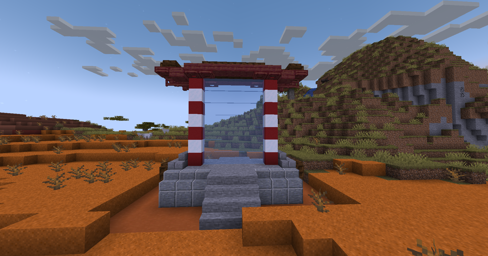

# 🟦 Donjon Givré Commun

## 💠 <mark style="color:green;"> Caractéristiques 📋</mark>

👪 Nombre de joueurs accueillis : <mark style="color:green;">**1 ou 2 joueurs**</mark>  
📈 Niveau de classe minimum : <mark style="color:green;">**Classe niveau 15**</mark>  
🕓 Durée du donjon : <mark style="color:green;">**5 minutes**</mark>  

## 💠 <mark style="color:green;"> Aperçu du portail 👁‍🗨</mark>

<table border="1" cellspacing="0" cellpadding="6">
  <tr>
    <td><mark style="color:green;"><strong>Aperçu du Donjon 📸</strong></mark></td>
  </tr>
  <tr>
    <td><figure></figure></td>
  </tr>
</table>

## 💠 <mark style="color:green;"> XP de classe récoltée ⚔</mark>

Lors de ce donjon, vous pouvez obtenir l’XP de classe comme suit :  

* <mark style="color:green;"><strong>Combattant & Elf 🧟‍♂️</strong></mark> : **18 XP**  
* <mark style="color:yellow;"><strong>Golem 👽</strong></mark> : **450 XP**  
* <mark style="color:red;"><strong>Reine 🐉</strong></mark> : **900 XP**

## 💠 <mark style="color:green;">Récompenses 🎁</mark>

|                                                                           |
|:-------------------------------------------------------------------------:|
| <mark style="color:blue;"><strong>Parchemin Givrée</strong></mark>           |
| <mark style="color:blue;"><strong>10 000 💲</strong></mark>                |
| <mark style="color:blue;"><strong>15 000 💲</strong></mark>                |
| <mark style="color:blue;"><strong>25 000 💲</strong></mark>                |
| <mark style="color:blue;"><strong>Sucre d'orge</strong></mark>        |
| <mark style="color:blue;"><strong>Bonbon à la pomme</strong></mark> |
| <mark style="color:blue;"><strong>Œuf de familier givré</strong></mark>    |
| <mark style="color:blue;"><strong>250 XP classe</strong></mark>        |
