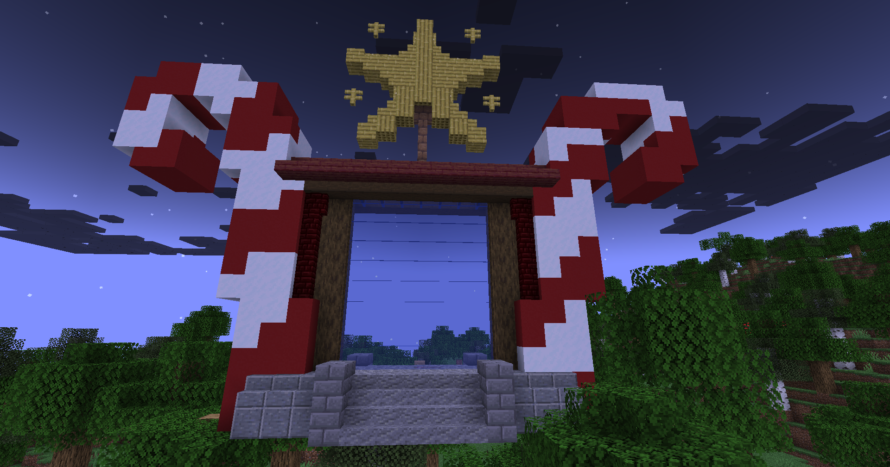

# 🟦 Givré Épique

## <mark style="color:green;"> Caractéristiques 📋</mark>

👪 Nombre de joueurs accueillis : <mark style="color:green;">**1 ou 2 joueurs**</mark>  
📈 Niveau de classe minimum : <mark style="color:green;">**Classe niveau 40**</mark>  
🕓 Durée du donjon : <mark style="color:green;">**10 minutes**</mark>  

## <mark style="color:green;"> Aperçu du portail 👁‍🗨</mark>

<table border="1" cellspacing="0" cellpadding="6">
  <tr>
    <td><mark style="color:green;"><strong>Aperçu du Donjon 📸</strong></mark></td>
  </tr>
  <tr>
    <td><figure></figure></td>
  </tr>
</table>

## <mark style="color:green;"> XP de classe récoltée ⚔</mark>

Lors de ce donjon, vous pouvez obtenir l’XP de classe comme suit :  

* <mark style="color:green;"><strong>Elfs & Combattants 🧟‍♂️</strong></mark> : **50 XP**  
* <mark style="color:yellow;"><strong>Golem 👽</strong></mark> : **5 000 XP**  
* <mark style="color:red;"><strong>Reine 🐉</strong></mark> : **10 000 XP**

### <mark style="color:green;">Récompenses 🎁</mark>

|                                                               |
| :-----------------------------------------------------------: |
| <mark style="color:blue;">**Parchemin Givrée**</mark>         |
| <mark style="color:blue;">**40 000 💲**</mark>                 |
| <mark style="color:blue;">**60 000 💲**</mark>                 |
| <mark style="color:blue;">**100 000 💲**</mark>                |
| <mark style="color:blue;">**2 Sucres d'orges**</mark>         |
| <mark style="color:blue;">**2 Bonbons à l'orange**</mark>     |
| <mark style="color:blue;">**Œuf de familier givré**</mark>    |
| <mark style="color:blue;">**1 500 XP classe**</mark>          |
| <mark style="color:blue;">**Clé givrée**</mark>               |
