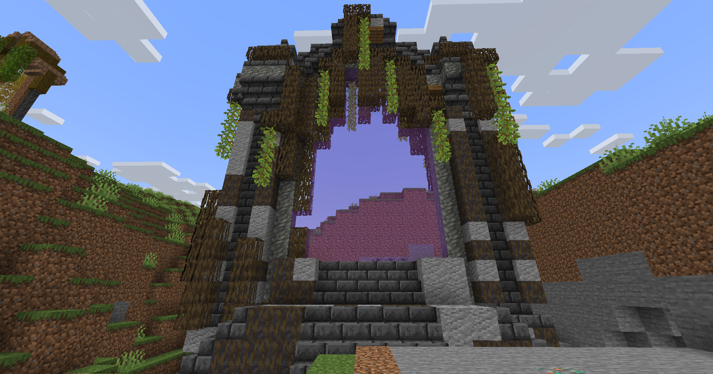

# 🟪 Donjon Légendaire

## 💠 <mark style="color:green;"> Caractéristiques 📋</mark>

👪 Nombre de joueurs accueillis : <mark style="color:green;">**1 à 4 joueurs**</mark>  
📈 Niveau de classe minimum : <mark style="color:green;">**Classe niveau 40**</mark>  
🕓 Durée du donjon : <mark style="color:green;">**30 minutes**</mark>  

## 💠 <mark style="color:green;"> Aperçu du portail 👁‍🗨</mark>

<table border="1" cellspacing="0" cellpadding="6">
  <tr>
    <td><mark style="color:green;"><strong>Aperçu du Donjon 📸</strong></mark></td>
  </tr>
  <tr>
    <td><figure></figure></td>
  </tr>
</table>

## 💠 <mark style="color:green;"> XP de classe récoltée ⚔️</mark>

Lors de ce donjon, vous pouvez obtenir l’XP de classe comme suit :  

* <mark style="color:green;"><strong>Mob normal 🧟‍♂️</strong></mark> : **50 XP**
* <mark style="color:green;"><strong>Sl'Endermen 🧟‍♂️</strong></mark> : **500 XP**  
* <mark style="color:yellow;"><strong>Mini boss 👽</strong></mark> : **5 000 XP**  
* <mark style="color:red;"><strong>Boss 🐉</strong></mark> : **10 000 XP**

## 💠 <mark style="color:green;">Récompenses 🎁</mark>

|                                                                                       |
|:-------------------------------------------------------------------------------------:|
| <mark style="color:purple;"><strong>Cartes Aléatoire de Classe Rare</strong></mark>   |
| <mark style="color:purple;"><strong>Cartes Aléatoire de Classe Épique</strong></mark> |
| <mark style="color:purple;"><strong>Parchemin Difficile</strong></mark>               |
| <mark style="color:purple;"><strong>Parchemin Expert</strong></mark>                  |
| <mark style="color:purple;"><strong>150 000 💲</strong></mark>                         |
| <mark style="color:purple;"><strong>300 000 💲</strong></mark>                         |
| <mark style="color:purple;"><strong>750 000 💲</strong></mark>                         |
| <mark style="color:purple;"><strong>Cristal de donjon légendaire</strong></mark>      |
| <mark style="color:purple;"><strong>2 Bonbons à la Myrtille (x2)</strong></mark>      |
| <mark style="color:purple;"><strong>2 Bonbons au Raisin (x2)</strong></mark>          |
| <mark style="color:purple;"><strong>Plume de Phoenix</strong></mark>                  |
| <mark style="color:purple;"><strong>Item Évolutif Aléatoire</strong></mark>           |
| <mark style="color:purple;"><strong>Pet Donjon (Uniquement Boss)</strong></mark>      |
| <mark style="color:purple;"><strong>Clé Aléatoire</strong></mark>                     |
| <mark style="color:purple;"><strong>Jambe Gauche d'Atlas (Musée)</strong></mark>      |
| <mark style="color:purple;"><strong>Bras Gauche d'Atlas (Musée)</strong></mark>       |
| <mark style="color:purple;"><strong>Pierre du Bas d'Atlas (Musée)</strong></mark>     |
| <mark style="color:purple;"><strong>Pierre du Haut d'Atlas (Musée)</strong></mark>    |

