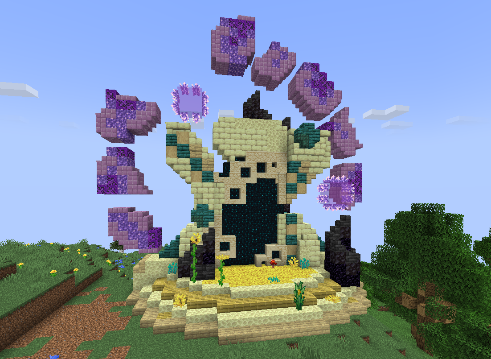

# 🟥 Donjon Mythique

## 💠 <mark style="color:green;"> Caractéristiques 📋</mark>

👪 Nombre de joueurs accueillis : <mark style="color:green;">**1 à 10 joueurs**</mark>  
📈 Niveau de classe minimum : <mark style="color:green;">**Classe niveau 50**</mark>  
🕓 Durée du donjon : <mark style="color:green;">**60 minutes**</mark>  

## 💠 <mark style="color:green;"> Aperçu du portail 👁‍🗨</mark>

<table border="1" cellspacing="0" cellpadding="6">
  <tr>
    <td><mark style="color:green;"><strong>Aperçu du Donjon 📸</strong></mark></td>
  </tr>
  <tr>
    <td><figure></figure></td>
  </tr>
</table>

## 💠 <mark style="color:green;"> XP de classe récoltée ⚔️</mark>

Lors de ce donjon, vous pouvez obtenir l’XP de classe comme suit :  

* <mark style="color:green;"><strong>Mob normal 🧟‍♂️</strong></mark> : **100 XP**  
* <mark style="color:yellow;"><strong>Mini-Boss 👽</strong></mark> : **10 000 XP**  
* <mark style="color:red;"><strong>Boss 🐉</strong></mark> : **20 000 XP**

## 💠 <mark style="color:green;">Récompenses 🎁</mark>

|                                                                                       |
|:-------------------------------------------------------------------------------------:|
| <mark style="color:red;"><strong>Carte Aléatoire de Classe Épique</strong></mark>     |
| <mark style="color:red;"><strong>Carte Aléatoire de Classe Légendaire</strong></mark> |
| <mark style="color:red;"><strong>Parchemin Expert</strong></mark>                     |
| <mark style="color:red;"><strong>Parchemin Impossible</strong></mark>                 |
| <mark style="color:red;"><strong>300 000 💲</strong></mark>                            |
| <mark style="color:red;"><strong>750 000 💲</strong></mark>                            |
| <mark style="color:red;"><strong>1 000 000 💲</strong></mark>                          |
| <mark style="color:red;"><strong>Cristaux de donjon Mythique</strong></mark>          |
| <mark style="color:red;"><strong>2 Bonbons au Raisin</strong></mark>                  |      
| <mark style="color:red;"><strong>Plume de Phoenix</strong></mark>                     |
| <mark style="color:red;"><strong>Item Évolutif Aléatoire</strong></mark>              |
| <mark style="color:red;"><strong>Pet Donjon (Boss Uniquement)</strong></mark>         |
| <mark style="color:red;"><strong>Clé Aléatoire</strong></mark>                        |
| <mark style="color:red;"><strong>Pied Droit du T-Rex (Musée)</strong></mark>          |
| <mark style="color:red;"><strong>Pied Gauche du T-Rex (Musée)</strong></mark>         |
| <mark style="color:red;"><strong>Colonne Vertébrale du T-Rex (Musée)</strong></mark>  |
| <mark style="color:red;"><strong>Bras Droit du T-Rex (Musée)</strong></mark>          |
| <mark style="color:red;"><strong>Bras Gauche du T-Rex (Musée)</strong></mark>         |
| <mark style="color:red;"><strong>Main Gauche du T-Rex (Musée)</strong></mark>         |

