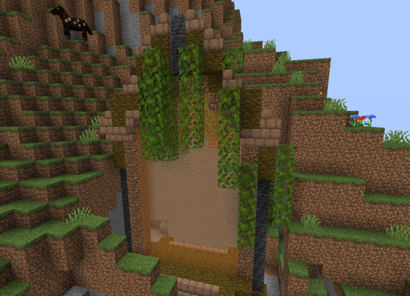
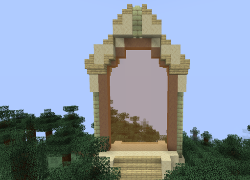
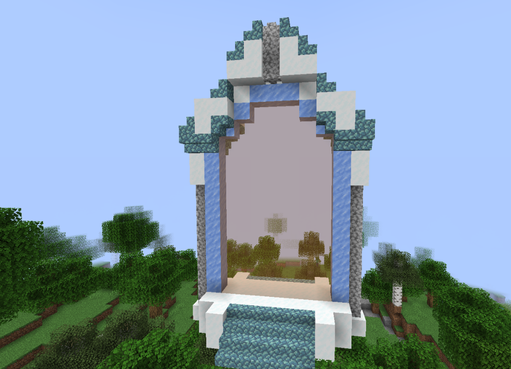
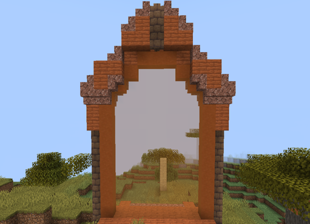
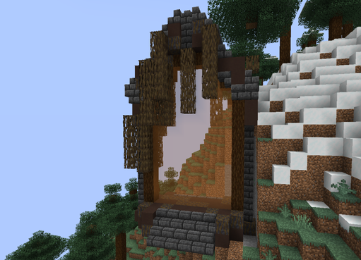
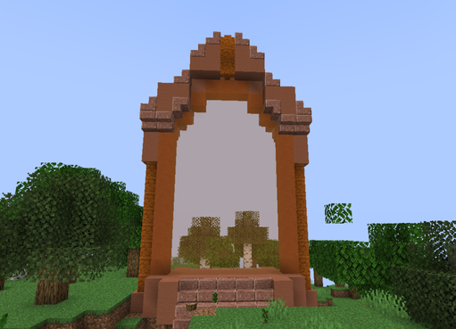
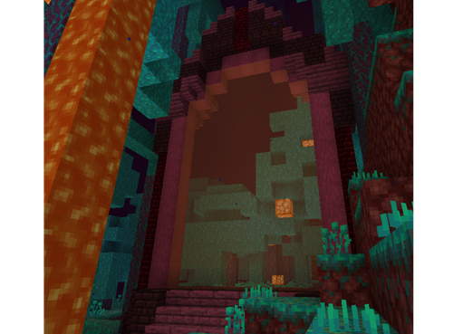

# 🟧 Donjon Rare

<table border="1" cellspacing="0" cellpadding="6">
  <tr>
    <td><mark style="color:yellow;"><strong>Biome du portail 🏛</strong></mark></td>
    <td><mark style="color:white;"><strong>Forêt 🌳</strong></mark></td>
    <td><mark style="color:white;"><strong>Jungle 🦜</strong></mark></td>
    <td><mark style="color:white;"><strong>Désert 🏜</strong></mark></td>
    <td><mark style="color:white;"><strong>Neige ❄</strong></mark></td>
    <td><mark style="color:white;"><strong>Savane 🦏</strong></mark></td>
    <td><mark style="color:white;"><strong>Marais 🐸</strong></mark></td>
    <td><mark style="color:white;"><strong>Messa 🌵</strong></mark></td>
    <td><mark style="color:white;"><strong>Nether 🔥</strong></mark></td>
  </tr>
  <tr>
    <td><mark style="color:yellow;"><strong>Aperçu du Donjons 📸</strong></mark></td>
    <td>
      <figure>
        
      </figure>
    </td>
    <td>
      <figure>
        
      </figure>
    </td>
    <td>
      <figure>
        
      </figure>
    </td>
    <td>
      <figure>
        
      </figure>
    </td>
    <td>
      <figure>
        
      </figure>
    </td>
    <td>
      <figure>
        
      </figure>
    </td>
    <td>
      <figure>
        
      </figure>
    </td>
    <td>
      <figure>
        
      </figure>
    </td>
  </tr>
</table>

## <mark style="color:green;"> Pré-requis </mark>

Ce donjon est <mark style="color:green;">**limité à 4 personnes**</mark>. Pour le faire, vous devez être <mark style="color:green;">**niveau 10**</mark> dans votre classe.

## <mark style="color:green;">Aperçu des récompenses</mark>

### <mark style="color:green;">XP obtenable</mark>
Lors de ce donjon vous pouvez obtenir l'xp de classe comme suit : 

* Mob normal : 18 xp
* Mini boss : 450 xp
* Boss : 900 xp

## <mark style="color:green;"> Caractéristiques 📋</mark>

👪 Nombre de joueurs accueillis : <mark style="color:green;">**1 à 4 joueurs**</mark>  
📈 Niveau de classe minimum : <mark style="color:green;">**Classe niveau 1**</mark>  
🕓 Durée du donjon : <mark style="color:green;">**10 minutes**</mark>  

## <mark style="color:green;"> Aperçu du portail 👁‍🗨</mark>

<table border="1" cellspacing="0" cellpadding="6">
  <tr>
    <td><mark style="color:green;"><strong>Biome du portail 🏛</strong></mark></td>
    <td><mark style="color:white;"><strong>Forêt 🌳</strong></mark></td>
    <td><mark style="color:white;"><strong>Jungle 🦜</strong></mark></td>
    <td><mark style="color:white;"><strong>Désert 🏜</strong></mark></td>
    <td><mark style="color:white;"><strong>Neige ❄</strong></mark></td>
    <td><mark style="color:white;"><strong>Savane 🦏</strong></mark></td>
    <td><mark style="color:white;"><strong>Marais 🐸</strong></mark></td>
    <td><mark style="color:white;"><strong>Messa 🌵</strong></mark></td>
    <td><mark style="color:white;"><strong>Nether 🔥</strong></mark></td>
  </tr>
  <tr>
    <td><mark style="color:green;"><strong>Aperçu du Donjon 📸</strong></mark></td>
    <td><figure></figure></td>
    <td><figure></figure></td>
    <td><figure></figure></td>
    <td><figure></figure></td>
    <td><figure></figure></td>
    <td><figure></figure></td>
    <td><figure></figure></td>
    <td><figure></figure></td>
  </tr>
</table>

## <mark style="color:green;"> XP de classe récoltée ⚔</mark>

Lors de ce donjon, vous pouvez obtenir l’XP de classe comme suit :  

* <mark style="color:green;"><strong>Mob normal 🧟‍♂️</strong></mark> : **6.5 XP**  
* <mark style="color:yellow;"><strong>Mini-boss 👽</strong></mark> : **200 XP**  
* <mark style="color:red;"><strong>Boss 🐉</strong></mark> : **400 XP**

### <mark style="color:green;">Récompenses 🎁</mark>

|                                                                                         |
|:---------------------------------------------------------------------------------------:|
| <mark style="color:yellow;"><strong>2 Cartes Aléatoire de Classe Commune</strong></mark> |
| <mark style="color:yellow;"><strong>Parchemin Avancé</strong></mark>                    |
| <mark style="color:yellow;"><strong>20 000 💲</strong></mark>                            |
| <mark style="color:yellow;"><strong>50 000 💲</strong></mark>                            |
| <mark style="color:yellow;"><strong>100 000 💲</strong></mark>                           |
| <mark style="color:yellow;"><strong>Cristal de Donjon Rare</strong></mark>              |
| <mark style="color:yellow;"><strong>2 Bonbons à l’Orange</strong></mark>                |
| <mark style="color:yellow;"><strong>Plume de Fly 30min</strong></mark>                  |
| <mark style="color:yellow;"><strong>Plume de Phoenix</strong></mark>                    |
| <mark style="color:yellow;"><strong>Arme Commune</strong></mark>                         |
| <mark style="color:yellow;"><strong>Arme Rare</strong></mark>                           |
| <mark style="color:yellow;"><strong>Socle du Kabuto (Musée)</strong></mark>                   |
| <mark style="color:yellow;"><strong>Jambière Droite du Kabuto (Musée)</strong></mark>         |
| <mark style="color:yellow;"><strong>Épaulière Droit du Kabuto (Musée)</strong></mark>         |
| <mark style="color:yellow;"><strong>Bébé Droit de la Louve Capitoline (Musée)</strong></mark> |
| <mark style="color:yellow;"><strong>Louve Capitoline (Musée)</strong></mark>                  |

