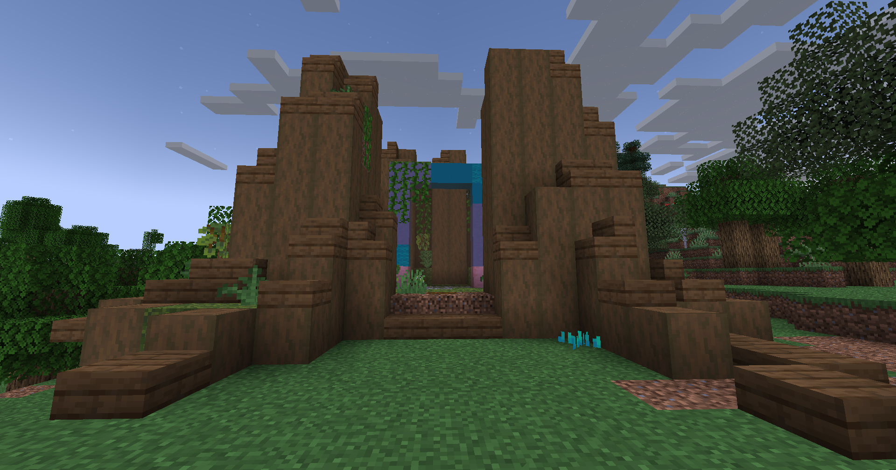

# 🟫 Terrier du Roi Lapin

## 💠 <mark style="color:green;"> Caractéristiques 📋</mark>

👪 Nombre de joueurs accueillis : <mark style="color:green;">**1 à 4 joueurs**</mark>  
📈 Niveau de classe minimum : <mark style="color:green;">**Classe niveau 15**</mark>  
🕓 Durée du donjon : <mark style="color:green;">**15 minutes**</mark>  

## 💠 <mark style="color:green;"> Aperçu du portail 👁‍🗨</mark>

<table border="1" cellspacing="0" cellpadding="6">
  <tr>
    <td><mark style="color:green;"><strong>Aperçu du Donjon 📸</strong></mark></td>
  </tr>
  <tr>
    <td><figure></figure></td>
  </tr>
</table>

## 💠 <mark style="color:green;"> XP de classe récoltée ⚔</mark>

Lors de ce donjon, vous pouvez obtenir l’XP de classe comme suit :  

* <mark style="color:green;"><strong>Combattants & Tireurs 🧟‍♂️</strong></mark> : **22 XP**  
* <mark style="color:yellow;"><strong>Gros Lapins 👽</strong></mark> : **562 XP**  
* <mark style="color:red;"><strong>Lapins 🐉</strong></mark> : **1 125 XP**

## 💠 <mark style="color:green;">Récompenses 🎁</mark>
|                                                                                   |
|:---------------------------------------------------------------------------------:|
| <mark style="color:yellow;"><strong>Parchemin du Terrier Roi Lapin</strong></mark> |
| <mark style="color:yellow;"><strong>10 000 💲</strong></mark>                      |
| <mark style="color:yellow;"><strong>15 000 💲</strong></mark>                      |
| <mark style="color:yellow;"><strong>25 000 💲</strong></mark>                      |
| <mark style="color:yellow;"><strong>Tablette de chocolat</strong></mark>   |
| <mark style="color:yellow;"><strong>Bonbon à la pomme</strong></mark>         |
| <mark style="color:yellow;"><strong>Œuf de familier de Pâques</strong></mark>      |
| <mark style="color:yellow;"><strong>1 000 XP Classe</strong></mark>            |

