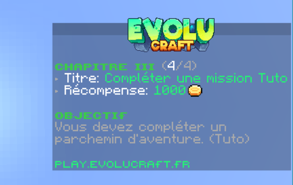
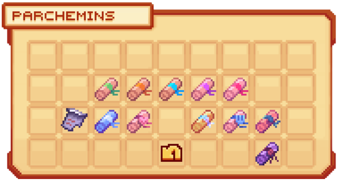

# 📜 Les Quêtes


**Tuto : Comment gagner de l'argent sur Evolucraft**


Les <mark style="color:green;">**quêtes**</mark> vous permettent d’explorer plus profondément les différents <mark style="color:green;">**aspects du serveur**</mark>, que ce soit à travers le <mark style="color:green;">**tutoriel**</mark> ou grâce aux <mark style="color:green;">**parchemins**</mark>, qui vous offrent des <mark style="color:green;">**récompenses utiles**</mark> durant votre aventure.  

Il existe <mark style="color:green;">**deux catégories de quêtes**</mark> :

## 💠 <mark style="color:green;">**Quêtes Tutoriel**</mark> ❔

Ces <mark style="color:green;">**quêtes**</mark> sont conçues pour vous familiariser avec les différentes <mark style="color:green;">**fonctionnalités**</mark> et les <mark style="color:green;">**aspects uniques**</mark> du serveur. Elles sont idéales pour les <mark style="color:green;">**nouveaux joueurs**</mark> désireux de découvrir les <mark style="color:green;">**rudiments du jeu**</mark> sur <mark style="color:green;">**Evolucraft**</mark>.  

En plus de guider vos premiers pas, elles vous permettent de <mark style="color:green;">**progresser efficacement**</mark> tout en obtenant des <mark style="color:green;">**récompenses utiles**</mark>. Certaines missions introduisent également des <mark style="color:green;">**mécaniques avancées**</mark>, préparant ainsi les joueurs à relever des <mark style="color:green;">**défis plus complexes**</mark> au fil de leur aventure.  

<figure><figcaption>
<strong>Aperçu d'une </strong><mark style="color:green;"><strong>quête du tuto</strong></mark>
</figcaption></figure>

## 💠 <mark style="color:green;">**Parchemin d'Aventure**</mark>

<figure><figcaption>
<strong>Aperçu des </strong><mark style="color:green;"><strong>parchemins disponibles</strong></mark>
</figcaption></figure>

Chaque <mark style="color:green;">**parchemins**</mark> de <mark style="color:green;">**de diffilcutés différentes**</mark> propose des <mark style="color:green;">**défis différents**</mark> et <mark style="color:green;">**des récompenses**</mark> à la hauteur de vos exploits, visibles dans le <mark style="color:green;">**`/quete`**</mark>, puis en cliquant sur <mark style="color:green;">**parchemins**</mark> et en passant votre curseur sur la quête que vous avez.

Sur le serveurs, il existent <mark style="color:green;">**14 parchemins différents**</mark> :

Avec dans un premier temps <mark style="color:green;">**5 parchemins classiques**</mark>
- 🟩 [<mark style="color:green;">Parchemin Facile</mark>](https://wiki.evolucraft.fr/codex/parchemin/commun)
- 🟨 [<mark style="color:yellow;">Parchemin Avancé</mark>](https://wiki.evolucraft.fr/codex/parchemin/rare)
- 🟦 [<mark style="color:blue;">Parchemin Difficile</mark>](https://wiki.evolucraft.fr/codex/parchemin/epique)
- 🟪 [<mark style="color:purple;">Parchemin Expert</mark>](https://wiki.evolucraft.fr/codex/parchemin/legendaire)
- 🟥 [<mark style="color:red;">Parchemin Impossible</mark>](https://wiki.evolucraft.fr/codex/parchemin/mythique)

Mais également  <mark style="color:green;">**9 parchemins issue d'évènement**</mark>
- 🌊 [<mark style="color:blue;">Parchemin Abyssal</mark>](https://wiki.evolucraft.fr/codex/parchemin#parchemin-abyssal)
- 🧛‍♂️ [<mark style="color:orange;">Parchemin Halloween</mark>](https://wiki.evolucraft.fr/codex/parchemin#parchemin-halloween)
- ❄️ [<mark style="color:blue;">Parchemin Givré</mark>](https://wiki.evolucraft.fr/codex/parchemin#parchemin-givre)
- ❤️ [<mark style="color:red;">Parchemin de l'Amour</mark>](https://wiki.evolucraft.fr/codex/parchemin#parchemin-de-lamour)
- 🐰 [<mark style="color:yellow;">Parchemin Terrier du Roi Lapin</mark>](https://wiki.evolucraft.fr/codex/parchemin#parchemin-terrier-du-roi-lapin)
- 🍫 [<mark style="color:yellow;">Parchemin Fabrique du Chocolat</mark>](https://wiki.evolucraft.fr/codex/parchemin#parchemin-fabrique-du-chocolat)
- 🎃 [<mark style="color:red;">Parchemin Citrouille</mark>](https://wiki.evolucraft.fr/codex/parchemin#parchemin-citrouille)
- 🩸 [<mark style="color:red;">Parchemin Lune de Sang</mark>](https://wiki.evolucraft.fr/codex/parchemin#parchemin-lune-de-sang)
- 🍪 [<mark style="color:red;">Parchemin Pain d'Épice</mark>](https://wiki.evolucraft.fr/codex/parchemin#parchemin-pain-depice)
