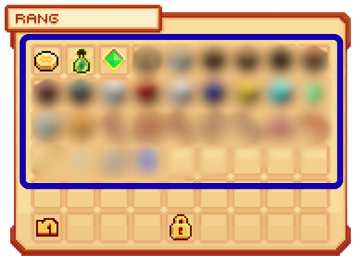
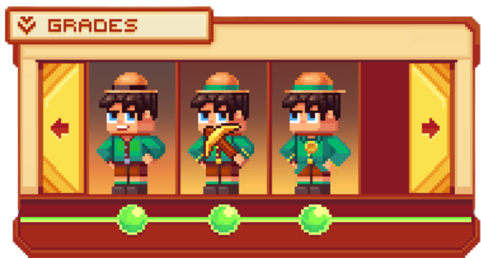
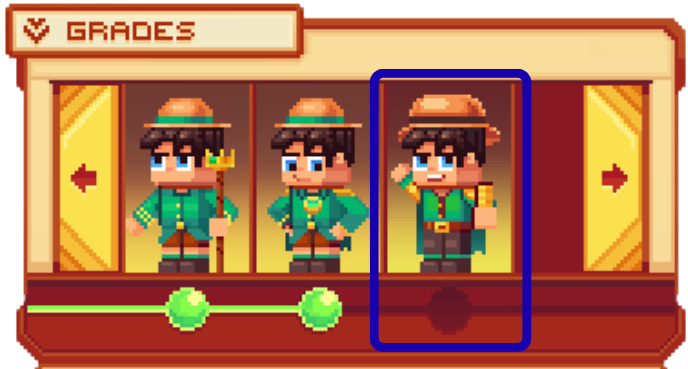
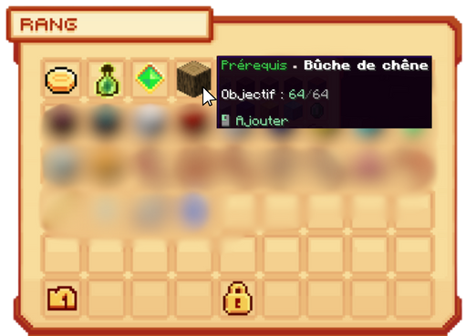
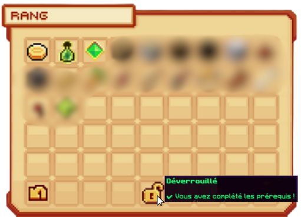

# 👑 Les Rangs


**Tuto : Comment faire Évoluer son Personnage sur Evolucraft ?**


L’un des objectifs principaux du serveur est de <mark style="color:green;">**monter de rang**</mark> afin d’obtenir des <mark style="color:green;">**avantages supplémentaires**</mark> pouvant grandement faciliter votre aventure.  
Pour les débloquer, vous devrez <mark style="color:green;">**farmer des items**</mark>, <mark style="color:green;">**gagner des niveaux de jobs**</mark> et <mark style="color:green;">**obtenir de l’argent 💲**</mark>.

Découvrez les <mark style="color:green;">**15 rangs différents**</mark> et les avantages associés à chacun grâce à la commande <mark style="color:green;">**`/rangs`**</mark> :

<figure><figcaption>
<strong><code>Interface du </code></strong><mark style="color:green;"><strong><code>/rangs</code></strong></mark>
</figcaption><figure>

## 💠 <mark style="color:green;">Comment valider des prérequis ? ✅</mark>

 
**INFORMATION ❗❗ : Les prérequis ont été volontairement cachés pour éviter le spoil.**


### 🔸 Étape 1
Récoltez les <mark style="color:green;">**items nécessaires**</mark> indiqués dans <mark style="color:green;">**`/rangs`**</mark> pour votre futur rang.  
<figure><figcaption>
<strong><code>Liste des pré requis d'un</code></strong><mark style="color:green;"><strong><code>rang</code></strong></mark>
</figcaption></figure>

### 🔸 Étape 2
Une fois que vous avez récolté tout ou partie des items, effectuez la commande <mark style="color:green;">**`/rangs`**</mark>.  
<figure><figcaption>
<strong><code>Interface du </code></strong><mark style="color:green;"><strong><code>/rangs</code></strong></mark>
</figcaption></figure>

### 🔸 Étape 3
Cliquez sur le <mark style="color:green;">**rang que vous devez débloquer**</mark>.
<figure><figcaption>
<strong><code>Interface du </code></strong><mark style="color:green;"><strong><code>/rangs</code></strong></mark>
</figcaption>

### 🔸 Étape 4
Déposez vos items dans la liste des <mark style="color:green;">**prérequis**</mark> en cliquant dessus afin d'avancer dans le <mark style="color:green;">**dévérouillage du rang**</mark>
<figure><figcaption>
<strong><code>Validation d'un </code></strong><mark style="color:green;"><strong><code>Pré-requis d'un rang</code></strong></mark>
</figcaption></figure>

### 🔸 Étape 5
Une fois tous les <mark style="color:green;">**prérequis validés**</mark> (items, argent, XP vanilla, métiers), le <mark style="color:green;">**cadenas**</mark> s’ouvrira et vous pourrez ensuite cliquez dessus pour <mark style="color:green;">**valider votre rang**</mark> et le dévérouiller.  
<figure><figcaption>
<strong><code>Montre la possibilité de </code></strong><mark style="color:green;"><strong><code>dévérouiller un rang</code></strong></mark>
</figcaption></figure>

**Et voilà, vous venez de passer un rang ! Recommencez pour continuer à progresser.**

## <mark style="color:green;">Les rangs disponibles sur le serveur 🤴</mark>

### ⬛ <mark style="color:green;">Néophyte</mark>
* Accès à la <mark style="color:green;">**création de ville 🌆**</mark>  
* Accès à <mark style="color:green;">**1 ville ⛺**</mark>  
* Accès à <mark style="color:green;">**1 Home 🏠**</mark>  
* Accès à <mark style="color:green;">**2 emplacements de vente 🏬**</mark>  
* Accès à <mark style="color:green;">**1 coffre de vente 🔖**</mark>  

 
**REMARQUE 🔍 :** Ce rang est attribué automatiquement à tous les nouveaux joueurs dès leur arrivée.


### ⬛ <mark style="color:green;">Débutant</mark>
* Accès à <mark style="color:green;">**2 métiers 🛠️**</mark>  
* Accès à <mark style="color:green;">**5 emplacements de vente 🏬**</mark>  
* Accès à <mark style="color:green;">**5 coffres de vente 🔖**</mark>

### 🟩 <mark style="color:green;">Expérimenté</mark>
* Accès au <mark style="color:green;">**Nether 🔥**</mark>  
* Accès à <mark style="color:green;">**2 Homes 🏠**</mark>  
* Accès à <mark style="color:green;">**6 emplacements de vente 🏬**</mark>  
* Accès à <mark style="color:green;">**10 coffres de vente 🔖**</mark>

### 🟩 <mark style="color:green;">Aguerri</mark>
* Accès à <mark style="color:green;">**2 villes ⛺**</mark>  
* Accès à la commande <mark style="color:green;">**`/sell hand` 🤲**</mark>  
* Accès à <mark style="color:green;">**3 Homes 🏠**</mark>  
* Accès à <mark style="color:green;">**7 emplacements de vente 🏬**</mark>  
* Accès à <mark style="color:green;">**15 coffres de vente 🔖**</mark>

### 🟩 <mark style="color:green;">Valeureux</mark>
* Accès à la commande <mark style="color:green;">**`/marry` 💒**</mark>  
* Accès à la commande <mark style="color:green;">**`/pweather` 🌦️**</mark>  
* Accès à <mark style="color:green;">**4 Homes 🏠**</mark>  
* Accès à <mark style="color:green;">**8 emplacements de vente 🏬**</mark>  
* Accès à <mark style="color:green;">**20 coffres de vente 🔖**</mark>

### 🟦 <mark style="color:green;">Intrépide</mark>
* Accès à la commande <mark style="color:green;">**`/craft` ⚒️**</mark>  
* Accès à <mark style="color:green;">**5 Homes 🏠**</mark>  
* Accès à <mark style="color:green;">**9 emplacements de vente 🏬**</mark>  
* Accès à <mark style="color:green;">**25 coffres de vente 🔖**</mark>

### 🟦 <mark style="color:green;">Talentueux</mark>
* Accès à <mark style="color:green;">**3 villes ⛺**</mark>  
* Accès à <mark style="color:green;">**3 métiers 🛠️**</mark>  
* Accès à <mark style="color:green;">**6 Homes 🏠**</mark>  
* Accès à <mark style="color:green;">**10 emplacements de vente 🏬**</mark>  
* Accès à <mark style="color:green;">**30 coffres de vente 🔖**</mark>

### 🟨 <mark style="color:green;">Brillant</mark>
* Accès à la commande <mark style="color:green;">**`/furnace` 🔥**</mark>  
* Accès à <mark style="color:green;">**7 Homes 🏠**</mark>  
* Accès à <mark style="color:green;">**11 emplacements de vente 🏬**</mark>  
* Accès à <mark style="color:green;">**35 coffres de vente 🔖**</mark>

### 🟨 <mark style="color:green;">Chevronné</mark>
* Accès à <mark style="color:green;">**l’End 🌌**</mark>  
* Accès à la commande <mark style="color:green;">**`/ptime` ☀️/🌙**</mark>  
* Accès à <mark style="color:green;">**8 Homes 🏠**</mark>  
* Accès à <mark style="color:green;">**12 emplacements de vente 🏬**</mark>  
* Accès à <mark style="color:green;">**40 coffres de vente 🔖**</mark>

### 🟨 <mark style="color:green;">Émérite</mark>
* Accès à <mark style="color:green;">**4 villes ⛺**</mark>  
* Accès à <mark style="color:green;">**4 métiers 🛠️**</mark>  
* Accès à la commande <mark style="color:green;">**`/xpb [quantité] [nombre]` 🟢**</mark>  
* Accès à <mark style="color:green;">**9 Homes 🏠**</mark>  
* Accès à <mark style="color:green;">**13 emplacements de vente 🏬**</mark>  
* Accès à <mark style="color:green;">**45 coffres de vente 🔖**</mark>

### 🟧 <mark style="color:green;">Pro</mark>
* Accès à <mark style="color:green;">**3 emplacements de compagnons 🐾**</mark>  
* Accès à la commande <mark style="color:green;">**`/repair` 🔄**</mark> _(délai : 1h)_  
* Accès à la commande <mark style="color:green;">**`/ec` 📮**</mark>  
* Accès à <mark style="color:green;">**10 Homes 🏠**</mark>  
* Accès à <mark style="color:green;">**14 emplacements de vente 🏬**</mark>  
* Accès à <mark style="color:green;">**50 coffres de vente 🔖**</mark>

### 🟧 <mark style="color:green;">Expert</mark>
* Accès à la commande <mark style="color:green;">**`/condense` 💽**</mark>  
* Accès à <mark style="color:green;">**11 Homes 🏠**</mark>  
* Accès à <mark style="color:green;">**15 emplacements de vente 🏬**</mark>  
* Accès à <mark style="color:green;">**55 coffres de vente 🔖**</mark>

### 🟥 <mark style="color:green;">Prodigieux</mark>
* Accès à <mark style="color:green;">**5 villes ⛺**</mark>  
* Accès à <mark style="color:green;">**5 métiers 🛠️**</mark>  
* Accès à la commande <mark style="color:green;">**`/feed` 🥞**</mark>  
* Accès à <mark style="color:green;">**12 Homes 🏠**</mark>  
* Accès à <mark style="color:green;">**16 emplacements de vente 🏬**</mark>  
* Accès à <mark style="color:green;">**60 coffres de vente 🔖**</mark>  

### 🟥 <mark style="color:green;">Illustre</mark>
* Accès à la commande <mark style="color:green;">**`/sell all` 💯**</mark>  
* Accès à la commande <mark style="color:green;">**`/heal` ❤️**</mark> _(hors donjons)_  
* Accès à <mark style="color:green;">**13 Homes 🏠**</mark>  
* Accès à <mark style="color:green;">**17 emplacements de vente 🏬**</mark>  
* Accès à <mark style="color:green;">**65 coffres de vente 🔖**</mark>  

### 🟪 <mark style="color:green;">Légendaire</mark>
* Accès à <mark style="color:green;">**6 métiers 🛠️**</mark>  
* Accès à la commande <mark style="color:green;">**`/fly` 🦋**</mark> _(monde construction uniquement)_  
* Accès à la commande <mark style="color:green;">**`/repair all` 🔁**</mark> _(délai : 24h)_  
* Accès à <mark style="color:green;">**14 Homes 🏠**</mark>  
* Accès à <mark style="color:green;">**18 emplacements de vente 🏬**</mark>  
* Accès à <mark style="color:green;">**70 coffres de vente 🔖**</mark>  

**🎉 Et voilà, vous connaissez désormais tous les <mark style="color:green;">avantages</mark> de chaque <mark style="color:green;">rang</mark> !**
