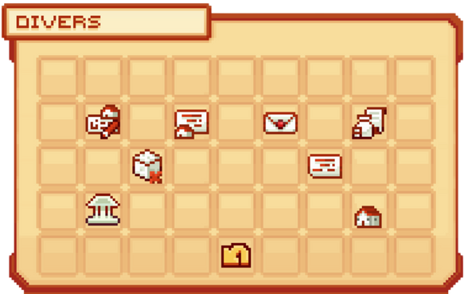

# 🏙️ Les Villes


**Tuto : Créer et gérer votre propre ville sur Evolucraft**


Les <mark style="color:green;">**villes**</mark> sont l'une des parties centrales du serveur. C'est à l'intérieur de celles-ci que vous pourrez **stocker votre stuff**, **créer vos builds** selon votre imagination ou encore **installer vos fermes** pour monter vos métiers ! À vous de créer le <mark style="color:green;">**RP**</mark> qui vous convient, selon votre imagination !

## <mark style="color:green;">**💠 Comment créer ou rejoindre une ville ? 🏙️**</mark>

Nous vous invitons à consulter ce petit tuto pour savoir comment : [<mark style="color:green;">**Être dans une ville 🏙️**</mark>](https://wiki.evolucraft.fr/tuto-et-astuce/creer-une-ville)

## <mark style="color:green;">**💠 Comment agrandir ma ville ? 📈**</mark>

<mark style="color:green;">**Agrandir votre ville**</mark> vous permet d'étendre votre territoire afin de réaliser des constructions de plus en plus impressionnantes. C'est aussi un moyen d’augmenter le <mark style="color:green;">**niveau de votre ville**</mark> dans une quête secondaire.

Pour l'agrandir, vous devez déposer de l'<mark style="color:green;">**argent dans la banque**</mark> de votre ville avec la commande <mark style="color:green;">**`/v bank deposit [montant]`**</mark>. À noter que le coût d'un <mark style="color:green;">**claim**</mark> dépend du <mark style="color:green;">**niveau de votre ville**</mark>.

Ensuite, en étant sur un <mark style="color:green;">**chunk adjacent**</mark> à votre ville, effectuez la commande <mark style="color:green;">**`/v claim`**</mark>. L'argent requis sera retiré de la banque de votre ville.


🔎 <mark style="color:green;">**Remarque**</mark> : Pour visualiser les différents chunks, utilisez le raccourci clavier **F3+G**, ou la commande <mark style="color:green;">**`/v view`**</mark> afin de mieux visualiser la bordure de votre territoire.


Si vous vous êtes trompé de chunk à claim et souhaitez le retirer, utilisez la commande <mark style="color:green;">**`/v unclaim`**</mark> en étant **dans le chunk concerné**.

Et voilà, vous avez un chunk de plus dans votre ville ! 🎉

## <mark style="color:green;">**💠 Comment ajouter un membre à ma ville ? 👩🏻‍🤝‍🧑🏽**</mark>

Invitez vos amis à rejoindre votre ville afin de vous aider à l’agencer ou même conquérir le monde d’Évolucraft ! 😎

Pour cela, utilisez la commande <mark style="color:green;">**`/v invite [Pseudo]`**</mark>.  
L'autre joueur devra accepter avec <mark style="color:green;">**`/v accept [Nom de votre ville]`**</mark>.

Si vous vous êtes trompé dans l'invitation, vous pouvez la supprimer via le menu <mark style="color:green;">**`/v` → Divers → Invitation**</mark>, puis appuyez sur votre touche de jet d'item en visant la tête du joueur.

## <mark style="color:green;">**💠 Comment supprimer ma ville ? ❌**</mark>

Vous souhaitez supprimer votre ville pour en rejoindre une autre ou pour toute autre raison ? ⚠️ Attention : cette action est **irréversible** !

Avant de la supprimer, pensez à :  
- <mark style="color:green;">**Retirer l’argent de la banque**</mark> avec <mark style="color:green;">**`/v bank withdraw [montant]`**</mark> 💰  
- <mark style="color:green;">**Récupérer vos coffres et items précieux**</mark> ✨  


Après la suppression, seuls les blocs posés et coffres resteront, mais ils seront inaccessibles jusqu’à ce qu’une autre personne claim la zone. Supprimez vos coffres privés pour éviter des tickets en cas de surclaim 🤗.


Une fois prêt, utilisez <mark style="color:green;">**`/v disband`**</mark> puis <mark style="color:green;">**`/v disband --confirm`**</mark> pour supprimer définitivement votre ville.

## <mark style="color:green;">**💠 Comment fonctionne la commande `/ville` ? 🏙️**</mark>

Lors de la création de votre ville, vous pourrez accéder à un menu pour <mark style="color:green;">**gérer et personnaliser**</mark> tous ses aspects. Pour y accéder : <mark style="color:green;">**`/ville`**</mark> ou <mark style="color:green;">**`/v`**</mark>.

<figure><figcaption>
<strong>Aperçu du </strong><mark style="color:green;"><strong>`/ville`</strong></mark>
</figcaption></figure>

### 🔶 <mark style="color:green;">**Téléportation 📌**</mark>

Ce bouton permet de se téléporter au point de spawn de votre ville, comme avec la commande <mark style="color:green;">/v spawn</mark>.

### 🔶 <mark style="color:green;">**Membres 👥**</mark>
Gérez vos membres grâce aux [<mark style="color:green;">**rôles 🎭**</mark>](https://wiki.evolucraft.fr/le-gameplay/les-villes/les-roles).

Pour cela, il vous suffit de passer votre souris sur la tête du joueur puis de suivre les instructions suivantes :
* <mark style="color:green;">**Accéder 🖼️**</mark> : Permet de voir le /profile du joueur. _(Clic gauche)_
* <mark style="color:green;">**Promouvoir ⏫**</mark> : Permet d’attribuer un rôle supérieur au joueur. _(Touche d'accroupissement + Clic gauche)_
* <mark style="color:green;">**Destituer ⏬**</mark> : Permet de rétrograder le rôle du joueur. _(Touche d'accroupissement + Clic droit)_

<figure><figcaption></figcaption></figure>

### 🔶 <mark style="color:green;">**Divers 📂**</mark>
Dans ce menu Divers, vous pouvez trouver l’aspect visuel ainsi que les informations principales de la ville pour vos habitants, comme :

* <mark style="color:green;">**Nom de votre ville 🚩**</mark> : Permet de changer le nom de votre ville 
* <mark style="color:green;">**Description de votre ville 📜**</mark> : Permet de changer la description de votre ville 
* <mark style="color:green;">**Invitations 📧**</mark> : Permet d'envoyer ou de supprimer une invitation d'adhésion à la ville. _(Seuls les joueurs ayant la permission "Inviter des Joueurs" peuvent y accéder)_ 
* <mark style="color:green;">**Impôts 🧾**</mark> : Permet de voir les impôts que vous payez dans la ville que vous avez selectionner.
* <mark style="color:green;">**Limites 🚦**</mark> : Permet de vérifier les limites de blocs par chunk imposées par le serveur, consultables également avec la commande `/limites`
* <mark style="color:green;">**Historique ⏪**</mark> : Permet de voir les interactions réalisées dans la ville (arrivée d’un joueur, retrait d’un joueur, infos de la banque de la ville, etc.) 
* <mark style="color:green;">**Banque 💰**</mark> : Permet de gérer (pour déposer ou retirer) l'argent dans la banque de la ville. 
* <mark style="color:green;">**Couleur du Chat Ville 🎨**</mark> : Permet de changer la couleur de votre tchat de ville entre <mark style="color:green;">Vert</mark>, <mark style="color:blue;">Bleu</mark> et <mark style="color:purple;">Violet/Rose</mark>.

<figure><figcaption>
<strong>Aperçu des </strong><mark style="color:green;"><strong>Options Divers</strong></mark> du </strong><mark style="color:green;"><strong>/ville</strong></mark>
</figcaption></figure>

### 🔶 <mark style="color:green;">**Sous-Zones 🗃️**</mark>
Les <mark style="color:green;">sous-zones</mark> permettent de définir une <mark style="color:green;">région</mark> d’un <mark style="color:green;">point A</mark> à un <mark style="color:green;">point B</mark> à l’intérieur de la <mark style="color:green;">ville</mark> (cube ou parallélépipède).
Elles permettent de <mark style="color:green;">restreindre</mark> ou <mark style="color:green;">ouvrir des permissions</mark> à certains joueurs dans une <mark style="color:green;">partie spécifique</mark> de la ville, sans leur donner accès aux autres zones.
C’est souvent utilisé pour des <mark style="color:green;">champs publics</mark>, des <mark style="color:green;">locations</mark> ou la <mark style="color:green;">gestion de la ville</mark>.

👉 Pour plus d’infos sur [<mark style="color:green;">**Les Sous-Zones 🗃️**</mark>](https://wiki.evolucraft.fr/le-gameplay/les-villes/les-sous-zones)

### 🔶 <mark style="color:green;">**Rôles 🎭**</mark>

Attribuez des <mark style="color:green;">**permissions**</mark> différentes selon les joueurs afin de garantir la sécurité et de structurer une hiérarchie RP.

👉 Pour plus d’infos sur [<mark style="color:green;">**Les Rôles 🎭**</mark>](https://wiki.evolucraft.fr/le-gameplay/les-villes/les-roles)

### 🔶 <mark style="color:green;">**Classement Villes 🏆**</mark>

Chaque mois, les villes s’affrontent pour obtenir le meilleur score. Récoltez un maximum de <mark style="color:green;">**points**</mark> pour devenir la meilleure ville du serveur !  

👉 Pour plus d’infos sur [<mark style="color:green;">**Le Classement Villes 🏆**</mark>](https://wiki.evolucraft.fr/le-gameplay/les-villes/classement-ville)

### 🔶 <mark style="color:green;">**Niveau de Ville 🔝**</mark>

Les <mark style="color:green;">**niveaux de ville**</mark> augmentent le nombre de <mark style="color:green;">**claims**</mark> disponibles à certains paliers.

👉 Pour plus d’infos sur [<mark style="color:green;">**Les Niveaux de Ville 🔝**</mark>](https://wiki.evolucraft.fr/le-gameplay/les-villes/les-niveaux-de-ville)

### 🔶 <mark style="color:green;">**Paramètres de Ville ⚙️**</mark>

Gérez différents <mark style="color:green;">**paramètres**</mark> (spawn des animaux, activation du PvP, etc.) pour personnaliser votre expérience.

## <mark style="color:green;">**💠 Les commandes diverses des villes 🕹️**</mark>


`[...]` Signifie que le paramètre est obligatoire

`<...>` Signifie que vous pouvez mettre une chaîne de caractères avec des espaces

`{...}` Signifie que le paramètre est optionnel


Voici les commandes à connaître pour gérer votre ville :

### 🔸 Globales 🌏

* <mark style="color:green;">**`/v create <nom de votre ville>`**</mark> : Crée votre ville.
* <mark style="color:green;">**`/v`**</mark> : Ouvre le menu de votre ville.
* <mark style="color:green;">**`/v sethome`**</mark><mark style="color:green;">**&#x20;**</mark><mark style="color:green;">**/**</mark><mark style="color:green;">**&#x20;**</mark><mark style="color:green;">**`/v setspawn`**</mark> : Définit le point de téléportation de votre ville.
* <mark style="color:green;">**`/v home`**</mark><mark style="color:green;">**&#x20;**</mark><mark style="color:green;">**/**</mark><mark style="color:green;">**&#x20;**</mark><mark style="color:green;">**`/v spawn`**</mark> : Se téléporte au home de votre ville.
* <mark style="color:green;">**`/v leave <nom de votre ville>`**</mark> : Quitte la ville choisie.
* <mark style="color:green;">**`/v info [nom de la ville]`**</mark> : Affiche les informations de la ville.
* <mark style="color:green;">**`/v select`**</mark> : Permet de choisir sa ville principale.
* <mark style="color:green;">**`/v pinfo [joueur]`**</mark> : Donne des informations concernant la ville du joueur.
* <mark style="color:green;">**`/v list`**</mark> : Donne la liste de toutes les villes présentes sur le serveur.
* <mark style="color:green;">**`/v player [joueur]`**</mark> : Donne les informations d'un joueur : ville, statut dans la ville, dernière connexion.
* <mark style="color:green;">**`/v bank deposit [montant]`**</mark> : Permet de déposer de l'argent dans votre banque de ville.
* <mark style="color:green;">**`/v bank withdraw [montant]`**</mark> : Permet de reprendre de l'argent dans votre banque de ville. _(Accessible si vous avez la permission dans votre rôle de ville)_
* <mark style="color:green;">**`/v disband --confirm`**</mark> : Supprime votre ville.


**Important 🚨** Avant de confirmer la suppression de votre ville, pensez à récupérer l’argent de votre ville avec la commande `/v bank withdraw [montant]` et à récupérer le stuff qui s’y trouve dans votre ville !


### 🔸 Gestion des joueurs 👩🏻‍🤝‍🧑🏽

* <mark style="color:green;">**`/v add [joueur]`**</mark><mark style="color:green;">**&#x20;**</mark><mark style="color:green;">**/**</mark><mark style="color:green;">**&#x20;**</mark><mark style="color:green;">**`/v invite [joueur]`**</mark> : Invite un joueur dans votre ville.
* <mark style="color:green;">**`/v accept [joueur]`**</mark> : Accepte la demande d'adhésion d'un joueur à votre ville.
* <mark style="color:green;">**`/v kick [joueur]`**</mark> : Retire un joueur de votre ville.
* <mark style="color:green;">**`/v ban [joueur]`**</mark> : Bannit un joueur de votre ville.
* <mark style="color:green;">**`/v unban [joueur]`**</mark> : Retire le bannissement du joueur visé.
* <mark style="color:green;">**`/v setrole [joueur] [rôle]`**</mark> : Modifie le rôle des joueurs présents dans votre ville.
* <mark style="color:green;">**`/v setowner [joueur]`**</mark> : Donne le rôle de maire au joueur désigné.
* <mark style="color:green;">**`/v members`**</mark> : Donne la liste des joueurs connectés dans la ville.

### 🔸 Gestion des claims 🗺️

* <mark style="color:green;">**`/v map`**</mark> : Donne la topographie des villes à l'endroit où vous vous situez.
* <mark style="color:green;">**`/v claim`**</mark> : Claim le chunk sur lequel vous vous situez.
* <mark style="color:green;">**`/v unclaim`**</mark> : Retire le claim du chunk sur lequel vous vous situez.
* <mark style="color:green;">**`/v autoclaim`**</mark> : Claim automatiquement les chunks sur lesquels vous marchez.
* <mark style="color:green;">**`/v view`**</mark> : Affiche la délimitation de votre ville avec des particules vertes.

### 🔸 Chat de ville 💬

* <mark style="color:green;">**`/v chat`**</mark> : Active le chat de votre ville.
* <mark style="color:green;">**`/v chat message`**</mark> : Écrit dans le chat de la ville sans l'activer.


Votre futur royaume est à vos pieds !

