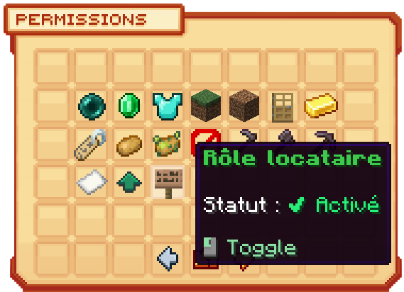

# 🗃️ Les sous-zones

Les sous-zones sont un moyen de surclaim sa ville en définissant une région d'un point A à un point B à l'intérieur de celle-ci, qui sera obligatoirement un parallélépipède ou un cube. Elles permettent de modifier les actions que certains joueurs peuvent effectuer dans cet endroit, sans pour autant leur donner accès à d'autres endroits de la ville. Elles sont souvent utilisées pour réaliser des champs publics, des locations ou pour la gestion de la ville.

## <mark style="color:green;">**💠 Comment créer une sous-zone ? 🤔**</mark>


**REMARQUE ⚠️ : Avant de commencer la création, il est <mark style="color:green;">impératif que vous soyez dans l'un de ces deux cas pour pouvoir créer des sous-zones</mark> :**
* <mark style="color:green;">**Être maire de la ville**</mark>
* <mark style="color:green;">**Avoir, via votre rôle, le périmètre de gestion des sous-zones**</mark>


### <mark style="color:green;">Étape 1️⃣</mark>
**Dans <mark style="color:green;">le menu de la ville</mark>, via la commande `/ville`, tout en pensant à bien utiliser `/v select` sur la bonne ville, cliquez sur <mark style="color:green;">"Sous-Zones"</mark> comme sur l'image ci-dessous.**
<figure><figcaption></figcaption></figure>

### <mark style="color:green;">Étape 2️⃣</mark>
**Dans <mark style="color:green;">ce menu des Sous-Zones</mark>, où vous retrouverez toutes les sous-zones de votre ville déjà créées, cliquez sur "<mark style="color:green;">Nouvelle zone</mark>", représentée par la petite gemme à droite.**
<figure><figcaption></figcaption></figure>

### <mark style="color:green;">Étape 3️⃣</mark>

**À la suite de cela, <mark style="color:green;">une houe en or</mark> apparaîtra dans votre main. Elle vous permet de <mark style="color:green;">délimiter une zone cubique</mark>, votre sous-zone.**

**Pour délimiter votre sous-zone, tout <mark style="color:green;">en gardant la houe en or</mark> lors des prochaines actions, faites <mark style="color:green;">un clic GAUCHE</mark> pour déterminer la première position de votre parallélépipède, puis <mark style="color:green;">un clic DROIT</mark> sur l'autre extrémité du parallélépipède afin de choisir la deuxième position.**

**Cela vous permettra de créer <mark style="color:green;">une zone cubique délimitée par un point A et un point B</mark>.**

<figure><figcaption>
<strong>_La visualisation des délimitations de la zone n'est pas issue de ce plugin_</strong>
</figcaption></figure>


🔎 <mark style="color:green;">**Remarque**</mark> : Lorsque vous sélectionnez vos deux points, des particules s'afficheront pour vous montrer la délimitation de la zone effectuée, ce qui vous permet de vérifier si la sélection vous convient.


### <mark style="color:green;">Étape 4️⃣</mark>

**Effectuez la commande `/ville subarea selection create [Insérez un nom pour votre sous-zone]` afin de créer la sous-zone.**


ATTENTION ⚠️ : Vous ne pouvez pas mettre d'espace dans le nom de votre sous-zone.


**Toutes nos félicitations ! 🥳 Vous savez à présent créer de nouvelles sous-zones, gérables dans la section "Zones" de votre menu ville.**

## <mark style="color:green;">**💠 Comment créer une location ? 🤔**</mark>

**Créer une location vous permet de louer une zone pour une journée à un prix que vous décidez, dans la zone que vous avez choisie. Très pratique pour louer vos farms ou taxer davantage vos citoyens afin qu'ils disposent d'un endroit tranquille à eux.**

**Pour réaliser une location, il vous faut être muni <mark style="color:green;">d'un panneau vanilla</mark>, peu importe le type de bois, et y inscrire <mark style="color:green;">cette forme ci-dessous</mark> tout en étant dans la sous-zone où aura lieu la location :**
<figure><figcaption>
<strong>Le texte entre parenthèses doit être modifié pour correspondre au nom de votre sous-zone et au prix de la location</strong>
</figcaption></figure>


**REMARQUE 🔍 : Le montant maximum pour une location peut aller jusqu'à 10 millions par jour.**.


Une fois terminé, faites "Terminer" sur le panneau et votre panneau de location sera créé !

### <mark style="color:green;"><strong>Étape 5️⃣</strong></mark>

Pensez, pour le rôle <mark style="color:green;"><strong>Visiteur</strong></mark> de la <mark style="color:green;"><strong>sous-zone</strong></mark>, à activer la permission de gestion <mark style="color:green;"><strong>Rôle Locataire</strong></mark> afin que les joueurs de votre ville puissent payer la location de la sous-zone.

Pour cela, allez dans votre <mark style="color:green;"><strong>`/ville`</strong></mark>, puis dans <mark style="color:green;"><strong>sous-zone</strong></mark> et sélectionnez la sous-zone en question.

<figure><figcaption></figcaption></figure>

Ensuite, cliquez sur <mark style="color:green;"><strong>Rôles</strong></mark>, pour continuer sur <mark style="color:green;"><strong>Visiteurs</strong></mark> et enfin cliquez sur <mark style="color:green;"><strong>Permission de Gestion</strong></mark>, représentée par un <mark style="color:green;"><strong>plastron en diamant</strong></mark> :

<figure><figcaption></figcaption></figure>

Pour finir, cliquez sur le <mark style="color:green;"><strong>panneau en acajou</strong></mark> correspondant au <mark style="color:green;"><strong>Rôle Locataire</strong></mark> pour activer l'option d'achat de la location de cette sous-zone.

<figure><figcaption></figcaption></figure>

Et voilà ! Votre location est maintenant prête !

## <mark style="color:green;">**💠 Autres commandes 🤨**</mark>

* <mark style="color:green;">**/ville setspawn [Nom de la sous-zone]**</mark> : Permet de déplacer le spawn d'une sous-zone.
* <mark style="color:green;">**/ville subarea view [Nom de la sous-zone]**</mark> : Permet de voir les contours de toutes les sous-zones créer dans la ville.
* <mark style="color:green;">**/ville subarea kick [Nom de la sous-zone] [Pseudo]**</mark> : Permet d'exclure un membre de la sous-zone qu'il avait rejointe.


**REMARQUE 🔍 : La personne ayant pris la location sera remboursée au prorata du temps restant**.

