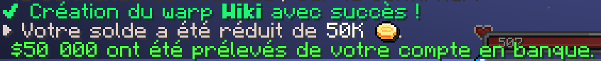

# 🛒 Créer un shop

Les **<mark style="color:green;">shops de joueurs</mark>** ont toujours été un **<mark style="color:green;">pilier essentiel</mark>** des **<mark style="color:green;">relations entre joueurs</mark>**.  
Ils permettent de **<mark style="color:green;">créer des échanges</mark>**, de développer des **<mark style="color:green;">relations commerciales</mark>**, de pratiquer la **<mark style="color:green;">négociation</mark>**, mais aussi de participer à de véritables **<mark style="color:green;">guerres de marché</mark>** où chaque joueur cherche à proposer les meilleurs prix et les meilleures offres. Alors, vous aussi, vous souhaitez **<mark style="color:green;">participer à cette aventure économique</mark>** en créant votre **<mark style="color:green;">shop</mark>** ?

Cette page est là pour vous **<mark style="color:green;">guider pas à pas</mark>** et vous présenter **<mark style="color:green;">tout ce qu’il faut savoir</mark>** afin de **<mark style="color:green;">créer et gérer votre shop</mark>** dans les meilleures conditions !

## <mark style="color:green;">**🚩 Créer un pwarp**</mark>

Chaque **<mark style="color:green;">joueur</mark>** dispose de **<mark style="color:green;">2 pwarps</mark>** qu’il peut **<mark style="color:green;">créer librement dans une ville</mark>** où il est présent. Vous avez ainsi la possibilité de les **<mark style="color:green;">regrouper</mark>** dans une **<mark style="color:green;">même ville</mark>** afin de centraliser votre activité, ou au contraire de les **<mark style="color:green;">disperser</mark>** dans **<mark style="color:green;">deux villes différentes</mark>** pour toucher un public plus large.

Pour créer un pwarp, il vous suffira de réaliser la commande **<mark style="color:green;">`/pwarp create [nom]`</mark>**. Une fois effectuée, pour valider la création, il faudra réaliser à nouveau **<mark style="color:green;">la même commande</mark>** dans la seconde qui suit.

Lorsque vous recevrez ce message, cela confirmera que la **<mark style="color:green;">création du pwarp</mark>** a bien été effectuée. Les joueurs souhaitant visiter votre ville pourront alors utiliser la commande **<mark style="color:green;">`/pwarp [nom du pwarp]`</mark>**.  
<figure><figcaption><strong>Message de la </strong><mark style="color:green;"><strong>création du pwarp</strong></mark></figcaption></figure>


💡 **REMARQUE :** Pensez à créer votre **<mark style="color:green;">pwarp</mark>** au plus proche de vos **<mark style="color:green;">zones de shop</mark>** afin d’éviter que les autres joueurs soient téléportés trop loin ou qu’ils ne puissent pas y accéder facilement.


Si vous souhaitez **<mark style="color:green;">plus d’informations</mark>** sur les **<mark style="color:green;">Pwarps</mark>**, nous vous conseillons de consulter la **<mark style="color:green;">page dédiée</mark>** à ce sujet :  
[**<mark style="color:green;">Page sur les Pwarps 🚩</mark>**](https://wiki.evolucraft.fr/le-gameplay/les-villes/les-pwarps)

## <mark style="color:green;">**👜 Les coffres de shops**</mark>

Sur le <mark style="color:green;"><strong>serveur</strong></mark>, vous pouvez aussi bien <mark style="color:green;"><strong>vendre des items</strong></mark> que <mark style="color:green;"><strong>racheter des items</strong></mark>. À vous de définir votre <mark style="color:green;"><strong>stratégie commerciale</strong></mark> en choisissant de créer uniquement des <mark style="color:green;"><strong>coffres de vente</strong></mark>, uniquement des <mark style="color:green;"><strong>coffres d’achat</strong></mark>, ou bien de <mark style="color:green;"><strong>combiner les deux</strong></mark> selon vos besoins et l’offre du marché. Cependant, gardez en tête que vous êtes <mark style="color:green;"><strong>limité</strong></mark> par le <mark style="color:green;"><strong>nombre de coffres de shop autorisés</strong></mark>, lequel dépend directement de votre <mark style="color:green;"><strong>rang / grade</strong></mark> sur le serveur.

### <mark style="color:green;">**🏷️ Créer un coffre de vente**</mark>
* <mark style="color:green;">**Étape 1️⃣ :**</mark> Placez le coffre à l’endroit où vous souhaitez installer votre shop.
* <mark style="color:green;">**Étape 2️⃣ :**</mark> Prenez en main l'item que vous souhaitez mettre en vente, puis cliquez avec le bouton gauche de votre souris sur le coffre.
* <mark style="color:green;">**Étape 3️⃣ :**</mark> Insérez le prix unitaire dans le chat auquel vous souhaitez que les autres joueurs achètent l’item.

Et voilà ! Votre coffre de vente est créé 🤩 !

### <mark style="color:green;">**🏷️ Créer un coffre de rachat**</mark>
* <mark style="color:green;">**Étape 1️⃣ :**</mark> Réaliser les mêmes étapes que pour faire un coffre de vente, tout en mettant votre prix d'achat à la place du prix de vente.
* <mark style="color:green;">**Étape 2️⃣ :**</mark> Tapez **`/qs buy`** pour transformer votre coffre de vente en coffre d'achat.

<figure><figcaption>
<strong>Aperçu d'un <mark style="color:green;">coffre de vente d'item</mark></strong>
</figcaption></figure>

### <mark style="color:green;">**💡 Quelques commandes en plus pour vos coffres de shop !**</mark>

* <mark style="color:green;">**`/qs create [montant]`**</mark>**&#x20;: Permet de créer un coffre de vente (⚠: Il faudra cependant avoir l'item en main et en regardant le coffre).**
* <mark style="color:green;">**`/qs price [montant]`**</mark>**&#x20;: Permet de modifier le prix de votre coffre de vente.**
* <mark style="color:green;">**`/qs sell`**</mark>**&#x20;: Permet de transformer un coffre d'achat en un coffre de vente.**
* <mark style="color:green;">**`/qs item`**</mark>**&#x20;: Permet de changer l'item en vente.**
* <mark style="color:green;">**`/qs staff add [pseudo]`**</mark>**&#x20;: Permet d'ajouter un membre.**
* <mark style="color:green;">**`/qs toggledisplay`**</mark>**&#x20;: Permet d'afficher ou de masquer l'item au-dessus du coffre.**

## <mark style="color:green;">**🏪 Le Finditem**</mark>

Le Finditem vous permet de **chercher un item** parmi **tous les coffres de vente existants**, et vous téléportera au **pwarp le plus proche du coffre de vente**. Lors de l'affichage de sa recherche, il indiquera dans un **ordre croissant les prix unitaires** de chaque shop.

Pour cela, réalisez la commande suivante en fonction de votre besoin :

* <mark style="color:green;">**`/finditem acheter [id de l'item / bout d'un mot de l'item]`**</mark>**&#x20;: Permet de chercher tous les coffres où les joueurs vendent l'item.**
* <mark style="color:green;">**`/finditem vendre [id de l'item / bout d'un mot de l'item]`**</mark>**&#x20;: Permet de chercher tous les coffres où les joueurs achètent l'item.**

<figure><figcaption>
<strong>Aperçu de l’interface du <mark style="color:green;">/finditem</mark></strong>
</figcaption></figure>

**Et voilà, vous savez tout pour créer votre magnifique shop ! ✨**
