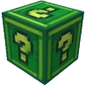
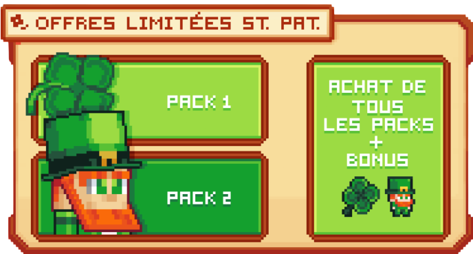

# 🎲 Les Lucky Block

Les <mark style="color:green;">**lucky blocks**</mark> sont des items rajoutés pour <mark style="color:green;">**la mise à jour Saint-Patrick 2026**</mark> vous permettant d’obtenir des récompenses en passant par des <mark style="color:green;">**items hyper rares comme des pets**</mark>, à <mark style="color:green;">**une humilation dans le chat public**</mark> afin de jouer avec vos nerfs et tester vos limites sur un aspect du jeu que beaucoup apprécie, je parle bien entendu du <mark style="color:green;">**GAMBLING**</mark> ! ✨

## 💠 <mark style="color:green;">**Quels sont les moyens d'obtention d'un lucky blocks**</mark> 🎊

Pour obtenir les précieux sésament, il y a trois façon d'en obtenir :

### 🔹 <mark style="color:blue;">**La Pêche**</mark> 🎣

La pêche est enfin mis en avant dans une mis à jour où vous pouvez en obtenir peut importe le monde où vous êtes, avec n'importe quel monde. Mais attention les pourcentages sont assez faible, il faudra être très chanceux pour en obtenir !

<table border="1" cellspacing="0" cellpadding="6">
  <tr>
    <td><mark style="color:green;"><strong>Type de Lucky Block 🎲</strong></mark></td>
    <td><mark style="color:green;"><strong>Pourcentage d'obtention 📊</strong></mark></td>
  </tr>
  <tr>
    <td>
      
<figure><figcaption></figcaption></figure>

      
<mark style="color:green;"><strong>Lucky Block Commun</strong></mark>

    </td>
    <td><mark style="color:green;"><strong>2.20%</strong></mark></td>
  </tr>
  <tr>
    <td>
      
<figure><figcaption></figcaption></figure>

      
<mark style="color:yellow;"><strong>Lucky Block Commun</strong></mark>

    </td>
    <td><mark style="color:green;"><strong>0.29%</strong></mark></td>
  </tr>
</table>

### 🔹 <mark style="color:blue;">**Les mobs en donjon **</mark> 🧟‍♂️

En plus d'xp votre classe en tuant ces mobs, vous avez une petite probabilités suivant le donjon effectuer que l'un de vous permet de drop un lucky block en tuant des mobs dans les donjons. Les probabilité d'en obtenir sont différents suivant le donjon effectuer mais sur chaque mob tué où vous recevez un lucky block, ces derniers sont également donné à vos coéquipiers du donjon qui sont encore en vie.

<table border="1" cellspacing="0" cellpadding="6">
  <tr>
    <td><mark style="color:green;"><strong>Type de Donjon 🎲</strong></mark></td>
    <td>
      
<mark style="color:green;"><strong>Pourcentage d'obtention 📊</strong></mark>

      
<mark style="color:green;"><strong>Lucky Block Commun ❇️</strong></mark>

    </td>
    <td>
      
<mark style="color:yellow;"><strong>Pourcentage d'obtention 📊</strong></mark>

      
<mark style="color:yellow;"><strong>Lucky Block Gold ✴️</strong></mark>

    </td>
  </tr>
  <tr>
    <td>🟩 <strong><a href="https://wiki.evolucraft.fr/codex/donjons/commun"><mark style="color:green;">Commun</mark></a></strong></td>
    <td><mark style="color:green;"><strong>0.90%</strong></mark></td>
    <td><mark style="color:yellow;"><strong>0.06%</strong></mark></td>
  </tr>
  <tr>
    <td>🟨 <strong><a href="https://wiki.evolucraft.fr/codex/donjons/rare"><mark style="color:yellow;">Rare</mark></a></strong></td>
    <td><mark style="color:green;"><strong>1.05%</strong></mark></td>
    <td><mark style="color:yellow;"><strong>0.07%</strong></mark></td>
  </tr>
  <tr>
    <td>🟦 <strong><a href="https://wiki.evolucraft.fr/codex/donjons/epique"><mark style="color:blue;">Épique</mark></a></strong></td>
    <td><mark style="color:green;"><strong>1.43%</strong></mark></td>
    <td><mark style="color:yellow;"><strong>0.095%</strong></mark></td>
  </tr>
  <tr>
    <td>🟪 <strong><a href="https://wiki.evolucraft.fr/codex/donjons/legendaire"><mark style="color:purple;">Légendaire</mark></a></strong></td>
    <td><mark style="color:green;"><strong>2.70%</strong></mark></td>
    <td><mark style="color:yellow;"><strong>0.18%</strong></mark></td>
  </tr>
  <tr>
    <td>🟥 <strong><a href="https://wiki.evolucraft.fr/codex/donjons/mythique"><mark style="color:red;">Mythique</mark></a></strong></td>
    <td><mark style="color:green;"><strong>3.00%</strong></mark></td>
    <td><mark style="color:yellow;"><strong>0.20%</strong></mark></td>
  </tr>
  <tr>
    <td>🐉 <strong><a href="https://wiki.evolucraft.fr/codex/donjons/draconique"><mark style="color:orange;">Donjon Draconique</mark></a></strong></td>
    <td><mark style="color:green;"><strong>0.83%</strong></mark></td>
    <td><mark style="color:yellow;"><strong>0.055%</strong></mark></td>
  </tr>
  <tr>
    <td>🌊 <strong><a href="https://wiki.evolucraft.fr/codex/donjons/abyssal"><mark style="color:blue;">Donjon Abyssal</mark></a></strong></td>
    <td><mark style="color:green;"><strong>1.35%</strong></mark></td>
    <td><mark style="color:yellow;"><strong>0.09%</strong></mark></td>
  </tr>
  <tr>
    <td>🧛‍♂️ <strong><a href="https://wiki.evolucraft.fr/codex/donjons/halloween"><mark style="color:orange;">Donjon Halloween</mark></a></strong></td>
    <td><mark style="color:green;"><strong>1.28%</strong></mark></td>
    <td><mark style="color:yellow;"><strong>0.085%</strong></mark></td>
  </tr>
  <tr>
    <td>❄️ <strong><a href="https://wiki.evolucraft.fr/codex/donjons/givre15"><mark style="color:blue;">Donjon Givré Commun</mark></a></strong></td>
    <td><mark style="color:green;"><strong>1.50%</strong></mark></td>
    <td><mark style="color:yellow;"><strong>0.10%</strong></mark></td>
  </tr>
  <tr>
    <td>🌟 <strong><a href="https://wiki.evolucraft.fr/codex/donjons/givre40"><mark style="color:blue;">Donjon Givré Épique</mark></a></strong></td>
    <td><mark style="color:green;"><strong>1.50%</strong></mark></td>
    <td><mark style="color:yellow;"><strong>0.10%</strong></mark></td>
  </tr>
  <tr>
    <td>❤️ <strong><a href="https://wiki.evolucraft.fr/codex/donjons/amour"><mark style="color:red;">Donjon Amour</mark></a></strong></td>
    <td><mark style="color:green;"><strong>1.35%</strong></mark></td>
    <td><mark style="color:yellow;"><strong>0.09%</strong></mark></td>
  </tr>
  <tr>
    <td>🏹 <strong><a href="https://wiki.evolucraft.fr/codex/donjons/cupidon"><mark style="color:red;">Donjon Cupidon</mark></a></strong></td>
    <td><mark style="color:green;"><strong>1.50%</strong></mark></td>
    <td><mark style="color:yellow;"><strong>0.10%</strong></mark></td>
  </tr>
  <tr>
    <td>🐰 <strong><a href="https://wiki.evolucraft.fr/codex/donjons/roi-lapin"><mark style="color:yellow;">Donjon Terrier du Roi Lapin</mark></a></strong></td>
    <td><mark style="color:green;"><strong>1.35%</strong></mark></td>
    <td><mark style="color:yellow;"><strong>0.09%</strong></mark></td>
  </tr>
  <tr>
    <td>🍫 <strong><a href="https://wiki.evolucraft.fr/codex/donjons/fabrique-chocolat"><mark style="color:yellow;">Donjon Fabrique de Chocolat</mark></a></strong></td>
    <td><mark style="color:green;"><strong>1.50%</strong></mark></td>
    <td><mark style="color:yellow;"><strong>0.10%</strong></mark></td>
  </tr>
  <tr>
    <td>🎃 <strong><a href="https://wiki.evolucraft.fr/codex/donjons/citrouille"><mark style="color:red;">Donjon Citrouille</mark></a></strong></td>
    <td><mark style="color:green;"><strong>1.35%</strong></mark></td>
    <td><mark style="color:yellow;"><strong>0.09%</strong></mark></td>
  </tr>
  <tr>
    <td>🩸 <strong><a href="https://wiki.evolucraft.fr/codex/donjons/lune-de-sang"><mark style="color:red;">Donjon Lune de Sang</mark></a></strong></td>
    <td><mark style="color:green;"><strong>3.00%</strong></mark></td>
    <td><mark style="color:yellow;"><strong>0.20%</strong></mark></td>
  </tr>
  <tr>
    <td>⛰️ <strong><a href="https://wiki.evolucraft.fr/codex/donjons/caverne"><mark style="color:blue;">Donjon Caverne</mark></a></strong></td>
    <td><mark style="color:green;"><strong>1.05%</strong></mark></td>
    <td><mark style="color:yellow;"><strong>0.07%</strong></mark></td>
  </tr>
  <tr>
    <td>⚗️ <strong><a href="https://wiki.evolucraft.fr/codex/donjons/labo"><mark style="color:blue;">Donjon Laboratoire</mark></a></strong></td>
    <td><mark style="color:green;"><strong>1.05%</strong></mark></td>
    <td><mark style="color:yellow;"><strong>0.07%</strong></mark></td>
  </tr>
</table>

### 🔹 <mark style="color:blue;">**Les packs limités **</mark> 🎁

Vous n'avez pas une grande envie de pêcher ou de faire des donjons mais vous voulez quand même vous tester dans le gambling ? Pas de panique ! Il y a la solution d'acheter des packs contenant en plus des lucky block d'autre items exclusifs comme des cosmétiques ou des packs de décoration.

Il existent de 2 offres de packs limité à 5 achats chacun, également une 3e offres est disponible offrant directement les 2 packs à prix réduit pour 3 achats maximum.

(Faire le récap)

<figure><figcaption>Interface du <strong><mark style="color:green;">/saintpatrick</mark></strong></figcaption></figure>

## 💠 <mark style="color:green;">**Les récompenses possible**</mark> 🎁

Il existe 2 type de lucky block donnant chacun différentes récompense possible. Pour connaitre en jeu ce qui est possible d'obtenir, il vous suffit de faire clique droit avec le lucky block en main sans viser de block. Sinon ce dernier se posera et s'ouvrira quelques seconde après avec une récompense promise. Mais quels sont les récompense possible :

### 🔹 <mark style="color:green;">**Lucky Block Commun ❇️**</mark>

### 🔹 <mark style="color:green;">**Lucky Block Gold ✴️**</mark>

