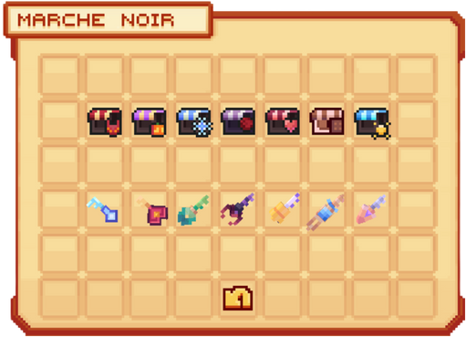
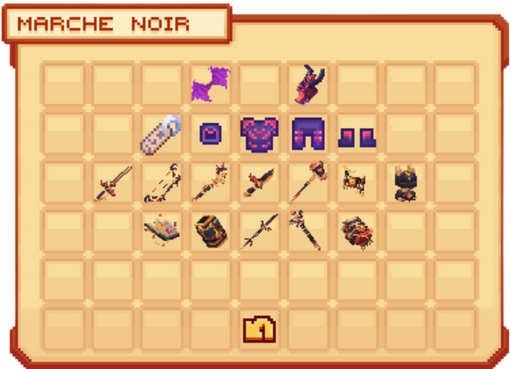
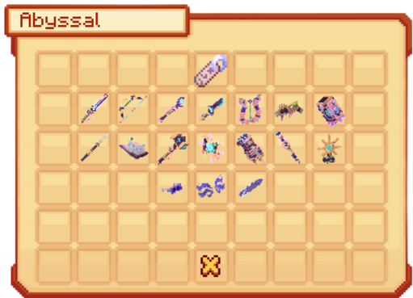
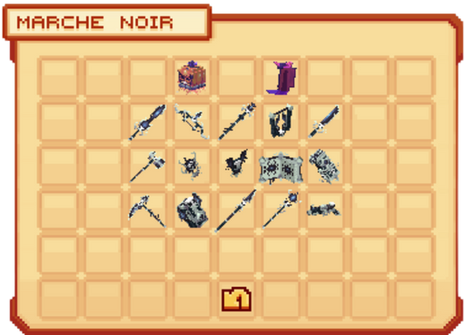
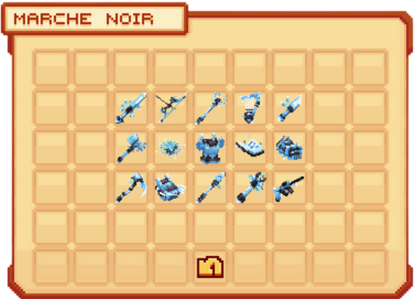
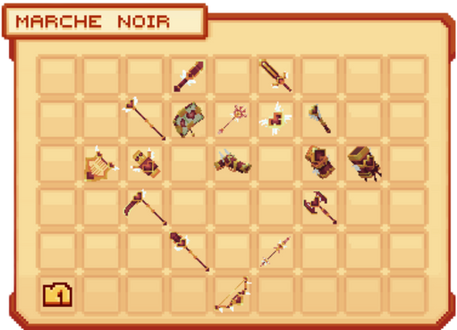
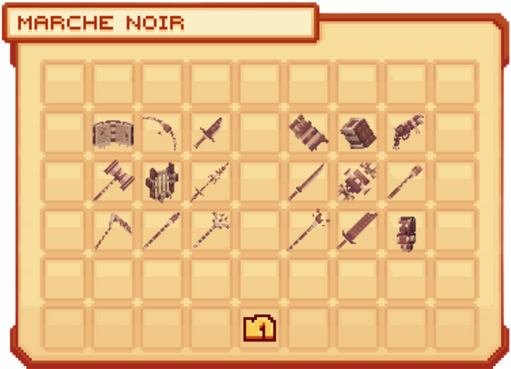
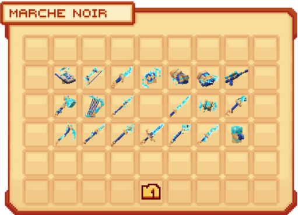
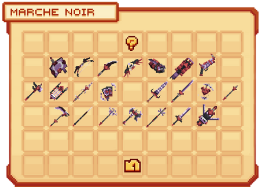

# 🧥 Le Marché Noir

Dans un **<mark style="color:green;">lieu mystère</mark>** du spawn, se cache un **<mark style="color:green;">marchand spécial</mark>** que seuls les plus curieux parviennent à trouver.  
Selon les rumeurs, il proposerait à la vente des **<mark style="color:green;">armes puissantes</mark>** et des **<mark style="color:green;">objets rares</mark>** provenant d’anciens **<mark style="color:green;">événements</mark>** qui ont marqué l’histoire d’**<mark style="color:green;">Évolucraft</mark>**.  
Pour en profiter, il faudra toutefois réunir certains **<mark style="color:green;">items précis</mark>** afin d’obtenir ces **<mark style="color:green;">trésors uniques</mark>**.

Mais quels sont les items disponibles...

<figure><figcaption><strong>Menu du  <mark style="color:green;">marché noir</mark></strong></figcaption></figure>

## 💠 <mark style="color:green;">Les items échangeables 📦</mark>

### 🔸 <mark style="color:orange;">Draconique 🐉</mark>

Ces items sont achetables avec des <mark style="color:orange;">**Cœurs de Dragon**</mark>, obtenables dans les récompenses du **[<mark style="color:orange;">Donjon Draconique</mark>](https://wiki.evolucraft.fr/le-gameplay/les-donjons/draconique)**.

| **Items disponibles**                                                                | **Prix**                  |
| ------------------------------------------------------------------------------------ | ------------------------- |
| <mark style="color:orange;">**Ailes de Dragon**</mark> *(Cosmétique)*                | **50 Cœurs de Dragon**    |
| <mark style="color:orange;">**Tête de Dragon**</mark> *(Cosmétique)*                 | **50 Cœurs de Dragon**    |
| <mark style="color:orange;">**Tag Draconique**</mark>                                | **100 Cœurs de Dragon**   |
| <mark style="color:orange;">**Casque du Dragonnier**</mark>                          | **150 Cœurs de Dragon**   |
| <mark style="color:orange;">**Plastron du Dragonnier**</mark>                        | **150 Cœurs de Dragon**   |
| <mark style="color:orange;">**Pantalon du Dragonnier**</mark>                        | **150 Cœurs de Dragon**   |
| <mark style="color:orange;">**Bottes du Dragonnier**</mark>                          | **150 Cœurs de Dragon**   |
| <mark style="color:orange;">**Épée Draconique**</mark> *(Armes Guerrier)*            | **150 Cœurs de Dragon**   |
| <mark style="color:orange;">**Arc Draconique**</mark> *(Armes Archer)*               | **150 Cœurs de Dragon**   |
| <mark style="color:orange;">**Bâton Draconique**</mark> *(Armes Mage)*               | **150 Cœurs de Dragon**   |
| <mark style="color:orange;">**Dague Draconique**</mark> *(Armes Assassin)*           | **150 Cœurs de Dragon**   |
| <mark style="color:orange;">**Marteau Draconique**</mark> *(Armes Paladin)*          | **150 Cœurs de Dragon**   |
| <mark style="color:orange;">**Orbe Draconique**</mark> *(Armes Élémentaliste)*       | **150 Cœurs de Dragon**   |
| <mark style="color:orange;">**Totem Draconique**</mark> *(Armes Chaman)*             | **150 Cœurs de Dragon**   |
| <mark style="color:orange;">**Livre Draconique**</mark> *(Armes Invocateur)*         | **150 Cœurs de Dragon**   |
| <mark style="color:orange;">**Gantelet Draconique**</mark> *(Armes Artiste Martial)* | **150 Cœurs de Dragon**   |
| <mark style="color:orange;">**Lance Draconique**</mark> *(Armes Guerrier Dragon)*    | **150 Cœurs de Dragon**   |
| <mark style="color:orange;">**Sceptre Draconique**</mark> *(Armes Clerc)*            | **150 Cœurs de Dragon**   |
| <mark style="color:orange;">**Poing Draconique**</mark> *(Armes Moine)*              | **150 Cœurs de Dragon**   |

<figure><figcaption><strong>Menu du  <mark style="color:green;">marché noir Draconique</mark></strong></figcaption></figure>

### 🔸 <mark style="color:blue;">Abyssal 🌊</mark>

Ces items sont échangeables contre des <mark style="color:blue;">**Pinces de Crabe**</mark>, que vous pouvez obtenir en récompense du **[<mark style="color:blue;">Donjon Abyssal</mark>](https://wiki.evolucraft.fr/le-gameplay/les-donjons/abyssal)** ou dans les récompenses de **<mark style="color:blue;">Quête Abyssal</mark>**.

| **Items disponible**                                                             | **Prix**                    |
| -------------------------------------------------------------------------------- | --------------------------- |
| <mark style="color:blue;">**Tag Profondeur**</mark>                              | **200 Pinces de Crabe**     |
| <mark style="color:blue;">**Épée Abyssale**</mark> *(Armes Guerrier)*            | **150 Pinces de Crabe**     |
| <mark style="color:blue;">**Arc Abyssal**</mark> *(Armes Archer)*                | **150 Pinces de Crabe**     |
| <mark style="color:blue;">**Bâton Abyssal**</mark> *(Armes Mage)*                | **150 Pinces de Crabe**     |
| <mark style="color:blue;">**Dague Abyssale**</mark> *(Armes Assassin)*           | **150 Pinces de Crabe**     |
| <mark style="color:blue;">**Harpe Abyssale**</mark> *(Armes Barde)*              | **150 Pinces de Crabe**     |
| <mark style="color:blue;">**Pistolet Laser Abyssal**</mark> *(Armes Artificier)* | **150 Pinces de Crabe**     |
| <mark style="color:blue;">**Gantelet Abyssal**</mark> *(Armes Artiste Martial)*  | **150 Pinces de Crabe**     |
| <mark style="color:blue;">**Lance Abyssale**</mark> *(Armes Guerrier Dragon)*    | **150 Pinces de Crabe**     |
| <mark style="color:blue;">**Livre Abyssal**</mark> *(Armes Invocateur)*          | **150 Pinces de Crabe**     |
| <mark style="color:blue;">**Marteau Abyssal**</mark> *(Armes Paladin)*           | **150 Pinces de Crabe**     |
| <mark style="color:blue;">**Orbe Abyssale**</mark> *(Armes Élémentaliste)*       | **150 Pinces de Crabe**     |
| <mark style="color:blue;">**Poing Abyssal**</mark> *(Armes Moine)*               | **150 Pinces de Crabe**     |
| <mark style="color:blue;">**Sceptre Abyssal**</mark> *(Armes Clerc)*             | **150 Pinces de Crabe**     |
| <mark style="color:blue;">**Totem Abyssal**</mark> *(Armes Chaman)*              | **150 Pinces de Crabe**     |
| <mark style="color:blue;">**Lunettes de Surf**</mark> *(Cosmétique)*             | **75 Pinces de Crabe**      |
| <mark style="color:blue;">**Vagues Estivales**</mark> *(Cosmétique)*             | **75 Pinces de Crabe**      |
| <mark style="color:blue;">**Planche de Surf**</mark> *(Cosmétique)*              | **75 Pinces de Crabe**      |

<figure><figcaption><strong>Menu du  <mark style="color:green;">marché noir Abyssal</mark></strong></figcaption></figure>

### 🔸 <mark style="color:orange;">Halloween 🎃</mark>

Ces items sont achetables avec des **<mark style="color:orange;">Citrouilles Scintillantes</mark>**, obtenables dans les récompenses de **[<mark style="color:orange;">Donjon Halloween</mark>](https://wiki.evolucraft.fr/le-gameplay/les-donjons/halloween)** ou dans les récompenses de **<mark style="color:orange;">Quête Halloween</mark>**.

| **Items disponible**                                                                 | **Prix**                           |
| ------------------------------------------------------------------------------------ | ---------------------------------- |
| <mark style="color:orange;">**Tête de Citrouille Diabolique**</mark> *(Cosmétique)*  | **50 Citrouilles Scintillantes**   |
| <mark style="color:orange;">**Cape de Dracula**</mark> *(Cosmétique)*                | **50 Citrouilles Scintillantes**   |
| <mark style="color:orange;">**Épée de Minuit**</mark> *(Armes Guerrier)*             | **150 Citrouilles Scintillantes**  |
| <mark style="color:orange;">**Arc de Minuit**</mark> *(Armes Archer)*                | **150 Citrouilles Scintillantes**  |
| <mark style="color:orange;">**Bâton de Minuit**</mark> *(Armes Mage)*                | **150 Citrouilles Scintillantes**  |
| <mark style="color:orange;">**Harpe de Minuit**</mark> *(Armes Barde)*               | **150 Citrouilles Scintillantes**  |
| <mark style="color:orange;">**Dague de Minuit**</mark> *(Armes Assassin)*            | **150 Citrouilles Scintillantes**  |
| <mark style="color:orange;">**Marteau de Minuit**</mark> *(Armes Paladin)*           | **150 Citrouilles Scintillantes**  |
| <mark style="color:orange;">**Orbe de Minuit**</mark> *(Armes Élémentaliste)*        | **150 Citrouilles Scintillantes**  |
| <mark style="color:orange;">**Totem de Minuit**</mark> *(Armes Chaman)*              | **150 Citrouilles Scintillantes**  |
| <mark style="color:orange;">**Livre de Minuit**</mark> *(Armes Invocateur)*          | **150 Citrouilles Scintillantes**  |
| <mark style="color:orange;">**Poing de Minuit**</mark> *(Armes Moine)*               | **150 Citrouilles Scintillantes**  |
| <mark style="color:orange;">**Faux de Minuit**</mark> *(Armes Faucheur)*             | **150 Citrouilles Scintillantes**  |
| <mark style="color:orange;">**Gantelet de Minuit**</mark> *(Armes Artiste Martial)*  | **150 Citrouilles Scintillantes**  |
| <mark style="color:orange;">**Lance de Minuit**</mark> *(Armes Guerrier Dragon)*     | **150 Citrouilles Scintillantes**  |
| <mark style="color:orange;">**Sceptre de Minuit**</mark> *(Armes Clerc)*             | **150 Citrouilles Scintillantes**  |
| <mark style="color:orange;">**Pistolet de Minuit**</mark> *(Armes Artificier)*       | **150 Citrouilles Scintillantes**  |

<figure><figcaption><strong>Menu du  <mark style="color:green;">marché noir Halloween</mark></strong></figcaption></figure>

### 🔸 <mark style="color:blue;">Givrée ❄️</mark>

Ces items sont achetables avec des **<mark style="color:blue;">Sucres d'Orges</mark>**, obtenables dans les récompenses de **[<mark style="color:blue;">Donjon Givrée Commun</mark>](https://wiki.evolucraft.fr/le-gameplay/les-donjons/givre15)** et **[<mark style="color:blue;">Donjon Givrée Épique</mark>](https://wiki.evolucraft.fr/le-gameplay/les-donjons/givre40)** ou encore dans les récompenses de **<mark style="color:blue;">Quête Givré</mark>**.

| **Items disponible**                                                                | **Prix**                   |
| ----------------------------------------------------------------------------------- | -------------------------- |
| <mark style="color:blue;">**Épée des Glaces**</mark> *(Armes Guerrier)*             | **150 Sucres d'Orges**     |
| <mark style="color:blue;">**Arc des Glaces**</mark> *(Armes Archer)*                | **150 Sucres d'Orges**     |
| <mark style="color:blue;">**Bâton des Glaces**</mark> *(Armes Mage)*                | **150 Sucres d'Orges**     |
| <mark style="color:blue;">**Harpe des Glaces**</mark> *(Armes Barde)*               | **150 Sucres d'Orges**     |
| <mark style="color:blue;">**Dague des Glaces**</mark> *(Armes Assassin)*            | **150 Sucres d'Orges**     |
| <mark style="color:blue;">**Marteau des Glaces**</mark> *(Armes Paladin)*           | **150 Sucres d'Orges**     |
| <mark style="color:blue;">**Orbe des Glaces**</mark> *(Armes Élémentaliste)*        | **150 Sucres d'Orges**     |
| <mark style="color:blue;">**Totem des Glaces**</mark> *(Armes Chaman)*              | **150 Sucres d'Orges**     |
| <mark style="color:blue;">**Livre des Glaces**</mark> *(Armes Invocateur)*          | **150 Sucres d'Orges**     |
| <mark style="color:blue;">**Poing des Glaces**</mark> *(Armes Moine)*               | **150 Sucres d'Orges**     |
| <mark style="color:blue;">**Faux des Glaces**</mark> *(Armes Faucheur)*             | **150 Sucres d'Orges**     |
| <mark style="color:blue;">**Gantelet des Glaces**</mark> *(Armes Artiste Martial)*  | **150 Sucres d'Orges**     |
| <mark style="color:blue;">**Lance des Glaces**</mark> *(Armes Guerrier Dragon)*     | **150 Sucres d'Orges**     |
| <mark style="color:blue;">**Sceptre des Glaces**</mark> *(Armes Clerc)*             | **150 Sucres d'Orges**     |
| <mark style="color:blue;">**Pistolet Laser des Glaces**</mark> *(Armes Artificier)* | **150 Sucres d'Orges**     |

<figure><figcaption><strong>Menu du  <mark style="color:green;">marché noir Givrée</mark></strong></figcaption></figure>

### 🔸 <mark style="color:red;">St-Valentin 💕</mark>

Ces items sont achetables avec des **<mark style="color:red;">Auréoles</mark>**, obtenables dans les récompenses de **[<mark style="color:red;">Donjon Amour</mark>](https://wiki.evolucraft.fr/le-gameplay/les-donjons/amour)** et **[<mark style="color:red;">Donjon Cupidon</mark>](https://wiki.evolucraft.fr/le-gameplay/les-donjons/cupidon)** ou encore dans les récompenses de **<mark style="color:red;">Quête de l'Amour</mark>**.

| **Items disponible**                                                               | **Prix**             |
| ---------------------------------------------------------------------------------- | -------------------- |
| <mark style="color:red;">**Dague de l'Amour**</mark> *(Armes Assassin)*            | **150 Auréoles**     |
| <mark style="color:red;">**Épée de l'Amour**</mark> *(Armes Guerrier)*             | **150 Auréoles**     |
| <mark style="color:red;">**Bâton de l'Amour**</mark> *(Armes Mage)*                | **150 Auréoles**     |
| <mark style="color:red;">**Livre de l'Amour**</mark> *(Armes Invocateur)*          | **150 Auréoles**     |
| <mark style="color:red;">**Bâton de l'Amour**</mark> *(Armes Archimage)*           | **150 Auréoles**     |
| <mark style="color:red;">**Orbe de l'Amour**</mark> *(Armes Élémentaliste)*        | **150 Auréoles**     |
| <mark style="color:red;">**Sceptre de l'Amour**</mark> *(Armes Clerc)*             | **150 Auréoles**     |
| <mark style="color:red;">**Harpe de l'Amour**</mark> *(Armes Barde)*               | **150 Auréoles**     |
| <mark style="color:red;">**Totem de l'Amour**</mark> *(Armes Chaman)*              | **150 Auréoles**     |
| <mark style="color:red;">**Pistolet de l'Amour**</mark> *(Armes Artificier)*       | **150 Auréoles**     |
| <mark style="color:red;">**Poing de l'Amour**</mark> *(Armes Moine)*               | **150 Auréoles**     |
| <mark style="color:red;">**Gantelet de l'Amour**</mark> *(Armes Artiste Martial)*  | **150 Auréoles**     |
| <mark style="color:red;">**Faux de l'Amour**</mark> *(Armes Faucheur)*             | **150 Auréoles**     |
| <mark style="color:red;">**Marteau de l'Amour**</mark> *(Armes Paladin)*           | **150 Auréoles**     |
| <mark style="color:red;">**Lance de l'Amour**</mark> *(Armes Guerrier Dragon)*     | **150 Auréoles**     |
| <mark style="color:red;">**Lance de l'Amour**</mark> *(Armes Chevalier de Glace)*  | **150 Auréoles**     |
| <mark style="color:red;">**Arc de l'Amour**</mark> *(Armes Archer)*                | **150 Auréoles**     |

<figure><figcaption><strong>Menu du  <mark style="color:green;">marché noir St-Valentin</mark></strong></figcaption></figure>

### 🔸 <mark style="color:yellow;">Pâques 🥚</mark>

Ces items sont achetables avec des **<mark style="color:yellow;">Tablettes de Chocolat</mark>**, obtenables dans les récompenses de **[<mark style="color:yellow;">Donjon Terrier du Roi Lapin</mark>](https://wiki.evolucraft.fr/le-gameplay/les-donjons/roi-lapin)** et **[<mark style="color:yellow;">Donjon Fabrique de Chocolat</mark>](https://wiki.evolucraft.fr/le-gameplay/les-donjons/fabrique-chocolat)** ou encore dans les récompebses de **<mark style="color:yellow;">Quête du Terrier du Roi Lapin</mark>**.

| **Items disponible**                                                                       | **Prix**                      |
| ------------------------------------------------------------------------------------------ | ----------------------------- |
| <mark style="color:yellow;">**Livre de Pâques**</mark> *(Armes Invocateur)*                | **150 Tablettes de Chocolat** |
| <mark style="color:yellow;">**Arc de Pâques**</mark> *(Armes Archer)*                      | **150 Tablettes de Chocolat** |
| <mark style="color:yellow;">**Dague de Pâques**</mark> *(Armes Assassin)*                  | **150 Tablettes de Chocolat** |
| <mark style="color:yellow;">**Poing de Pâques**</mark> *(Armes Moine)*                     | **150 Tablettes de Chocolat** |
| <mark style="color:yellow;">**Gantelet de Pâques**</mark> *(Armes Artiste Martial)*        | **150 Tablettes de Chocolat** |
| <mark style="color:yellow;">**Pistolet de Pâques**</mark> *(Armes Artificier)*             | **150 Tablettes de Chocolat** |
| <mark style="color:yellow;">**Marteau de Pâques**</mark> *(Armes Paladin)*                 | **150 Tablettes de Chocolat** |
| <mark style="color:yellow;">**Harpe de Pâques**</mark> *(Armes Barde)*                     | **150 Tablettes de Chocolat** |
| <mark style="color:yellow;">**Lance Glacée de Pâques**</mark> *(Armes Chevalier de Glace)* | **150 Tablettes de Chocolat** |
| <mark style="color:yellow;">**Katana de Pâques**</mark> *(Armes Samoraï)*                  | **150 Tablettes de Chocolat** |
| <mark style="color:yellow;">**Orbe de Pâques**</mark> *(Armes Élémentaliste)*              | **150 Tablettes de Chocolat** |
| <mark style="color:yellow;">**Sceptre de Pâques**</mark> *(Armes Clerc)*                   | **150 Tablettes de Chocolat** |
| <mark style="color:yellow;">**Faux de Pâques**</mark> *(Armes Faucheur)*                   | **150 Tablettes de Chocolat** |
| <mark style="color:yellow;">**Lance de Pâques**</mark> *(Armes Guerrier Dragon)*           | **150 Tablettes de Chocolat** |
| <mark style="color:yellow;">**Bâton de Pâques**</mark> *(Armes Archimage)*                 | **150 Tablettes de Chocolat** |
| <mark style="color:yellow;">**Bâton de Pâques**</mark> *(Armes Mage)*                      | **150 Tablettes de Chocolat** |
| <mark style="color:yellow;">**Épée de Pâques**</mark> *(Armes Guerrier)*                   | **150 Tablettes de Chocolat** |
| <mark style="color:yellow;">**Totem de Pâques**</mark> *(Armes Chaman)*                    | **150 Tablettes de Chocolat** |

<figure><figcaption><strong>Menu du  <mark style="color:green;">marché noir Pâques</mark></strong></figcaption></figure>

### 🔸 <mark style="color:blue;">Summer 2025 🏖️</mark>

Ces items étaient achetables avec des **<mark style="color:blue;">Glaces</mark>**, obtenues avec des **<mark style="color:blue;">Soleils</mark>**. Cependant, cette monnaie n'existe plus.  
Ils ne sont alors disponibles **<mark style="color:blue;">qu’à l’hôtel de vente</mark>**, par les joueurs ayant encore des Glaces.

| **Items disponible**                                                                      | **Prix**       |
| ----------------------------------------------------------------------------------------- | -------------- |
| <mark style="color:blue;">**Livre Summer**</mark> *(Armes Invocateur)*                    | **150 Glaces** |
| <mark style="color:blue;">**Arc Summer**</mark> *(Armes Archer)*                          | **150 Glaces** |
| <mark style="color:blue;">**Dague Summer**</mark> *(Armes Assassin)*                      | **150 Glaces** |
| <mark style="color:blue;">**Carte Mystique Summer**</mark> *(Armes Illusioniste)*         | **150 Glaces** |
| <mark style="color:blue;">**Poing Summer**</mark> *(Armes Moine)*                         | **150 Glaces** |
| <mark style="color:blue;">**Gantelet Summer**</mark> *(Armes Artiste Martial)*            | **150 Glaces** |
| <mark style="color:blue;">**Pistolet Summer**</mark> *(Armes Artificier)*                 | **150 Glaces** |
| <mark style="color:blue;">**Marteau Summer**</mark> *(Armes Paladin)*                     | **150 Glaces** |
| <mark style="color:blue;">**Harpe Summer**</mark> *(Armes Barde)*                         | **150 Glaces** |
| <mark style="color:blue;">**Lance Glacée Summer**</mark> *(Armes Chevalier de Glace)*     | **150 Glaces** |
| <mark style="color:blue;">**Katana Summer**</mark> *(Armes Samoraï)*                      | **150 Glaces** |
| <mark style="color:blue;">**Orbe Summer**</mark> *(Armes Élémentaliste)*                  | **150 Glaces** |
| <mark style="color:blue;">**Sceptre Summer**</mark> *(Armes Clerc)*                       | **150 Glaces** |
| <mark style="color:blue;">**Faux Summer**</mark> *(Armes Faucheur)*                       | **150 Glaces** |
| <mark style="color:blue;">**Lance Summer**</mark> *(Armes Guerrier Dragon)*               | **150 Glaces** |
| <mark style="color:blue;">**Bâton Summer**</mark> *(Armes Archimage)*                     | **150 Glaces** |
| <mark style="color:blue;">**Épée des Morts Summer**</mark> *(Armes Chevalier de la Mort)* | **150 Glaces** |
| <mark style="color:blue;">**Bâton Summer**</mark> *(Armes Mage)*                          | **150 Glaces** |
| <mark style="color:blue;">**Épée Summer**</mark> *(Armes Guerrier)*                       | **150 Glaces** |
| <mark style="color:blue;">**Totem Summer**</mark> *(Armes Chaman)*                        | **150 Glaces** |

<figure><figcaption><strong>Menu du  <mark style="color:green;">marché noir Summer</mark></strong></figcaption></figure>

### 🔸 <mark style="color:red;">Halloween 2025 🧛‍♂️</mark>

Ces items sont achetables avec des **<mark style="color:red;">Lunes de Sang</mark>**, obtenables dans les récompenses de **[<mark style="color:red;">Donjon Citrouille</mark>](https://wiki.evolucraft.fr/le-gameplay/les-donjons/citrouille)** et **[<mark style="color:red;">Donjon Lune de Sang</mark>](https://wiki.evolucraft.fr/le-gameplay/les-donjons/lune-sang)** ou encore dans les récompenses des **<mark style="color:red;">Parchemins Citrouilles</mark>** et les **<mark style="color:red;">Parchemins Lunes de Sang</mark>**.

| **Items disponible**                                                                                  | **Prix**              |
| ----------------------------------------------------------------------------------------------------- | --------------------- |
| <mark style="color:blue;">**Livre de la Lune de Sang**</mark> *(Armes Invocateur)*                    | **150 Lunes de Sang** |
| <mark style="color:blue;">**Arc de la Lune de Sang**</mark> *(Armes Archer)*                          | **150 Lunes de Sang** |
| <mark style="color:blue;">**Dague de la Lune de Sang**</mark> *(Armes Assassin)*                      | **150 Lunes de Sang** |
| <mark style="color:blue;">**Arc de l'enfer de la Lune de Sang**</mark> *(Armes Chasseur de Phénix)*   | **150 Lunes de Sang** |
| <mark style="color:blue;">**Poing de la Lune de Sang**</mark> *(Armes Moine)*                         | **150 Lunes de Sang** |
| <mark style="color:blue;">**Gantelet de la Lune de Sang**</mark> *(Armes Artiste Martial)*            | **150 Lunes de Sang** |
| <mark style="color:blue;">**Pistolet de la Lune de Sang**</mark> *(Armes Artificier)*                 | **150 Lunes de Sang** |
| <mark style="color:blue;">**Marteau de la Lune de Sang**</mark> *(Armes Paladin)*                     | **150 Lunes de Sang** |
| <mark style="color:blue;">**Harpe de la Lune de Sang**</mark> *(Armes Barde)*                         | **150 Lunes de Sang** |
| <mark style="color:blue;">**Lance Glacée de la Lune de Sang**</mark> *(Armes Chevalier de Glace)*     | **150 Lunes de Sang** |
| <mark style="color:blue;">**Carte Mystique de la Lune de Sang**</mark> *(Armes Illusioniste)*         | **150 Lunes de Sang** |
| <mark style="color:blue;">**Épée des Morts de la Lune de Sang**</mark> *(Armes Chevalier de la Mort)* | **150 Lunes de Sang** |
| <mark style="color:blue;">**Katana de la Lune de Sang**</mark> *(Armes Samoraï)*                      | **150 Lunes de Sang** |
| <mark style="color:blue;">**Orbe de la Lune de Sang**</mark> *(Armes Élémentaliste)*                  | **150 Lunes de Sang** |
| <mark style="color:blue;">**Sceptre de la Lune de Sang**</mark> *(Armes Clerc)*                       | **150 Lunes de Sang** |
| <mark style="color:blue;">**Faux de la Lune de Sang**</mark> *(Armes Faucheur)*                       | **150 Lunes de Sang** |
| <mark style="color:blue;">**Lance de la Lune de Sang**</mark> *(Armes Guerrier Dragon)*               | **150 Lunes de Sang** |
| <mark style="color:blue;">**Bâton de la Lune de Sang**</mark> *(Armes Archimage)*                     | **150 Lunes de Sang** |
| <mark style="color:blue;">**Hache de la Lune de Sang**</mark> *(Armes Barbare)*                       | **150 Lunes de Sang** |
| <mark style="color:blue;">**Bâton de la Lune de Sang**</mark> *(Armes Mage)*                          | **150 Lunes de Sang** |
| <mark style="color:blue;">**Épée de la Lune de Sang**</mark> *(Armes Guerrier)*                       | **150 Lunes de Sang** |
| <mark style="color:blue;">**Totem de la Lune de Sang**</mark> *(Armes Chaman)*                        | **150 Lunes de Sang** |

<figure><figcaption><strong>Menu du  <mark style="color:green;">marché noir des Lunes de Sang</mark></strong></figcaption></figure>

## 💠 <mark style="color:green;">Les clés 🗝️</mark>

### 🔸 <mark style="color:blue;">Clé Givrée ❄️</mark>

La **<mark style="color:blue;">Clé Givrée</mark>** permet d'ouvrir la **[<mark style="color:blue;">Caisse Givrée ❄️</mark>](https://wiki.evolucraft.fr/le-gameplay/les-caisses#caisse-givree)**.  
Elle s'obtient en échange de **<mark style="color:blue;">16 Fragments de Clé Givrée</mark>**, disponibles uniquement durant **<mark style="color:blue;">l'évènement Noël 2024</mark>**.

### 🔸 <mark style="color:red;">Clé de Cupidon 💕</mark>
La **<mark style="color:red;">Clé de Cupidon</mark>** permet d'ouvrir la **[<mark style="color:red;">Caisse St-Valentin 💕</mark>](https://wiki.evolucraft.fr/le-gameplay/les-caisses#caisse-saint-valentin)**.  
Elle s'obtient en échange de **<mark style="color:red;">16 Fragments de Clé Cupidon</mark>**, disponibles durant **<mark style="color:red;">l'évènement St-Valentin 2025</mark>**.

### 🔸 <mark style="color:green;">Clé du Léprechaun 🍀</mark>
La **<mark style="color:green;">Clé du Léprechaun</mark>** permet d'ouvrir la **[<mark style="color:green;">Caisse St-Patrick 🍀</mark>](https://wiki.evolucraft.fr/le-gameplay/les-caisses#caisse-saint-patrick)**.  
Elle s'obtient en échange de **<mark style="color:green;">16 Fragments de Clé Leprechaun</mark>**, disponibles durant **<mark style="color:green;">l'évènement St-Patrick 2025</mark>**.

### 🔸 <mark style="color:yellow;">Clé de Pâques 🥚</mark>
La **<mark style="color:yellow;">Clé de Pâques</mark>** permet d'ouvrir la **[<mark style="color:yellow;">Caisse Pâques 🥚</mark>](https://wiki.evolucraft.fr/le-gameplay/les-caisses#caisse-paques)**.  
Elle s'obtient en échange de **<mark style="color:yellow;">16 Fragments de Clé Pâques</mark>**, disponibles durant **<mark style="color:yellow;">l'évènement Pâques 2025</mark>**.

### 🔸 <mark style="color:blue;">Clé Summer 🏖️</mark>
La **<mark style="color:blue;">Clé Summer</mark>** permet d'ouvrir la **[<mark style="color:blue;">Caisse Summer 🏖️</mark>](https://wiki.evolucraft.fr/le-gameplay/les-caisses#caisse-summer)**.  
Elle s'obtient en échange de **<mark style="color:blue;">16 Fragments de Clé Summer</mark>**, disponibles durant **<mark style="color:blue;">l'évènement Summer 2025</mark>**.

### 🔸 <mark style="color:yellow;">Clé Antique 🦴</mark>
La **<mark style="color:yellow;">Clé Antique</mark>** permet d'ouvrir la **[<mark style="color:yellow;">Caisse Antique 🦴</mark>](https://wiki.evolucraft.fr/le-gameplay/les-caisses#caisse-antique)**.  
Elle s'obtient en échange de **<mark style="color:yellow;">16 Fragments de Clé Antique</mark>**, qui sont obtenables en **<mark style="color:yellow;">terminant des statues</mark>** dans le Musée du spawn.

### 🔸 <mark style="color:red;">Clé Lune de Sang 🧛‍♂️</mark>
La **<mark style="color:red;">Clé Lune de sang</mark>** permet d'ouvrir la **[<mark style="color:red;">Caisse Lune de Sang 🧛‍♂️</mark>](https://wiki.evolucraft.fr/le-gameplay/les-caisses#caisse-lune-de-sang)**.  
Elle s'obtient en échange de **<mark style="color:red;">16 Fragments de Clé de Lune de Sang</mark>**, disponibles durant **<mark style="color:red;">l'évènement d'Halloween 2025</mark>**.

**Et voilà, vous savez tout sur le marché noir d'Évolucraft, mais attention… ceci doit rester secret 🤫**
