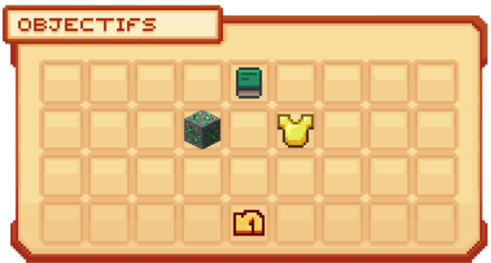
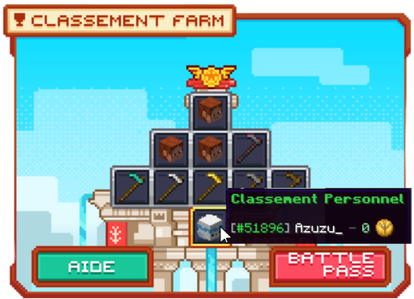
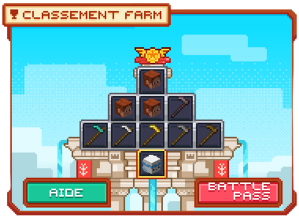
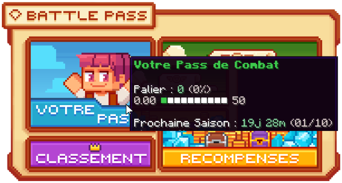
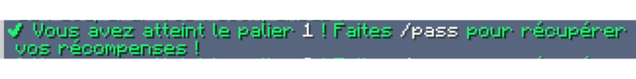
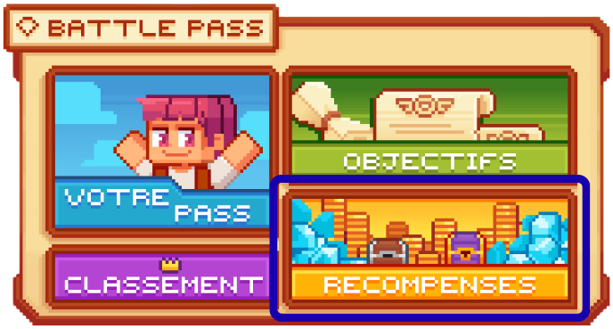

# 🔱 Le Pass de Combat


**Tuto : Maximiser sa Progression sur Evolucraft**


## 💠 <mark style="color:green;">Qu'est-ce que le Pass ? ⚡</mark>

Le <mark style="color:green;">**`/pass`**</mark> est un système compétitif qui repose sur le farm de <mark style="color:green;">**Farmiums 🔱**</mark> tout au long de la semaine.  
Il permet de débloquer, pour les meilleurs joueurs, des <mark style="color:green;">**récompenses exclusives**</mark> et pour les joueurs plus tranquille, des récompenses utiles grâce au <mark style="color:green;">**Pass de Combat**</mark>, afin d'accélérer votre progression.

<figure><figcaption>
<strong>Aperçu du </strong><mark style="color:green;"><strong><code>/pass</code></strong></mark>
</figcaption></figure>

## 💠 <mark style="color:green;">Comment gagner du Farmium ? 🔱</mark>

Deux moyens principaux permettent de gagner du <mark style="color:green;">**Farmium 🔱**</mark> :

### 🔷 Les actions de métiers aléatoires 🛠️
Chaque jour, à partir de minuit (heure française), vous recevez <mark style="color:green;">**2 actions de métiers**</mark> permettant de gagner du Farmium. Les actions concernera toujours des <mark style="color:green;">**métiers différents**</mark> afin de diversifier votre farm.


**REMARQUE 🔍** : Les <mark style="color:green;">**deux actions de métiers**</mark> sont tirées de façon <mark style="color:green;">**aléatoire**</mark>, mais le système empêche qu’elles soient issues du <mark style="color:green;">**même métier deux fois de suite**</mark>. 

Cependant, il peut toujours conserver une des actions déjà présent mais dans une limite d'<mark style="color:green;">**une seule action ou action du même métier au maximum**</mark>.


Pour connaître les items du jour, deux solutions s’offrent à vous :

#### 🔸 <mark style="color:green;">Via le /pass 🎮</mark>
Faites la commande <mark style="color:green;">**`/pass`**</mark>, puis cliquez sur **Objectifs**.  
Passez ensuite votre souris sur l’item pour connaître le <mark style="color:green;">**nombre de Farmiums 🔱**</mark> récoltés par action.

<figure><figcaption>
<strong>Aperçu des </strong><mark style="color:green;"><strong><code>Objectifs du /pass</code></strong></mark>
</figcaption></figure>

#### 🔸 <mark style="color:green;">Via la boutique de minuit 📢</mark>
Chaque jour, vers **00h01**, un membre du staff publie un message résumant les items disponibles dans la <mark style="color:green;">**/boutique**</mark> mais surtout les <mark style="color:green;">**2 actions du /pass**</mark> à réaliser.  

<figure><figcaption>
<strong>Aperçu du message de la </strong><mark style="color:green;"><strong><code>boutique de minuit</code></strong></mark>
</figcaption></figure>

### 🔷 Les boss de donjons 🐲
Lorsque vous terminez un donjon et tuez le <mark style="color:green;">**boss**</mark>, vous gagnez du Farmium selon la difficulté :

| Type de Donjon                                           | Farmiums obtenus                                   |
| -------------------------------------------------------- | ------------------------------------------------- |
| <mark style="color:green;">**Commun 🟩**</mark>          | <mark style="color:yellow;">**500 🔱**</mark>     |
| <mark style="color:yellow;">**Rare 🟨**</mark>           | <mark style="color:yellow;">**1 000 🔱**</mark>   |
| <mark style="color:blue;">**Épique 🟦**</mark>           | <mark style="color:yellow;">**1 500 🔱**</mark>   |
| <mark style="color:purple;">**Légendaire 🟪**</mark>     | <mark style="color:yellow;">**3 000 🔱**</mark>   |
| <mark style="color:red;">**Mythique 🟥**</mark>          | <mark style="color:yellow;">**6 000 🔱**</mark>   |


**REMARQUE 🔍** : Les boss des <mark style="color:green;">**donjons événements**</mark> (Draconique, Halloween, etc.) ne donnent pas de Farmium.


## 💠 <mark style="color:green;">Comment apparaître dans le classement ? 🏆</mark>

Un <mark style="color:green;">**classement hebdomadaire**</mark> (du **lundi 00h00** au **dimanche 23h59**) récompense les 50 meilleurs farmeurs.  
Pour voir votre position, tapez la commande <mark style="color:green;">**`/classement_farm`**</mark> puis passez la souris sur votre tête.

<figure><figcaption>
<strong>Aperçu du </strong><mark style="color:green;"><strong><code>classement personnel</code></strong></mark>
</figcaption></figure>

| Classement                                    | Récompenses                                                                 |
| --------------------------------------------- | --------------------------------------------------------------------------- |
| <mark style="color:yellow;">**1er**</mark>    | <mark style="color:blue;">**750 Gemmes 💎**</mark> + <mark style="color:yellow;">**Tag Or**</mark> |
| <mark style="color:white;">**2e**</mark>      | <mark style="color:blue;">**500 Gemmes 💎**</mark> + <mark style="color:white;">**Tag Argent**</mark> |
| <mark style="color:orange;">**3e**</mark>     | <mark style="color:blue;">**250 Gemmes 💎**</mark> + <mark style="color:orange;">**Tag Bronze**</mark> |
| <mark style="color:green;">**4e à 10e**</mark>| <mark style="color:yellow;">**100K 💲**</mark> |
| <mark style="color:white;">**11e à 25e**</mark>| <mark style="color:yellow;">**25K 💲**</mark> |
| <mark style="color:green;">**26e à 50e**</mark>| <mark style="color:yellow;">**10K 💲**</mark> |


⚠️ Les <mark style="color:green;">**tags**</mark> sont valables <mark style="color:green;">**1 semaine**</mark>.  
Après ce délai, vous ne pourrez plus les réutiliser, sauf si vous atteignez à nouveau la même position la semaine suivante.


<figure><figcaption>
<strong>Aperçu du </strong><mark style="color:green;"><strong><code>classement général du /pass</code></strong></mark>
</figcaption></figure>

## 💠 <mark style="color:green;">Comment récupérer les récompenses du Pass ? 🎁</mark>

En dehors du classement, vous pouvez obtenir des <mark style="color:green;">**récompenses de paliers**</mark>.  
Chaque <mark style="color:green;">**palier**</mark> est débloqué grâce à un certain nombre de <mark style="color:green;">**Farmiums 🔱**</mark> (ils ne sont pas consommés).

Pour voir votre progression, allez dans le <mark style="color:green;">**`/pass`**</mark> puis passez la souris sur la case "<mark style="color:green;">**Votre Pass**</mark>".  
Vous verrez votre palier actuel et le pourcentage vers le suivant.

<figure><figcaption>
<strong>Aperçu de la </strong><mark style="color:green;"><strong><code>progression des paliers</code></strong></mark>
</figcaption></figure>

Pendant que vous <mark style="color:green;">**farmez**</mark> et que vous débloquez un <mark style="color:green;">**palier**</mark>, un message comme ci-dessous apparaîtra dans votre chat.  
<figure><figcaption>
<strong>Aperçu du message d'un </strong><mark style="color:green;"><strong><code>palier débloqué</code></strong></mark>
</figcaption></figure>

Pour <mark style="color:green;">**récupérer la récompense**</mark> du palier, il faudra effectuer la commande <mark style="color:green;">**`/pass`**</mark>, puis cliquer sur le bouton "<mark style="color:green;">**Récompenses**</mark>".  

<figure><figcaption>
<strong>Aperçu du menu </strong><mark style="color:green;"><strong><code>Récompenses</code></strong></mark>
</figcaption></figure>

Ensuite, cliquez sur le <mark style="color:green;">**cadenas**</mark> comme indiqué sur l’image, et vos <mark style="color:green;">**récompenses**</mark> seront ajoutées directement dans votre inventaire.  


**REMARQUE 🔍 :** Si vous possédez le [<mark style="color:green;">**Premium 👑**</mark>](https://wiki.evolucraft.fr/le-gameplay/les-grades#abonnement-premium), vous aurez accès à une <mark style="color:green;">**seconde récompense supplémentaire**</mark> dans le même palier !


<figure><figcaption>
<strong>Aperçu de l'onglet </strong><mark style="color:green;"><strong><code>Récompenses du /pass</code></strong></mark>
</figcaption></figure>

Il existe au total <mark style="color:green;">**35 paliers**</mark> à compléter chaque mois.  


⚠️ Attention, le Pass est <mark style="color:green;">**réinitialisé le 1er du mois**</mark> !


**Voilà, vous connaissez toutes les informations sur le pass de combat ! A vos fermes pour récupérer vos farmiums !**
