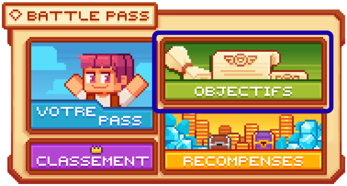

# 🔱 Pass


**Tuto : Maximiser sa Progression sur Evolucraft**


## 💠 <mark style="color:green;">Qu'est ce que le pass ? ⚡
Le <mark style="color:green;">/pass</mark> est un système compétitif qui repose sur le farm de <mark style="color:green;">Farmiums 🔱</mark> tout au long de la semaine débloquant, pour les meilleurs, des <mark style="color:green;">récompenses exclusives</mark> et des bonus utiles, avec le <mark style="color:green;">pass de combat</mark>, afin d'accélérer votre progression.

<figure><figcaption>
<strong>Aperçu du </strong><mark style="color:green;"><strong><code>/pass</code></strong></mark>
</figcaption></figure>

## 💠 <mark style="color:green;">Comment gagner du Farmium ? 🔱</mark>

Pour gagner du farmium 🔱, 2 actions sont possible :

### 🔷 Les actions de métiers aléatoire 🛠️
Chaque jour, à partir de minuit (heure française), vous avez 2 actions liées aux métiers qui vous permettent de gagner du farmium. Ces deux actions sont sur des secteurs de farm différents pour permettre de diversiffier vos moyen de farm.


**REMARQUE 🔍** : Les <mark style="color:green;">deux actions de métiers</mark> sont tirées de façon <mark style="color:green;">aléatoire</mark>, mais le système empêche qu’elles soient issues du <mark style="color:green;">même métier deux fois de suite</mark>, tout en permettant d’en garder <mark style="color:green;">une seule au maximum</mark>.


Pour savoir qu'elles sont les items du jour, 2 solutions qui sont misent à dispositions :

#### 🔸 <mark style="color:green;">Via le /pass 🎮</mark>
Vous avez la possibilité de le découvrir en allant faire `/pass`. Puis de cliquez sur "Objectifs".

<figure><figcaption>
<strong>Aperçu du </strong><mark style="color:green;"><strong><code>/pass</code></strong></mark>
</figcaption></figure>

Puis, de passer votre souris sur l'item afin de savoir son nombre de farmium qui sera récolté pour chaque action éffectué.

<figure><figcaption>
<strong>Aperçu du </strong><mark style="color:green;"><strong><code>/pass</code></strong></mark>
</figcaption></figure>

#### 🔸 <mark style="color:green;">Via le boutique de minuit 📢</mark>
Chaque jour, vers 00h01 (même si des fois c'est à minuit pile), WhiteMarshadow ou un autre staffs vous offrent le résumé de plusieurs infos comme les items du /boutique mais également les 2 actions à réaliser dans le /pass.

N'hésitez à faire un tout vers minuit pour voir son message.
<figure><figcaption>
<strong>Aperçu du </strong><mark style="color:green;"><strong><code>/pass</code></strong></mark>
</figcaption></figure>
<!-- White, l'horraire c'est 00h01, pas 00h00 -->
### 🔷 Les boss de donjons 🐲
Lorsuque vous réaliser un donjons et que votre groupe a tué le boss de donjons, il vous fera gagner du farmium suivant la difficulté du donjons.

| Type de Donjons où se trouve le boss                        | Nombre de Farmium Données                                 |
| ----------------------------------------------------------- | --------------------------------------------------------- |
| <mark style="color:green;">**Donjons Commun 🟩**</mark>     | <mark style="color:yellow;">**500 Farmiums 🔱**</mark>   |
| <mark style="color:yellow;">**Donjon Rare 🟨**</mark>       | <mark style="color:yellow;">**1 000 Farmiums 🔱**</mark> |
| <mark style="color:blue;">**Donjon Épique 🟦**</mark>       | <mark style="color:yellow;">**1 500 Farmiums 🔱**</mark> |
| <mark style="color:purple;">**Donjon Légendaire 🟪**</mark> | <mark style="color:yellow;">**3 000 Farmiums 🔱**</mark> |
| <mark style="color:red;">**Donjon Mythique 🟥**</mark>      | <mark style="color:yellow;">**6 000 Farmiums 🔱**</mark> |


**REMARQUE 🔍** : Les boss des donjons événements (draconique, halloween, ect...) ne font pas gagnées de farmium.


## 💠 <mark style="color:green;">Comment apparaitre dans le classement ? 🏆</mark>

Pendant votre farm, il y a un classement hebdomaire (du lundi 0h00 au dimanche 23H59) qui classe les joueurs farmant le plus de Farmium sur la semaine en cumulé. Ces joueurs finissant dans le top 50 des farmeurs peuvent recevoir ces récompenses :

Pour connaitre votre classement, il vout suffit de faire la commande `/classement_farm`, puis de mettre la souris sur la tête de votre personnage.
<figure><figcaption>
<strong>Aperçu du </strong><mark style="color:green;"><strong><code>classement personnel du /pass</code></strong></mark>
</figcaption></figure>

| Classements                                      | Récompenses données                                                                                  |
| ------------------------------------------------ | ---------------------------------------------------------------------------------------------------- |
| <mark style="color:yellow;">**1er**</mark>       | <mark style="color:blue;">**750 Gemmes 💎</mark> + <mark style="color:yellow;">Tag (Or)**</mark>     |
| <mark style="color:white;">**2e**</mark>         | <mark style="color:blue;">**500 Gemmes 💎</mark> + <mark style="color:white;">Tag (Argent)**</mark>  |
| <mark style="color:orange;">**3e**</mark>        | <mark style="color:blue;">**250 Gemmes 💎</mark> + <mark style="color:orange;">Tag (Bronze)**</mark> |
| <mark style="color:green;">**4e à 10e**</mark>   | <mark style="color:yellow;">100K 💲**</mark>                                                          |
| <mark style="color:white;">**11e à 25e**</mark>  | <mark style="color:yellow;">25K 💲**</mark>                                                           |
| <mark style="color:green;">**26e à 50e**</mark>  | <mark style="color:yellow;">10K 💲**</mark>                                                           |


Les tags sont valable 1 semaine. Après ce délai, vous ne pourrez plus resémectionner le tag si vous changer ce dernier (À moins de refaire la même position sur la semaine qui suit votre victoire).


<figure><figcaption>
<strong>Aperçu du </strong><mark style="color:green;"><strong><code>Classement du /pass</code></strong></mark>
</figcaption></figure>

## 💠 <mark style="color:green;">Comment récupérer des récompenses du pass ? 🎁</mark>

En plus du petits classement hebdomadaire, il y a la possibilité de gagner des récompenses sans penser à jouer le classement, c'est les récompenses du pass.

Les récompenses se font par palier. Pour débloquer un palier il faudra avoir un nombre requis de farmium mais il ne se consommera pas pour autant.

Pour connaitre l'avancer sur votre palier, il vous suffit de vous rendre dans le `/pass`, puis de passer la souris sur la case "Votre Pass" comme ci-desous. Il vous affichera alors le palier où vous êtes rendu et le pourcentage aquis pour le prochain à débloquer.

<figure><figcaption>
<strong>Aperçu de la </strong><mark style="color:green;"><strong><code>Progression des paliers du /pass</code></strong></mark>
</figcaption></figure>

Lorsque vous avez débloquer un palier, alors un message vous sera donné vous indiquant que vous compléter un palier.

<figure><figcaption>
<strong>Aperçu du message d'un </strong><mark style="color:green;"><strong><code>palier débloquer</code></strong></mark>
</figcaption></figure>

Pour récupérer votre récompense, il faudra aller dans la section "Récompense" dans le `/pass`.

<figure><figcaption>
<strong>Aperçu du </strong><mark style="color:green;"><strong><code>/pass</code></strong></mark>
</figcaption></figure>

Puis de cliquer sur le cadena. Il vous donnera les récompense gratuite, mais également, si vous avez le [Premium 👑](https://wiki.evolucraft.fr/le-gameplay/les-grades#abonnement-premium), vous pourrez y récupérer des récompenses supplémentaire !

<figure><figcaption>
<strong>Aperçu de l'onglet </strong><mark style="color:green;"><strong><code>Récompense du /pass</code></strong></mark>
</figcaption></figure>

Il vous reste maintenant plus qu'à compléter les 35 paliers ! Mais attention, vous n'avez que jusqu'à la fin du mois pour le réaliser car ce dernier se reset au 1er du mois !
