# 🏆 Classements des Villes

Le <mark style="color:green;">**classement des villes**</mark> est une <mark style="color:green;">**compétition**</mark> entre toutes les villes du serveur, se déroulant <mark style="color:green;">**tous les mois**</mark> afin de déterminer la <mark style="color:green;">**meilleure ville**</mark> et ainsi <mark style="color:green;">**récompenser**</mark> celle-ci. Alors, qui sera la meilleure ville ?!

<figure>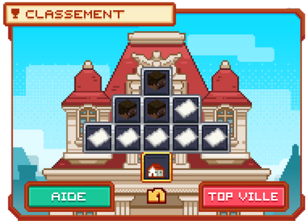<figcaption>Interface du Classement Villes</figcaption></figure>

## 💠 <mark style="color:green;">Comment gagner des points ?</mark> 🌠
Les <mark style="color:green;">**points**</mark> se gagnent avec des <mark style="color:green;">**étoiles**</mark>, mais comment en avoir ?

### 🔷 Étape 1️⃣
Dans votre <mark style="color:green;">**`/ville`**</mark>, cliquez sur le <mark style="color:green;">**pictogramme trophée**</mark> comme sur l’image.

<figure>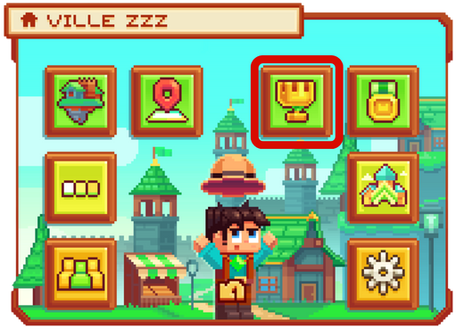<figcaption>Interface du /ville</figcaption></figure>

### 🔷 Étape 2️⃣
Passez votre curseur sur le bouton <mark style="color:green;">**"Aide"**</mark> comme sur l'image afin de connaître les <mark style="color:green;">**items**</mark> où le <mark style="color:green;">**fragment du métier**</mark> en question peut être obtenu.

<figure>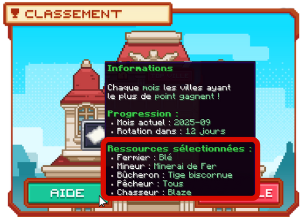<figcaption>Informations des actions de métiers donnant le fragment</figcaption></figure>


**REMARQUE 🔍** : Notez bien que les <mark style="color:green;">**items indiqués changent chaque 1er du mois**</mark>.


### 🔷 Étape 3️⃣
Commencez à <mark style="color:green;">**farmer les items indiqués**</mark> pour obtenir un <mark style="color:green;">**fragment d'étoile**</mark> de chaque <mark style="color:green;">**métier**</mark> :

<table border="1" cellspacing="0" cellpadding="6">
 <tr> 
  <td><mark style="color:white;"><strong>Métiers 🛠</strong></mark></td> <td><mark style="color:green;"><strong>Fragment d'étoile</strong></mark></td>
 </tr>
  <tr>
   <td><mark style="color:green;"><strong>Fermier 🌾</strong></mark></td>
   <td>
    <figure>
     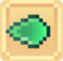
    </figure>
   </td>
  </tr>
  <tr>
   <td><mark style="color:green;"><strong>Mineur ⛏️</strong></mark></td>
   <td>
    <figure>
     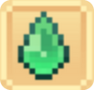
    </figure>
   </td>
  </tr>
  <tr>
   <td><mark style="color:green;"><strong>Bûcheron 🪚</strong></mark></td>
   <td>
    <figure>
     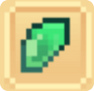
      </figure>
   </td>
  </tr>
  <tr>
   <td><mark style="color:green;"><strong>Pêcheur 🎣</strong></mark></td>
   <td>
    <figure>
     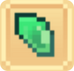
    </figure>
   </td>
  </tr>
  <tr>
   <td><mark style="color:green;"><strong>Chasseur 🗡️</strong></mark></td>
   <td>
    <figure>
     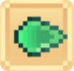
    </figure>
   </td>
  </tr>
 </table>

### 🔷 Étape 4️⃣
<mark style="color:green;">**Craftez une Étoile 🌟**</mark> en plaçant les <mark style="color:green;">**fragments d'étoile**</mark> comme sur l'image ci-dessous. Vous pouvez également consulter le craft en <mark style="color:green;">**cliquant sur bouton "Aide"**</mark> dans le classement des ville.

<figure>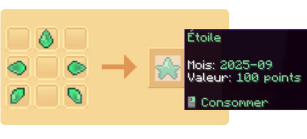<figcaption>Craft d'une Étoile</figcaption></figure>

### 🔷 Étape 5️⃣
Une fois <mark style="color:green;">**craftée**</mark>, il vous suffira de faire un <mark style="color:green;">**clic droit**</mark> en tenant l’<mark style="color:green;">**étoile**</mark> en main pour <mark style="color:green;">**comptabiliser les points**</mark>. Et c'est ainsi que vous ajoutez <mark style="color:green;">**100 points**</mark> de plus pour le <mark style="color:green;">**classement de votre ville**</mark>.


**🚨 IMPORTANT ‼ :** Les <mark style="color:green;">**étoiles**</mark> et les <mark style="color:green;">**fragments**</mark> ont une <mark style="color:green;">**date limite**</mark>, c'est-à-dire qu'ils ne sont plus utilisables après le mois où ils ont été obtenus et deviennent alors <mark style="color:green;">**obsolètes**</mark>. Par conséquent, ils sont <mark style="color:green;">**interdits à la vente ❌**</mark>.


## 💠 <mark style="color:green;">Comment voir son classement ?</mark> 💭
Pour vérifier son <mark style="color:green;">**classement de ville**</mark>, il vous suffira d'aller dans <mark style="color:green;">**l'interface des classements**</mark>, puis de passer votre curseur sur le <mark style="color:green;">**pictogramme de la maison**</mark>.

Dessus, vous y retrouverez la <mark style="color:green;">**ville**</mark> et sa <mark style="color:green;">**position**</mark>.

<figure>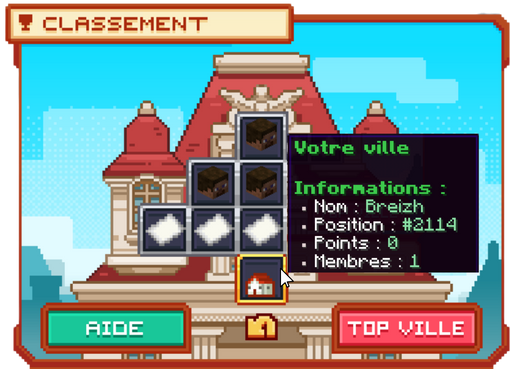<figcaption>Interface du classement des ville</figcaption></figure>

Si vous voulez faire un petit concours dans votre ville, il existe la possibilité d'afficher les <mark style="color:green;">**joueurs de votre ville ayant déposé le plus de points**</mark> en cliquant sur <mark style="color:green;">**"Top Ville"**</mark> comme ci-dessous.

<figure>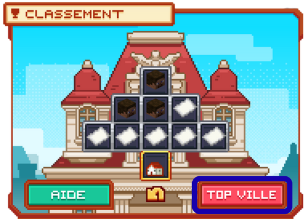<figcaption>Interface du classement des ville</figcaption></figure>

## 💠 <mark style="color:green;">Les récompenses ?</mark> 🎁
À la <mark style="color:green;">**fin du mois**</mark>, le <mark style="color:green;">**classement**</mark> est établi et les <mark style="color:green;">**villes dans le Top 25**</mark> recevront alors les <mark style="color:green;">**récompenses**</mark> suivantes :

| Classement | Récompenses | 
| --------------------------------------------- | --------------------------------------------------------------------------- | 
| <mark style="color:yellow;">**🥇 1er**</mark> | <mark style="color:blue;">**5 000 Gemmes 💎**</mark> + <mark style="color:yellow;">**Sceptre du roi**</mark> + <mark style="color:yellow;">**Tag Ville Or**</mark> | 
| <mark style="color:white;">**🥈 2e**</mark> | <mark style="color:blue;">**4 000 Gemmes 💎**</mark> + <mark style="color:white;">**Sceptre du roi**</mark> + <mark style="color:white;">**Tag Ville Argent**</mark> | 
| <mark style="color:orange;">**🥉 3e**</mark> | <mark style="color:blue;">**3 000 Gemmes 💎**</mark> + <mark style="color:orange;">**Sceptre du roi**</mark> + <mark style="color:orange;">**Tag Ville Bronze**</mark> | 
| <mark style="color:green;">**4e à 5e**</mark>| <mark style="color:blue;">**1 500 Gemmes 💎**</mark> | 
| <mark style="color:green;">**6e à 10e**</mark>| <mark style="color:yellow;">**1M 500K 💲**</mark> | 
| <mark style="color:green;">**11e à 25e**</mark>| <mark style="color:yellow;">**1M 💲**</mark> |


⚠️ Les <mark style="color:green;">**tags**</mark> sont valables uniquement pendant <mark style="color:green;">**le mois suivant**</mark>.  
Après ce délai, vous ne pourrez plus les réutiliser, sauf si vous atteignez à nouveau la même position <mark style="color:green;">**le mois suivant**</mark>.


**Vous connaissez dès à présent tout ce qu'il faut savoir concernant le <mark style="color:green;">**classement des villes**</mark>, vous n'avez plus qu'à <mark style="color:green;">**farmer**</mark> pour devenir la <mark style="color:green;">**ville n°1 du serveur 🏆**</mark> !**
