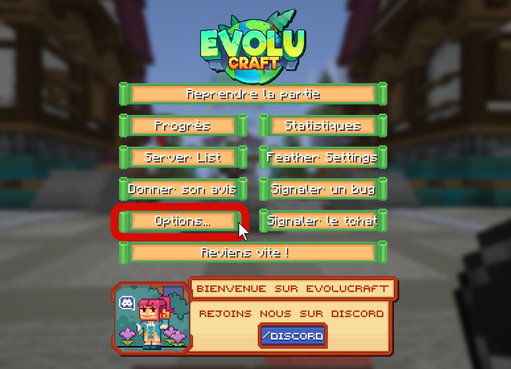
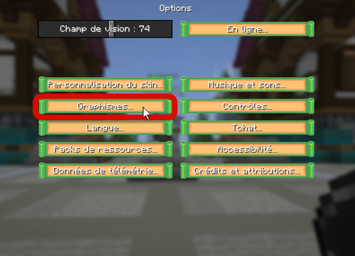
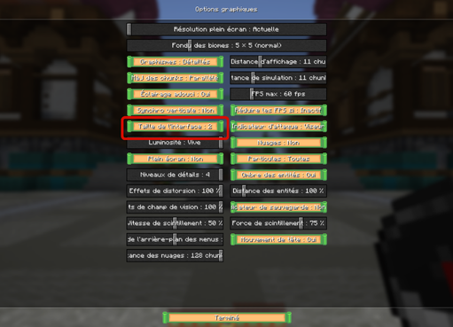
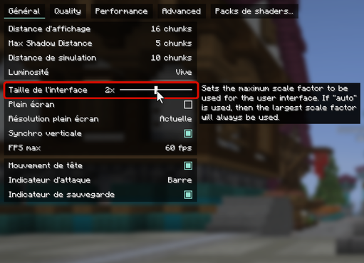

# 🖼️ Problème d'interface

## <mark style="color:green;">💠 Comment y voir ses compétences et les barres de boss ? 🖼️</mark>

Vous avez bien suivis les instructions pour y [mettre les compétences](https://wiki.evolucraft.fr/le-gameplay/les-classes#comment-debloquer-installer-et-utiliser-les-competences) et vous ne voyez toujours rien ? Et de même pour les barre de boss dans les donjons ? Pas d'inquiétude, il y a possiblement une solution pour ça !

### <mark style="color:green;">🔸 Étape 1️⃣</mark>
Appuyez sur votre touche "Echap" sur votre clavier afin d'être sur votre menu de pause.

### <mark style="color:green;">🔸 Étape 2️⃣</mark>
**Cliquez sur le bouton "Options"** pour aller dans les options du jeu comme sur l'image ci-dessous.
<figure></figure>

### <mark style="color:green;">🔸 Étape 3️⃣</mark>
**Cliquez sur le bouton "Graphisme"** comme iniduquer ci-dessous pour paramétrer tout ce qui touchera au graphisme du jeu.
<figure></figure>

### <mark style="color:green;">🔸 Étape 4️⃣</mark>
**Cliquez sur le bouton "Taille de l'interface"** jusqu'à qu'il vous met l'interface en taille deux comme sur l'image dessous, celà vous permetrra de réduire toutes les interfaces (y compris votre inventaire et la barre d'action).
<figure></figure>


**Il est possible que si vous jouer avec le mod Sodium, l'interface ne sois pas la même que ci-dessus, il faudra dans ce cas suivres les étapes jusqu'à l'étape 3 pour arriver sur l'interface ci-dessous et de bouger le curseur de ta la taille de l'interface pour le mettre à deux.**

<figure></figure>


**Et vous voilà dans une meilleur vision de vos compétences ! 🥳**
